# Introduzione a Log Analytics
È possibile iniziare a usare Log Analytics in Microsoft Operations Management Suite (OMS) in pochi minuti. Sono disponibili due possibilità per creare un'area di lavoro di OMS, che è simile a un account:

* il sito Web Microsoft Operations Management Suite
* iscriversi a Microsoft Azure

È possibile creare un'area di lavoro di OMS gratuita tramite il sito Web OMS. In alternativa è possibile iscriversi a Microsoft Azure per creare un'area di lavoro per OMS. Le due aree di lavoro sono funzionalmente equivalenti, tranne per il fatto che l'area di lavoro di OMS gratuita non può inviare al servizio OMS più di 500 MB di dati al giorno. Se si utilizza l’iscrizione ad Azure, è possibile utilizzare tale iscrizione anche  per accedere ad altri servizi Azure. Indipendentemente dal metodo utilizzato per creare l'area di lavoro, questa verrà creata o con un account Microsoft o con un account aziendale.

Ecco il processo:

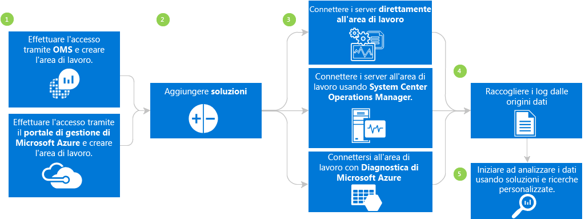

## Prerequisiti di Log Analytics e considerazioni sulla distribuzione
* È necessaria una sottoscrizione di Microsoft Azure a pagamento per usare tutte le funzionalità di Log Analytics. Se non è disponibile una sottoscrizione di Azure, creare un [account gratuito](https://azure.microsoft.com/free/) che consente di accedere a qualsiasi servizio Azure. In alternativa, è possibile creare un account OMS gratuito sul sito Web di [Operations Management Suite](http://microsoft.com/oms) e fare clic su **Prova gratuitamente**.
* Un'area di lavoro di OMS
* Ogni computer Windows da cui si vuole raccogliere dati deve eseguire Windows Server 2008 SP1 o versione successiva
* [firewall](log-analytics-proxy-firewall.md) agli indirizzi del servizio Web OMS
* Un [server d'inoltro di Log Analytics di OMS](https://blogs.technet.microsoft.com/msoms/2016/03/17/oms-log-analytics-forwarder) (gateway) in grado di inoltrare il traffico dai server al servizio OMS se nei computer non è disponibile l'accesso a Internet
* Se si usa Operations Manager, Log Analytics supporta Operations Manager 2012 SP1 UR6 e versioni successive e Operations Manager 2012 R2 UR2 e versioni successive. Il supporto per il proxy è stato aggiunto in Operations Manager 2012 SP1 UR7 e Operations Manager 2012 R2 UR3. Determinare le modalità di integrazione con OMS.
* Determinare se i computer hanno accesso diretto a Internet. In caso negativo, richiedono un server gateway per accedere ai siti del servizio Web OMS. Tutti gli accessi avvengono tramite HTTPS.
* Determinare quali server e tecnologie invieranno dati a OMS, ad esempio i controller di dominio, SQL Server e così via.
* Concedere l'autorizzazione agli utenti in OMS e Azure.
* Se si è preoccupati in merito all'utilizzo dei dati, distribuire singolarmente ogni soluzione e verificare l'impatto sulle prestazioni prima di aggiungere una nuova soluzione.
* Analizzare le prestazioni e l'utilizzo dei dati man mano che in Log Analytics si aggiungono nuove soluzioni o funzionalità, quali la raccolta degli eventi, la raccolta dei log, la raccolta dei dati sulle prestazioni e così via. È preferibile iniziare con una raccolta minima fino a quando non si riesce a identificare l'utilizzo dei dati o l'impatto sulle prestazioni.
* Verificare che gli agenti di Windows non vengano gestiti anche tramite Operations Manager, poiché in questo caso verrebbero generati dati duplicati. Le stesse considerazioni valgono anche per gli agenti basati su Azure con Diagnostica di Azure abilitata.
* Dopo aver installato gli agenti, verificare che funzionino correttamente. In caso contrario, verificare che l'API di crittografia Next Generation (CNG) Key Isolation non sia stata disabilitata tramite i criteri di gruppo.
* Per alcune soluzioni di Log Analytics sono previsti requisiti aggiuntivi.

## Iscriversi in tre passaggi utilizzando la Operations Management Suite
1. Andare sul sito Web di [Operations Management Suite](http://microsoft.com/oms) e fare clic su **Prova gratuitamente**. Accedere con l'account Microsoft, ad esempio Outlook.com o con un account aziendale fornito dall'azienda o dall’istituzione accademica con cui è possibile utilizzare Office 365 o altri servizi Microsoft.
2. Dare un nome univoco dell'area di lavoro. Un'area di lavoro è un logical container in cui sono memorizzati i dati di gestione. Esso fornisce un modo per partizionare i dati tra diversi team all'interno della propria organizzazione, in quanto i dati sono esclusivi per l'area di lavoro. Specificare un indirizzo di posta elettronica e l'area in cui si desidera archiviare i dati.  
    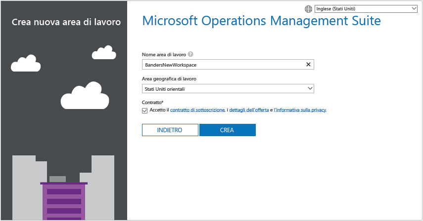
3. Successivamente, è possibile creare una nuova iscrizione ad Azure o un collegamento a una iscrizione Azure esistente. Se si desidera continuare a usare la versione gratuita, fare clic su **Non adesso**.  
   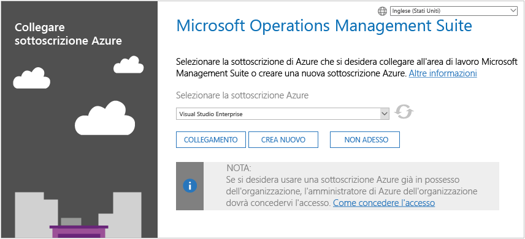

Si è pronti per iniziare a utilizzare il portale di Operations Management Suite.

Per altre informazioni sulla configurazione dell'area di lavoro e sul collegamento di account Azure esistenti alle aree di lavoro create con Operations Management Suite, vedere l'articolo [Gestire l'accesso a Log Analytics](log-analytics-manage-access.md).

## Iscriversi rapidamente utilizzando Microsoft Azure
1. Andare al [portale di Azure](https://portal.azure.com) , eseguire l'accesso, visualizzare l'elenco dei servizi e quindi selezionare **Log Analytics (OMS)**.  
    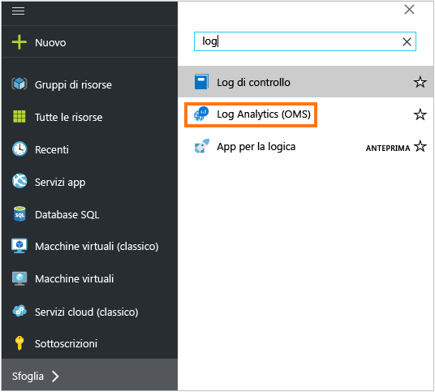
2. Fare clic su **Aggiungi**e selezionare le opzioni per gli elementi seguenti:
   * **area di lavoro di OMS**
   * **Sottoscrizione** : in presenza di più sottoscrizioni, scegliere quella da associare alla nuova area di lavoro.
   * **Gruppo di risorse**
   * **Posizione**
   * **Piano tariffario**  
       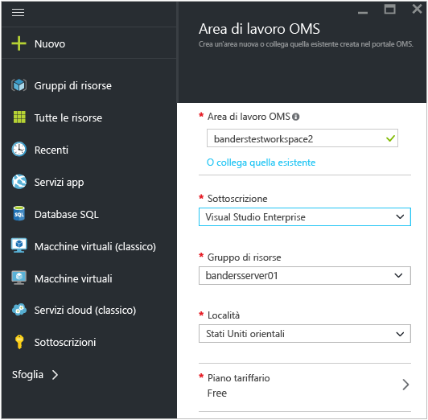
3. Fare clic su **Crea** per visualizzare i dettagli dell'area di lavoro nel portale di Azure.       
    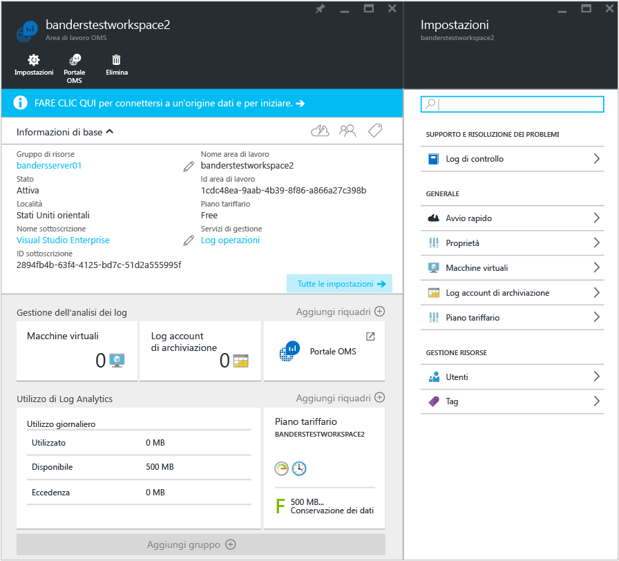         
4. Fare clic sul collegamento **Portale OMS** per aprire il sito Web Operations Management Suite con la nuova area di lavoro.

Ora è possibile iniziare a usare il portale di Operations Management Suite.

Per altre informazioni sulla configurazione dell'area di lavoro e sul collegamento delle aree di lavoro esistenti create con Operations Management Suite alle sottoscrizioni di Azure, vedere l'articolo [Gestire l'accesso a Log Analytics](log-analytics-manage-access.md).

## Introduzione al portale di Operations Management Suite
Per scegliere le soluzioni e collegare i server da gestire, fare clic sul riquadro **Settings** (Impostazioni) e seguire i passaggi descritti in questa sezione.  

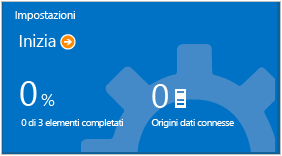  

1. **Aggiungere soluzioni**: visualizzare le soluzioni installate.  
    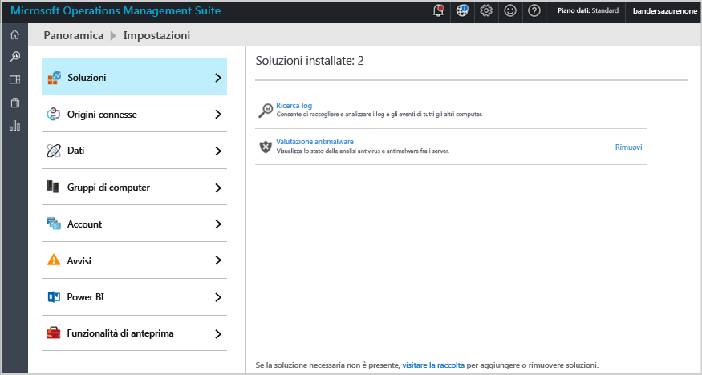  
    Fare clic su **Visita la raccolta** per aggiungere altre soluzioni.  
    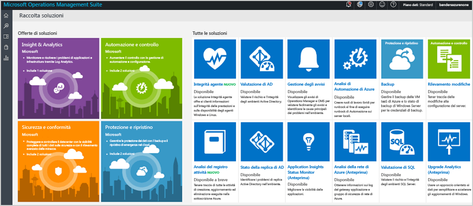  
    Selezionare una soluzione e quindi fare clic su **Aggiungi**.
2. **Connettere un'origine**: scegliere come connettersi all'ambiente server per raccogliere i dati:
   
   * Connettere qualsiasi Server di Windows o un client installando direttamente un agente.
   * Connettere i server Linux all'agente OMS per Linux.
   * Utilizzare un account di archiviazione di Azure configurato con l'estensione VM diagnostica Windows o Linux Azure.
   * Utilizzare System Center Operations Manager per collegare i gruppi di gestione o l'intera distribuzione di Operations Manager.
   * Abilitare la telemetria di Windows per usare Upgrade Analytics.
           
3. **Raccogliere i dati**: configurare almeno un'origine dati per inserire i dati nell'area di lavoro. Al termine, fare clic su **Salva**.    
   
    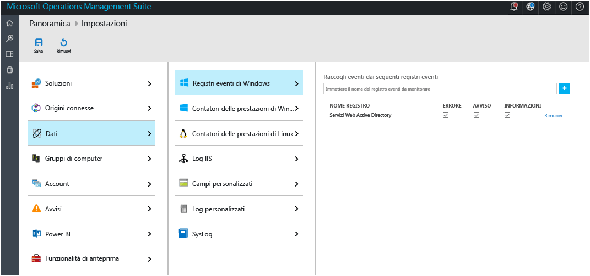    

## Facoltativamente, collegare i server direttamente a Operations Management Suite installando un agente
L'esempio seguente illustra come installare un agente Windows.

1. Fare clic sul riquadro **Impostazioni**, quindi sulla scheda **Origini connesse**, infine su una scheda per il tipo di origine che si vuole aggiungere e scaricare un agente o vedere come abilitarlo. Ad esempio, fare clic su **Scarica agente Windows (64 bit)**. Per gli agenti Windows, è possibile installare l'agente solo in Windows Server 2008 SP 1 o versione successiva o in Windows 7 SP1 o versione successiva.
2. Installare l'agente su uno o più server. È possibile installare gli agenti uno alla volta o utilizzando un metodo automatico con [uno script personalizzato](log-analytics-windows-agents.md)oppure è possibile utilizzare un software di distribuzione già esistente.
3. Accettare il contratto di licenza, scegliere la cartella di installazione e quindi selezionare **Connect the agent to Azure Log Analytics (OMS)** (Connetti l'agente ad Azure Log Analytics - OMS).   
    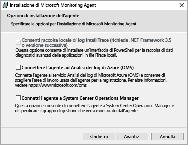
4. Nella pagina successiva, viene richiesto l'ID dell'area di lavoro e la chiave dell'area di lavoro. La chiave e l'ID dell'area di lavoro vengono visualizzati sullo schermo in cui è stato scaricato il file dell'agente.  
    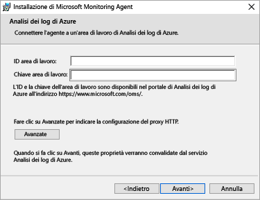  
   
    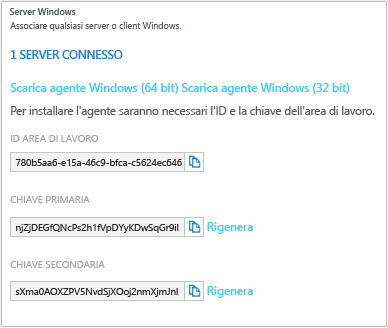
5. Durante l'installazione, è possibile fare clic su **Avanzate** per facoltativamente impostare il server proxy e fornire informazioni di autenticazione. Fare clic su **Avanti** per tornare alla schermata di informazioni dell'area di lavoro.
6. Fare clic su **Avanti** per convalidare la chiave e l'ID dell'area di lavoro. Se vengono rilevati errori, è possibile scegliere **Indietro** per apportare correzioni. Quando la chiave e l'ID dell'area di lavoro vengono convalidati, fare clic su **Installa** per completare l'installazione dell'agente.
7. Nel Pannello di controllo fare clic su Microsoft Monitoring Agent > scheda Azure Log Analytics (OMS). Quando gli agenti comunicano con il servizio Operations Management Suite, verrà visualizzata un'icona del segno di spunta verde. Inizialmente,  questa operazione richiede circa 5-10 minuti.

> [!NOTE]
> Le soluzioni di gestione capacità e la configurazione delle valutazione non sono attualmente supportate dai server collegati direttamente al Operations Management Suite.
> 
> 

È inoltre possibile connettere l'agente al System Center Operations Manager 2012 SP1 e versioni successive. A tale scopo, selezionare **Collegare l'agente a System Center Operations Manager**. Quando viene scelta tale opzione, i dati vengono inviati al servizio senza che sia necessario l’utilizzo di un hardware aggiuntivo o caricarli sui gruppi di gestione.

Per altre informazioni sulla connessione di agenti a Operations Management Suite, vedere l'articolo [Connettere computer Windows a Log Analytics](log-analytics-windows-agents.md).

## Facoltativamente, è possibile collegare i server utilizzando il System Center Operations Manager
1. Nella console di Operations Manager selezionare **Amministrazione**.
2. Espandere il nodo **Operational Insights**, quindi selezionare **Operational Insights Connection** (Connessione a Operational Insights).
   
   > [!NOTE]
   > A seconda dell'aggiornamento cumulativo di SCOM in uso, viene visualizzato un nodo relativo a *System Center Advisor*, *Operational Insights* o *Operations Management Suite*.
   > 
   > 
3. Fare clic sul collegamento **Registra con Operational Insights** in alto a destra e seguire le istruzioni.
4. Dopo il completamento della registrazione guidata, fare clic sul collegamento **Aggiungi computer/gruppo** .
5. Nella finestra di dialogo **Ricerca computer** è possibile cercare i computer o i gruppi monitorati da Operations Manager. Selezionare i computer o i gruppi da caricare in Log Analytics, fare clic su **Aggiungi** e quindi su **OK**. È possibile verificare che il servizio OMS riceva i dati accedendo al riquadro **Usage** (Utilizzo) nel portale di Operations Management Suite. I Dati dovrebbero essere visualizzati in circa 5-10 minuti.

Per altre informazioni sulla connessione di Operations Manager a Operations Management Suite, vedere l'articolo [Connettere Operations Manager a Log Analytics](log-analytics-om-agents.md).

## Facoltativamente, analizzare i dati da servizi cloud di Microsoft Azure
Con Operations Management Suite è possibile eseguire ricerche rapide in log di eventi e IIS per servizi cloud e macchine virtuali abilitando la diagnostica nei servizi cloud di Azure È inoltre possibile ottenere informazioni aggiuntive per le macchine virtuali di Azure mediante l'installazione di Microsoft Monitoring Agent. Per altre informazioni su come configurare l'ambiente Azure per usare Operations Management Suite, vedere l'articolo [Connettere lo spazio di archiviazione di Azure a Log Analytics](log-analytics-azure-storage.md).

## Passaggi successivi
* [Aggiungere soluzioni di Log Analytics dalla Raccolta soluzioni](log-analytics-add-solutions.md) per aggiungere funzionalità e raccogliere dati.
* Acquisire familiarità con le [ricerche nei log](log-analytics-log-searches.md) per visualizzare le informazioni dettagliate raccolte dalle soluzioni.
* Usare i [dashboard](log-analytics-dashboards.md) per salvare e visualizzare le ricerche personalizzate.

<!--HONumber=Oct16_HO2-->

