<properties
	pageTitle="Gestire l'accesso a Log Analytics | Microsoft Azure"
	description="Gestire l'accesso a Log Analytics usando svariate attività amministrative per utenti, account, aree di lavoro di OMS e account Azure."
	services="log-analytics"
	documentationCenter=""
	authors="bandersmsft"
	manager="jwhit"
	editor=""/>

<tags
	ms.service="log-analytics"
	ms.workload="na"
	ms.tgt_pltfrm="na"
	ms.devlang="na"
	ms.topic="article"
	ms.date="04/28/2016"
	ms.author="banders"/>

# Gestire l'accesso a Log Analytics

Per gestire l'accesso a Log Analytics, si useranno svariate attività amministrative per utenti, account, aree di lavoro di OMS e account Azure. Per creare una nuova area di lavoro in Operations Management Suite (OMS), scegliere un nome per l'area di lavoro, associarlo al proprio account e scegliere una località geografica. Un'area di lavoro è sostanzialmente un contenitore che include informazioni sull'account e semplici informazioni di configurazione per l'account stesso. Nell'organizzazione è possibile usare più aree di lavoro di OMS per gestire diversi set di dati raccolti dall'intera infrastruttura IT o da una parte di essa.

L'articolo [Introduzione a Log Analytics](log-analytics-get-started.md) illustra come rendersi attivi rapidamente e descrive nel dettaglio alcune delle azioni necessarie per gestire l'accesso a OMS.

Anche se non è necessario eseguire fin dall'inizio ogni attività di gestione, nelle sezioni seguenti verranno illustrate tutte le attività usate di frequente:

- Determinare il numero di aree di lavoro necessarie
- Gestire utenti e account
- Aggiungere un gruppo a un'area di lavoro esistente
- Collegare un'area di lavoro esistente a una sottoscrizione di Azure
- Aggiornare un'area di lavoro a un piano a pagamento
- Modificare un tipo di piano dati
- Aggiungere un'organizzazione di Azure Active Directory a un'area di lavoro esistente
- Chiudere l'aea di lavoro di OMS

## Determinare il numero di aree di lavoro necessarie

Un’area di lavoro è una risorsa di Azure e rappresenta un contenitore in cui i dati vengono, aggregati, analizzati e presentati nel portale di OMS.

È possibile creare più aree di lavoro di Log Analytics di OMS e consentire agli utenti di accedere a una o più aree di lavoro. In generale è preferibile ridurre al minimo il numero di aree di lavoro, poiché in questo modo sarà possibile eseguire query e correlazioni tra la maggior parte dei dati. Questa sezione descrive quando può essere utile creare più aree di lavoro.

Attualmente un'area di lavoro di Log Analytics offre:

- Una posizione geografica per archiviare i dati. 
- Granularità per la fatturazione 
- Isolamento dei dati 

In base alle caratteristiche precedenti, si possono creare più aree di lavoro se:

- Si opera in un'azienda globale ed è necessario che i dati siano archiviati in aree specifiche per motivi di loro sovranità o conformità. 
- Si usa Azure e si intendono evitare costi di trasferimento dei dati in uscita tramite un'area di lavoro di Log Analytics nella stessa area delle risorse di Azure da essa gestite.
- Si desidera allocare le spese a reparti o gruppi aziendali diversi in base all'utilizzo. Tramite la creazione di un'area di lavoro per ogni reparto o gruppo aziendale, i rendiconti sulla fatturazione e l’utilizzo di Azure presenteranno gli addebiti separatamente per ogni area di lavoro.
- Si opera come provider di servizi gestiti e per ogni cliente gestito è necessario mantenere i dati di Log Analytics isolati da altri dati del cliente. 
- Si gestiscono più clienti e si desidera che ogni cliente, reparto o gruppo aziendale visualizzi i propri dati, ma non i dati di altri clienti, reparti o gruppi aziendali. 

Quando si usano agenti per la raccolta dei dati, è possibile configurare ogni agente in modo che faccia riferimento all'area di lavoro richiesta.

Se si usa System Center Operations Manager, ogni gruppo di gestione di Operations Manager può essere connesso con una sola area di lavoro. È possibile installare Microsoft Monitoring Agent nei computer gestiti da Operations Manager e fare sì che l’agente faccia riferimento sia a Operations Manager che a un'altra area di lavoro di Log Analytics.

## Gestire utenti e account

A ogni area di lavoro possono essere associati più account utente, ciascuno dei quali (account Microsoft o account aziendale) può avere accesso a diverse aree di lavoro di OMS.

Per impostazione predefinita, l'account Microsoft o l'account aziendale usato per creare l'area di lavoro diventa l'amministratore di quest'ultima. L'amministratore può quindi invitare altri account Microsoft o scegliere utenti da Azure Active Directory.

È possibile concedere agli utenti l'accesso all'area di lavoro di OMS da 2 posizioni:

- Usando il controllo di accesso in base al ruolo di Azure, è possibile fornire l'accesso alla sottoscrizione di Azure e alle risorse di Azure associate. Lo stesso viene usato anche per l'accesso a PowerShell e all’API REST.
- L’accesso al solo portale di OMS e non alla sottoscrizione di Azure associata può essere gestito all'interno del portale di OMS.

Se a una persona è stato concesso l'accesso al portale di OMS, ma non alla sottoscrizione di Azure a cui è collegato, i riquadri delle soluzioni Automazione, Backup e Site Recovery non visualizzeranno nessun dato per l'utente quando accede al portale di OMS.

Per consentire agli utenti di visualizzare i dati in queste soluzioni, assicurarsi che abbiano almeno l'accesso **lettore** per l'account di Automazione, l'insieme di credenziali per il backup e l'insieme di credenziali di Site Recovery collegati all'area di lavoro di OMS.

### Gestione dell'accesso a Log Analytics tramite il portale di Azure

Se si concede agli utenti l'accesso all'area di lavoro di Log Analytics usando le autorizzazioni di Azure (ad esempio nel portale di Azure), gli stessi utenti saranno in grado di accedere al portale di Log Analytics. Se gli utenti accedono al portale di Azure, possono anche accedere al portale di OMS facendo clic sull'attività relativa al portale di OMS durante la visualizzazione della risorsa dell'area di lavoro di Log Analytics.

Ecco quattro informazioni essenziali:

1. Non si tratta del controllo di accesso in base al ruolo Se si dispone delle autorizzazioni di accesso "Lettore" nel portale di Azure per l'area di lavoro di Log Analytics, è possibile apportare modifiche tramite il portale di OMS. Il portale di OMS prevede ruoli di amministratore, collaboratore e utente di sola lettura. Se l'account con cui è stato eseguito l’accesso si trova nell’Azure Active Directory collegato all'area di lavoro, l’utente avrà un ruolo di amministratore nel portale di OMS, in caso contrario avrà un ruolo di collaboratore.
2. Se si esegue l'accesso al portale di OMS tramite mms.microsoft.com, per impostazione predefinita quando viene visualizzato l'elenco "Selezionare un'area di lavoro", saranno incluse solo le aree di lavoro a cui l’utente è stato aggiunto nel portale di OMS. Per visualizzare le aree di lavoro a cui è possibile accedere tramite le sottoscrizioni di Azure, è necessario specificare un tenant come parte dell'URL, ad esempio mms.microsoft.com/?tenant=contoso.com (l'identificatore del tenant è spesso l'ultima parte dell'indirizzo di posta elettronica con cui si accede.
3. Se l'account con cui si accede è un account nel tenant AAD (come solitamente avviene a meno che non si esegua l'accesso come CSP), l’utente avrà un ruolo di amministratore nel portale di OMS. Se l'account non è nel tenant AAD, gli sarà concesso il ruolo di utente nel portale di OMS.
4. Se si desidera passare direttamente a un portale a cui si ha accesso tramite le autorizzazioni di Azure, è necessario specificare la risorsa come parte dell'URL. È possibile ottenere questo URL tramite PowerShell, ad esempio (Get-AzureRmOperationalInsightsWorkspace).PortalUrl. L'URL sarà simile al seguente: https://eus.mms.microsoft.com/?tenant=contoso.com&resource=%2fsubscriptions%2faaa5159e-dcf6-890a-a702-2d2fee51c102%2fresourcegroups%2fdb-resgroup%2fproviders%2fmicrosoft.operationalinsights%2fworkspaces%2fmydemo12

### Gestione degli utenti nel portale di OMS

Gestire account e utenti utilizzando la scheda**Account**nella pagina Impostazioni. Da questo punto è possibile eseguire le attività nelle sezioni seguenti:

#### Aggiungere un utente a un'area di lavoro esistente

Per aggiungere un utente o un gruppo a un'area di lavoro di OMS, seguire questa procedura. L'utente o il gruppo potrà visualizzare e agire su tutti gli avvisi associati a questa area di lavoro.

>[AZURE.NOTE] Per aggiungere un utente o un gruppo dal proprio account aziendale Azure Active Directory, prima di tutto è necessario assicurarsi di avere associato il proprio account OMS al dominio di Active Directory. Vedere [Aggiungere un'organizzazione di Azure Active Directory a un'area di lavoro esistente](#add-an-azure-active-directory-organization-to-an-existing-workspace).

1. In OMS fare clic sul riquadro **Impostazioni**.
2. Scegliere la scheda**Account**.
3. Nella sezione **Gestisci utenti** scegliere il tipo di account da aggiungere:**Account aziendale**, **Account Microsoft**, **Supporto Microsoft**.
    - Se si sceglie l'Account Microsoft, digitare l'indirizzo di posta elettronica dell'utente associato all'Account Microsoft.
    - Se si sceglie l'Account dell'organizzazione, è possibile immettere parte del nome utente o del gruppo utenti o alias di posta elettronica e verrà visualizzato un elenco di utenti e gruppi. Selezionare un utente o gruppo.
    - Usare Supporto Microsoft per fornire a un tecnico del supporto tecnico Microsoft l’accesso temporaneo all'area di lavoro per la risoluzione dei problemi.

    >[AZURE.NOTE] Per prestazioni ottimali, limitare a tre il numero di gruppi di Active Directory associati a un singolo account OMS, ovvero uno per gli amministratori, uno per i collaboratori e uno per gli utenti di sola lettura. L'uso di più gruppi potrebbe compromettere le prestazioni di Log Analytics.

7. Scegliere il tipo di utente o gruppo da aggiungere: **Amministratore**, **Collaboratore** o **Utente di sola lettura**.
8. Fare clic su **Aggiungi**.

  Se si aggiunge un account Microsoft, all'indirizzo di posta elettronica fornito viene inviato un invito ad aggiungere l'account. Dopo che l'utente avrà seguito le istruzioni contenute nell'invito a iscriversi a OMS, potrà visualizzare gli avvisi e le informazioni per l'account OMS e sarà possibile visualizzare le informazioni utente nella scheda **Account** della pagina **Impostazioni**. Se si aggiunge un account aziendale, l'utente potrà immediatamente accedere a Log Analytics. 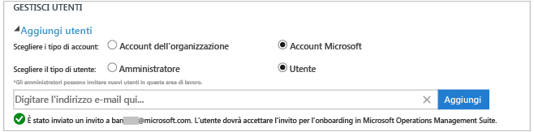

#### Modificare un tipo utente esistente

È possibile modificare il ruolo account per un utente associato all'account OMS. Per il ruolo sono disponibili le opzioni seguenti:

 - *Administrator*: può gestire gli utenti, visualizzare ed eseguire operazioni su tutti gli avvisi e aggiungere e rimuovere i server

 - *Collaboratore*: può visualizzare ed eseguire operazioni su tutti gli avvisi e aggiungere e rimuovere i server

 - *Utente di sola lettura*: gli utenti contrassegnati come di sola lettura non saranno in grado di:
   1. Aggiungere/rimuovere soluzioni (la raccolta soluzioni è nascosta)
   2. Aggiungere/modificare o rimuovere riquadri in 'Dashboard'
   3. Visualizzare le pagine di impostazione (le pagine sono nascoste)
   4. Nella visualizzazione Ricerca: le attività di configurazione di Power BI, ricerche salvate e avvisi sono nascoste

#### Per modificare un account
1. Nella scheda **Account** della pagina **Impostazioni** di OMS selezionare il ruolo dell'utente che si vuole modificare.
2. Fare clic su **OK**.

### Rimuovere un utente da un'area di lavoro di OMS

Per rimuovere un utente da un'area di lavoro di OMS, seguire questa procedura. Si noti che questo non comporta la chiusura dell'area di lavoro dell'utente, ma rimuove l'associazione tra l'utente e l'area di lavoro stessa. Se è associato a più aree di lavoro, un utente riuscirà comunque ad accedere a OMS e a visualizzare le altre aree di lavoro.

1. Nella scheda**Account** della pagina **Impostazioni** di OMS fare clic su Rimuovi accanto al nome utente che si vuole rimuovere.
2. Fare clic su **OK** per confermare che si desidera rimuovere l'utente.

### Aggiungere un gruppo a un'area di lavoro esistente

1.	Seguire i passaggi da 1 a 4 in "Per aggiungere un utente a un'area di lavoro esistente" sopra.
2.	In **Scegliere l'utente/gruppo** selezionare **Gruppo**. 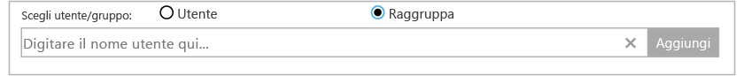
3.	Immettere il nome visualizzato o l'indirizzo di posta elettronica per il gruppo che si vuole aggiungere.
4.	Selezionare il gruppo nei risultati dell'elenco e quindi fare clic su **Aggiungi**.

## Collegare un'area di lavoro esistente a una sottoscrizione di Azure

È possibile creare un'area di lavoro dal sito Web [microsoft.com/oms](https://microsoft.com/oms). Per le aree di lavoro, tuttavia, esistono determinate limitazioni. La principale è il limite di 500 MB al giorno di caricamento dati se si usa un account gratuito. Per apportare modifiche a questa area di lavoro, è necessario **collegare l'area di lavoro esistente a una sottoscrizione di Azure**.

>[AZURE.IMPORTANT] Per collegare un'area di lavoro, è necessario che l'account di Azure abbia già accesso a tale area. In altri termini, è necessario che l'account usato per accedere al portale di Azure sia **lo stesso** account usato per accedere all'area di lavoro di OMS. Se non si tratta dello stesso account, vedere [Aggiungere un utente a un'area di lavoro esistente](#add-a-user-to-an-existing-workspace).

1.	Accedere al [portale di Azure](http://portal.azure.com).
2.	Cercare **Log Analytics (OMS)** e quindi selezionarlo.
3.	Verrà visualizzato un elenco delle aree di lavoro esistenti. Fare clic su **Aggiungi**. 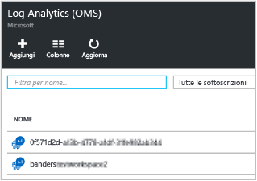
4.	In **Area di lavoro di OMS** fare clic su **O collega esistente**. 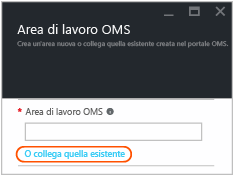
5.	Fare clic su **Configura le impostazioni necessarie**. 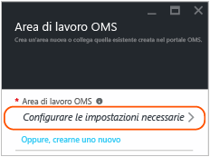
6.	Verrà visualizzato l'elenco delle aree di lavoro non ancora collegate all'account Azure. Selezionare un'area di lavoro. 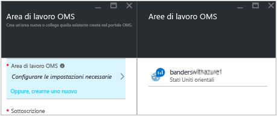
7.	Se necessario, è possibile modificare i valori per gli elementi seguenti:
    - Sottoscrizione
    - Gruppo di risorse
    - Percorso
    - Piano tariffario 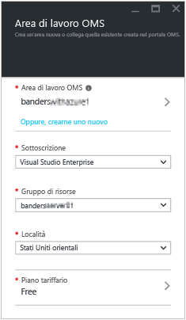
8.	Fare clic su **Create**. L'area di lavoro ora è collegata all'account Azure.

>[AZURE.NOTE] Se non viene visualizzata l'area di lavoro a cui ci si vuole collegare, la sottoscrizione di Azure non ha accesso all'area di lavoro di OMS creata usando il sito Web OMS. È necessario concedere l'accesso a questo account dall'area di lavoro di OMS usando il sito Web OMS. Per eseguire questa operazione, vedere [Aggiungere un utente a un'area di lavoro esistente](#add-a-user-to-an-existing-workspace).

## Aggiornare un'area di lavoro a un piano a pagamento

In OMS sono disponibili tre tipi di piano dati per l'area di lavoro: **Gratuito**, **Standard** e **Premium**. Si supponga di avere sottoscritto un piano di tipo *Free* e di avere raggiunto il limite massimo di 500 MB di dati. Per raccogliere dati oltre questo limite, è necessario aggiornare l'area di lavoro a un '**piano con pagamento in base al consumo**'. Il tipo di piano può essere cambiato in qualsiasi momento. Per altre informazioni sui prezzi di OMS, vedere i [dettagli sui prezzi](https://www.microsoft.com/it-IT/server-cloud/operations-management-suite/pricing.aspx).

>[AZURE.IMPORTANT] È possibile modificare i piani relativi alle aree di lavoro solo se queste sono *collegate* a una sottoscrizione di Azure. Se l'area di lavoro è stata creata in Azure o se è *già* stata collegata, è possibile ignorare questo messaggio. Se l'area di lavoro è stata creata con il [sito Web OMS](http://www.microsoft.com/oms), seguire la procedura riportata in [Collegare un'area di lavoro esistente a una sottoscrizione di Azure](#link-an-existing-workspace-to-an-azure-subscription).

### Uso di diritti dal componente aggiuntivo OMS per System Center

Il componente aggiuntivo OMS per System Center fornisce un diritto per il piano Premium di Log Analytics di OMS, illustrato in [Prezzi di OMS](https://www.microsoft.com/it-IT/server-cloud/operations-management-suite/pricing.aspx).

Quando si acquista il componente aggiuntivo OMS per System Center, il componente aggiuntivo OMS viene aggiunto come diritto al contratto di System Center. Ogni sottoscrizione di Azure creata in base a tale contratto può usare il diritto. Ciò consente, ad esempio, di avere più aree di lavoro di OMS che usano il diritto dal componente aggiuntivo OMS.

Per assicurarsi che l'utilizzo di un'area di lavoro OMS venga applicato ai diritti dal componente aggiuntivo OMS, sarà necessario:

1. Collegare l'area di lavoro di OMS a una sottoscrizione di Azure che fa parte del contratto Enterprise che include sia l'acquisto del componente aggiuntivo OMS che l'utilizzo della sottoscrizione di Azure
2. Selezionare il piano Premium per l'area di lavoro

Quando si esamina l'utilizzo nel portale di Azure o di OMS, i diritti del componente aggiuntivo OMS non verranno visualizzati. È tuttavia possibile visualizzare i diritti in Enterprise Portal.

Se è necessario modificare la sottoscrizione di Azure a cui è collegata la propria 'area di lavoro di OMS, è possibile usare il cmdlet [Move-AzureRMResource](https://msdn.microsoft.com/library/mt652516.aspx) di Azure PowerShell.

### Uso dell'impegno di Azure da un contratto Enterprise

Se si sceglie di usare i prezzi autonomi per i componenti di OMS, si pagherà ogni singolo componente di OMS e l'utilizzo verrà visualizzato nella fattura di Azure.

Se si dispone di un impegno monetario di Azure nell’iscrizione Enterprise a cui sono collegate le sottoscrizioni di Azure, l'utilizzo di Log Analytics verrà automaticamente addebitato a fronte di qualsiasi impegno monetario rimanente.

Se è necessario modificare la sottoscrizione di Azure a cui è collegata l'area di lavoro di OMS, è possibile usare il cmdlet [Move-AzureRMResource](https://msdn.microsoft.com/library/mt652516.aspx) di Azure PowerShell.

### Per sostituire un'area di lavoro con un piano a pagamento

1.	Accedere al [portale di Azure](http://portal.azure.com).
2.	Cercare **Log Analytics (OMS)** e quindi selezionarlo.
3.	Verrà visualizzato un elenco delle aree di lavoro esistenti. Selezionare un'area di lavoro. 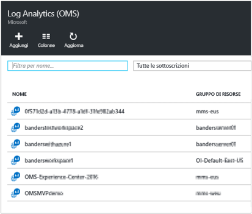
4.	In **Impostazioni** fare clic su **Piano tariffario**. 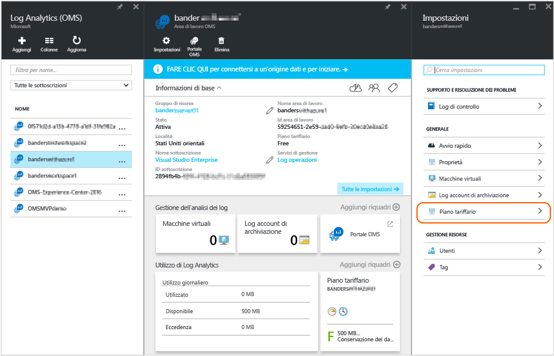
5.	In **Piano tariffario** selezionare un piano dati e quindi fare clic su **Seleziona**. 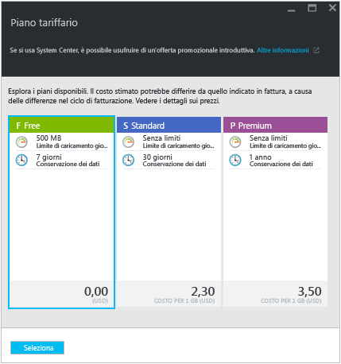
6.	Quando si aggiorna la visualizzazione nel portale di Azure, **Piano tariffario** risulterà aggiornato per il piano selezionato. 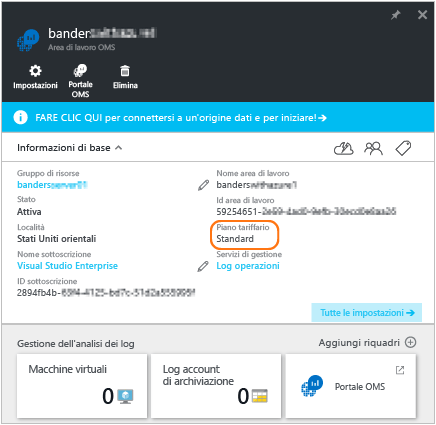

Ora è possibile raccogliere dati oltre il limite del piano "Gratuito".

## Aggiungere un'organizzazione di Azure Active Directory a un'area di lavoro esistente

È possibile associare l'area di lavoro di Operational Insights (OMS) a un dominio di Azure Active Directory. Questo consente di aggiungere utenti da Active Directory direttamente nell'area di lavoro di OMS senza richiedere un account Microsoft separato.

Quando si crea l'area di lavoro dal portale di Azure o si collega l'area di lavoro a una sottoscrizione di Azure, Azure Active Directory verrà collegato come account aziendale.

Quando si crea l'area di lavoro dal portale di OMS, verrà richiesto di eseguire il collegamento a una sottoscrizione di Azure e a un account aziendale.

### Per aggiungere un'organizzazione di Azure Active Directory a un'area di lavoro esistente

1. Nella pagina Impostazioni di OMS fare clic su **Account** e quindi su **Informazioni area di lavoro**.  
2. Rivedere le informazioni sugli account aziendali e quindi fare clic su **Aggiungi organizzazione**. 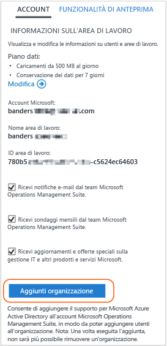
3. Immettere le informazioni sull'identità per l'amministratore del dominio di Azure Active Directory. Successivamente, verrà visualizzato un acknowledgment che informa che l'area di lavoro è collegata al dominio di Azure Active Directory. 

>[AZURE.NOTE]Dopo aver collegato l'account a un account aziendale, il collegamento non può essere rimosso o modificato.

## Chiudere l'aea di lavoro di OMS

Quando si chiude un'area di lavoro di OMS, tutti i dati relativi a tale area verranno eliminati dal servizio OMS non più di 30 giorni dopo la chiusura dell'area di lavoro stessa.

Se si è un amministratore e vi sono più utenti associati all'area di lavoro, l'associazione tra quest'ultima e gli utenti viene interrotta. Se gli utenti sono associati ad altre aree di lavoro, potranno continuare a usare tali aree di lavoro di OMS. Tuttavia, se non sono associati ad altre aree di lavoro, per usare OMS dovranno crearne una nuova.

### Per chiudere un'area di lavoro di OMS

1. Nella pagina **Impostazioni** nella scheda **Account** di OMS fare clic su **Chiudi area di lavoro**.

2. Selezionare uno dei motivi per la chiusura dell'area di lavoro o immettere un motivo diverso nella casella di testo.

3. Fare clic su **Close workspace**.

## Passaggi successivi

- Vedere [Connettere computer Windows a Log Analytics](log-analytics-windows-agents.md) per aggiungere agenti e raccogliere dati.
- [Aggiungere soluzioni di Log Analytics dalla raccolta soluzioni](log-analytics-add-solutions.md) per aggiungere funzionalità e raccogliere i dati.
- [Configurare le impostazioni di proxy e firewall in Log Analytics](log-analytics-proxy-firewall.md) se l'organizzazione usa un server proxy o un firewall per consentire agli agenti di comunicare con il servizio Log Analytics..

<!---HONumber=AcomDC_0518_2016-->