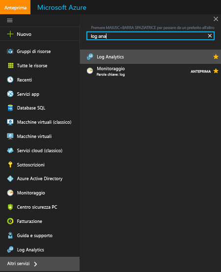
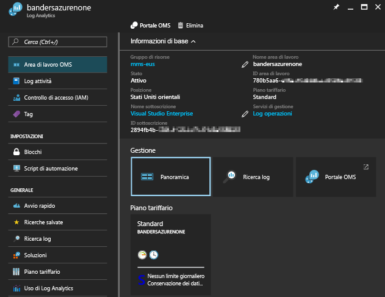
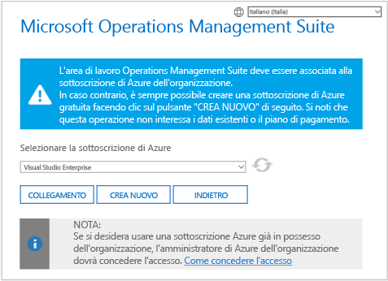
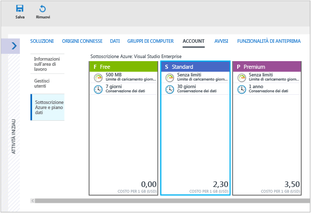
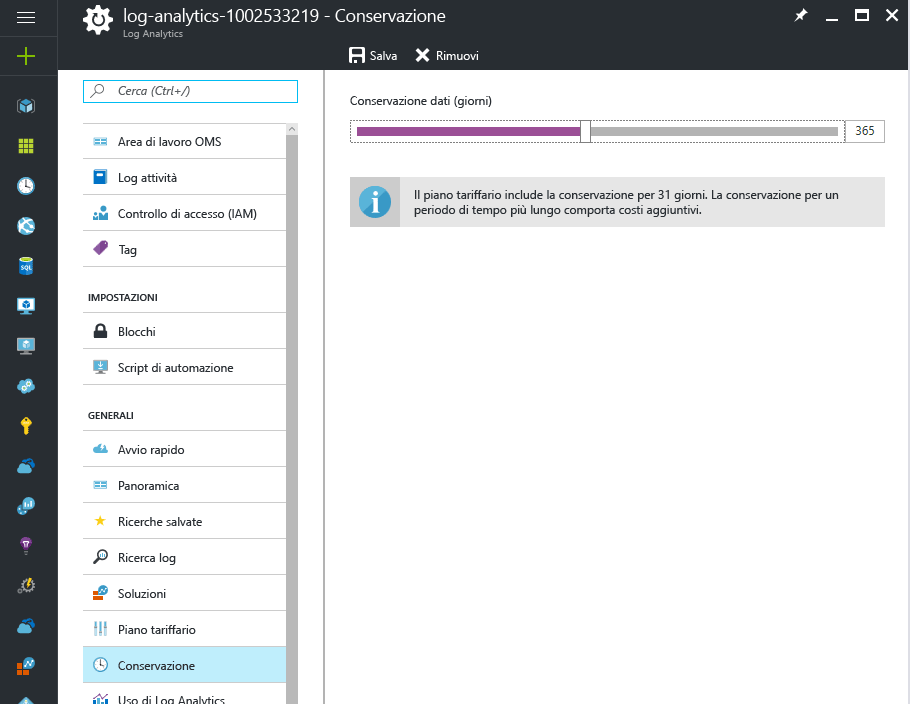
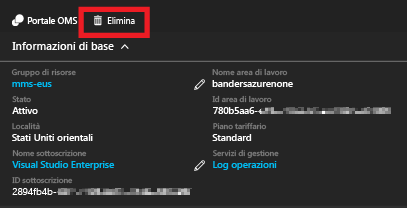

# Gestire le aree di lavoro

Per gestire l'accesso a Log Analytics, vengono eseguite diverse attività amministrative relative alle aree di lavoro. Questo articolo fornisce le procedure consigliate per gestire le aree di lavoro. Un'area di lavoro è sostanzialmente un contenitore che include informazioni sull'account e semplici informazioni di configurazione per l'account stesso. Nell'organizzazione è possibile usare più aree di lavoro per gestire diversi set di dati raccolti dall'intera infrastruttura IT o da una parte di essa.

Per creare un'area di lavoro, è necessario:

1. Disporre di una sottoscrizione di Azure
2. Scegliere un nome per l'area di lavoro
3. Associare l'area di lavoro alla sottoscrizione
4. Scegliere una località geografica

## Determinare il numero di aree di lavoro necessarie
Un'area di lavoro è una risorsa di Azure e rappresenta un contenitore in cui i dati vengono, aggregati, analizzati e presentati nel portale di Azure.

È possibile creare più aree di lavoro e consentire agli utenti di accedere a una o più aree di lavoro. Ridurre al minimo il numero di aree di lavoro consente di eseguire una query e di correlarla con la maggior parte dei dati. Questa sezione descrive quando può essere utile creare più aree di lavoro.

Oggi, un'area di lavoro fornisce:

* Una posizione geografica per archiviare i dati
* Granularità per la fatturazione
* Isolamento dei dati
* Ambito per la configurazione

In base alle caratteristiche precedenti, si possono creare più aree di lavoro se:

* Si opera in un'azienda globale ed è necessario che i dati siano archiviati in aree specifiche per motivi di sovranità o conformità.
* Si usa Azure e si intendono evitare costi di trasferimento dei dati in uscita tramite un'area di lavoro nella stessa area delle risorse di Azure da essa gestite.
* Si vogliono allocare le spese a reparti o gruppi aziendali diversi in base all'utilizzo. Quando si crea un'area di lavoro per ogni reparto o gruppo aziendale, i rendiconti sulla fatturazione e l’utilizzo di Azure presentano gli addebiti separatamente per ogni area di lavoro.
* Si opera come provider di servizi gestiti e per ogni cliente gestito è necessario mantenere i dati di Log Analytics isolati da altri dati del cliente.
* Si gestiscono più clienti e si desidera che ogni cliente, reparto o gruppo aziendale visualizzi i propri dati, ma non i dati di altri.

Quando si usano agenti per la raccolta dei dati, è possibile configurare ogni agente in modo che faccia riferimento a una o più aree di lavoro.

Se si usa System Center Operations Manager, ogni gruppo di gestione di Operations Manager può essere connesso con una sola area di lavoro. È possibile installare Microsoft Monitoring Agent nei computer gestiti da Operations Manager e fare sì che l’agente faccia riferimento sia a Operations Manager che a un'altra area di lavoro di Log Analytics.

### Informazioni sull'area di lavoro

È possibile visualizzare i dettagli sull'area di lavoro nel portale di Azure. È inoltre possibile visualizzare i dettagli nel portale di OMS.

#### Visualizzare le informazioni sull'area di lavoro nel portale di Azure

1. Se questa operazione non è già stata eseguita, accedere al [portale di Azure](https://portal.azure.com), usando la sottoscrizione di Azure.
2. Scegliere **Altri servizi** dal menu **Hub** e digitare **Log Analytics** nell'elenco di risorse. Non appena si inizia a digitare, l'elenco viene filtrato in base all'input. Fare clic su **Log Analytics**.  
      
3. Nel pannello di sottoscrizioni di Log Analytics, selezionare un'area di lavoro.
4. Nel pannello dell'area di lavoro vengono visualizzati i dettagli sull'area di lavoro e i collegamenti che forniscono informazioni aggiuntive.  
      

## Gestire utenti e account
A ogni area di lavoro possono essere associati più account utente, ciascuno dei quali (account Microsoft o account aziendale) può avere accesso a diverse aree di lavoro.

Per impostazione predefinita, l'account Microsoft o l'account aziendale usato per creare l'area di lavoro diventa l'amministratore di quest'ultima. L'amministratore può quindi invitare altri account Microsoft o scegliere utenti da Azure Active Directory.

È possibile concedere agli utenti l'accesso all'area di lavoro da due posizioni:

* In Azure è possibile usare controllo degli accessi in base al ruolo per fornire l'accesso alla sottoscrizione di Azure e alle risorse di Azure associate. Queste autorizzazioni vengono usate anche per l'accesso a PowerShell e all'API REST.
* Nel portale di OMS è possibile accedere solo al portale di OMS, non alla sottoscrizione di Azure associata.

Per visualizzare i dati nei riquadri delle soluzioni Backup e Site Recovery, è necessario avere l'autorizzazione di amministratore o coamministratore per la sottoscrizione di Azure a cui è collegata l'area di lavoro.   

### Gestione dell'accesso a Log Analytics tramite il portale di Azure
Se si concede agli utenti l'accesso all'area di lavoro di Log Analytics usando le autorizzazioni di Azure nel portale di Azure, ad esempio, gli stessi utenti sono in grado di accedere al portale di Log Analytics. Se gli utenti accedono al portale di Azure, possono anche accedere al portale di OMS facendo clic sull'attività **Portale di OMS** durante la visualizzazione della risorsa dell'area di lavoro di Log Analytics.

Ecco alcuni elementi relativi al portale di Azure da tenere presenti:

* Non si tratta del *Controllo degli accessi in base al ruolo*. Se sono disponibili le autorizzazioni di accesso di tipo *Lettore* nel portale di Azure per l'area di lavoro Log Analytics, è possibile apportare modifiche usando il portale di OMS. Il portale di OMS prevede ruoli di amministratore, collaboratore e utente di sola lettura. Se l'account con cui è stato eseguito l'accesso si trova nell'istanza di Azure Active Directory collegata all'area di lavoro, l'utente avrà un ruolo di amministratore nel portale di OMS. In caso contrario avrà un ruolo di collaboratore.
* Quando si accede al portale di OMS usando l'URL http://mms.microsoft.com, per impostazione predefinita viene visualizzato l'elenco **Select a workspace** (Selezionare un'area di lavoro). L'elenco contiene solo le aree di lavoro aggiunte usando il portale di OMS. Per visualizzare le aree di lavoro a cui si può accedere con le sottoscrizioni di Azure, è necessario specificare un tenant come parte dell'URL. Ad esempio:

  `mms.microsoft.com/?tenant=contoso.com` L'identificatore del tenant corrisponde spesso all'ultima parte dell'indirizzo e-mail usato per eseguire l'accesso.
* Se l'account usato per l'accesso è un account nel tenant Azure Active Directory, significa che l'utente è un *Amministratore* nel portale di OMS. Questa è la situazione che si verifica di solito a meno che l'accesso non venga eseguito come CSP.  Se l'account non è nel tenant Azure Active Directory, gli sarà concesso il ruolo di *Utente* nel portale di OMS.
* Se si vuole passare direttamente a un portale a cui si ha accesso tramite le autorizzazioni di Azure, è necessario specificare la risorsa come parte dell'URL. È possibile ottenere questo URL usando PowerShell.

  ad esempio `(Get-AzureRmOperationalInsightsWorkspace).PortalUrl`.

  L'URL ha l'aspetto seguente: `https://eus.mms.microsoft.com/?tenant=contoso.com&resource=%2fsubscriptions%2faaa5159e-dcf6-890a-a702-2d2fee51c102%2fresourcegroups%2fdb-resgroup%2fproviders%2fmicrosoft.operationalinsights%2fworkspaces%2fmydemo12`

Ad esempio, per aggiungere o rimuovere le soluzioni di gestione, l'utente deve essere amministratore o collaboratore della sottoscrizione di Azure quando usa il Portale di Azure. L'utente deve anche essere membro del ruolo di amministratore o collaboratore dell'area di lavoro OMS nel portale di OMS.

### Gestione degli utenti nel portale di OMS
È possibile gestire utenti e gruppi nella scheda **Gestisci utenti** in **Account** nella pagina Impostazioni.   

#### Aggiungere un utente a un'area di lavoro esistente
Per aggiungere un utente o un gruppo a un'area di lavoro, seguire questa procedura.

1. Nel portale di OMS fare clic sul riquadro **Impostazioni**.
2. Fare clic sulla scheda **Account** e quindi sulla scheda **Gestisci utenti**.
3. Nella sezione **Gestisci utenti** scegliere il tipo di account da aggiungere: **Account aziendale**, **Account Microsoft**, **Supporto Microsoft**.

   * Se si sceglie l'Account Microsoft, digitare l'indirizzo di posta elettronica dell'utente associato all'Account Microsoft.
   * Se si sceglie l'Account dell'organizzazione, è possibile immettere parte del nome utente o del gruppo o l'alias e-mail e verrà visualizzato un elenco di utenti e gruppi in una casella a discesa. Selezionare un utente o gruppo.
   * Usare Supporto Microsoft per concedere a un tecnico del supporto tecnico Microsoft o a un altro dipendente Microsoft l'accesso temporaneo all'area di lavoro per la risoluzione dei problemi.

     > [!NOTE]
     > Per prestazioni ottimali, limitare a tre il numero di gruppi di Active Directory associati a un singolo account OMS, ovvero uno per gli amministratori, uno per i collaboratori e uno per gli utenti di sola lettura. L'uso di più gruppi potrebbe compromettere le prestazioni di Log Analytics.
     >
     >
4. Scegliere il tipo di utente o gruppo da aggiungere: **Amministratore**, **Collaboratore** o **Utente di sola lettura**.  
5. Fare clic su **Aggiungi**.

   Se si aggiunge un account Microsoft, all'indirizzo di posta elettronica fornito viene inviato un invito ad aggiungere l'account. Dopo aver seguito le istruzioni riportate nell'invito a iscriversi a OMS, l'utente può accedere alla sua area di lavoro.
   Se si aggiunge un account aziendale, l'utente può accedere immediatamente a Log Analytics.  

#### Modificare un tipo utente esistente
È possibile modificare il ruolo account per un utente associato all'account OMS. Per il ruolo sono disponibili le opzioni seguenti:

* *Administrator*: può gestire gli utenti, visualizzare ed eseguire operazioni su tutti gli avvisi e aggiungere e rimuovere i server
* *Collaboratore*: può visualizzare ed eseguire operazioni su tutti gli avvisi e aggiungere e rimuovere i server
* *Utente di sola lettura*: gli utenti contrassegnati come di sola lettura non possono:

  1. Aggiungere o rimuovere soluzioni. La raccolta di soluzioni è nascosta.
  2. Aggiungere, modificare o rimuovere riquadri nel **Dashboard**.
  3. Visualizzare le pagine **Impostazioni**. Queste pagine sono nascoste.
  4. Nella visualizzazione Ricerca le attività di configurazione di Power BI, ricerche salvate e avvisi sono nascoste.

#### Per modificare un account
1. Nel portale di OMS fare clic sul riquadro **Impostazioni**.
2. Fare clic sulla scheda **Account** e quindi sulla scheda **Gestisci utenti**.
3. Selezionare il ruolo per l'utente da modificare.
4. Nella finestra di dialogo di conferma fare clic su **Sì**.

### Rimuovere un utente da un'area di lavoro
Per rimuovere un utente da un'area di lavoro, seguire questa procedura. La rimozione dell'utente non chiude l'area di lavoro, ma rimuove l'associazione tra l'utente e l'area di lavoro stessa. Se è associato a più aree di lavoro, un utente può comunque accedere a OMS e visualizzare le altre aree di lavoro.

1. Nel portale di OMS fare clic sul riquadro **Impostazioni**.
2. Fare clic sulla scheda **Account** e quindi sulla scheda **Gestisci utenti**.
3. Fare clic su **Rimuovi** accanto al nome utente da rimuovere.
4. Nella finestra di dialogo di conferma fare clic su **Sì**.

### Aggiungere un gruppo a un'area di lavoro esistente
1. Seguire i passaggi da 1 a 4 in "Per aggiungere un utente a un'area di lavoro esistente" sopra.
2. In **Scegliere l'utente/gruppo** selezionare **Gruppo**.  
   
3. Immettere il nome visualizzato o l'indirizzo di posta elettronica per il gruppo che si vuole aggiungere.
4. Selezionare il gruppo nei risultati dell'elenco e quindi fare clic su **Aggiungi**.

## Collegare un'area di lavoro esistente a una sottoscrizione di Azure
Tutte le aree di lavoro create dopo il 26 settembre 2016 devono essere collegate a una sottoscrizione di Azure al momento della creazione. All'accesso successivo, le aree di lavoro create prima di tale data devono essere collegate a un'area di lavoro. Quando si crea l'area di lavoro dal portale di Azure o si collega l'area di lavoro a una sottoscrizione di Azure, Azure Active Directory viene collegato come account aziendale.

### Per collegare un'area di lavoro a una sottoscrizione di Azure nel portale di OMS

- Quando si accede al portale di OMS, viene richiesto di selezionare una sottoscrizione di Azure. Selezionare la sottoscrizione che si vuole collegare all'area di lavoro e quindi fare clic su **Collega**.  
    

    > [!IMPORTANT]
    > Per collegare un'area di lavoro, è necessario che l'account di Azure abbia già accesso a tale area.  In altri termini, è necessario che l'account usato per accedere al portale di Azure sia **lo stesso** account usato per accedere all'area di lavoro. In caso contrario, vedere [Aggiungere un utente a un'area di lavoro esistente](#add-a-user-to-an-existing-workspace).

### Per collegare un'area di lavoro a una sottoscrizione di Azure nel portale di Azure
1. Accedere al [portale di Azure](http://portal.azure.com).
2. Cercare e selezionare **Log Analytics**.
3. Viene visualizzato un elenco delle aree di lavoro esistenti. Fare clic su **Aggiungi**.  
   
4. In **Area di lavoro di OMS** fare clic su **Collega esistente**.  
   
5. Fare clic su **Configura le impostazioni necessarie**.  
   
6. Viene visualizzato l'elenco delle aree di lavoro non ancora collegate all'account Azure. Selezionare un'area di lavoro.  
   
7. Se necessario, è possibile modificare i valori per gli elementi seguenti:
   * Sottoscrizione
   * Gruppo di risorse
   * Percorso
   * Piano tariffario   
     
8. Fare clic su **OK**. L'area di lavoro ora è collegata all'account Azure.

> [!NOTE]
> Se non viene visualizzata l'area di lavoro a cui ci si vuole collegare, la sottoscrizione di Azure non ha accesso all'area di lavoro creata usando il sito Web OMS.  Per concedere l'accesso a questo account dal portale di OMS, vedere [Aggiungere un utente a un'area di lavoro esistente](#add-a-user-to-an-existing-workspace).
>
>

## Aggiornare l'area di lavoro a un piano a pagamento
In OMS sono disponibili tre tipi di piani per l'area di lavoro: **Gratuito**, **Standalone** e **OMS**.  Se si usa il piano *gratuito*, è previsto un limite di 500 MB di dati inviati ogni giorno a Log Analytics.  Se si supera questo limite, è necessario modificare l'area di lavoro in un piano a pagamento per evitare che non vengano raccolti dati oltre questo limite. Il tipo di piano può essere cambiato in qualsiasi momento.  Per altre informazioni sui prezzi di OMS, vedere i [dettagli sui prezzi](https://www.microsoft.com/en-us/cloud-platform/operations-management-suite-pricing).

### Uso dei diritti derivanti da una sottoscrizione di OMS
Per usare i diritti che derivano dall'acquisto di OMS E1, OMS E2 o un componente aggiuntivo di OMS per System Center, scegliere il piano *OMS* di Log Analytics.

Quando si acquista una sottoscrizione di OMS, i diritti vengono aggiunti al contratto Enterprise Agreement. I diritti possono essere usati da ogni sottoscrizione di Azure creata in base a tale contratto. Ciò consente, ad esempio, di avere più aree di lavoro che usano il diritto derivante dalle sottoscrizioni di OMS.

Per assicurarsi che l'uso di un'area di lavoro venga applicato ai diritti derivanti dalla sottoscrizione di OMS, è necessario:

1. Creare un'area di lavoro in una sottoscrizione di Azure che fa parte del contratto Enterprise Agreement che include sia la sottoscrizione di OMS
2. Selezionare il piano *OMS* per l'area di lavoro

> [!NOTE]
> Se l'area di lavoro è stata creata prima del 26 settembre 2016 e il piano di prezzo di Log Analytics è *Premium*, l'area di lavoro userà i diritti derivanti dal componente aggiuntivo OMS per System Center. È possibile anche usare i diritti passando al piano tariffario *OMS*.
>
>

I diritti della sottoscrizione di OMS non sono visibili nel portale di Azure o OMS. È possibile visualizzare i diritti e l'uso in Enterprise Portal.  

Se è necessario modificare la sottoscrizione di Azure a cui è collegata la propria area di lavoro, è possibile usare il cmdlet [Move-AzureRmResource](https://msdn.microsoft.com/library/mt652516.aspx) di Azure PowerShell.

### Uso dell'impegno di Azure da un contratto Enterprise
Se non si dispone di una sottoscrizione di OMS, è necessario pagare separatamente per ogni componente di OMS e l'uso viene visualizzato nella fattura di Azure.

Se si ha un impegno monetario di Azure nell'iscrizione Enterprise a cui sono collegate le sottoscrizioni di Azure, l'utilizzo di Log Analytics verrà automaticamente addebitato a fronte di qualsiasi impegno monetario rimanente.

Se è necessario modificare la sottoscrizione di Azure a cui è collegata l'area di lavoro, è possibile usare il cmdlet [Move-AzureRmResource](https://msdn.microsoft.com/library/mt652516.aspx) di Azure PowerShell.  

### Passare a un piano tariffario a pagamento per l'area di lavoro nel portale di Azure
1. Accedere al [portale di Azure](http://portal.azure.com).
2. Cercare e selezionare **Log Analytics**.
3. Viene visualizzato un elenco delle aree di lavoro esistenti. Selezionare un'area di lavoro.  
4. Nel pannello dell'area di lavoro in **Generale** fare clic su **Piano tariffario**.  
5. In **Piano tariffario** selezionare un piano tariffario e quindi fare clic su **Seleziona**.  
    
6. Quando si aggiorna la visualizzazione nel portale di Azure, **Piano tariffario** risulta aggiornato per il piano selezionato.  
    

> [!NOTE]
> Se l'area di lavoro è collegata a un account di Automazione, prima di poter selezionare il piano tariffario *Standalone (Per GB)* (Autonomo - per GB), è necessario eliminare eventuali soluzioni di **Automazione e controllo** e scollegare l'account di Automazione. Nel pannello dell'area di lavoro in **Generale** fare clic su **Soluzioni** per visualizzare ed eliminare le soluzioni. Per scollegare l'account di Automazione, fare clic sul nome dell'account di Automazione nel pannello **Piano tariffario**.
>
>

## Modificare il piano dati nel portale di OMS

Per modificare un piano dati usando il portale di OMS, l'utente connesso deve avere già un account Azure.

1. Nel portale di OMS fare clic sul riquadro **Impostazioni**.
2. Fare clic sulla scheda **Account** e quindi sulla scheda **Azure Subscription & Data Plan** (Sottoscrizione di Azure e piano dati).
3. Fare clic sul piano dati da usare.
4. Fare clic su **Salva**  
   

Il nuovo piano dati viene visualizzato nella barra multifunzione del portale di OMS, nella parte superiore della pagina Web.

## Modificare la durata dell'archiviazione dei dati di Log Analytics

Nel piano tariffario Gratuito, Log Analytics mette a disposizione i dati degli ultimi sette giorni.
Nel piano tariffario Standard, Log Analytics mette a disposizione i dati degli ultimi 30 giorni.
Nel piano tariffario Premium, Log Analytics mette a disposizione i dati degli ultimi 365 giorni.
Nei piani tariffari Autonomo e OMS, Log Analytics mette a disposizione i dati degli ultimi 31 giorni.

Quando si usano i piani tariffari Autonomo e OMS, è possibile conservare fino a 2 anni di dati (730 giorni). I dati archiviati da più tempo rispetto al valore predefinito di 31 giorni sono soggetti a costi di conservazione dei dati. Per altre informazioni sui prezzi, vedere i [prezzi per eccedenze](https://azure.microsoft.com/pricing/details/log-analytics/).

Per modificare la durata della conservazione dei dati:

1. Accedere al [portale di Azure](http://portal.azure.com).
2. Cercare e selezionare **Log Analytics**.
3. Viene visualizzato un elenco delle aree di lavoro esistenti. Selezionare un'area di lavoro.  
4. Nel pannello dell'area di lavoro in **Generale** fare clic su **Conservazione**.  
5. Usare il dispositivo di scorrimento per aumentare o diminuire il numero di giorni di conservazione e quindi fare clic su **Salva**.  
    

## Modificare un'organizzazione di Azure Active Directory in un'area di lavoro

È possibile modificare un'organizzazione di Azure Active Directory in un'area di lavoro. La modifica dell'organizzazione di Azure Active Directory consente di aggiungere all'area di lavoro gli utenti e i gruppi dalla directory.

### Per modificare l'organizzazione di Azure Active Directory in un'area di lavoro

1. Nella pagina Impostazioni del portale di OMS fare clic su **Account** e quindi su **Gestisci utenti**.  
2. Rivedere le informazioni sugli account aziendali e quindi fare clic su **Modifica organizzazione**.  
    
3. Immettere le informazioni sull'identità per l'amministratore del dominio di Azure Active Directory. Successivamente, viene visualizzato un acknowledgement che informa che l'area di lavoro è collegata al dominio di Azure Active Directory.  
    

## Eliminare un'area di lavoro di Log Analytics
Quando si elimina un'area di lavoro di Log Analytics, tutti i dati relativi a tale area vengono eliminati dal servizio OMS entro 30 giorni.

Se si è un amministratore e vi sono più utenti associati all'area di lavoro, l'associazione tra quest'ultima e gli utenti viene interrotta. Se gli utenti sono associati ad altre aree di lavoro, potranno continuare a usare tali aree di lavoro di OMS. Tuttavia, se non sono associati ad altre aree di lavoro, per usare OMS devono crearne una nuova.

### Per eliminare un'area di lavoro
1. Accedere al [portale di Azure](http://portal.azure.com).
2. Cercare e selezionare **Log Analytics**.
3. Viene visualizzato un elenco delle aree di lavoro esistenti. Selezionare l'area di lavoro da eliminare.
4. Nel pannello dell'area di lavoro fare clic su **Elimina**.  
    
5. Nella finestra di conferma dell'eliminazione dell'area di lavoro, fare clic su **Sì**.

## Passaggi successivi
* Vedere [Connettere computer Windows a Log Analytics](log-analytics-windows-agents.md) per aggiungere agenti e raccogliere dati.
* [Aggiungere soluzioni di Log Analytics dalla raccolta soluzioni](log-analytics-add-solutions.md) per aggiungere funzionalità e raccogliere i dati.
* [Configurare le impostazioni di proxy e firewall in Log Analytics](log-analytics-proxy-firewall.md) se l'organizzazione usa un server proxy o un firewall per consentire agli agenti di comunicare con il servizio Log Analytics.

