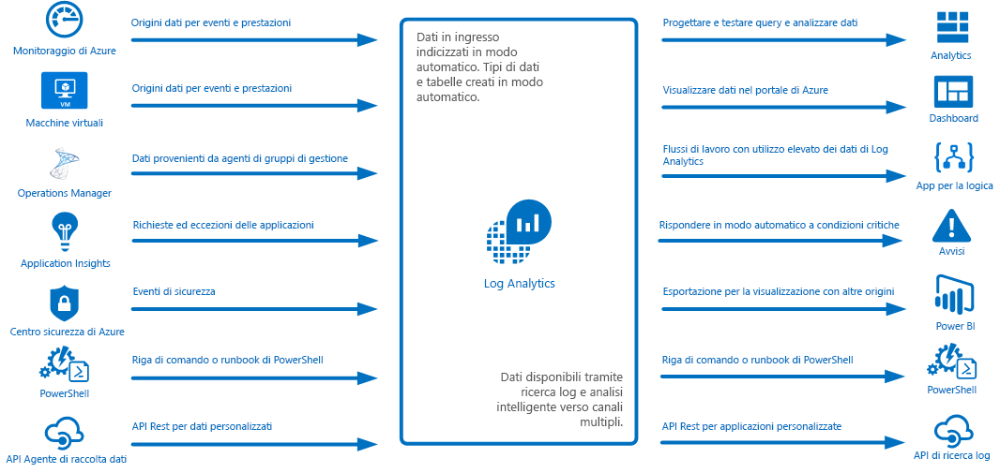
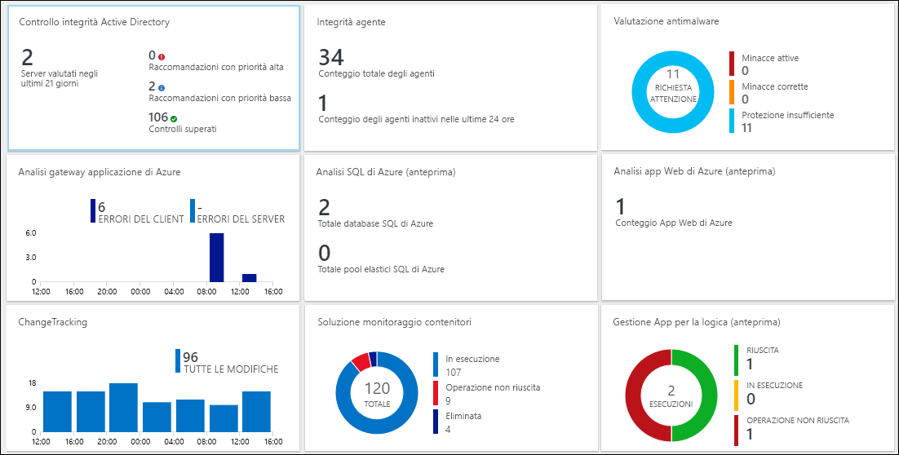
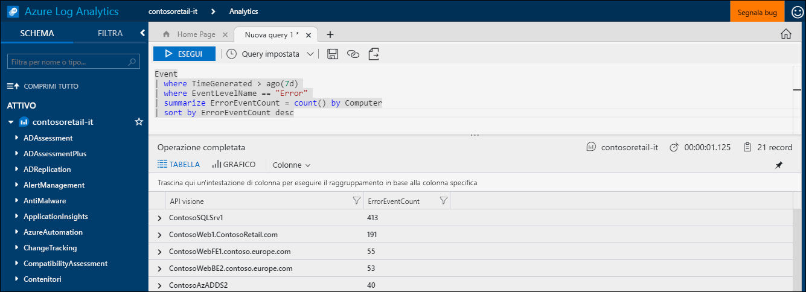
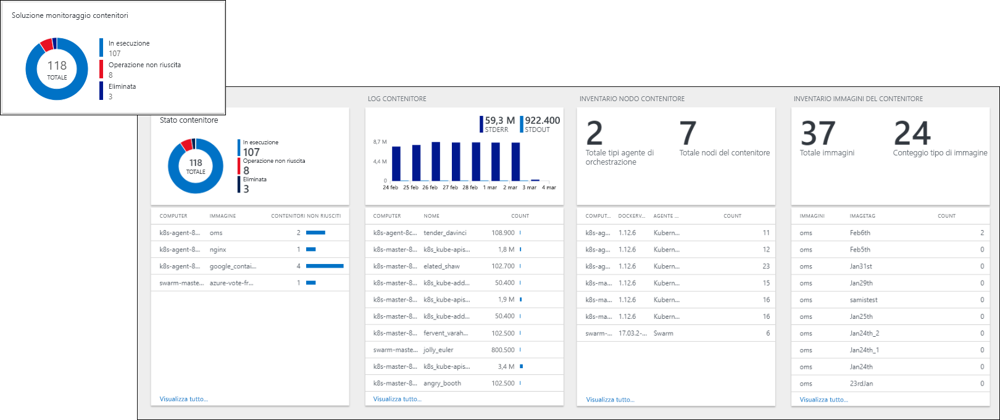
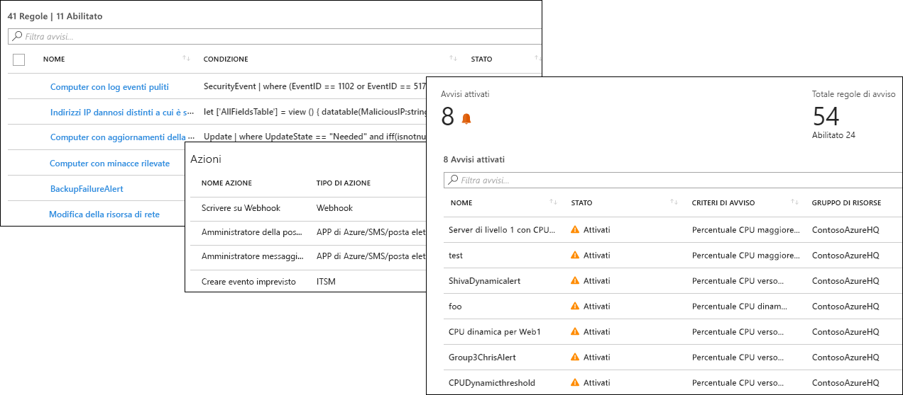
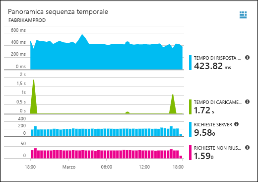
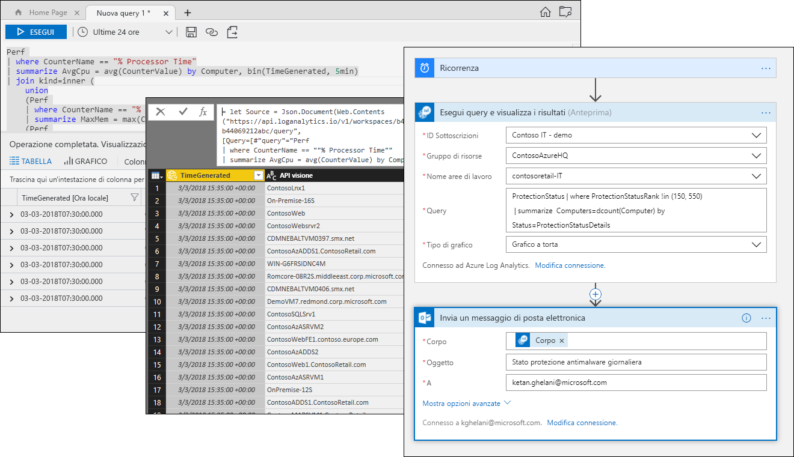

# Informazioni su Azure Log Analytics
Log Analytics svolge un ruolo essenziale nella gestione di Azure, raccogliendo dati di telemetria e di altro tipo da diverse origini e fornendo un linguaggio di query e un motore di analisi che offrono informazioni dettagliate sul funzionamento delle applicazioni e delle risorse.  È possibile interagire direttamente con i dati di Log Analytics tramite le ricerche nei log e le visualizzazioni oppure è possibile usare gli strumenti di analisi in altri servizi di Azure che archiviano i rispettivi dati in Log Analytics, ad esempio Application Insights o il Centro sicurezza di Azure.  

Log Analytics richiede una configurazione minima ed è già integrato con altri servizi di Azure.  È sufficiente creare un'area di lavoro per abilitare la raccolta.  È quindi possibile installare agenti sulle macchine virtuali per includerli nell'area di lavoro e abilitare le soluzioni di gestione, che includono la logica necessaria per fornire informazioni dettagliate aggiuntive in diverse applicazioni.  In background i tipi di dati vengono predefiniti o creati automaticamente durante la raccolta dei dati.

## Ruolo nel monitoraggio

I diversi servizi di monitoraggio di Azure sono illustrati in [Monitoraggio di applicazioni e risorse di Azure](../monitoring-and-diagnostics/monitoring-overview.md).  Log Analytics svolge un ruolo essenziale consolidando i dati di monitoraggio da diverse origini e fornendo un linguaggio di query avanzato per il consolidamento e l'analisi.  

Log Analytics non è tuttavia limitato al monitoraggio delle risorse di Azure.  Può raccogliere dati da risorse locali o in altri cloud per creare un ambiente di monitoraggio ibrido e può connettersi direttamente a System Center Operations Manager per raccogliere dati di telemetria dagli agenti esistenti.  Gli strumenti di analisi in Log Analytics, come le ricerche nei log, le visualizzazioni e le soluzioni di gestione, vengono applicati a tutti i dati raccolti per consentire di ottenere un'analisi centralizzata dell'intero ambiente.

## Raccolta dei dati
Log Analytics raccoglie dati da diverse origini.  Dopo la raccolta, i dati vengono organizzati in tabelle separate per ogni tipo di dati, in modo che sia possibile analizzare tutti i dati insieme, indipendentemente dalla rispettiva origine.

Ecco alcuni metodi per la raccolta di dati in Log Analytics:

- Configurare Monitoraggio di Azure per copiare le metriche e i log raccolti dalle risorse di Azure.
- Gli agenti sulle macchine virtuali [Windows](log-analytics-windows-agent.md) e [Linux](log-analytics-linux-agents.md) inviano dati di telemetria dal sistema operativo guest e dalle applicazioni a Log Analytics in base alle [Origini dati](log-analytics-data-sources.md) configurate.  
- Connettere un [gruppo di gestione di System Center Operations Manager](log-analytics-om-agents.md) a Log Analytics per raccogliere dati dai rispettivi agenti.
- I servizi di Azure come [Application Insights](https://docs.microsoft.com/azure/application-insights/) e il [Centro sicurezza di Azure](https://docs.microsoft.com/azure/security-center/) archiviano i rispettivi dati direttamente in Log Analytics, senza alcuna configurazione.
- Scrivere dati dalla riga di comando di PowerShell o da un [runbook di Automazione di Azure](../automation/automation-runbook-types.md) tramite cmdlet di Log Analytics.
- Per requisiti personalizzati, è possibile usare l'[API di raccolta dati HTTP](log-analytics-data-collector-api.md) per scrivere dati in Log Analytics da qualsiasi client dell'API REST.

## Aggiungere funzionalità con soluzioni di gestione
Le [soluzioni di gestione](log-analytics-add-solutions.md) forniscono logica predefinita per un prodotto o uno scenario specifico.  È possibile che raccolgano dati aggiuntivi in Log Analytics o elaborino dati già raccolti.  Includeranno in genere una visualizzazione per semplificare l'analisi dei dati aggiuntivi.  Sono disponibili soluzioni per numerose funzioni e vengono aggiunte continuamente altre soluzioni.  È possibile accedere facilmente alle soluzioni disponibili e [aggiungerle all'area di lavoro](log-analytics-add-solutions.md) da Azure Marketplace.  

## Linguaggio di query

Log Analytics include un [linguaggio di query avanzato](http://docs.loganalytics.io) che permette di recuperare, consolidare e analizzare rapidamente i dati raccolti.  È possibile creare e testare query usando i [portali Ricerca log o Analisi avanzata](log-analytics-log-search-portals.md) e quindi analizzare direttamente i dati usando questi strumenti o salvare query per l'uso con visualizzazioni, avvisi oppure per l'esportazione in altri strumenti, come Power BI o Excel.

Il linguaggio di query di Log Analytics è adatto a ricerche semplici nei log, ma include anche funzionalità avanzate come le aggregazioni, i join e le analisi intelligenti. È possibile apprendere rapidamente il linguaggio di query usando le [numerose esercitazioni](https://docs.loganalytics.io/docs/Learn/Tutorials) disponibili.  Indicazioni specifiche sono disponibili per gli utenti che hanno già familiarità con [SQL](https://docs.loganalytics.io/docs/Learn/References/SQL-to-Azure-Log-Analytics) e [Splunk](https://docs.loganalytics.io/docs/Learn/References/Splunk-to-Azure-Log-Analytics).

## Visualizzare i dati di Log Analytics

Le [visualizzazioni in Log Analytics](log-analytics-view-designer.md) presentano visivamente i dati dalle ricerche nei log.  Ogni visualizzazione include una combinazione di visualizzazioni quali grafici a barre o a linee, oltre ad elenchi di riepilogo dei dati critici.  Le [soluzioni di gestione](#add-functionality-with-management-solutions) includono visualizzazioni di riepilogo dei dati per un'applicazione specifica ed è possibile creare visualizzazioni personalizzate per presentare i dati da qualsiasi ricerca nei log di Log Analytics.

È anche possibile aggiungere i risultati di una query di Log Analytics a un [dashboard di Azure](../azure-portal/azure-portal-dashboards.md), che consente di combinare riquadri da diversi servizi di Azure.  È possibile anche aggiungere una visualizzazione di Log Analytics a un dashboard.

## Creazione di avvisi dai dati di Log Analytics

Usare gli [avvisi di Azure](../monitoring-and-diagnostics/monitoring-overview-unified-alerts.md) per ricevere proattivamente notifiche relative a condizioni dei dati di Log Analytics significative.  Una query viene eseguita automaticamente in base a intervalli pianificati e viene creato un avviso se i risultati corrispondono a criteri specifici.  Ciò consente di combinare gli avvisi da Log Analytics con altre origini, ad esempio gli avvisi in tempo quasi reale di [Monitoraggio di Azure](../monitoring-and-diagnostics/monitoring-near-real-time-metric-alerts.md) e le eccezioni delle applicazioni da [Application Insights](../application-insights/app-insights-alerts.md), condividendo [gruppi di azioni](../monitoring-and-diagnostics/monitoring-action-groups.md) per rispondere alle condizioni di avviso.

## Uso dei dati di Log Analytics in altri servizi
Servizi come Application Insights e il Centro sicurezza di Azure archiviano i rispettivi dati in Log Analytics.  Si interagisce in genere con gli strumenti di analisi avanzata offerti da questi servizi, ma è anche possibile usare le query di Log Analytics per accedere ai rispettivi dati e potenzialmente combinarli con dati da altri servizi.  

La visualizzazione seguente, ad esempio, proviene da Application Insights.  Se si fa clic sull'icona in alto a destra, viene avviata la console di analisi di Log Analytics, con le query usate dal grafico.

## Esportazione dei dati di Log Analytics

Log Analytics rende i rispettivi dati disponibili anche all'esterno di Azure.  È possibile configurare [Power BI](log-analytics-powerbi.md) per l'importazione dei risultati di una query in base a intervalli pianificati, consentendo di sfruttare le funzionalità di questa soluzione, come la possibilità di combinare dati provenienti da origini diverse e di condividere report sul Web e dispositivi mobili.  È anche possibile sfruttare l' [API di Ricerca log](log-analytics-log-search-api.md) per compilare soluzioni personalizzate che sfruttano i dati di Log Analytics o per eseguire l'integrazione con altri sistemi.

È possibile usare [App per la logica](../logic-apps/logic-apps-overview.md) in Azure per creare flussi di lavoro personalizzati basati sui dati di Log Analytics.  Per una logica più complessa basata su PowerShell, è possibile usare i [runbook in Automazione di Azure](../automation/automation-runbook-types.md).

## Passaggi successivi
- Per iniziare, [raccogliere dati dalle macchine virtuali di Azure](log-analytics-quick-collect-azurevm.md).
- Completare un'[esercitazione sull'analisi dei dati di Log Analytics con una semplice query](log-analytics-tutorial-viewdata.md).
* [Esplorare le soluzioni disponibili](log-analytics-add-solutions.md) per aggiungere funzionalità a Log Analytics.

