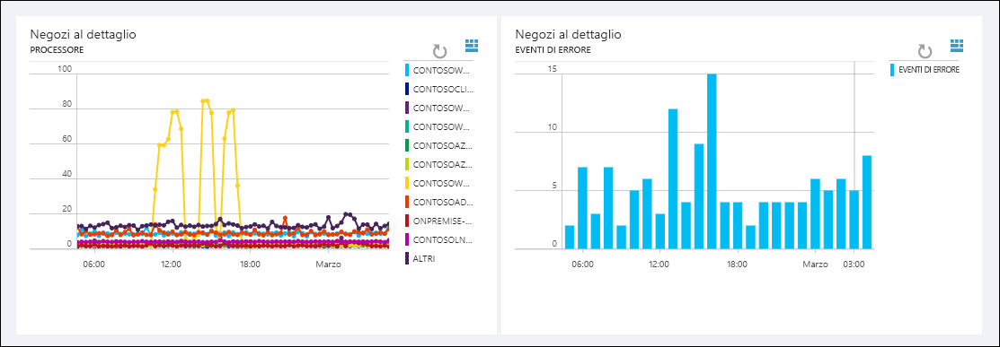

# Cos'è Log Analytics?
Log Analytics è un servizio di [Operations Management Suite \(OMS\)](../operations-management-suite/operations-management-suite-overview.md) che consente di raccogliere e analizzare i dati generati dalle risorse nel cloud e negli ambienti locali. Fornisce informazioni in tempo reale usando la ricerca integrata e i dashboard personalizzati per analizzare rapidamente milioni di record in tutti i carichi di lavoro e i server, indipendentemente dalla loro ubicazione fisica.

## Componenti di Log Analytics
Al centro di Log Analytics è presente il repository OMS, ospitato nel cloud di Azure.  I dati vengono raccolti nel repository da origini connesse configurando le origini dati e aggiungendo soluzioni alla sottoscrizione.  Le origini dati e le soluzioni creeranno diversi tipi di record con uno specifico set di proprietà, ma che possono comunque essere analizzati insieme nelle query al repository.  In questo modo è possibile usare gli stessi strumenti e metodi per lavorare con diversi tipi di dati raccolti da diverse origini.

Le origini connesse sono i computer e altre risorse che generano dati raccolti da Log Analytics.  Sono inclusi gli agenti installati nei computer [Windows](log-analytics-windows-agents.md) e [Linux](log-analytics-linux-agents.md) che si connettono direttamente o gli agenti in un [gruppo di gestione di System Center Operations Manager connesso](log-analytics-om-agents.md).  Log Analytics può anche raccogliere dati da [Archiviazione di Azure](log-analytics-azure-storage.md).

[origini dati](log-analytics-data-sources.md) sono i diversi tipi di dati raccolti da ogni origine connessa.  Sono inclusi gli eventi i [dati sulle prestazioni](log-analytics-data-sources-performance-counters.md) ricavati dagli agenti [Windows](log-analytics-data-sources-windows-events.md) e Linux oltre alle origini come i [log IIS](log-analytics-data-sources-iis-logs.md) e i [log di testo personalizzati](log-analytics-data-sources-custom-logs.md).  È possibile configurare ciascuna origine dati che si vuole raccogliere e la configurazione viene inviata automaticamente a ogni origine connessa.

## Analisi dei dati di Log Analytics
La maggior parte delle interazioni con Log Analytics avverrà attraverso il portale OMS che viene eseguito in qualsiasi browser e fornisce all'utente l'accesso alle impostazioni e a più strumenti di configurazione per analizzare e agire in base ai dati raccolti.  Dal portale è possibile sfruttare le [ricerche di log](log-analytics-log-searches.md) in cui si creano query per analizzare i dati raccolti, i [dashboard](log-analytics-dashboards.md) che è possibile personalizzare con rappresentazioni grafiche delle ricerche più importanti e le [soluzioni](log-analytics-add-solutions.md) che forniscono funzionalità e strumenti di analisi aggiuntivi.

Log Analytics fornisce una sintassi di query per recuperare e consolidare rapidamente i dati nel repository.  È possibile creare e salvare le [ricerche di log](log-analytics-log-searches.md) per analizzare i dati direttamente nel portale OMS o eseguire automaticamente le ricerche di logo per creare un avviso se i risultati della query indicano una condizione importante.

Per fornire una rappresentazione grafica rapida dell'integrità dell'ambiente globale, è possibile aggiungere le visualizzazioni per le ricerche di log salvate nel [dashboard](log-analytics-dashboards.md).   

Per analizzare i dati all'esterno di Log Analytics, è possibile esportare i dati dal repository OMS in strumenti come [Power BI](log-analytics-powerbi.md) o Excel.  È anche possibile sfruttare l' [API di Ricerca log](log-analytics-log-search-api.md) per compilare soluzioni personalizzate che sfruttano i dati di Log Analytics o per eseguire l'integrazione con altri sistemi.

## soluzioni
Le soluzioni aggiungono funzionalità a Log Analytics.  Vengono eseguite principalmente nel cloud e forniscono un'analisi dei dati raccolti nel repository OMS. Possono anche definire nuovi tipi di record da raccogliere, che possono essere analizzati con ricerche di log o con l'interfaccia utente aggiuntiva fornita dalla soluzione nel dashboard di OMS.  

Sono disponibili soluzioni per una varietà di funzioni e sarà possibile accedere facilmente a quelle disponibili e [aggiungerle all'area di lavoro OMS](log-analytics-add-solutions.md) dalla Raccolta soluzioni.  Molte verranno distribuite automaticamente e inizieranno a funzionare immediatamente, mentre altre potrebbero richiedere alcune attività di configurazione.

## Architettura di Log Analytics
I requisiti di distribuzione di Log Analytics sono minimi, perché i componenti centrali sono ospitati nel cloud di Azure.  Ciò include il repository in aggiunta ai servizi che consentono di correlare e analizzare i dati raccolti.  Il portale è accessibile da qualsiasi browser, dunque non esiste alcun requisito per il software client.

È necessario installare gli agenti nei computer [Windows](log-analytics-windows-agents.md) e [Linux](log-analytics-linux-agents.md), ma non sono richiesti agenti aggiuntivi per i computer che fanno già parte di un [gruppo di gestione SCOM connesso](log-analytics-om-agents.md).  Gli agenti SCOM continueranno a comunicare con i server di gestione che inoltreranno i propri dati a Log Analytics.  Alcune soluzioni richiederanno tuttavia che gli agenti comunichino direttamente con Log Analytics.  La documentazione per ogni soluzione specificherà i relativi requisiti di comunicazione.

Quando ci si [iscrive a Log Analytics](log-analytics-get-started.md), verrà creata un'area di lavoro OMS.  L'area di lavoro può essere considerata come un ambiente di OMS univoco con un archivio dati, origini dati e soluzioni personalizzati. È possibile creare più aree di lavoro nella sottoscrizione per supportare più ambienti, ad esempio di produzione e test.

## Passaggi successivi
* [Iscriversi per ottenere un account gratuito di Log Analytics](log-analytics-get-started.md) da testare nel proprio ambiente.
* Per raccogliere i dati nel repository OMS visualizzare le diverse [origini dati](log-analytics-data-sources.md) disponibili.
* [Esplorare le soluzioni disponibili nella Raccolta soluzioni](log-analytics-add-solutions.md) per aggiungere funzionalità a Log Analytics.

<!--HONumber=Feb17_HO3-->

