<properties
	pageTitle="Configurare le impostazioni di proxy e firewall in Log Analytics | Microsoft Azure"
	description="Configurare le impostazioni di proxy e firewall quando gli agenti o i servizi OMS devono usare porte specifiche."
	services="log-analytics"
	documentationCenter=""
	authors="bandersmsft"
	manager="jwhit"
	editor=""/>

<tags
	ms.service="log-analytics"
	ms.workload="na"
	ms.tgt_pltfrm="na"
	ms.devlang="na"
	ms.topic="article"
	ms.date="04/28/2016"
	ms.author="banders"/>

# Configurare le impostazioni di proxy e firewall in Log Analytics


Le azioni necessarie per configurare le impostazioni di proxy e firewall per Log Analytics in OMS variano quando si usano Operations Manager e i relativi agenti rispetto ai Microsoft Monitoring Agent che si connettono direttamente ai server. Rivedere le seguenti sezioni per il tipo di agente in uso.

## Configurare le impostazioni proxy e firewall con Microsoft Monitoring Agent

Per connettersi e registrarsi al servizio OMS, Microsoft Monitoring Agent deve avere accesso al numero di porta dei domini e degli URL. Se si usa un server proxy per la comunicazione tra l'agente e il servizio OMS, è necessario verificare che le risorse appropriate siano accessibili. Se si usa un firewall per limitare l'accesso a Internet, è necessario configurare il firewall per consentire l'accesso a OMS. Le tabelle seguenti elencano le porte necessarie per OMS.

|**Risorsa agente**|**Porte**|
|--------------|-----|
|*.ods.opinsights.azure.com|Porta 443|
|*.oms.opinsights.azure.com|Porta 443|
|ods.systemcenteradvisor.com|Porta 443|
|*.blob.core.windows.net|Porta 443|

È possibile usare la procedura seguente per configurare le impostazioni proxy per Microsoft Monitoring Agent tramite il Pannello di controllo. È necessario usare la procedura per ogni server. Se è necessario configurare molti server, può risultare più semplice usare uno script per automatizzare il processo. In questo caso, vedere la procedura seguente [Per configurare le impostazioni proxy per Microsoft Monitoring Agent tramite uno script](#to-configure-proxy-settings-for-the-microsoft-monitoring-agent-using-a-script).

### Per configurare le impostazioni proxy per Microsoft Monitoring Agent tramite il Pannello di controllo

1. Aprire il **Pannello di controllo**.

2. Aprire **Microsoft Monitoring Agent**.

3. Fare clic sulla scheda **Impostazioni proxy**.  
  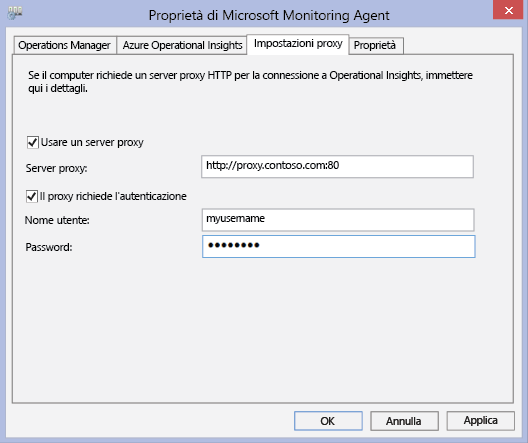

4. Selezionare **Usa server proxy** e digitare l'URL e il numero di porta, se necessario, in modo analogo all'esempio illustrato. Se il server proxy richiede l'autenticazione, digitare il nome utente e la password per accedere al server proxy.

Usare la procedura seguente per creare uno script di PowerShell da eseguire per configurare le impostazioni proxy per ogni agente che si connette direttamente ai server.

### Per configurare le impostazioni proxy per Microsoft Monitoring Agent tramite uno script


- Copiare l'esempio seguente, aggiornarlo con le informazioni specifiche per l'ambiente, salvarlo con un'estensione di file PS1 ed eseguire lo script in ogni computer che si connette direttamente al servizio OMS.


```
param($ProxyDomainName="http://proxy.contoso.com:80", $cred=(Get-Credential))

# First we get the health service configuration object.  We need to determine if we
# have the right update rollup with the API we need.  If not, no need to run the rest of the script.
$healthServiceSettings = New-Object -ComObject 'AgentConfigManager.MgmtSvcCfg'

$proxyMethod = $healthServiceSettings | Get-Member -Name 'SetProxyInfo'

if (!$proxyMethod)
{
    Write-Output 'Health Service proxy API not present, will not update settings.'
    return
}


Write-Output "Clearing proxy settings."
$healthServiceSettings.SetProxyInfo('', '', '')

$ProxyUserName = $cred.username;


Write-Output "Setting Proxy to ${ProxyDomainName} with proxy username of (${ProxyUserName})."
$healthServiceSettings.SetProxyInfo($ProxyDomainName, $ProxyUserName, $cred.GetNetworkCredential().password)
```

## Configurare le impostazioni proxy e firewall con Operations Manager

Per connettersi e registrarsi al servizio OMS, un gruppo di gestione di Operations Manager deve avere accesso al numero di porta dei domini e degli URL. Se si usa un server proxy per la comunicazione tra il server di gestione di Operations Manager e il servizio OMS è necessario verificare che le risorse appropriate siano accessibili. Se si usa un firewall per limitare l'accesso a Internet, è necessario configurare il firewall per consentire l'accesso a OMS. Anche se un server di gestione Operations Manager non è protetto da un server proxy, potrebbe essere di agenti. In questo caso, il server proxy dovrebbe essere configurato esattamente come gli agenti per abilitare e consentire alla soluzione di protezione e gestione dei log di trasmettere i dati al servizio Web di OMS.

Affinché gli agenti di Operations Manager possano comunicare con il servizio OMS, l'infrastruttura di Operations Manager, compresi gli agenti, deve avere le impostazioni del proxy e la versione corrette. L'impostazione proxy per gli agenti è specificata nella console di Operations Manager. La versione deve essere una delle seguenti:

- Operations Manager 2012 SP1 Aggiornamento cumulativo 7 o versione successiva
- Operations Manager 2012 R2 Aggiornamento cumulativo 3 o versione successiva


Le tabelle seguenti elencano le porte associate a queste attività.

>[AZURE.NOTE] Alcune delle risorse seguenti fanno riferimento ad Advisor e a Operational Insights, entrambe versioni precedenti di OMS. Tuttavia, le risorse elencate verranno modificate in futuro.

Di seguito è riportato un elenco di porte e risorse dell'agente:

|**Risorsa agente**|**Porte**|
|--------------|-----|
|*.ods.opinsights.azure.com|Porta 443|
|*.oms.opinsights.azure.com|Porta 443|
|ods.systemcenteradvisor.com|Porta 443|
|*.blob.core.windows.net/|Porta 443|

Di seguito è riportato un elenco di porte e risorse del server di gestione:

|**Risorsa del server di gestione**|**Porte**|
|--------------|-----|
|*.ods.opinsights.azure.com|Porta 443|
|service.systemcenteradvisor.com|Porta 443|
|scadvisor.accesscontrol.windows.net|Porta 443|
|scadvisorservice.accesscontrol.windows.net|Porta 443|
|*.blob.core.windows.net|Porta 443|
|data.systemcenteradvisor.com|Porta 443|
|ods.systemcenteradvisor.com|Porta 443|
|*.systemcenteradvisor.com|Porta 443|

Di seguito è riportato un elenco di porte e risorse per la console OMS e Operations Manager.

|**Risorsa per la console di OMS e Operations Manager**|**Porte**|
|----|----|
|*.systemcenteradvisor.com|Porte 80 e 443|
|*.live.com|Porte 80 e 443|
|*.microsoftonline.com|Porte 80 e 443|
|login.windows.net|Porte 80 e 443|


Usare le procedure seguenti per registrare il gruppo di gestione di Operations Manager con il servizio OMS. Se si verificano problemi di comunicazione tra il gruppo di gestione e il servizio OMS, usare le procedure di convalida per risolvere i problemi relativi alla trasmissione dei dati al servizio OMS.

### Per richiedere eccezioni per gli endpoint di servizio OMS

1. Usare le informazioni della prima tabella riportata precedentemente per verificare che le risorse necessarie per il server di gestione di Operations Manager siano accessibili da qualsiasi firewall in uso.
2. Usare le informazioni della seconda tabella riportata precedentemente per verificare che le risorse necessarie per la console operatore in Operations Manager e OMS siano accessibili da qualsiasi firewall in uso.
3. Se si usa un server proxy con Internet Explorer, verificare che sia configurato e che funzioni correttamente. Per verificarlo, aprire una connessione Web sicura (HTTPS), ad esempio [https://bing.com](https://bing.com). Se la connessione Web sicura non funziona in un browser, è probabile che non funzionerà nella console di gestione di Operations Manager con i servizi Web nel cloud.

### Per configurare il server proxy nella console di Operations Manager

1. Aprire la console di Operations Manager e selezionare lo spazio di lavoro **Amministrazione**.

2. Espandere **Operational Insights**, quindi selezionare **Operational Insights Connection**.  
    
3. Nella visualizzazione OMS Connection (Connessione OMS), fare clic su **Configure Proxy Server** (Configura server proxy).  
    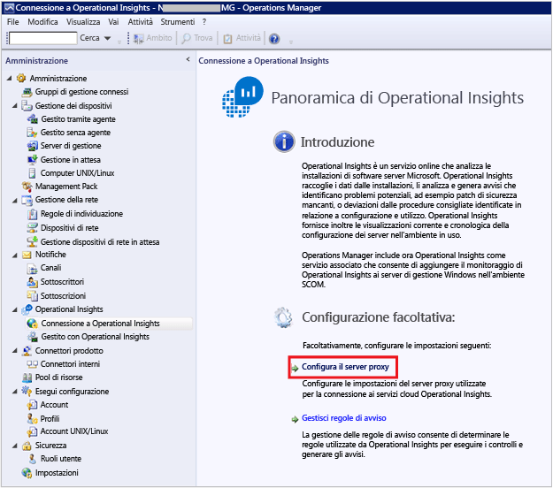
4. In Operational Insights Settings Wizard: Proxy Server selezionare **Use a proxy server to access the Operational Insights Web Service**, quindi digitare l'URL con il numero di porta, ad esempio **http://myproxy:80**.  
    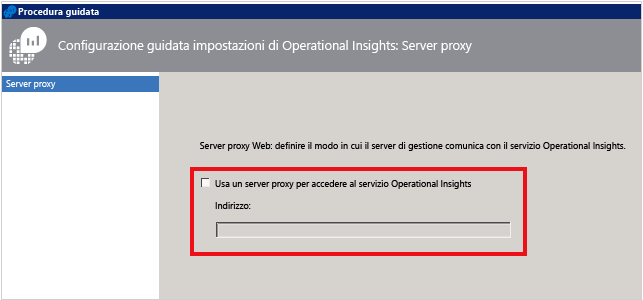


### Per specificare le credenziali se è necessaria l'autenticazione per il server proxy
 Le impostazioni e le credenziali del server proxy devono essere propagate ai computer gestiti che lo comunicheranno a OMS. Questi server devono essere nel *Microsoft System Center Advisor Monitoring Server Group*. Le credenziali vengono crittografate nel Registro di sistema di ogni server nel gruppo.

1. Aprire la console di Operations Manager e selezionare lo spazio di lavoro **Amministrazione**.
2. In **Configurazione RunAs**, selezionare **Profili**.
3. Aprire il profilo **Proxy del profilo RunAs di System Center Advisor**.  
    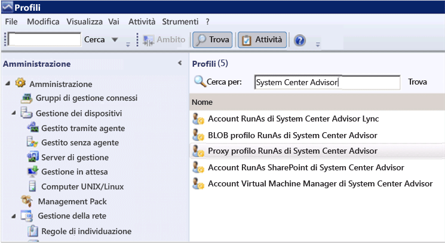
4. In Creazione guidata profilo RunAs, fare clic su **Aggiungi** per usare un account RunAs. È possibile creare un nuovo account RunAs oppure usare un account esistente. L'account deve avere autorizzazioni sufficienti per passare attraverso il server proxy.  
    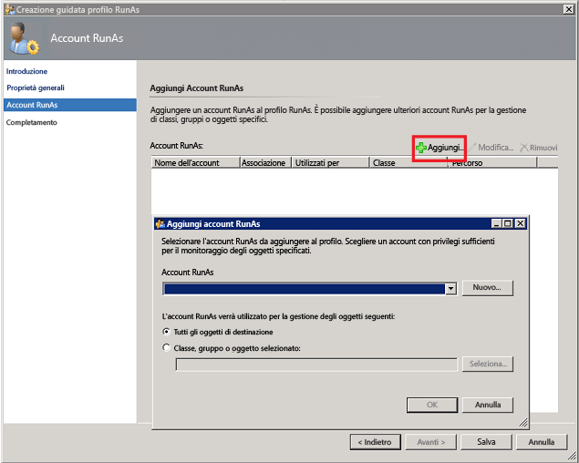
5. Per impostare l'account da gestire scegliere **Classe, gruppo o oggetto selezionato** per aprire la finestra Ricerca oggetti.  
    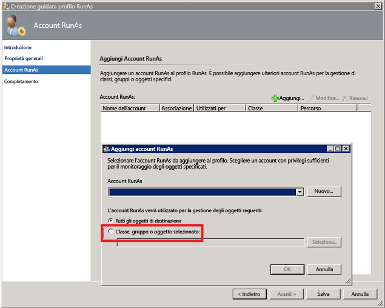
6. Cercare e quindi selezionare **Microsoft System Center Advisor Monitoring Server Group**.  
    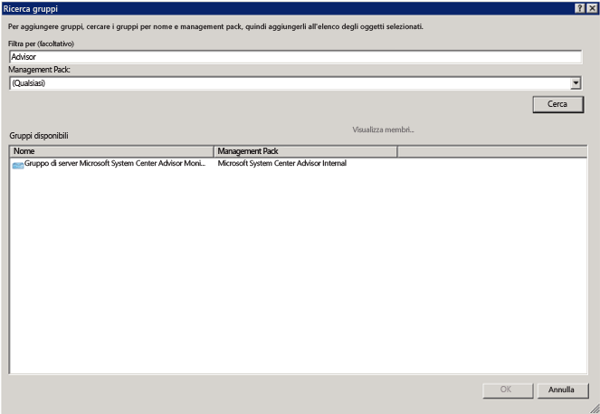
7. Fare clic su **OK** per chiudere il riquadro Aggiungi account RunAs.  
    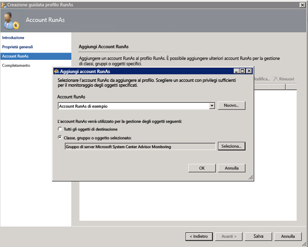
8. Completare la procedura guidata e salvare le modifiche.  
    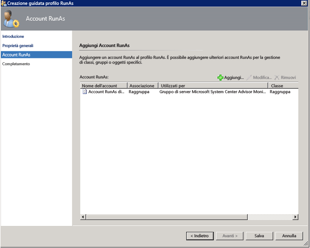


### Per convalidare il download dei Management Pack di OMS

- Se sono state aggiunte soluzioni a OMS, è possibile visualizzarle nella console di Operations Manager come Management Pack in **Amministrazione**. Cercare *System Center Advisor* per trovarle rapidamente.  
    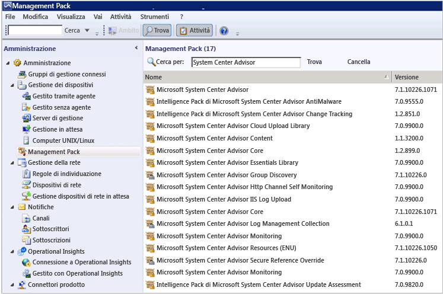
- In alternativa, i Management Pack di OMS possono essere cercati anche usando i comandi seguenti di Windows PowerShell nel server di gestione di Operations Manager:

        get-scommanagementpack | where {$_.DisplayName -match 'Advisor'} | select Name,DisplayName,Version,KeyToken

        get-scommanagementpack | where {$_.DisplayName -match 'Advisor'} | select Name,DisplayName,Version | ft

### Per convalidare l'invio dei dati di Operations Manager al servizio OMS

1. Nel server di gestione di Operations Manager, aprire Monitoraggio delle prestazioni (perfmon.exe) e selezionare **Monitoraggio delle prestazioni**.
2. Fare clic su **Aggiungi**, quindi selezionare **Gruppi di gestione Servizio integrità**.
3. Aggiungere tutti i contatori che iniziano con **HTTP**.  
    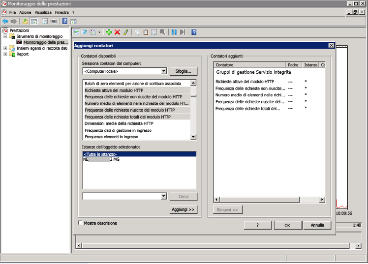
4. Se la configurazione di Operations Manager è valida, verrà visualizzata l'attività dei contatori di gestione Servizio integrità per gli eventi e altri elementi di dati in base ai Management Pack aggiunti a OMS e ai criteri di raccolta del log configurati.  
    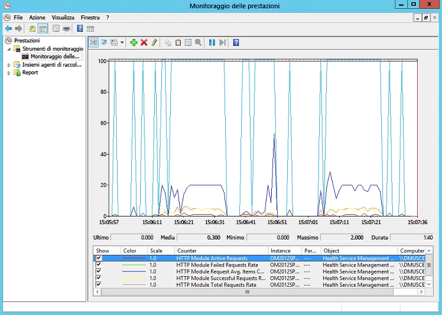


## Ruolo di lavoro ibrido per runbook di Automazione di Azure

Non sono previsti requisiti di firewall in ingresso per supportare Hybrid Runbook Workers.

Il computer locale che esegue il ruolo di lavoro ibrido per runbook deve avere accesso in uscita a *. cloudapp.net sulle porte 443, 9354 e da 30000 a 30199.

## Passaggi successivi

- [Add Log Analytics solutions from the Solutions Gallery](log-analytics-add-solutions.md) (Aggiungere soluzioni di Log Analytics dalla raccolta soluzioni) per aggiungere funzionalità e raccogliere i dati.
- Acquisire familiarità con le [ricerche nei log](log-analytics-log-searches.md) per visualizzare le informazioni dettagliate raccolte dalle soluzioni.

<!---HONumber=AcomDC_0504_2016-->

