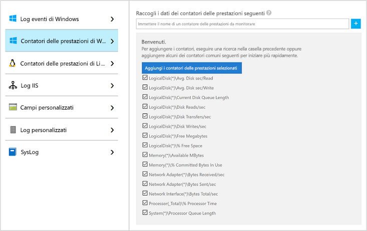
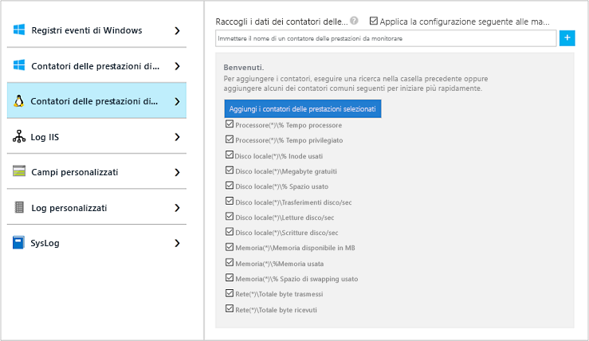
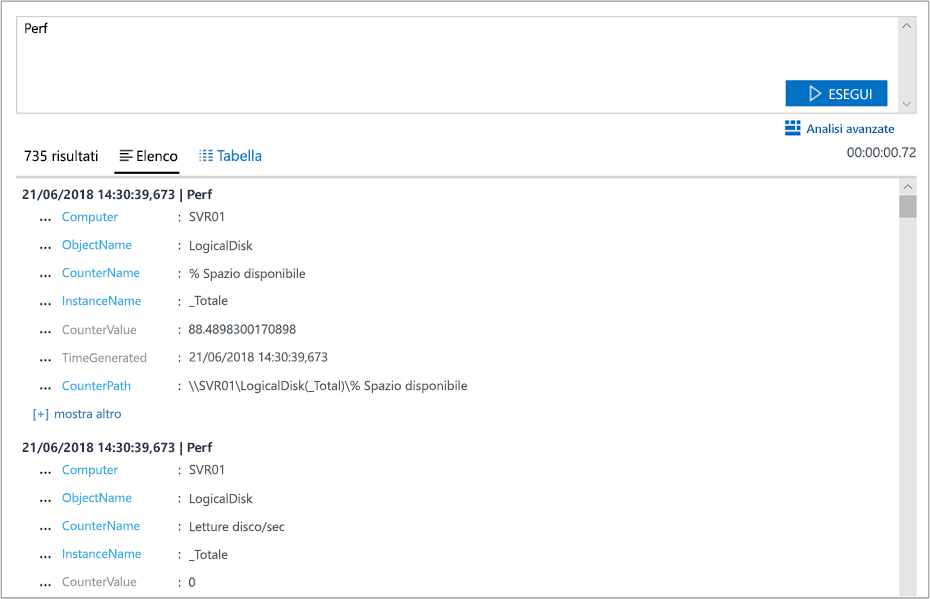
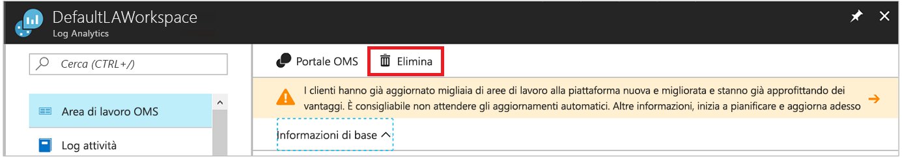

# Raccogliere dati sulle macchine virtuali di Azure
[Azure Log Analytics](log-analytics-overview.md) può raccogliere i dati direttamente dalle macchine virtuali di Azure e da altre risorse dell'ambiente in un unico archivio per analisi dettagliate e per la correlazione.  Questa guida introduttiva illustra come configurare e raccogliere dati dalle VM Linux o Windows di Azure in pochi semplici passaggi.  
 
Questa guida introduttiva presuppone che esista già una macchina virtuale di Azure. In caso contrario, è possibile [creare una VM Windows](../virtual-machines/windows/quick-create-portal.md) o [creare una VM Linux](../virtual-machines/linux/quick-create-cli.md) seguendo le guide introduttive sulle VM.

## Accedere al portale di Azure
Accedere al portale di Azure all'indirizzo [https://portal.azure.com](https://portal.azure.com). 

## Creare un'area di lavoro
1. Nel portale di Azure fare clic su **Altri servizi** nell'angolo in basso a sinistra. Nell'elenco delle risorse digitare **Log Analytics**. Non appena si inizia a digitare, l'elenco viene filtrato in base all'input. Selezionare **Log Analytics**.     
2. Fare clic su **Crea** e quindi selezionare le opzioni per gli elementi seguenti:

  * Specificare un nome per la nuova **area di lavoro di OMS**, ad esempio *DefaultLAWorkspace*. 
  * Selezionare una **sottoscrizione** a cui collegarsi. Se la sottoscrizione selezionata per impostazione predefinita non è appropriata, è possibile sceglierne una dall'elenco a discesa.
  * Per **Gruppo di risorse**, selezionare un gruppo di risorse esistente contenente una o più macchine virtuali di Azure.  
  * Selezionare la **località** in cui sono distribuite le VM.  Per altre informazioni, vedere le [are in cui è disponibile Log Analytics](https://azure.microsoft.com/regions/services/).
  * È possibile scegliere tra tre diversi **piani tariffari** in Log Analytics, ma per questa guida introduttiva si selezionerà il piano **Gratuito**.  Per altre informazioni sui piani specifici, vedere [Dettagli prezzi di Log Analytics](https://azure.microsoft.com/pricing/details/log-analytics/).

           
3. Dopo aver specificato le informazioni necessarie nel riquadro **Area di lavoro di OMS**, fare clic su **OK**.  

Per tenere traccia dello stato di avanzamento della verifica delle informazioni e della creazione dell'area di lavoro, è possibile usare la voce **Notifiche** nel menu. 

## Abilitare l'estensione macchina virtuale di Log Analytics
Per le macchine virtuali Windows e Linux già distribuite in Azure, si installa l'agente di Log Analytics con l'estensione VM di Log Analytics.  L'uso dell'estensione macchina virtuale consente di semplificare il processo di installazione e di configurare automaticamente l'agente per l'invio di dati all'area di lavoro di Log Analytics specificata. L'agente viene anche aggiornato automaticamente in modo da garantire la presenza delle funzionalità e delle correzioni più recenti.

Nella parte superiore della pagina delle risorse di Log Analytics nel portale si noterà il banner che invita a eseguire l'aggiornamento.  L'aggiornamento non è necessario ai fini di questa guida introduttiva. 

.    
1. Nel portale di Azure fare clic su **Altri servizi** nell'angolo in basso a sinistra. Nell'elenco delle risorse digitare **Log Analytics**. Non appena si inizia a digitare, l'elenco viene filtrato in base all'input. Selezionare **Log Analytics**.
2. Nell'elenco di aree di lavoro di Log Analytics selezionare *DefaultLAWorkspace* creata prima.
3. Nel menu a sinistra fare clic su **Macchine virtuali** in Origini dati dell'area di lavoro.  
4. Nell'elenco **Macchine virtuali** selezionare una macchina virtuale in cui si vuole installare l'agente. Si noti che lo **stato della connessione OMS** per la VM sarà **Non connesso**.
5. Nei dettagli relativi alla macchina virtuale selezionare **Connetti**. L'agente viene automaticamente installato e configurato per l'area di lavoro di Log Analytics. Il processo richiede alcuni minuti, durante i quali lo **stato** è **Connessione**.
6. Al termine dell'installazione e della connessione dell'agente, lo stato della **connessione OMS** verrà aggiornato con **Questa area di lavoro**.

## Raccogliere dati su eventi e prestazioni
Log Analytics può raccogliere gli eventi dai registri eventi di Windows o da Syslog Linux e i contatori delle prestazioni specificati per l'analisi a lungo termine e la creazione di report e intervenire quando viene rilevata una particolare condizione.  Seguire questi passaggi per configurare la raccolta di eventi dal registro di sistema di Windows e da Syslog Linux e di diversi comuni contatori delle prestazioni con cui iniziare.  

### Raccolta di dati da una VM Windows
1. Selezionare **Impostazioni avanzate**.    
3. Selezionare **Dati** e quindi selezionare **Registri eventi di Windows**.  
4. Si aggiunge un registro eventi digitandone il nome.  Digitare **Sistema** e quindi fare clic sul segno **+**.  
5. Nella tabella selezionare i livelli di gravità **Errore** e **Avviso**.   
6. Fare clic su **Salva** nella parte superiore della pagina per salvare la configurazione.
7. Selezionare **Windows Performance Data** (Dati di prestazione di Windows) per abilitare la raccolta di contatori delle prestazioni in un computer Windows. 
8. Quando si configurano i contatori delle prestazioni di Windows per la prima volta per una nuova area di lavoro di Log Analytics, è possibile creare rapidamente numerosi contatori comuni. Viene visualizzato l'elenco dei contatori con le caselle di controllo corrispondenti.  .  Fare clic su **Aggiungi i contatori delle prestazioni selezionati**.  Vengono aggiunti e preimpostati con un intervallo di esempio tra le raccolte di dieci secondi.  
9. Fare clic su **Salva** nella parte superiore della pagina per salvare la configurazione.

### Raccolta di dati da una VM Linux

1. Selezionare **Syslog**.  
2. Si aggiunge un registro eventi digitandone il nome.  Digitare **Syslog** e quindi fare clic sul segno **+**.  
3. Nella tabella deselezionare i livelli di gravità **Informativo**, **Avviso** e **Debug**. 
4. Fare clic su **Salva** nella parte superiore della pagina per salvare la configurazione.
5. Selezionare **Linux Performance Data** (Dati di prestazione di Linux) per abilitare la raccolta di contatori delle prestazioni in un computer Windows. 
6. Quando si configurano i contatori delle prestazioni di Linux per la prima volta per una nuova area di lavoro di Log Analytics, è possibile creare rapidamente numerosi contatori comuni. Viene visualizzato l'elenco dei contatori con le caselle di controllo corrispondenti.  .  Fare clic su **Aggiungi i contatori delle prestazioni selezionati**.  Vengono aggiunti e preimpostati con un intervallo di esempio tra le raccolte di dieci secondi.  
7. Fare clic su **Salva** nella parte superiore della pagina per salvare la configurazione.

## Visualizzare i dati raccolti
Ora che la raccolta di dati è stata abilitata, verrà eseguito un semplice esempio di ricerca log per visualizzare alcuni dati dalle VM di destinazione.  

1. Nel portale di Azure passare a Log Analytics e selezionare l'area di lavoro creata prima.
2. Fare clic sul riquadro **Ricerca log** e nel riquadro Ricerca log digitare `Type=Perf` nel campo della query e quindi premere INVIO o fare clic sul pulsante della ricerca a destra del campo della query.    La query nella figura seguente, ad esempio, ha restituito 78.000 record relativi alle prestazioni.  I risultati effettivi saranno molti di meno.  

## Pulire le risorse
Quando non è più necessaria, eliminare l'area di lavoro di Log Analytics. A questo scopo, selezionare l'area di lavoro di Log Analytics creata prima e nella pagina delle risorse fare clic su **Elimina**.  

## Passaggi successivi
Ora che è in corso la raccolta di dati operativi e sulle prestazioni dalle macchine virtuali Windows o Linux, è possibile iniziare facilmente a esplorare, analizzare e modificare i dati raccolti *gratuitamente*.  

Per informazioni su come visualizzare e analizzare i dati, passare all'esercitazione.   

> [!div class="nextstepaction"]
> [View or analyze data in Log Analytics (Visualizzare o analizzare i dati in Log Analytics)](log-analytics-tutorial-viewdata.md)
