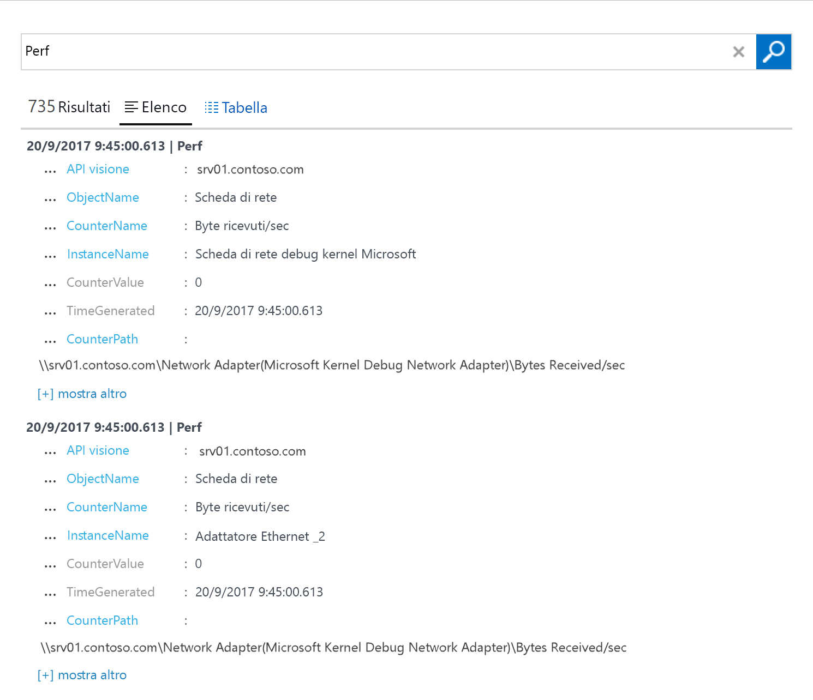

# Raccogliere dati dai computer Windows ospitati nell'ambiente in uso
[Azure Log Analytics](log-analytics-overview.md) può raccogliere i dati direttamente dai computer fisici o virtuali Windows e da altre risorse nell'ambiente in uso in un unico repository per procedere ad analisi dettagliate e alla correlazione.  Questa guida introduttiva mostra come configurare e raccogliere dati dal computer Windows in pochi semplici passaggi.  Per le macchine virtuali Windows di Azure, vedere l'argomento seguente [Raccogliere dati sulle macchine virtuali di Azure](log-analytics-quick-collect-azurevm.md).  

Per informazioni sui requisiti di rete e di sistema per distribuire l'agente Windows, vedere [Raccogliere dati dall'ambiente con Azure Log Analytics](log-analytics-concept-hybrid.md#prerequisites).
 
Se non si ha una sottoscrizione di Azure, creare un [account gratuito](https://azure.microsoft.com/free/?WT.mc_id=A261C142F) prima di iniziare.

## Accedere al portale di Azure
Accedere al portale di Azure all'indirizzo [https://portal.azure.com](https://portal.azure.com). 

## Creare un'area di lavoro
1. Nel portale di Azure fare clic su **Altri servizi** nell'angolo in basso a sinistra. Nell'elenco delle risorse digitare **Log Analytics**. Non appena si inizia a digitare, l'elenco viene filtrato in base all'input. Selezionare **Log Analytics**.       
2. Fare clic su **Crea** e quindi selezionare le opzioni per gli elementi seguenti:

  * Specificare un nome per la nuova **area di lavoro di OMS**, ad esempio *DefaultLAWorkspace*. 
  * Selezionare una **sottoscrizione** a cui collegarsi. Se la sottoscrizione selezionata per impostazione predefinita non è appropriata, è possibile sceglierne una dall'elenco a discesa.
  * Per **Gruppo di risorse**, selezionare un gruppo di risorse esistente contenente una o più macchine virtuali di Azure.  
  * Selezionare la **località** in cui sono distribuite le VM.  Per altre informazioni, vedere le [are in cui è disponibile Log Analytics](https://azure.microsoft.com/regions/services/).
  * È possibile scegliere tra tre diversi **piani tariffari** in Log Analytics, ma per questa guida introduttiva si selezionerà il piano **Gratuito**.  Per altre informazioni sui piani specifici, vedere [Dettagli prezzi di Log Analytics](https://azure.microsoft.com/pricing/details/log-analytics/).

           
3. Dopo aver specificato le informazioni necessarie nel riquadro **Area di lavoro di OMS**, fare clic su **OK**.  

Per tenere traccia dello stato di avanzamento della verifica delle informazioni e della creazione dell'area di lavoro, è possibile usare la voce **Notifiche** nel menu. 

## Ottenere l'ID e la chiave dell'area di lavoro
Prima di installare Microsoft Monitoring Agent per Windows, sono necessari l'ID e la chiave dell'area di lavoro per l'area di lavoro di Log Analytics.  Queste informazioni sono richieste dall'installazione guidata per configurare correttamente l'agente e verificare che possa comunicare correttamente con Log Analytics.  

1. Nel portale di Azure fare clic su **Altri servizi** nell'angolo in basso a sinistra. Nell'elenco delle risorse digitare **Log Analytics**. Non appena si inizia a digitare, l'elenco viene filtrato in base all'input. Selezionare **Log Analytics**.
2. Nell'elenco di aree di lavoro di Log Analytics selezionare *DefaultLAWorkspace* creata prima.
3. Selezionare **Impostazioni avanzate**.       
4. Selezionare **Origini connesse** e quindi **Server Windows**.   
5. Il valore a destra di **ID area di lavoro** e **Chiave primaria**. Copiare e incollare entrambi i valori nell'editor predefinito.   

## Installare l'agente per Windows
Le istruzioni seguenti consentono di installare e configurare l'agente per Log Analytics nel cloud di Azure e di Azure per enti pubblici, installando Microsoft Monitoring Agent nel computer.  

1. Nella pagina **Server Windows** selezionare la versione appropriata da scaricare in **Scarica agente Windows** a seconda dell'architettura del processore del sistema operativo Windows.
2. Eseguire il programma di installazione per installare l'agente nel computer in uso.
2. Nella pagina di **benvenuto** fare clic su **Avanti**.
3. Nella pagina **Condizioni di licenza** leggere la licenza e quindi fare clic su **Accetto**.
4. Nella pagina **Cartella di destinazione** modificare o mantenere la cartella di installazione predefinita e quindi fare clic su **Avanti**.
5. Nella pagina **Opzioni di installazione dell'agente** scegliere di connettere l'agente ad Azure Log Analytics (OMS) e quindi fare clic su **Avanti**.   
6. Nella pagina **Azure Log Analytics** eseguire le operazioni seguenti:
   1. Incollare **ID area di lavoro** e **Chiave dell'area di lavoro (Chiave primaria)** copiati in precedenza.  Se il computer deve fare riferimento a un'area di lavoro di Log Analytics nel cloud di Azure per enti pubblici, selezionare **Azure Governo degli Stati Uniti** nell'elenco a discesa **Cloud di Azure**.  
   2. Se il computer deve comunicare tramite un server proxy con il servizio Log Analytics, fare clic su **Avanzate** e specificare l'URL e il numero di porta del server proxy.  Se il server proxy richiede l'autenticazione, digitare il nome utente e la password per l'autenticazione nel server proxy, quindi fare clic su **Avanti**.  
7. Fare clic su **Avanti** dopo aver specificato le impostazioni di configurazione necessarie.     
8. Nella pagina **Pronto per l'installazione** rivedere le scelte effettuate e quindi fare clic su **Installa**.
9. Nella pagina **Configurazione completata** fare clic su **Fine**.

Al termine, verrà visualizzato **Microsoft Monitoring Agent** nel **Pannello di controllo**. È possibile rivedere la configurazione e verificare che l'agente sia connesso a Log Analytics. Quando si è connessi, nella scheda **Azure Log Analytics (OMS)** l'agente visualizza un messaggio che indica che **Microsoft Monitoring Agent ha eseguito la connessione al servizio Microsoft Operations Management Suite.**   

## Raccogliere dati su eventi e prestazioni
Log Analytics può raccogliere gli eventi dai registri eventi e dai contatori delle prestazioni di Windows specificati per l'analisi a lungo termine e la creazione di report e intervenire quando viene rilevata una particolare condizione.  Seguire questi passaggi per configurare la raccolta di eventi dal registro eventi di Windows e di diversi contatori delle prestazioni comuni con cui iniziare.  

1. Nel portale di Azure fare clic su **Altri servizi** nell'angolo in basso a sinistra. Nell'elenco delle risorse digitare **Log Analytics**. Non appena si inizia a digitare, l'elenco viene filtrato in base all'input. Selezionare **Log Analytics**.
2. Selezionare **Impostazioni avanzate**.      
3. Selezionare **Dati** e quindi selezionare **Registri eventi di Windows**.  
4. Si aggiunge un registro eventi digitandone il nome.  Digitare **Sistema** e quindi fare clic sul segno **+**.  
5. Nella tabella selezionare i livelli di gravità **Errore** e **Avviso**.   
6. Fare clic su **Salva** nella parte superiore della pagina per salvare la configurazione.
7. Selezionare **Windows Performance Data** (Dati di prestazione di Windows) per abilitare la raccolta di contatori delle prestazioni in un computer Windows. 
8. Quando si configurano i contatori delle prestazioni di Windows per la prima volta per una nuova area di lavoro di Log Analytics, è possibile creare rapidamente numerosi contatori comuni. Viene visualizzato l'elenco dei contatori con le caselle di controllo corrispondenti.  .  Fare clic su **Aggiungi i contatori delle prestazioni selezionati**.  Vengono aggiunti e preimpostati con un intervallo di esempio tra le raccolte di dieci secondi.  
9. Fare clic su **Salva** nella parte superiore della pagina per salvare la configurazione.

## Visualizzare i dati raccolti
Ora che la raccolta di dati è stata abilitata, verrà eseguito un semplice esempio di ricerca nel log per visualizzare alcuni dati dal computer di destinazione.  

1. Nel portale di Azure, nell'area di lavoro selezionata, fare clic sul riquadro **Ricerca log**.  
2. Nel riquadro Ricerca log digitare `Perf` nel campo della query e quindi premere INVIO o fare clic sul pulsante di ricerca a destra del campo della query.      La query nella figura seguente, ad esempio, ha restituito 735 record relativi alle prestazioni.   

## Pulire le risorse
Quando non è più necessario, è possibile rimuovere l'agente dal computer Windows ed eliminare l'area di lavoro di Log Analytics.  

Per rimuovere l'agente, eseguire la procedura seguente.

1. Aprire il **Pannello di controllo**.
2. Aprire **Programmi e funzionalità**.
3. In **Programmi e funzionalità** selezionare **Microsoft Monitoring Agent** e fare clic su **Disinstalla**.

Per eliminare l'area di lavoro, selezionare l'area di lavoro di Log Analytics creata in precedenza e nella pagina delle risorse fare clic su **Elimina**.   

## Passaggi successivi
Ora che è in corso la raccolta di dati operativi e sulle prestazioni dal computer Linux locale, è possibile iniziare facilmente a esplorare, analizzare e modificare i dati raccolti *gratuitamente*.  

Per informazioni su come visualizzare e analizzare i dati, passare all'esercitazione.   

> [!div class="nextstepaction"]
> [View or analyze data in Log Analytics (Visualizzare o analizzare i dati in Log Analytics)](log-analytics-tutorial-viewdata.md)
