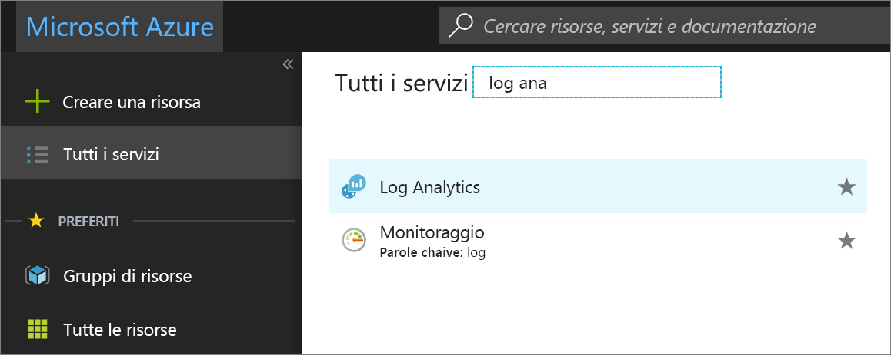
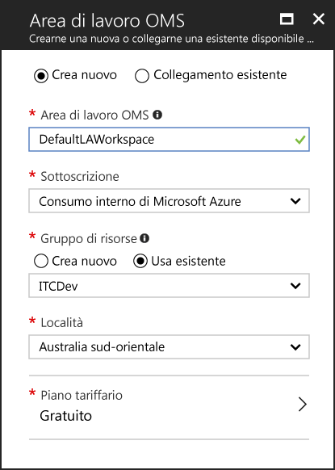

# Creare un'area di lavoro di Log Analytics nel portale di Azure
Nel portale di Azure è possibile configurare un'area di lavoro di Log Analytics, ovvero un ambiente di Log Analytics univoco che contiene un archivio dati, origini dati e soluzioni.  I passaggi descritti in questo articolo sono obbligatori se si intende raccogliere i dati dalle origini seguenti:

* Risorse di Azure nella sottoscrizione
* Computer locali monitorati tramite System Center Operations Manager
* Raccolte di dispositivi da System Center Configuration Manager 
* Dati di diagnostica o dei log dall'archiviazione di Azure

Per altre origini, ad esempio macchine virtuali di Azure e computer Windows o Linux presenti nell'ambiente, vedere gli argomenti seguenti:

*  [Raccogliere dati sulle macchine virtuali di Azure](log-analytics-quick-collect-azurevm.md) 
*  [Raccogliere dati dai computer Linux ospitati nell'ambiente in uso](log-analytics-quick-collect-linux-computer.md)
*  [Raccogliere dati dai computer Windows ospitati nell'ambiente in uso](log-analytics-quick-collect-windows-computer.md)

Se non si ha una sottoscrizione di Azure, creare un [account gratuito](https://azure.microsoft.com/free/?WT.mc_id=A261C142F) prima di iniziare.

## Accedere al portale di Azure
Accedere al portale di Azure all'indirizzo [https://portal.azure.com](https://portal.azure.com). 

## Creare un'area di lavoro
1. Nel portale di Azure fare clic su **Tutti i servizi**. Nell'elenco delle risorse digitare **Log Analytics**. Non appena si inizia a digitare, l'elenco viene filtrato in base all'input. Selezionare **Log Analytics**.       
2. Fare clic su **Crea** e quindi selezionare le opzioni per gli elementi seguenti:

  * Specificare un nome per la nuova **area di lavoro di OMS**, ad esempio *DefaultLAWorkspace*. 
  * Selezionare una **sottoscrizione** a cui collegarsi. Se la sottoscrizione selezionata per impostazione predefinita non è appropriata, è possibile sceglierne una dall'elenco a discesa.
  * Per **Gruppo di risorse** scegliere di usare un gruppo di risorse esistente già configurato oppure crearne uno nuovo.  
  * Selezionare una **località** disponibile.  Per altre informazioni, vedere le [are in cui è disponibile Log Analytics](https://azure.microsoft.com/regions/services/).
  * È possibile scegliere tra tre diversi **piani tariffari** in Log Analytics, ma per questa guida introduttiva si selezionerà il piano **Gratuito**.  Per altre informazioni sui piani specifici, vedere [Dettagli prezzi di Log Analytics](https://azure.microsoft.com/pricing/details/log-analytics/).

           
3. Dopo aver specificato le informazioni necessarie nel riquadro **Area di lavoro di OMS**, fare clic su **OK**.  

Per tenere traccia dello stato di avanzamento della verifica delle informazioni e della creazione dell'area di lavoro, è possibile usare la voce **Notifiche** nel menu. 

## Passaggi successivi
Dopo aver creato un'area di lavoro, è possibile configurare la raccolta di dati di telemetria di monitoraggio, eseguire ricerche nei log per analizzare i dati e aggiungere una soluzione di gestione per fornire informazioni analitiche dettagliate e dati aggiuntivi. 

* Per abilitare la raccolta di dati dalle risorse di Azure con Diagnostica di Azure o l'archiviazione di Azure, vedere [Raccolta di log e metriche per i servizi di Azure da usare in Log Analytics](log-analytics-azure-storage.md).  
* [Aggiungere System Center Operations Manager come origine dati](log-analytics-om-agents.md) per raccogliere i dati da agenti di creazione report per il gruppo di gestione Operations Manager e archiviarli nel repository dell'area di lavoro di Log Analytics. 
* Connettere [Configuration Manager](log-analytics-sccm.md) per importare computer che sono membri di raccolte nella gerarchia.  
* Esaminare le [soluzioni di gestione](/log-analytics-add-solutions.md) disponibili e verificare come aggiungere o rimuovere una soluzione dall'area di lavoro.

