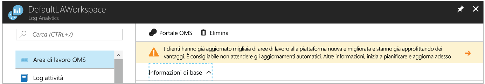

# <a name="view-or-analyze-data-collected-with-log-analytics-log-search"></a>Visualizzare o analizzare i dati raccolti con la ricerca log di Log Analytics

In Log Analytics è possibile usare ricerche log creando query per analizzare i dati raccolti. Usare dashboard preesistenti che è possibile personalizzare con i grafici delle ricerche più utili.  Ora che è stata definita una raccolta di dati operativi dai log attività e dalle macchine virtuali di Azure, in questa esercitazione si apprenderà come:

> [!div class="checklist"]
> * Aggiornare la risorsa Log Analytics di Azure al nuovo linguaggio di query 
> * Eseguire una semplice ricerca di dati di eventi e usare le funzionalità per modificare e filtrare i risultati 
> * Usare i dati sulle prestazioni

Per completare l'esempio contenuto in questa esercitazione, è necessario disporre di una macchina virtuale esistente [connessa all'area di lavoro di Log Analytics](log-analytics-quick-collect-azurevm.md).  

Oltre a usare in modo interattivo i dati restituiti, è possibile creare e modificare le query in due modi.  Per le query di base, usare la pagina Ricerca log nel portale di Azure. Per le query avanzate, è possibile usare il portale Advanced Analytics. Per altre informazioni sulla differenze di funzionalità tra i due portali, vedere [Portali per la creazione e la modifica di query di log in Azure Log Analytics](log-analytics-log-search-portals.md)

In questa esercitazione verrà usato Ricerca log nel portale di Azure. 

## <a name="log-in-to-azure-portal"></a>Accedere al portale di Azure
Accedere al portale di Azure all'indirizzo [https://portal.azure.com](https://portal.azure.com). 

## <a name="open-the-log-search-portal"></a>Aprire il portale per la ricerca log 
Per iniziare, aprire il portale per la ricerca log.   

1. Nel portale di Azure fare clic su **Altri servizi** nell'angolo in basso a sinistra. Nell'elenco delle risorse digitare **Log Analytics**. Non appena si inizia a digitare, l'elenco viene filtrato in base all'input. Selezionare **Log Analytics**.
2. Nel riquadro delle sottoscrizioni di Log Analytics, selezionare un'area di lavoro e quindi selezionare il riquadro **Ricerca log**.<br> 

Potrebbe essere apparso il banner nella parte superiore della pagina delle risorse di Log Analytics nel portale che invita a eseguire l'aggiornamento.<br> 

Di recente Log Analytics ha introdotto un nuovo linguaggio di query per semplificare la costruzione di query, la correlazione di dati da diverse origini e l'analisi per identificare rapidamente tendenze o problemi.

Eseguire un aggiornamento è semplice.  Avviare il processo facendo clic sul banner indicante **Altre informazioni e aggiorna**.  Leggere le informazioni aggiuntive sull'aggiornamento nella pagina delle informazioni sull'aggiornamento e fare clic su **Aggiorna ora**.

Questo processo richiederà alcuni minuti. Nel frattempo è possibile tenere traccia dello stato di avanzamento alla voce **Notifiche** nel menu. Altre informazioni sui [Vantaggi del nuovo linguaggio di query](log-analytics-log-search-upgrade.md#why-the-new-language).

## <a name="create-a-simple-search"></a>Creare una ricerca semplice
Il modo più rapido per recuperare alcuni dati da utilizzare è una query semplice che restituisce tutti i record in una tabella.  In presenza di client Windows o Linux connessi all'area di lavoro, saranno disponibili dati nella tabella Event (Windows) o nella tabella Syslog (Linux).

Digitare una delle query seguenti nella casella di ricerca e fare clic sul pulsante di ricerca.  

```
Event
```
```
Syslog
```

I dati vengono restituiti nella visualizzazione elenco predefinita ed è possibile vedere il numero totale di record restituiti.


Vengono visualizzate alcune delle prime proprietà di ogni record.  Fare clic su **Mostra più** per visualizzare tutte le proprietà per un record specifico.

## <a name="filter-results-of-the-query"></a>Filtrare i risultati della query
Sul lato sinistro della schermata è disponibile il riquadro di filtro che consente di aggiungere filtri alla query senza modificarla direttamente.  Vengono visualizzate diverse proprietà di record per tale tipo di record ed è possibile selezionare uno o più valori di proprietà per restringere i risultati di ricerca.

Se si sta usando la tabella **Event**, selezionare la casella di controllo accanto a **Error** in **EVENTLEVELNAME**.   Se si sta usando la tabella **Syslog**, selezionare la casella di controllo accanto a **err** in **SEVERITYLEVEL**.  La query viene modificata come segue per limitare i risultati agli eventi di errore.

```
Event | where (EventLevelName == "Error")
```
```
Syslog | where (SeverityLevel == "err")
```


Aggiungere proprietà al riquadro di filtro scegliendo **Aggiungi ai filtri** dal menu della proprietà in uno dei record.


È possibile impostare lo stesso filtro selezionando **Filtra** dal menu della proprietà per un record con il valore in base al quale si vogliono filtrare i risultati.  

L'opzione **Filtra** è disponibile solo per le proprietà il cui nome appare in blu al passaggio del mouse.  Si tratta di campi *disponibili per la ricerca* che vengono indicizzati per le condizioni di ricerca.  I campi in grigio sono campi *disponibili per la ricerca a testo libero* per i quali è disponibile solo l'opzione **Mostra riferimenti**.  Questa opzione restituisce i record con il valore specificato in qualsiasi proprietà.

È possibile raggruppare i risultati in base a una singola proprietà selezionando l'opzione **Raggruppa per** nel menu del record.  Verrà aggiunto un operatore [summarize](https://docs.loganalytics.io/docs/Language-Reference/Tabular-operators/summarize-operator) alla query, che visualizza i risultati in un grafico.  È possibile effettuare il raggruppamento in base a una o più proprietà, ma in questo caso occorre modificare direttamente la query.  Selezionare il menu del record accanto alla proprietà **Computer** e scegliere **Raggruppa per 'Computer'**.  


## <a name="work-with-results"></a>Usare i risultati
Il portale per la ricerca log offre un'ampia gamma di funzionalità per l'utilizzo dei risultati di una query.  È possibile ordinare, filtrare e raggruppare i risultati per analizzare i dati senza modificare la query effettiva.  I risultati di una query non sono ordinati per impostazione predefinita.

Per visualizzare i dati in formato di tabella e avere così a disposizione ulteriori opzioni di filtro e ordinamento, fare clic su **Tabella**.  


Fare clic sulla freccia accanto a un record per visualizzare i dettagli di tale record.


È possibile ordinare i risultati in base a qualsiasi campo facendo clic sulla relativa intestazione di colonna.


Per filtrare i risultati in base a un valore specifico nella colonna, fare clic sul pulsante di filtro e specificare una condizione di filtro.


Per raggruppare i risultati in base a una colonna, trascinare l'intestazione della colonna nella parte superiore dei risultati.  È possibile effettuare il raggruppamento in base a più campi trascinando più colonne nella parte superiore.


## <a name="work-with-performance-data"></a>Utilizzare i dati sulle prestazioni
I dati sulle delle prestazioni per gli agenti Windows e Linux sono archiviati nell'area di lavoro di Log Analytics nella tabella **Perf**.  I record sulle prestazioni hanno lo stesso aspetto di qualsiasi altro record; scrivere una query semplice che restituisce tutti i record sulle prestazioni esattamente come per gli eventi.

```
Perf
```


La restituzione di milioni di record per tutti i contatori e gli oggetti prestazioni non è molto utile.  È possibile usare gli stessi metodi descritti in precedenza per filtrare i dati oppure digitare la query seguente direttamente nella casella di ricerca log.  Vengono restituiti solo i record relativi all'utilizzo del processore per i computer Windows e Linux.

```
Perf | where (ObjectName == "Processor")  | where (CounterName == "% Processor Time")
```


I dati vengono così limitati a un particolare contatore, ma sono ancora presentati in una forma non particolarmente utile.  È possibile visualizzare i dati in un grafico a linee, ma è prima necessario raggrupparli in base a Computer e TimeGenerated.  Per effettuare il raggruppamento in base a più campi, è necessario modificare direttamente la query, quindi modificarla come indicato di seguito.  Questa query usa la funzione [avg](https://docs.loganalytics.io/docs/Language-Reference/Aggregation-functions/avg()) sulla proprietà **CounterValue** per calcolare il valore medio ogni ora.

```
Perf  | where (ObjectName == "Processor")  | where (CounterName == "% Processor Time") | summarize avg(CounterValue) by Computer, TimeGenerated
```


Ora che i dati sono raggruppati in modo adeguato, è possibile visualizzarli in un grafico aggiungendo l'operatore [render](https://docs.loganalytics.io/docs/Language-Reference/Tabular-operators/render-operator).  

```
Perf  | where (ObjectName == "Processor")  | where (CounterName == "% Processor Time") | summarize avg(CounterValue) by Computer, TimeGenerated | render timechart
```


## <a name="next-steps"></a>Passaggi successivi
In questa esercitazione si è appreso come creare ricerche log di base per analizzare dati di eventi e prestazioni.  Passare all'esercitazione successiva per informazioni su come visualizzare i dati tramite la creazione di un dashboard.

> [!div class="nextstepaction"]
> [Creare e condividere i dashboard di Log Analytics](log-analytics-tutorial-dashboards.md)