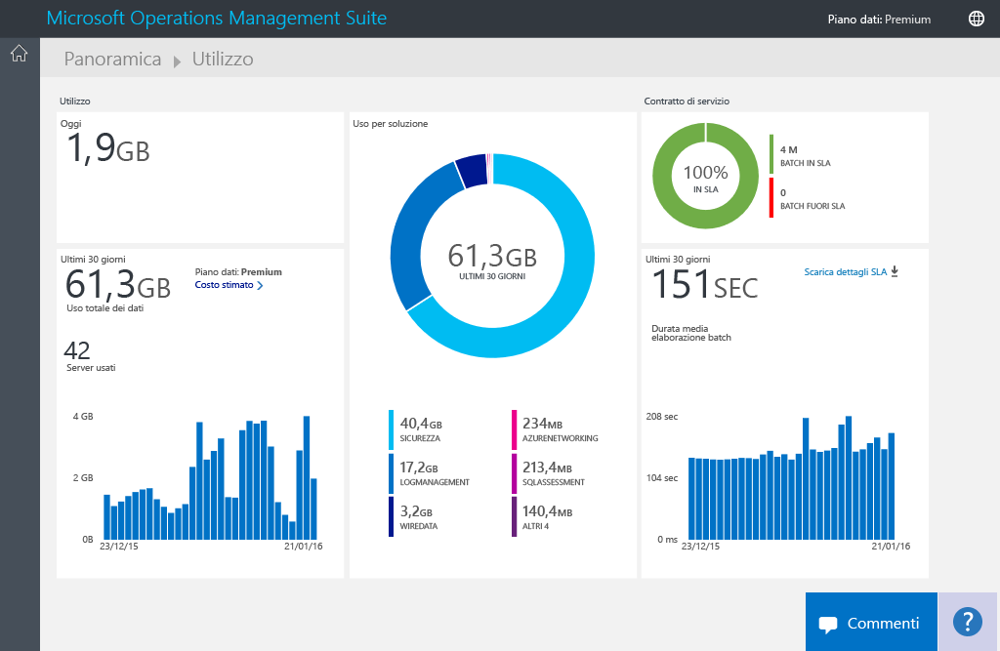
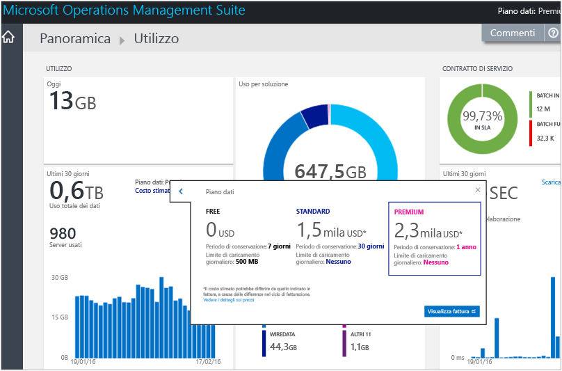
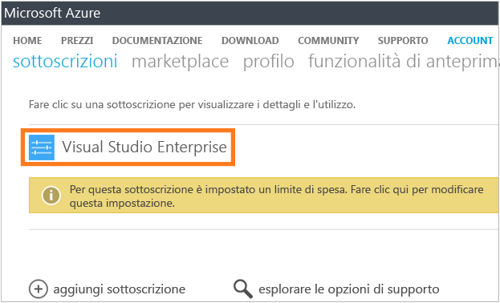
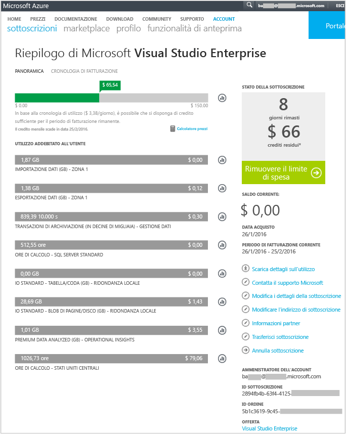
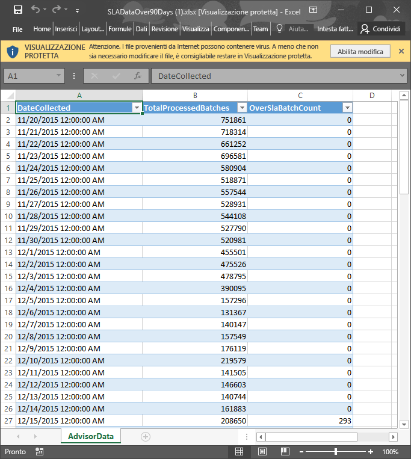

<properties
	pageTitle="Analizzare l'utilizzo dei dati in Log Analytics | Microsoft Azure"
	description="È possibile usare la pagina Usage (Utilizzo) in Log Analytics per visualizzare la quantità di dati inviata al servizio OMS."
	services="log-analytics"
	documentationCenter=""
	authors="bandersmsft"
	manager="jwhit"
	editor=""/>

<tags
	ms.service="log-analytics"
	ms.workload="na"
	ms.tgt_pltfrm="na"
	ms.devlang="na"
	ms.topic="get-started-article"
	ms.date="04/28/2016"
	ms.author="banders"/>

# Analizzare l'utilizzo dei dati in Log Analytics

Log Analytics in Operations Management Suite (OMS) raccoglie i dati e li invia periodicamente al servizio OMS. È possibile usare la pagina **Usage** (Utilizzo) per visualizzare la quantità di dati inviata al servizio OMS. La pagina **Usage** (Utilizzo) mostra anche la quantità di dati inviata ogni giorno dalle soluzioni e la frequenza dell'invio di dati da parte dei server.

>[AZURE.NOTE] Se si dispone di un account gratuito creato dal [sito Web OMS](http://www.microsoft.com/oms), è possibile inviare solo 500 MB di dati al giorno al servizio OMS. Se si raggiunge il limite giornaliero, l'analisi dei dati verrà interrotta e riprenderà all'inizio del giorno successivo.

È possibile visualizzare l'utilizzo mediante il riquadro **Usage** (Utilizzo) nel dashboard **Overview** (Panoramica) in OMS.

Se è stato superato o si sta per raggiungere il limite di utilizzo giornaliero, facoltativamente è possibile rimuovere una soluzione per ridurre la quantità di dati inviati al servizio OMS. Per altre informazioni sulla rimozione di soluzioni vedere l'articolo [Add Log Analytics solutions from the Solutions Gallery](log-analytics-add-solutions.md) (Aggiungere soluzioni di Log Analytics dalla raccolta soluzioni).

Nella pagina **Usage** (Utilizzo) vengono visualizzate le informazioni seguenti:

- Utilizzo medio al giorno.
- Utilizzo dei dati per ogni soluzione negli ultimi 30 giorni
- La quantità di dati inviati dai server nell'ambiente al servizio OMS negli ultimi 30 giorni
- Piano tariffario e costo stimato dei dati
- Informazioni sul contratto di servizio, incluso il tempo impiegato da OMS per elaborare i dati

## Per gestire i dati di utilizzo

1. Nella pagina **Overview** (Panoramica) fare clic sul riquadro **Usage** (Utilizzo).
2. Nella pagina **Usage** (Utilizzo) visualizzare le categorie di utilizzo con aree che presentano potenziali problemi.
3. Se la soluzione usa una quantità eccessiva della quota di caricamento giornaliera, è possibile rimuoverla.

## Per visualizzare le informazioni sulla fatturazione e sul costo stimato
1. Nella pagina **Overview** (Panoramica) fare clic sul riquadro **Usage** (Utilizzo).
2. Nella pagina **Usage** (Usage) in **Usage** (Utilizzo) fare clic su (**>**) accanto a **Estimated cost** (Costo stimato).
3. Nei dettagli espansi di **Your data plan** (Piano dati), è possibile visualizzare il costo stimato mensile. 
4. Per visualizzare le informazioni di fatturazione, fare clic su **Visualizza fattura** per visualizzare le informazioni della sottoscrizione.
    - Nella pagina delle sottoscrizioni, fare clic sulla sottoscrizione per visualizzare i dettagli e un elenco per voce di utilizzo. 
    - Nella pagina di riepilogo della sottoscrizione è possibile eseguire un'ampia gamma di attività per gestire e visualizzare altri dettagli sulla sottoscrizione. 

## Per visualizzare i batch di dati per il contratto di servizio
1. Nella pagina **Overview** (Panoramica) fare clic sul riquadro **Usage** (Utilizzo).
2. In **Service Level Agreement** (Contratto di servizio), fare clic su **Download SLA details** (Scarica i dettagli del contratto di servizio).
3. Verrà scaricato un file XLSX di Excel da riesaminare. 

## Passaggi successivi

- Vedere [Log searches in Log Analytics](log-analytics-log-searches.md) (Ricerche nei log in Log Analytics) per visualizzare le informazioni dettagliate raccolte dalle soluzioni.

<!---HONumber=AcomDC_0525_2016-->