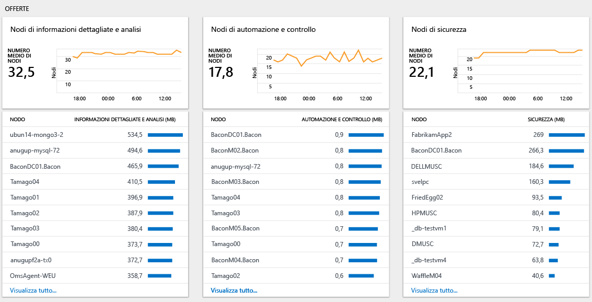

# Analizzare l'utilizzo dei dati in Log Analytics
Log Analytics include informazioni sulla quantità di dati raccolti, sui diversi tipi di dati inviati e sui sistemi che li hanno inviati.  È possibile usare dashboard **Utilizzo in Log Analytics** per visualizzare la quantità di dati inviata al servizio Log Analytics. Il dashboard mostra la quantità di dati raccolti da ogni soluzione e la quantità di dati inviata dai computer.

## Informazioni sul dashboard Utilizzo
Il dashboard **Utilizzo di Log Analytics** visualizza le informazioni seguenti:

- Volume dati
    - Volume dati nel tempo (in base all'ambito temporale corrente)
    - Volume dati per soluzione
    - Dati non associati a un computer
- Computer
    - Computer che inviano dati
    - Computer senza dati nelle ultime 24 ore
- Offerte
    - Nodi di informazioni dettagliate e analisi
    - Nodi di automazione e controllo
    - Nodi di sicurezza  
- Prestazioni
    - Tempo impiegato per raccogliere e indicizzare i dati  
- Elenco di query

### Per gestire i dati di utilizzo
1. Se questa operazione non è già stata eseguita, accedere al [portale di Azure](https://portal.azure.com), usando la sottoscrizione di Azure.
2. Fare clic su **Tutti i servizi** e nell'elenco di risorse digitare **Log Analytics**. Non appena si inizia a digitare, l'elenco viene filtrato in base all'input. Fare clic su **Log Analytics**.  
    
3. Il dashboard **Log Analytics** visualizza un elenco delle aree di lavoro. Selezionare un'area di lavoro.
4. Nel dashboard dell'*area di lavoro* fare clic su **Utilizzo di Log Analytics**.
5. Nel dashboard **Utilizzo di Log Analytics** fare clic su **Ora: Ultime 24 ore** per modificare l'intervallo di tempo.  
    
6. Visualizzare i pannelli delle categorie di utilizzo che mostrano le aree a cui si è interessati. Scegliere un pannello e quindi fare clic su un elemento per visualizzare altri dettagli in [Ricerca log](log-analytics-log-searches.md).  
    
7. Nel dashboard Ricerca log esaminare i risultati restituiti dalla ricerca.  
    

## Creare un avviso quando la raccolta dati supera le dimensioni previste
Questa sezione descrive come creare un avviso nei casi seguenti:
- Il volume di dati supera una quantità specificata.
- Si prevede che il volume di dati superi una quantità specificata.

Log Analytics [invia un avviso](log-analytics-alerts-creating.md) alle query di ricerca sull'utilizzo. La query seguente restituisce un risultato quando vengono raccolti più di 100 GB di dati nelle ultime 24 ore:

`union withsource = $table Usage | where QuantityUnit == "MBytes" and iff(isnotnull(toint(IsBillable)), IsBillable == true, IsBillable == "true") == true | extend Type = $table | summarize DataGB = sum((Quantity / 1024)) by Type | where DataGB > 100`

La query seguente usa una semplice formula per prevedere quando verranno inviati più di 100 GB di dati in un giorno: 

`union withsource = $table Usage | where QuantityUnit == "MBytes" and iff(isnotnull(toint(IsBillable)), IsBillable == true, IsBillable == "true") == true | extend Type = $table | summarize EstimatedGB = sum(((Quantity * 8) / 1024)) by Type | where EstimatedGB > 100`

Per generare un avviso su un volume di dati diverso, sostituire il numero 100 nelle query con il numero di GB da segnalare.

Per ricevere una notifica quando la raccolta dati supera le dimensioni previste, seguire la procedura descritta in [Creare una regola di avviso](log-analytics-alerts-creating.md#create-an-alert-rule).

Quando si crea l'avviso per la prima query e la quantità di dati supera i 100 GB in 24 ore, impostare:  
- **Nome** su *Data volume greater than 100 GB in 24 hours* (Volume di dati maggiore di 100 GB in 24 ore)  
- **Gravità** su *Avviso*  
- **Query di ricerca** su `union withsource = $table Usage | where QuantityUnit == "MBytes" and iff(isnotnull(toint(IsBillable)), IsBillable == true, IsBillable == "true") == true | extend Type = $table | summarize DataGB = sum((Quantity / 1024)) by Type | where DataGB > 100`   
- **Intervallo di tempo** su *24 ore*
- **Frequenza di avviso** su un'ora, dal momento che i dati di utilizzo vengono aggiornati solo una volta ogni ora
- **Genera l'avviso in base a** sul *numero di risultati*
- **Numero di risultati** su *Maggiore di 0*

Seguire la procedura descritta in [Aggiungere azioni alle regole di avviso in Log Analytics](log-analytics-alerts-actions.md) per configurare un'azione di posta elettronica, webhook o runbook per la regola di avviso.

Quando si crea l'avviso per la seconda query e si prevedono più di 100 GB di dati in 24 ore, impostare:
- **Nome** su *Data volume expected to be greater than 100 GB in 24 hours* (Volume di dati previsto maggiore di 100 GB in 24 ore)
- **Gravità** su *Avviso*
- **Query di ricerca** su `union withsource = $table Usage | where QuantityUnit == "MBytes" and iff(isnotnull(toint(IsBillable)), IsBillable == true, IsBillable == "true") == true | extend Type = $table | summarize EstimatedGB = sum(((Quantity * 8) / 1024)) by Type | where EstimatedGB > 100`
- **Intervallo di tempo** su *3 ore*
- **Frequenza di avviso** su un'ora, dal momento che i dati di utilizzo vengono aggiornati solo una volta ogni ora
- **Genera l'avviso in base a** sul *numero di risultati*
- **Numero di risultati** su *Maggiore di 0*

Quando si riceve un avviso, seguire la procedura descritta nella sezione seguente per risolvere i problemi che determinano un utilizzo superiore al previsto.

## Risoluzione dei problemi che determinano un utilizzo superiore al previsto
Dashboard Utilizzo consente di identificare il motivo per cui l'utilizzo e, di conseguenza, i costi sono superiori al previsto.

Un utilizzo più elevato è dovuto a una o entrambe le cause seguenti:
- Vengono inviati più dati del previsto a Log Analytics
- Più nodi del previsto inviano dati a Log Analytics

### Verificare se sono presenti più dati del previsto 
Sono due le sezioni principali della pagina di utilizzo che permettono di identificare il motivo per cui viene raccolta la maggior parte dei dati.

Il grafico *Volume dati nel tempo* mostra il volume totale dei dati inviati e i computer che inviano più dati. Il grafico in alto mostra se l'utilizzo complessivo dei dati è in aumento, stabile o in diminuzione. L'elenco dei computer mostra i 10 computer che inviano la maggior parte dei dati.

Il grafico *Volume dati per soluzione* mostra il volume di dati inviato da ogni soluzione e le soluzioni che inviano la maggior parte dei dati. Il grafico in alto mostra il volume totale dei dati inviati da ogni soluzione nel corso del tempo. Queste informazioni permettono di determinare se una soluzione sta inviando più o meno dati oppure se la quantità di dati inviata è pressoché invariata. L'elenco delle soluzioni mostra le 10 soluzioni che inviano la maggior parte dei dati. 

Questi due grafici mostrano tutti i dati. Alcuni dati sono fatturabili, mentre altri sono gratuiti. Per concentrarsi solo sui dati fatturabili, modificare la query nella pagina di ricerca in modo che includa `IsBillable=true`.  

Si osservi il grafico *Volume dati nel tempo*. Per visualizzare le soluzioni e i tipi di dati che inviano la maggior parte dei dati per un computer specifico, fare clic sul nome del computer. Fare clic sul nome del primo computer nell'elenco.

Nello screenshot seguente il tipo di dati *LogManagement / Perf* invia la maggior parte dei dati per il computer.     

Tornare quindi al dashboard *Utilizzo* e osservare il grafico *Volume dati per soluzione*. Per visualizzare i computer che inviano la maggior parte dei dati per una soluzione, fare clic sul nome della soluzione nell'elenco. Fare clic sul nome della prima soluzione nell'elenco. 

Lo screenshot seguente conferma che il computer *acmetomcat* è quello che invia la maggior parte dei dati per la soluzione Gestione log.     

Se necessario, eseguire ulteriori analisi per identificare volumi di grandi dimensioni all'interno di una soluzione o un tipo di dati. Le query di esempio includono:

+ Soluzione **Sicurezza**
  - `SecurityEvent | summarize AggregatedValue = count() by EventID`
+ Soluzione **Gestione log**
  - `Usage | where Solution == "LogManagement" and iff(isnotnull(toint(IsBillable)), IsBillable == true, IsBillable == "true") == true | summarize AggregatedValue = count() by DataType`
+ Tipo di dati **Perf**
  - `Perf | summarize AggregatedValue = count() by CounterPath`
  - `Perf | summarize AggregatedValue = count() by CounterName`
+ Tipo di dati **Event**
  - `Event | summarize AggregatedValue = count() by EventID`
  - `Event | summarize AggregatedValue = count() by EventLog, EventLevelName`
+ Tipo di dati **Syslog**
  - `Syslog | summarize AggregatedValue = count() by Facility, SeverityLevel`
  - `Syslog | summarize AggregatedValue = count() by ProcessName`
+ Tipo di dati **AzureDiagnostics**
  - `AzureDiagnostics | summarize AggregatedValue = count() by ResourceProvider, ResourceId`

Per ridurre il volume dei log raccolti, seguire questa procedura:

| Origine del volume di dati elevato | Come ridurre il volume di dati |
| -------------------------- | ------------------------- |
| Eventi di sicurezza            | Selezionare gli [eventi di sicurezza comuni o minimi](https://blogs.technet.microsoft.com/msoms/2016/11/08/filter-the-security-events-the-oms-security-collects/)   Modificare i criteri di controllo di sicurezza in modo che vengano raccolti solo gli eventi necessari. In particolare, esaminare la necessità di raccogliere eventi per:   - [controllo piattaforma filtro](https://technet.microsoft.com/library/dd772749(WS.10).aspx)   - [controllo Registro di sistema](https://docs.microsoft.com/windows/device-security/auditing/audit-registry)  - [controllo file system](https://docs.microsoft.com/windows/device-security/auditing/audit-file-system)  - [controllo oggetto kernel](https://docs.microsoft.com/windows/device-security/auditing/audit-kernel-object)  - [controllo manipolazione handle](https://docs.microsoft.com/windows/device-security/auditing/audit-handle-manipulation)  - [controllo archivi rimovibili](https://docs.microsoft.com/windows/device-security/auditing/audit-removable-storage) |
| Contatori delle prestazioni       | Modificare la [configurazione del contatore delle prestazioni](log-analytics-data-sources-performance-counters.md) per:   - Ridurre la frequenza di raccolta   - Ridurre il numero di contatori delle prestazioni |
| Log eventi                 | Modificare la [configurazione del log eventi](log-analytics-data-sources-windows-events.md) per:   - Ridurre il numero di log eventi raccolti   - Raccogliere solo i livelli di eventi richiesti, ad esempio non raccogliendo gli eventi di livello *informazioni* |
| syslog                     | Modificare la [configurazione di Syslog](log-analytics-data-sources-syslog.md) per:   - Ridurre il numero di strutture raccolte   - Raccogliere solo i livelli di eventi richiesti, ad esempio non raccogliendo gli eventi di livello *informazioni* e *debug* |
| AzureDiagnostics           | Modificare la raccolta dei log delle risorse per:   - Ridurre il numero di risorse che inviano log a Log Analytics   - Raccogliere solo i log necessari |
| Dati della soluzione da computer che non richiedono la soluzione | Usare il [targeting della soluzione](../operations-management-suite/operations-management-suite-solution-targeting.md) per raccogliere dati unicamente dai gruppi di computer necessari |

### Verificare se sono presenti più nodi del previsto
Con il piano tariffario *Per nodo (OMS)*, l'importo addebitato dipende dal numero di nodi e di soluzioni usate. È possibile visualizzare il numero di nodi in uso per ogni offerta nella sezione *offerte* del dashboard di uso.     

Fare clic su **Visualizza tutto...** per visualizzare l'elenco completo dei computer che inviano dati per l'offerta selezionata.

Usare il [targeting della soluzione](../operations-management-suite/operations-management-suite-solution-targeting.md) per raccogliere dati unicamente dai gruppi di computer necessari

## Passaggi successivi
* Per informazioni su come usare il linguaggio di ricerca, vedere [Ricerche nei log in Log Analytics](log-analytics-log-searches.md). È possibile usare le query di ricerca per eseguire ulteriori analisi sui dati di utilizzo.
* Per ricevere una notifica quando vengono soddisfatti determinati criteri di ricerca, seguire la procedura descritta in [Creare una regola di avviso](log-analytics-alerts-creating.md#create-an-alert-rule).
* Usare il [targeting della soluzione](../operations-management-suite/operations-management-suite-solution-targeting.md) per raccogliere dati unicamente dai gruppi di computer necessari
* Per configurare un criterio efficace per la raccolta degli eventi di sicurezza, vedere [Criteri per i filtri del Centro sicurezza di Azure](../security-center/security-center-enable-data-collection.md)
* Modificare la [configurazione del contatore delle prestazioni](log-analytics-data-sources-performance-counters.md)
* Per modificare le impostazioni di raccolta degli eventi, vedere la [configurazione del registro eventi](log-analytics-data-sources-windows-events.md)
* Per modificare le impostazioni di raccolta di SysLog, vedere la [configurazione di SysLog](log-analytics-data-sources-syslog.md)
