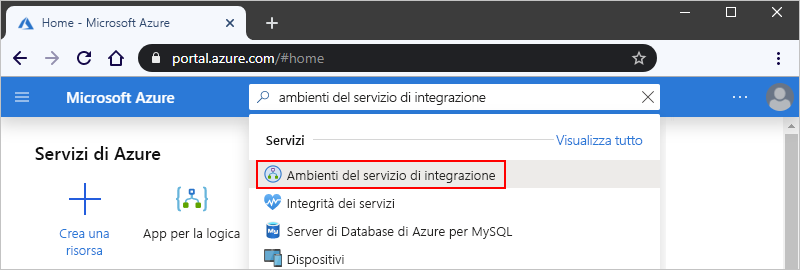
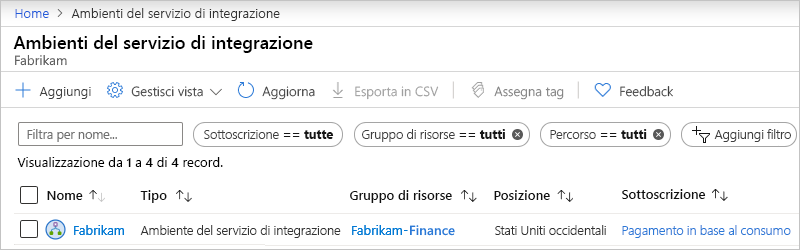

# Gestire l'ambiente Integration Services (ISE) in app per la logica di Azure

Per verificare lo stato di integrità della rete per l' [ambiente di Integration Services (ISE)](../logic-apps/connect-virtual-network-vnet-isolated-environment-overview.md) e gestire le app per la logica, le connessioni, gli account di integrazione e i connettori personalizzati presenti in ISE, attenersi alla procedura descritta in questo argomento.

## Visualizza ISE

1. Accedere al [portale di Azure](https://portal.azure.com).

1. Nella casella di ricerca del portale immettere "Integration Services environments" e quindi selezionare **Integration Services environments**.

   

1. Dall'elenco dei risultati selezionare l'ambiente del servizio di integrazione.

   

1. Passare alle sezioni successive per trovare le app per la logica, le connessioni, i connettori o gli account di integrazione in ISE.

## Controllare l'integrità della rete

Nel menu ISE selezionare **integrità rete**in **Impostazioni**. Questo riquadro Mostra lo stato di integrità per le subnet e le dipendenze in uscita da altri servizi.

## Gestire le app per la logica

1. Nel menu ISE selezionare app per la **logica**in **Impostazioni**.

   

1. Per rimuovere le app per la logica da ISE quando non sono più necessarie, selezionare le app per la logica e quindi fare clic su **Elimina**.

## Gestisci connessioni API

1. Per visualizzare le connessioni API create dalle app per la logica in esecuzione in ISE, nel menu ISE, in **Impostazioni**, selezionare **connessioni API**.

   

1. Per rimuovere le connessioni da ISE quando non è più necessario, selezionare le connessioni e quindi selezionare **Elimina**.

## Gestire i connettori personalizzati

1. Per visualizzare i connettori personalizzati creati in ISE, nel menu ISE, in **Impostazioni**, selezionare **connettori personalizzati**.

   

1. Per rimuovere i connettori personalizzati da ISE quando non sono più necessari, selezionarli e quindi selezionare **Elimina**.

## Gestire gli account di integrazione

1. Nel menu ISE, in **Impostazioni**, selezionare **account di integrazione**.

   

1. Per rimuovere gli account di integrazione da ISE quando non sono più necessari, selezionare gli account di integrazione e quindi selezionare **Elimina**.

## Passaggi successivi

* Informazioni su come [connettersi alle reti virtuali di Azure da app per la logica isolate](../logic-apps/connect-virtual-network-vnet-isolated-environment.md)
