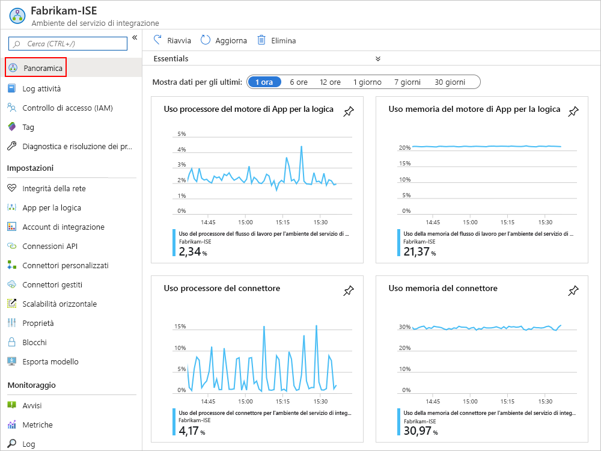
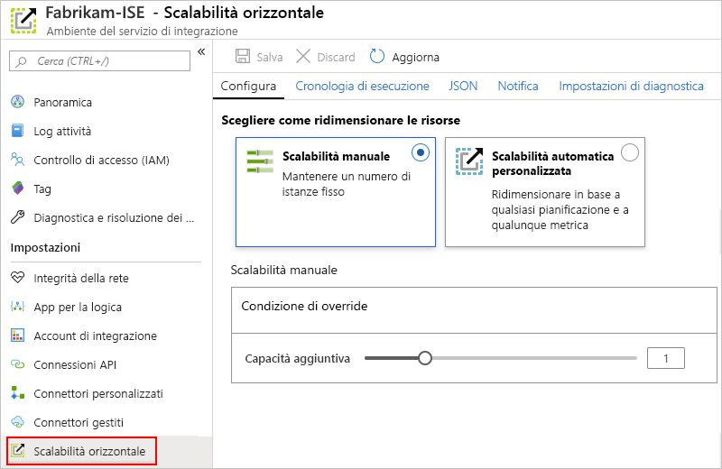
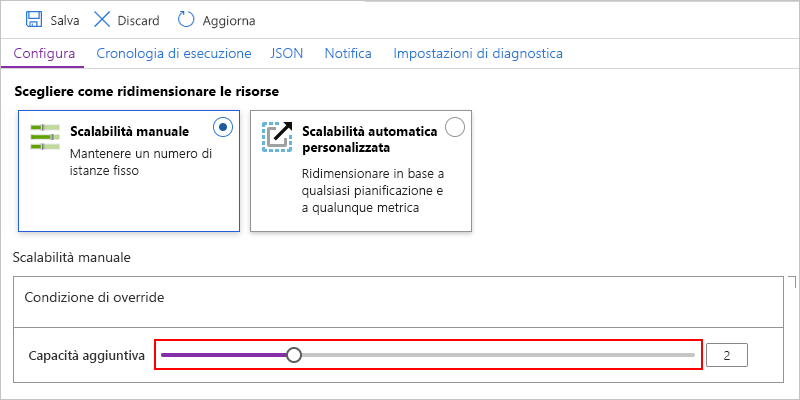
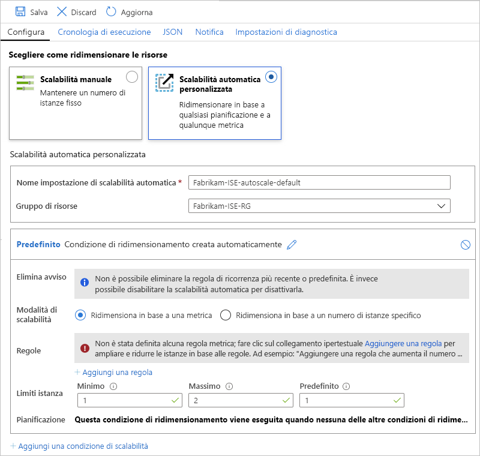

# Gestire l'ambiente del servizio di integrazione in App per la logica di Azure

Questo articolo illustra come eseguire attività di gestione per l' [ambiente Integration Services (ISE)](../logic-apps/connect-virtual-network-vnet-isolated-environment-overview.md), ad esempio:

* Gestire le risorse, ad esempio le app per la logica, le connessioni, gli account di integrazione e i connettori in ISE.

* Controllare l'integrità della rete di ISE.

* Aggiungere la capacità, riavviare ISE o eliminare ISE, attenersi alla procedura descritta in questo argomento. Per aggiungere questi elementi a ISE, vedere [aggiungere elementi all'ambiente del servizio di integrazione](../logic-apps/add-artifacts-integration-service-environment-ise.md).

## Visualizza ISE

1. Accedere al [portale di Azure](https://portal.azure.com).

1. Nella casella di ricerca del portale immettere "Integration Services environments" e quindi selezionare **Integration Services environments** .

   

1. Dall'elenco dei risultati selezionare l'ambiente del servizio di integrazione.

   

1. Passare alle sezioni successive per trovare le app per la logica, le connessioni, i connettori o gli account di integrazione in ISE.

## Controllare l'integrità della rete

Nel menu ISE selezionare **integrità rete** in **Impostazioni** . Questo riquadro Mostra lo stato di integrità per le subnet e le dipendenze in uscita da altri servizi.

> [!CAUTION]
> Se la rete di ISE diventa non integra, il ambiente del servizio app interno (ASE) usato da ISE può diventare non integro. Se l'ambiente del servizio app non è integro per più di sette giorni, l'ambiente del servizio app viene sospeso. Per risolvere questo stato, controllare la configurazione della rete virtuale. Risolvere gli eventuali problemi riscontrati, quindi riavviare ISE. In caso contrario, dopo 90 giorni, l'ambiente del servizio app sospeso viene eliminato e l'ISE diventa inutilizzabile. Quindi, assicurarsi di lasciare l'ambiente ISE integro per consentire il traffico necessario.
> 
> Per altre informazioni, vedere gli argomenti seguenti:
>
> * [Panoramica della diagnostica del servizio app di Azure](../app-service/overview-diagnostics.md)
> * [Registrazione dei messaggi per ambiente del servizio app di Azure](../app-service/environment/using-an-ase.md#logging)

## Gestire le app per la logica

È possibile visualizzare e gestire le app per la logica che si trovano in ISE.

1. Nel menu ISE selezionare app per la **logica** in **Impostazioni** .

   

1. Per rimuovere le app per la logica che non sono più necessarie in ISE, selezionare le app per la logica e quindi fare clic su **Elimina** . Per confermare che si desidera eliminare, selezionare **Sì** .

> [!NOTE]
> Se si elimina e si ricrea un'app per la logica figlio, è necessario salvare di nuovo l'app per la logica padre. L'app figlio ricreata avrà metadati diversi.
> Se non si salva di nuovo l'app per la logica padre dopo aver ricreato l'elemento figlio, le chiamate all'app per la logica figlio avranno esito negativo con un errore di "non autorizzato". Questo comportamento si applica alle app per la logica padre-figlio, ad esempio quelle che usano gli artefatti negli account di integrazione o chiamano funzioni di Azure.

## Gestisci connessioni API

È possibile visualizzare e gestire le connessioni create dalle app per la logica in esecuzione in ISE.

1. Nel menu ISE, in **Impostazioni** , selezionare **connessioni API** .

   

1. Per rimuovere le connessioni che non sono più necessarie in ISE, selezionare le connessioni e quindi selezionare **Elimina** . Per confermare che si desidera eliminare, selezionare **Sì** .

## Gestisci connettori ISE

È possibile visualizzare e gestire i connettori API distribuiti in ISE.

1. Nel menu ISE, in **Impostazioni** , selezionare **connettori gestiti** .

   

1. Per rimuovere i connettori che non si desidera siano disponibili in ISE, selezionarli e quindi selezionare **Elimina** . Per confermare che si desidera eliminare, selezionare **Sì** .

## Gestire i connettori personalizzati

È possibile visualizzare e gestire i connettori personalizzati distribuiti in ISE.

1. Nel menu ISE, in **Impostazioni** , selezionare **connettori personalizzati** .

   

1. Per rimuovere i connettori personalizzati che non sono più necessari in ISE, selezionare i connettori e quindi selezionare **Elimina** . Per confermare che si desidera eliminare, selezionare **Sì** .

## Gestire gli account di integrazione

1. Nel menu ISE, in **Impostazioni** , selezionare **account di integrazione** .

   

1. Per rimuovere gli account di integrazione da ISE quando non sono più necessari, selezionare gli account di integrazione e quindi selezionare **Elimina** .

## Aggiungere la capacità ISE

L'unità di base Premium ISE ha una capacità fissa, quindi se è necessaria una velocità effettiva maggiore, è possibile aggiungere altre unità di scala, durante la creazione o in seguito. Lo SKU Developer non include la possibilità di aggiungere unità di scala.

1. Nella [portale di Azure](https://portal.azure.com)passare a ISE.

1. Per esaminare le metriche di utilizzo e delle prestazioni per ISE, scegliere **Panoramica** dal menu ISE.

   

1. In **Impostazioni** selezionare **scale out (scalabilità orizzontale** ). Nel riquadro **Configura** selezionare una delle opzioni seguenti:

   * [**Scalabilità manuale**](#manual-scale): ridimensionare in base al numero di unità di elaborazione che si vuole usare.
   * [**Scalabilità automatica personalizzata**](#custom-autoscale): ridimensionare in base alle metriche delle prestazioni selezionando i diversi criteri e specificando le condizioni di soglia per la riunione di questi criteri.

   

### Scalabilità manuale

1. Dopo aver selezionato la **scalabilità manuale** , per **capacità aggiuntiva** Selezionare il numero di unità di scala che si desidera utilizzare.

   

1. Al termine, selezionare **Salva** .

### Scalabilità automatica personalizzata

1. Dopo aver selezionato il **ridimensionamento automatico personalizzato** , per **Nome impostazione di scalabilità** automatica specificare un nome per l'impostazione e, facoltativamente, selezionare il gruppo di risorse di Azure a cui appartiene l'impostazione.

   

1. Per la condizione **predefinita** , selezionare **scalabilità in base a una metrica** o **scala per un numero di istanze specifico** .

   * Se si sceglie basato su istanza, immettere il numero per le unità di elaborazione, ovvero un valore compreso tra 0 e 10.

   * Se si sceglie basato su metrica, attenersi alla procedura seguente:

     1. Nella sezione **regole** selezionare **Aggiungi una regola** .

     1. Nel riquadro **regola di scalabilità** impostare i criteri e l'azione da intraprendere quando la regola viene attivata.

     1. Per i **limiti dell'istanza** , specificare i valori seguenti:

        * **Minimum** : numero minimo di unità di elaborazione da usare
        * **Massimo** : numero massimo di unità di elaborazione da usare
        * **Impostazione predefinita** : se si verificano problemi durante la lettura delle metriche delle risorse e la capacità corrente è inferiore alla capacità predefinita, la scalabilità automatica aumenta fino al numero predefinito di unità di elaborazione. Tuttavia, se la capacità corrente supera la capacità predefinita, la scalabilità automatica non viene ridimensionata.

1. Per aggiungere un'altra condizione, selezionare **Aggiungi condizione di ridimensionamento** .

1. Al termine delle impostazioni di scalabilità automatica, salvare le modifiche.

## Riavviare ISE

Se si modifica il server DNS o le relative impostazioni, è necessario riavviare l’ISE in modo che possa rilevare tali modifiche. Il riavvio di uno SKU Premium ISE non comporta tempi di inattività dovuti alla ridondanza e ai componenti che si riavviano uno alla volta durante il riciclo. Tuttavia, uno SKU dello sviluppatore ISE presenta tempi di inattività perché non esiste alcuna ridondanza. Per altre informazioni, vedere [SKU di ISE](../logic-apps/connect-virtual-network-vnet-isolated-environment-overview.md#ise-level).

1. Nella [portale di Azure](https://portal.azure.com)passare a ISE.

1. Scegliere **Panoramica** dal menu ISE. Sulla barra degli strumenti Panoramica **riavviare** .

   

## Eliminare l'ISE

Prima di eliminare un ISE non più necessario o un gruppo di risorse di Azure che contiene un ISE, verificare di non avere criteri o blocchi nel gruppo di risorse di Azure che contiene queste risorse o nella rete virtuale di Azure, perché questi elementi possono bloccare l'eliminazione.

Dopo aver eliminato l'ISE, potrebbe essere necessario attendere fino a 9 ore prima di provare a eliminare la rete virtuale o le subnet di Azure.

## Passaggi successivi

* [Aggiungere risorse agli ambienti del servizio di integrazione](../logic-apps/add-artifacts-integration-service-environment-ise.md)
