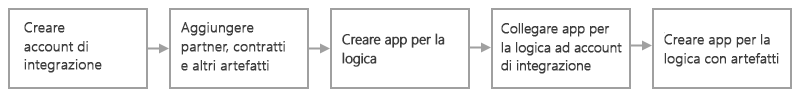

# Soluzioni di integrazione aziendale B2B con App per la logica di Azure ed Enterprise Integration Pack

Per soluzioni B2B (Business to Business) e una facile comunicazione tra le organizzazioni, è possibile creare flussi di lavoro di integrazione aziendale scalabili e automatizzati usando Enterprise Integration Pack (EIP) e [App per la logica di Azure](../logic-apps/logic-apps-overview.md). Le organizzazioni potranno scambiarsi messaggi elettronicamente pur usando formati e protocolli diversi. EIP trasforma formati diversi in un formato elaborabile dai sistemi delle organizzazioni e supporta protocolli standard di settore come [AS2](../logic-apps/logic-apps-enterprise-integration-as2.md), [X12](logic-apps-enterprise-integration-x12.md) ed [EDIFACT](../logic-apps/logic-apps-enterprise-integration-edifact.md). È inoltre possibile proteggere i messaggi con firme digitali e crittografia. EIP supporta i [connettori di integrazione aziendale](../connectors/apis-list.md#integration-account-connectors) e gli standard di settore seguenti:

* EDI (Electronic Data Interchange)
* EAI (Enterprise Application Integration)

Se si ha familiarità con Microsoft BizTalk Server o Servizi BizTalk di Azure, EIP segue concetti simili e facilita così l'uso delle funzionalità. Un'importante differenza consiste tuttavia nel fatto che l'architettura di EIP è basata su "account di integrazione" per semplificare l'archiviazione e la gestione degli artefatti usati nelle comunicazioni B2B. Questi account sono contenitori basati sul cloud in cui vengono archiviati tutti gli artefatti, come partner, accordi, schemi, mappe e certificati. 

## Vantaggi dell'uso di Enterprise Integration Pack

* Con EIP si possono archiviare tutti gli artefatti in un'unica posizione: l'account di integrazione.

* È possibile creare flussi di lavoro B2B ed eseguire l'integrazione con app SaaS (Software as a Service) di terze parti, app locali e app personalizzate usando connettori e App per la logica di Azure.

* Grazie alle funzioni di Azure, è possibile creare un codice personalizzato per le app per la logica.

## Come iniziare?

Per poter iniziare a creare flussi di lavoro di app per la logica B2B con EIP, sono prima di tutto necessari gli elementi seguenti:

* Una sottoscrizione di Azure. Se non si ha una sottoscrizione di Azure, [iscriversi per creare un account Azure gratuito](https://azure.microsoft.com/free/).

* Un [account di integrazione](../logic-apps/logic-apps-enterprise-integration-create-integration-account.md) con gli artefatti che si vogliono usare.

* Per creare mappe e schemi, si possono usare [Microsoft Azure Logic Apps Enterprise Integration Tools for Visual Studio 2015 2.0](https://aka.ms/vsmapsandschemas) e Visual Studio 2015.

Dopo aver creato un account di integrazione e aver aggiunto gli artefatti, è possibile iniziare a creare flussi di lavoro B2B con questi artefatti creando un'app per la logica nel portale di Azure. Se non si ha familiarità con le app per la logica, provare a [creare un'app per la logica di base](../logic-apps/quickstart-create-first-logic-app-workflow.md). Per usare questi artefatti, assicurarsi di collegare prima di tutto l'account di integrazione all'app per la logica. Successivamente, l'app per la logica potrà accedere all'account di integrazione. È anche possibile creare, gestire e distribuire app per la logica usando Visual Studio o [PowerShell](https://docs.microsoft.com/powershell/module/az.logicapp).

Di seguito è illustrata la procedura generale per iniziare a creare app per la logica B2B:

  

## Prova adesso

[Distribuire un'app per la logica di esempio completamente operativa che invia e riceve messaggi AS2](https://github.com/Azure/azure-quickstart-templates/tree/master/201-logic-app-as2-send-receive)

## Passaggi successivi

* [Creare partner commerciali](logic-apps-enterprise-integration-partners.md)
* [Creare contratti](../logic-apps/logic-apps-enterprise-integration-agreements.md)
* [Aggiungere schemi](logic-apps-enterprise-integration-schemas.md)
* [Aggiungere una mappa](../logic-apps/logic-apps-enterprise-integration-maps.md)
* [Eseguire la migrazione da Servizi BizTalk](../logic-apps/logic-apps-move-from-mabs.md)
