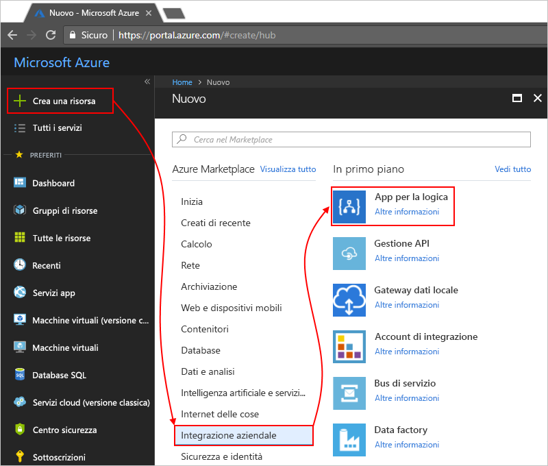

# Monitorare e ottenere informazioni dettagliate sulle esecuzioni dell'app per la logica con Operations Management Suite (OMS) e Log Analytics

Per informazioni di monitoraggio e dati di debug più dettagliati, è possibile attivare Log Analytics nel momento in cui si crea un'app per la logica. Log Analytics offre funzionalità di monitoraggio e di registrazione della diagnostica per le esecuzioni di app per la logica tramite il portale di Operations Management Suite (OMS). Quando si aggiunge la soluzione di gestione delle app per la logica in OMS, si ottiene non solo lo stato aggregato delle esecuzioni dell'app per la logica, ma anche dettagli specifici come lo stato, il tempo di esecuzione, lo stato dei nuovi invii e gli ID di correlazione.

Questo argomento illustra come attivare Log Analytics o installare la soluzione di gestione delle app per la logica in OMS, in modo da poter visualizzare i dati e gli eventi di runtime per l'esecuzione dell'app per la logica in corso.

 > [!TIP]
 > Per monitorare le app per la logica esistenti, seguire questa procedura per [attivare la registrazione della diagnostica e inviare a OMS i dati di runtime dell'app per la logica](../logic-apps/logic-apps-monitor-your-logic-apps.md#azure-diagnostics).

## Requisiti

Prima di iniziare, è necessario avere un'area di lavoro di OMS. Informazioni su [come creare un'area di lavoro di OMS](../log-analytics/log-analytics-get-started.md). 

## Attivare la registrazione della diagnostica durante la creazione di app per la logica

1. Nel [portale di Azure](https://portal.azure.com) creare un'app per la logica. Scegliere **Crea una risorsa** > **Integrazione aziendale** > **App per la logica**.

   

2. Nella pagina **Crea app per la logica** eseguire le attività descritte di seguito:

   1. Assegnare un nome all'app per la logica e selezionare la sottoscrizione di Azure personale. 
   2. Creare o selezionare un gruppo di risorse di Azure.
   3. Impostare **Log Analytics** su **On**. 
   Selezionare l'area di lavoro OMS in cui si vuole inviare i dati relativi alle esecuzioni dell'app per la logica. 
   4. Quando si è pronti, scegliere **Aggiungi al dashboard** > **Crea**.

      

      Al termine di questo passaggio, Azure crea l'app per la logica, che ora è associata all'area di lavoro OMS personale. 
      Con questo passaggio viene anche installata automaticamente la soluzione di gestione delle app per la logica nell'area di lavoro OMS.

3. Per visualizzare le esecuzioni dell'app per la logica in OMS, [proseguire la procedura](#view-logic-app-runs-oms).

## Installare la soluzione di gestione delle app per la logica in OMS

Se Log Analytics è già stato attivato al momento della creazione dell'app per la logica, ignorare questo passaggio. In questo caso, infatti, la soluzione di gestione delle app per la logica è già installata in OMS.

1. Nel [portale di Azure](https://portal.azure.com) scegliere **Altri servizi**. Digitare "Log Analytics" come filtro e scegliere **Log Analytics**, come illustrato di seguito:

   

2. In **Log Analytics** trovare e selezionare l'area di lavoro di OMS. 

   

3. In **Gestione** scegliere **Portale di OMS**.

   

4. Se nella home page di OMS viene visualizzato il banner di aggiornamento, selezionare il banner in modo da aggiornare per prima l'area di lavoro di OMS. Scegliere quindi **Raccolta soluzioni**.

   

5. In **Tutte le soluzioni** trovare e scegliere il riquadro relativo a **Logic Apps Management** (Gestione delle app per la logica).

   

6. Per installare la soluzione nell'area di lavoro OMS, scegliere **Aggiungi**.

   

## Visualizzare le esecuzioni dell'app per la logica nell'area di lavoro OMS

1. Per visualizzare il numero e lo stato delle esecuzioni dell'app per la logica, andare alla pagina di panoramica dell'area di lavoro OMS. Verificare i dettagli nel riquadro **Logic Apps Management** (Gestione delle app per la logica).

   

   > [!Note]
   > Se al posto del riquadro di gestione delle app per la logica viene visualizzato il banner di aggiornamento, selezionare il banner in modo da aggiornare per prima l'area di lavoro di OMS.
  
   > 

2. Per visualizzare un riepilogo con dettagli aggiuntivi sulle esecuzioni dell'app per la logica, scegliere il riquadro **Logic Apps Management** (Gestione delle app per la logica).

   In questo riquadro le esecuzioni dell'app per la logica vengono raggruppate in base al nome o allo stato di esecuzione. È anche possibile vedere i dettagli sugli errori di azioni o trigger per le esecuzioni delle app per la logica.

   
   
3. Per visualizzare tutte le esecuzioni per un'app per la logica o uno stato specifico, selezionare la riga relativa all'app per la logica o allo stato desiderato.

   Nell'esempio seguente sono visualizzate tutte le esecuzioni per un'app per la logica specifica:

   

   In questa pagina sono disponibili due opzioni avanzate:
   * **Proprietà rilevate:** questa colonna mostra le proprietà rilevate per l'app per la logica, raggruppate per azioni. Per visualizzare le proprietà rilevate, scegliere **Visualizza**. È possibile cercare le proprietà rilevate tramite il filtro di colonna.
   
     

     Tutte le proprietà rilevate che vengono aggiunte potrebbero richiedere 10-15 minuti per essere visualizzate la prima volta. Informazioni su [come aggiungere proprietà rilevate all'app per la logica](logic-apps-monitor-your-logic-apps.md#azure-diagnostics-event-settings-and-details).

   * **Invia di nuovo:** è possibile inviare di nuovo una o più esecuzioni di app per la logica che non sono riuscite, che sono riuscite o che sono ancora in esecuzione. Selezionare le caselle di controllo per le esecuzioni che si desidera inviare di nuovo, quindi scegliere **Invia di nuovo**. 

     

4. Per filtrare questi risultati, è possibile applicare un filtro sia sul lato client sia sul lato server.

   * Filtro lato client: per ogni colonna scegliere i filtri desiderati. 
   Di seguito sono riportati alcuni esempi:

     

   * Filtro lato server: per scegliere un intervallo di tempo specifico o per limitare il numero di esecuzioni visualizzate, usare il controllo dell'ambito disponibile nella parte superiore della pagina. 
   Per impostazione predefinita, vengono visualizzati contemporaneamente solo 1.000 record. 
   
     
 
5. Per visualizzare tutte le azioni e i relativi dettagli per un'esecuzione specifica, selezionare la riga dell'esecuzione dell'app per la logica desiderata.

   L'esempio seguente mostra tutte le azioni di un'esecuzione specifica di un'app per la logica:

   
   
6. In qualsiasi pagina di risultati, per visualizzare la query che ha generato i risultati o per visualizzare tutti i risultati, scegliere **Mostra tutto**, che apre la pagina Ricerca log.
   
   
   
   Nella pagina Ricerca log,
   * Per visualizzare i risultati della query in una tabella, scegliere **Tabella**.
   * Per modificare la query, è possibile modificare la stringa di query nella barra di ricerca. 
   Per un'esperienza migliore, scegliere **Analisi avanzata**.

     
     
     Nella pagina di Azure Log Analytics è possibile aggiornare le query e visualizzare i risultati dalla tabella. 
     Questa query usa [il linguaggio di query Kusto](https://docs.loganalytics.io/docs/Language-Reference), che può essere modificato se si preferisce visualizzare risultati diversi. 

     

## Passaggi successivi

* [Monitorare i messaggi B2B](../logic-apps/logic-apps-monitor-b2b-message.md)

