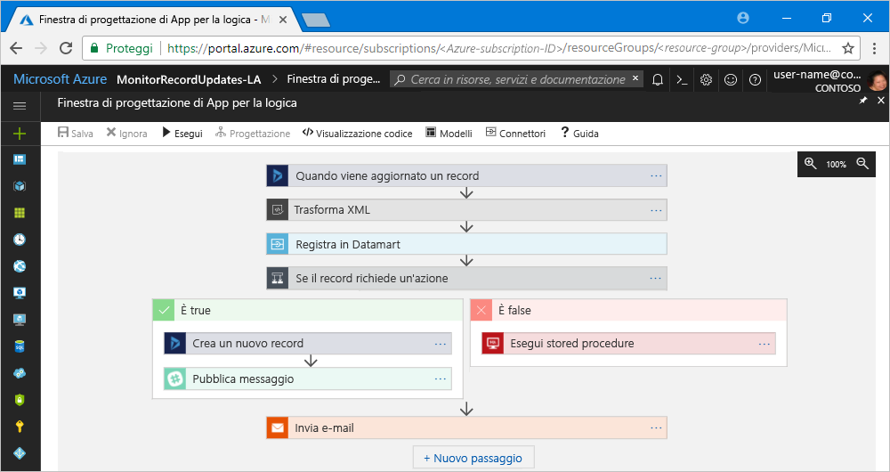

# Informazioni su App per la logica di Azure

[App per la logica](https://azure.microsoft.com/services/logic-apps) consente di creare, pianificare e automatizzare i processi sotto forma di [flussi di lavoro](#logic-app-concepts) in modo da integrare app, dati, sistemi e servizi in aziende e organizzazioni. App per la logica semplifica la progettazione e la creazione di soluzioni scalabili per l'integrazione di app, l'integrazione dei dati, l'integrazione di sistemi, Enterprise Application Integration (EAI) e le comunicazioni business-to-business (B2B) nel cloud, a livello locale o in entrambi gli ambienti.

Ecco, ad esempio, alcuni carichi di lavoro che è possibile automatizzare con le app per la logica:

* Elaborazione e instradamento di ordini in sistemi locali e servizi cloud.
* Spostamento di file caricati su un server FTP in Archiviazione di Azure. 
* Monitoraggio dei tweet su un determinato argomento, analisi del sentiment e creazione di avvisi o attività per gli elementi che devono essere esaminati.

Per creare soluzioni di integrazione con app per la logica, è possibile scegliere tra [circa 200 connettori incorporati](../connectors/apis-list.md) di una raccolta in costante crescita, che include database SQL, servizi di Azure, Office 365, Salesforce, Google e altri ancora. Questi [connettori](#logic-app-concepts) forniscono[trigger](#logic-app-concepts), [azioni](#logic-app-concepts) o entrambi per la creazione di app per la logica in grado di accedere ai dati in modo sicuro ed elaborarli in tempo reale.

> [!VIDEO https://channel9.msdn.com/Blogs/Azure/Introducing-Azure-Logic-Apps/player]

## Come funziona App per la logica 

Ogni flusso di lavoro delle app per la logica inizia con un trigger, che viene attivato quando si verifica un evento specifico oppure quando nuovi dati disponibili soddisfano criteri specifici. Molti trigger includono funzionalità di pianificazione di base e consentono quindi di specificare la frequenza di esecuzione dei carichi di lavoro. Per altri scenari di pianificazione personalizzati, avviare i flussi di lavoro con il trigger di pianificazione. Per altre informazioni, vedere l'articolo su [come creare flussi di lavoro basati su pianificazione](../logic-apps/tutorial-build-schedule-recurring-logic-app-workflow.md).

Ogni volta che il trigger viene attivato, il motore di App per la logica crea un'istanza dell'app per la logica che esegue le azioni del flusso di lavoro. Queste azioni possono anche includere conversioni di dati e controlli di flusso, ad esempio istruzioni condizionali, istruzioni switch, cicli e diramazioni. Ad esempio, questa app per la logica viene avviata con un trigger di Dynamics 365 che include il criterio predefinito "Quando un record viene aggiornato". Se il trigger rileva un evento che soddisfa questo criterio, il trigger viene attivato ed esegue le azioni del flusso di lavoro. In questo caso, le azioni includono la trasformazione XML, gli aggiornamenti dei dati, la diramazione delle decisioni e le notifiche tramite posta elettronica.

È possibile creare visivamente le app per la logica con la finestra di progettazione di App per la logica, disponibile nel portale di Azure tramite il browser e in Visual Studio. Per altre app per la logica personalizzate è possibile creare e modificare definizioni di app per la logica in JSON (JavaScript Object Notation) operando in modalità "visualizzazione codice". È anche possibile usare i comandi di Azure PowerShell e i modelli di Azure Resource Manager per le attività di selezione. Le app per la logica vengono distribuite ed eseguite nel cloud in Azure. Per un'introduzione più dettagliata, guardare questo video: [Use Azure Enterprise Integration Services to run cloud apps at scale](https://channel9.msdn.com/Events/Connect/2017/T119/) (Usare Azure Enterprise Integration Services per eseguire app cloud su larga scala).

## Perché usare App per la logica

Con l'affermazione della digitalizzazione in ambito aziendale, le app per la logica consentono di connettere sistemi legacy e sistemi moderni e all'avanguardia in modo più semplice e rapido grazie ad API predefinite fornite come connettori gestiti da Microsoft. In questo modo, è possibile concentrarsi sulla logica di business e sulla funzionalità delle proprie app. Non è infatti necessario preoccuparsi di creare, ospitare, ridimensionare, gestire e monitorare le app perché tutte queste operazioni vengono gestite da App per la logica. Senza contare che si paga solo per quello che si usa, in base a un [modello di determinazione prezzi](../logic-apps/logic-apps-pricing.md) a consumo. 

In molti casi non sarà neanche necessario scrivere codice. Nel caso sia necessario scrivere codice, è possibile creare frammenti di codice con [Funzioni di Azure](../azure-functions/functions-overview.md) ed eseguire tale codice su richiesta dalle app per la logica. Se inoltre le app per la logica devono interagire con gli eventi di servizi di Azure, app personalizzate o soluzioni di terze parti, è possibile usare [Griglia di eventi di Azure](../event-grid/overview.md) con le app per la logica per la pubblicazione, l'instradamento e il monitoraggio degli eventi.

App per la logica, Funzioni e Griglia di eventi sono completamente gestiti da Microsoft Azure, di conseguenza non è più necessario preoccuparsi di creare, ospitare, ridimensionare, gestire, monitorare e manutenere le soluzioni. Grazie alla possibilità di creare [app e soluzioni "senza server"](../logic-apps/logic-apps-serverless-overview.md), è possibile concentrarsi solo sulla logica di business. Questi servizi vengono automaticamente ridimensionati in base alle esigenze, velocizzano le integrazioni e consentono di creare app cloud affidabili con una quantità minima di codice. Senza contare che si paga solo per quello che si usa, in base a un [modello di determinazione prezzi](../logic-apps/logic-apps-pricing.md) a consumo. 

Per informazioni su come l'uso combinato di App per la logica con altri servizi Azure e prodotti Microsoft ha consentito alle aziende di migliorare la propria agilità e concentrare ancor di più l'attenzione sul proprio core business, vedere queste [storie dei clienti](https://aka.ms/logic-apps-customer-stories).

Ecco altre informazioni sulle funzionalità e sui vantaggi offerti da App per la logica:

* **Strumenti di facile utilizzo per la creazione di flussi di lavoro in modo visivo**

  Gli strumenti di progettazione visiva consentono di risparmiare tempo e di semplificare processi complessi. 
  È possibile creare app per la logica dall'inizio alla fine con la finestra di progettazione di App per la logica, tramite il browser nel portale di Azure o in Visual Studio. Per avviare il flusso di lavoro basta un trigger ed è inoltre possibile aggiungere tutte le azioni necessarie dalla [raccolta dei connettori](../connectors/apis-list.md).

* **Modelli di app per la logica per velocizzare l'implementazione**

  Per creare più rapidamente le soluzioni più comuni, basta scegliere tra i flussi di lavoro predefiniti nella [raccolta di modelli](../logic-apps/logic-apps-create-logic-apps-from-templates.md). 
  Sono disponibili vari modelli, da quelli per la semplice connettività per app di software come un servizio (SaaS) a soluzioni B2B avanzate, fino a modelli senza alcuno scopo specifico. Altre informazioni su come [creare app per la logica da modelli predefiniti](../logic-apps/logic-apps-create-logic-apps-from-templates.md).

* **Possibilità di connettere sistemi diversi in vari ambienti**

  Alcuni modelli e flussi di lavoro sono facili da descrivere ma difficili da implementare nel codice. 
  Le app per la logica consentono di connettere automaticamente sistemi diversi in ambienti locali e cloud. Ad esempio, è possibile connettere una soluzione di marketing cloud a un sistema di fatturazione locale oppure centralizzare la messaggistica tra API e sistemi con un bus di servizio aziendale. Le app per la logica consentono di distribuire in modo rapido, affidabile e coerente soluzioni riutilizzabili e riconfigurabili per questi scenari.

* **Supporto di livello avanzato per gli scenari di Enterprise Integration e B2B**

  Per comunicare tra loro in formato elettronico, aziende e organizzazioni usano formati e protocolli di messaggistica standard del settore, anche se diversi, ad esempio X12, EDIFACT e AS2. 
  Grazie alle funzionalità di [Enterprise Integration Pack (EIP)](../logic-apps/logic-apps-enterprise-integration-overview.md), è possibile creare app per la logica che trasformano i formati di messaggio usati dai partner in formati che i sistemi dell'organizzazione sono in grado di interpretare ed elaborare. Le app per la logica gestiscono questi scambi in modo pratico e in tutta sicurezza grazie alla crittografia e alle firme digitali.

  È possibile iniziare con i sistemi e i servizi già disponibili e ampliare l'ambiente in modo graduale. Quando si è pronti, sarà possibile usare le funzionalità seguenti di App per la logica ed EIP, oltre ad altre funzionalità, per implementare scenari di integrazione più complessi:

  * Prodotti e servizi per iniziare: 
    * [Microsoft BizTalk Server](https://docs.microsoft.com/biztalk/core/introducing-biztalk-server) 
    * [Gestione API](../api-management/api-management-key-concepts.md) 
    * [Funzioni di Azure](../azure-functions/functions-overview.md) 
    * [Bus di servizio di Azure](../service-bus-messaging/service-bus-messaging-overview.md)
  * Elaborare [messaggi XML](../logic-apps/logic-apps-enterprise-integration-xml.md)
  * Elaborare [file flat](../logic-apps/logic-apps-enterprise-integration-flatfile.md)
  * Scambiare messaggi con protocolli [EDIFACT](../logic-apps/logic-apps-enterprise-integration-edifact.md), [AS2](../logic-apps/logic-apps-enterprise-integration-as2.md) e [X12](../logic-apps/logic-apps-enterprise-integration-x12.md)
  * Archiviare e gestire questi artefatti B2B e altro ancora in un'unica posizione con gli [account di integrazione](../logic-apps/logic-apps-enterprise-integration-accounts.md):
    * [Partner](../logic-apps/logic-apps-enterprise-integration-partners.md)
    * [Contratti](../logic-apps/logic-apps-enterprise-integration-agreements.md) 
    * [Mappe per la trasformazione XML](../logic-apps/logic-apps-enterprise-integration-maps.md)
    * [Schemi per la convalida XML](../logic-apps/logic-apps-enterprise-integration-schemas.md)

* **Possibilità di riutilizzare il codice scritto**

  È possibile creare le app per la logica sotto forma di modelli in modo da poter [distribuire e riconfigurare le app](../logic-apps/logic-apps-create-deploy-template.md) in più ambienti e aree.

* **Estendibilità incorporata**

  Se il connettore necessario non è disponibile o si deve eseguire codice personalizzato, è possibile estendere le app per la logica creando e chiamando su richiesta frammenti di codice personalizzato tramite [Funzioni di Azure](../azure-functions/functions-overview.md). 
  È possibile creare [API](../logic-apps/logic-apps-create-api-app.md) e [connettori personalizzati](../logic-apps/custom-connector-overview.md) richiamabili dalle app per la logica.

* **Pagamento in base all'utilizzo**
  
  App per la logica usa [prezzi e metriche](../logic-apps/logic-apps-pricing.md) in base al consumo a meno che non siano presenti app per la logica create in precedenza con piani di servizio app.

Per altre informazioni su App per la logica, guardare i video introduttivi seguenti:
* [Integration with Logic Apps - Go from zero to hero](https://channel9.msdn.com/Events/Build/2017/C9R17) (Integrazione con App per la logica - Dalle stalle alle stelle)
* [Enterprise integration with Microsoft Azure Logic Apps](https://channel9.msdn.com/Events/Ignite/Microsoft-Ignite-Orlando-2017/BRK2188) (Integrazione aziendale con App per la logica di Microsoft Azure)
* [Building advanced business processes with Logic Apps](https://channel9.msdn.com/Events/Ignite/Microsoft-Ignite-Orlando-2017/BRK3179) (Creazione di processi aziendali avanzati con App per la logica)

## Termini chiave

* **Flusso di lavoro**: consente di visualizzare, progettare, creare, automatizzare e distribuire i processi aziendali come una serie di passaggi.

* **Connettori gestiti**: le app per la logica devono poter accedere a dati, servizi e sistemi. È possibile usare i connettori predefiniti gestiti da Microsoft che sono progettati per la connessione, l'accesso e l'utilizzo dei dati. Vedere [Connettori per App per la logica di Azure](../connectors/apis-list.md).

* **Trigger**: molti connettori gestiti da Microsoft forniscono trigger che vengono attivati in caso di eventi o di nuovi dati che soddisfano condizioni specificate. Ad esempio, un evento potrebbe ottenere un messaggio di posta elettronica o rilevare modifiche nell'account di archiviazione di Azure. Ogni volta che il trigger viene attivato, il motore di App per la logica crea una nuova istanza dell'app per la logica che esegue il flusso di lavoro.

* **Azioni**: per azioni si intendono tutti i passaggi che si verificano dopo il trigger. Ogni azione è in genere associata a un'operazione definita da un connettore gestito, un'API personalizzata o un connettore personalizzato.

* **Enterprise Integration Pack**: per scenari di integrazione più avanzati, App per la logica include funzionalità di BizTalk Server. Enterprise Integration Pack fornisce connettori che permettono alle app per la logica di eseguire facilmente la convalida, la trasformazione e molto altro ancora.

## Differenze tra App per la logica e Funzioni, Processi Web e Flow

Tutti questi servizi consentono di mettere insieme e connettere sistemi diversi. Ogni servizio presenta vantaggi e svantaggi, di conseguenza combinarne le funzionalità è il modo ideale per creare rapidamente un sistema di integrazione completo e scalabile. Per altre informazioni, vedere [Scegliere tra Flow, App per la logica, Funzioni e Processi Web](../azure-functions/functions-compare-logic-apps-ms-flow-webjobs.md).

## Attività iniziali 

App per la logica è uno dei numerosi servizi ospitati in Microsoft Azure. Di conseguenza, prima di iniziare, è necessaria una sottoscrizione di Azure. Se non si ha una sottoscrizione, è possibile <a href="https://azure.microsoft.com/free/" target="_blank">iscriversi per creare un account Azure gratuito</a>. 

Se si ha una sottoscrizione di Azure, provare questa [guida rapida per creare la prima app per la logica](../logic-apps/quickstart-create-first-logic-app-workflow.md), che monitora la disponibilità di nuovo contenuto in un sito Web tramite un feed RSS e invia un messaggio di posta elettronica quando è presente nuovo contenuto.

## Supporto, commenti e suggerimenti

* In caso di domande, visitare il [forum di App per la logica di Azure](https://social.msdn.microsoft.com/Forums/en-US/home?forum=azurelogicapps).
* Per votare o inviare idee relative alle funzionalità, visitare il [sito dei commenti e suggerimenti degli utenti di App per la logica](http://aka.ms/logicapps-wish).

## Passaggi successivi

* [Verificare il traffico con un'app per la logica basata su pianificazione](../logic-apps/tutorial-build-schedule-recurring-logic-app-workflow.md)
* Altre informazioni sulle [soluzioni senza server con Azure](../logic-apps/logic-apps-serverless-overview.md)
* Altre informazioni sull'[integrazione B2B con Enterprise Integration Pack](../logic-apps/logic-apps-enterprise-integration-overview.md)