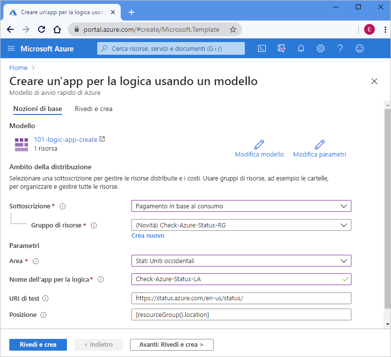

# <a name="quickstart-create-and-deploy-a-logic-app-workflow-by-using-an-arm-template"></a>Avvio rapido: Creare e distribuire un flusso di lavoro di app per la logica usando un modello di Resource Manager

[App per la logica di Azure](../logic-apps/logic-apps-overview.md) è un servizio cloud che consente di creare ed eseguire flussi di lavoro automatizzati che integrano dati, app, servizi basati sul cloud e sistemi locali con la possibilità di scegliere tra [centinaia di connettori](https://docs.microsoft.com/connectors/connector-reference/connector-reference-logicapps-connectors). Questa guida di avvio rapido descrive il processo di distribuzione di un modello di Azure Resource Manager per creare un'app per la logica di base che controlla lo stato di Azure in base a una pianificazione oraria. 

[!INCLUDE [About Azure Resource Manager](../../includes/resource-manager-quickstart-introduction.md)]

Se l'ambiente soddisfa i prerequisiti e si ha familiarità con l'uso dei modelli di Resource Manager, selezionare il pulsante **Distribuisci in Azure**. Il modello verrà aperto nel portale di Azure.

[](https://portal.azure.com/#create/Microsoft.Template/uri/https%3a%2f%2fraw.githubusercontent.com%2fAzure%2fazure-quickstart-templates%2fmaster%2f101-logic-app-create%2fazuredeploy.json)

## <a name="prerequisites"></a>Prerequisiti

Se non si ha una sottoscrizione di Azure, [creare un account Azure gratuito](https://azure.microsoft.com/free/?WT.mc_id=A261C142F) prima di iniziare.

## <a name="review-the-template"></a>Rivedere il modello

Questa guida di avvio rapido usa il modello [**Creare un'app per la logica**](https://azure.microsoft.com/resources/templates/101-logic-app-create/), disponibile nella [raccolta di modelli di avvio rapido di Azure](https://azure.microsoft.com/resources/templates). Questo modello è troppo lungo per essere mostrato qui. È invece possibile esaminare il ["file azuredeploy.json"](https://github.com/Azure/azure-quickstart-templates/blob/master/101-logic-app-create/azuredeploy.json) del modello di avvio rapido nella raccolta di modelli.

Il modello di avvio rapido crea un flusso di lavoro di app per la logica che usa il trigger di ricorrenza, impostato per essere eseguito ogni ora, e un'[azione *predefinita* HTTP](https://docs.microsoft.com/azure/connectors/apis-list#connector-types), che chiama un URL che restituisce lo stato di Azure. Un'azione predefinita è nativa della piattaforma di App per la logica di Azure.

Questo modello crea la risorsa di Azure seguente:

* [**Microsoft.Logic/workflows**](https://docs.microsoft.com/azure/templates/microsoft.logic/workflows), che crea il flusso di lavoro per un'app per la logica.

Per altri modelli di avvio rapido per app per la logica di Azure, vedere i modelli [Microsoft.Logic](https://azure.microsoft.com/resources/templates/?resourceType=Microsoft.Logic) nella raccolta.

<a name="deploy-template"></a>

## <a name="deploy-the-template"></a>Distribuire il modello

Seguire l'opzione che si vuole usare per la distribuzione del modello di avvio rapido:

| Opzione | Descrizione |
|--------|-------------|
| [Azure portal](../logic-apps/quickstart-create-deploy-azure-resource-manager-template.md?tabs=azure-portal#deploy-template) | Se l'ambiente Azure soddisfa i prerequisiti e si ha familiarità con l'uso dei modelli di Resource Manager, questa procedura consente di accedere direttamente ad Azure e aprire il modello di avvio rapido nel portale di Azure. Per altre informazioni, vedere [Distribuire le risorse con i modelli di Azure Resource Manager e il portale di Azure](../azure-resource-manager/templates/deploy-portal.md). |
| [Interfaccia della riga di comando di Azure](../logic-apps/quickstart-create-deploy-azure-resource-manager-template.md?tabs=azure-cli#deploy-template) | L'interfaccia della riga di comando di Azure è un set di comandi che consente di creare e gestire le risorse di Azure. Per eseguire questi comandi è necessaria l'interfaccia della riga di comando di Azure versione 2.6 o successiva. Per controllare la versione dell'interfaccia della riga di comando, digitare `az --version`. Per altre informazioni, vedere gli argomenti seguenti: <p><p>- [Cos'è l'interfaccia della riga di comando di Azure](https://docs.microsoft.com/cli/azure/what-is-azure-cli?view=azure-cli-latest) <br>- [Introduzione all'interfaccia della riga di comando di Azure](https://docs.microsoft.com/cli/azure/get-started-with-azure-cli?view=azure-cli-latest) |
| [Azure PowerShell](../logic-apps/quickstart-create-deploy-azure-resource-manager-template.md?tabs=azure-powershell#deploy-template) | Azure PowerShell offre un set di cmdlet che usano il modello Azure Resource Manager per la gestione delle risorse di Azure. Per altre informazioni, vedere gli argomenti seguenti: <p><p>- [Panoramica di Azure PowerShell](https://docs.microsoft.com/powershell/azure/azurerm/overview) <br>- [Presentazione del modulo Az di Azure PowerShell](https://docs.microsoft.com/powershell/azure/new-azureps-module-az) <br>- [Introduzione ad Azure PowerShell](https://docs.microsoft.com/powershell/azure/get-started-azureps) |
| [API REST di Gestione delle risorse di Azure](../logic-apps/quickstart-create-deploy-azure-resource-manager-template.md?tabs=rest-api#deploy-template) | Azure fornisce le API REST (Representational State Transfer), ovvero endpoint servizio che supportano le operazioni (metodi) HTTP che permettono di creare, recuperare, aggiornare o eliminare l'accesso alle risorse del servizio. Per altre informazioni, vedere [Introduzione alle API REST di Azure](https://docs.microsoft.com/rest/api/azure/). |
|||

<a name="deploy-azure-portal"></a>

#### <a name="portal"></a>[Portale](#tab/azure-portal)

1. Selezionare l'immagine seguente per accedere all'account Azure e aprire il modello di avvio rapido nel portale di Azure:

   [](https://portal.azure.com/#create/Microsoft.Template/uri/https%3a%2f%2fraw.githubusercontent.com%2fAzure%2fazure-quickstart-templates%2fmaster%2f101-logic-app-create%2fazuredeploy.json)

1. Nella pagina **Creare un'app per la logica usando un modello** del portale immettere o selezionare i valori seguenti:

   | Proprietà | valore | Descrizione |
   |----------|-------|-------------|
   | **Sottoscrizione** | <*nome sottoscrizione di Azure*> | Nome della sottoscrizione di Azure da usare. |
   | **Gruppo di risorse** | <*Azure-resource-group-name*> | Nome di un gruppo di risorse di Azure nuovo o esistente. In questo esempio viene utilizzato `Check-Azure-Status-RG`. |
   | **Area** | <*Area di Azure*> | Area del data center di Azure in cui verrà usata l'app per la logica. In questo esempio viene utilizzato `West US`. |
   | **Nome dell'app per la logica** | <*logic-app-name*> | Nome da usare per l'app per la logica. In questo esempio viene utilizzato `Check-Azure-Status-LA`. |
   | **URI di test** | <*test-URI*> | URI per il servizio da chiamare in base a una pianificazione specifica. Questo esempio usa `https://status.azure.com/en-us/status/`, ovvero la pagina stato di Azure. |
   | **Posizione** |  <*Azure-region-for-all-resources*> | Area di Azure da usare per tutte le risorse, se diversa dal valore predefinito. In questo esempio viene usato il valore predefinito, `[resourceGroup().location]`, che corrisponde alla località del gruppo di risorse. |
   ||||

   Di seguito è mostrato l'aspetto della pagina con i valori usati in questo esempio:

   

1. Al termine, selezionare **Rivedi e crea**.

1. Continuare con la procedura descritta in [Esaminare le risorse distribuite](#review-deployed-resources).

#### <a name="cli"></a>[CLI](#tab/azure-cli)

```azurecli-interactive
read -p "Enter a project name name to use for generating resource names:" projectName &&
read -p "Enter the location, such as 'westus':" location &&
templateUri="https://raw.githubusercontent.com/Azure/azure-quickstart-templates/master/101-logic-app-create/azuredeploy.json" &&
resourceGroupName="${projectName}rg" &&
az group create --name $resourceGroupName --location "$location" &&
az deployment group create --resource-group $resourceGroupName --template-uri  $templateUri &&
echo "Press [ENTER] to continue ..." &&
read
```

Per altre informazioni, vedere gli argomenti seguenti:

* [Interfaccia della riga di comando di Azure: az deployment group](https://docs.microsoft.com/cli/azure/deployment/group)
* [Distribuire le risorse con i modelli di Azure Resource Manager e l'interfaccia della riga di comando di Azure](../azure-resource-manager/templates/deploy-cli.md)

#### <a name="powershell"></a>[PowerShell](#tab/azure-powershell)

```azurepowershell-interactive
$projectName = Read-Host -Prompt "Enter a project name to use for generating resource names"
$location = Read-Host -Prompt "Enter the location, such as 'westus'"
$templateUri = "https://raw.githubusercontent.com/Azure/azure-quickstart-templates/master/101-logic-app-create/azuredeploy.json"

$resourceGroupName = "${projectName}rg"

New-AzResourceGroup -Name $resourceGroupName -Location "$location"
New-AzResourceGroupDeployment -ResourceGroupName $resourceGroupName -TemplateUri $templateUri

Read-Host -Prompt "Press [ENTER] to continue ..."
```

Per altre informazioni, vedere gli argomenti seguenti:

* [Azure PowerShell: New-AzResourceGroup](https://docs.microsoft.com/powershell/module/az.resources/new-azresourcegroup)
* [Azure PowerShell: New-AzResourceGroupDeployment](https://docs.microsoft.com/powershell/module/az.resources/new-azresourcegroupdeployment)
* [Distribuire le risorse con i modelli di Azure Resource Manager e Azure PowerShell](../azure-resource-manager/templates/deploy-powershell.md)

#### <a name="rest-api"></a>[REST API](#tab/rest-api)

1. Se non si vuole usare un gruppo di risorse di Azure esistente, crearne uno nuovo seguendo questa sintassi per la richiesta da inviare all'API REST di Gestione delle risorse:

   ```http
   PUT https://management.azure.com/subscriptions/{subscriptionId}/resourcegroups/{resourceGroupName}?api-version=2019-10-01
   ```

   | valore | Descrizione |
   |-------|-------------|
   | `subscriptionId`| GUID per la sottoscrizione di Azure da usare |
   | `resourceGroupName` | Nome del gruppo di risorse di Azure da creare. In questo esempio viene utilizzato `Check-Azure-Status-RG`. |
   |||

   Ad esempio:

   ```http
   PUT https://management.azure.com/subscriptions/xxxxXXXXxxxxXXXXX/resourcegroups/Check-Azure-Status-RG?api-version=2019-10-01
   ```

   Per altre informazioni, vedere gli argomenti seguenti:

   * [Informazioni di riferimento sull'API REST di Azure - Come chiamare le API REST di Azure](https://docs.microsoft.com/rest/api/azure/)
   * [API REST di Gestione delle risorse: Resource Groups - Create Or Update](https://docs.microsoft.com/rest/api/resources/resourcegroups/createorupdate).

1. Per distribuire il modello di avvio rapido nel gruppo di risorse, seguire questa sintassi per la richiesta da inviare all'API REST di Gestione delle risorse:

   ```http
   PUT https://management.azure.com/subscriptions/{subscriptionId}/resourcegroups/{resourceGroupName}/providers/Microsoft.Resources/deployments/{deploymentName}?api-version=2019-10-01
   ```

   | valore | Descrizione |
   |-------|-------------|
   | `subscriptionId`| GUID per la sottoscrizione di Azure da usare |
   | `resourceGroupName` | Nome del gruppo di risorse di Azure da usare. In questo esempio viene utilizzato `Check-Azure-Status-RG`. |
   | `deploymentName` | Nome da usare per la distribuzione. In questo esempio viene utilizzato `Check-Azure-Status-LA`. |
   |||

   Ad esempio:

   ```http
   PUT https://management.azure.com/subscriptions/xxxxXXXXxxxxXXXXX/resourcegroups/Check-Azure-Status-RG/providers/Microsoft.Resources/deployments/Check-Azure-Status-LA?api-version=2019-10-01
   ```

   Per altre informazioni, vedere [API REST di Gestione delle risorse: Deployments - Create Or Update](https://docs.microsoft.com/rest/api/resources/deployments/createorupdate).

1. Per specificare i valori da usare per la distribuzione, ad esempio l'area di Azure e i collegamenti al modello di avvio rapido e al [file dei parametri](../azure-resource-manager/templates/template-parameters.md), che contiene i valori per il modello di avvio rapido da usare per la distribuzione, seguire questa sintassi per il corpo della richiesta da inviare all'API REST di Gestione delle risorse:

   ```json
   {
      "location": "{Azure-region}",
      "properties": {
         "templateLink": {
            "uri": "{quickstart-template-URL}",
            "contentVersion": "1.0.0.0"
         },
         "parametersLink": {
            "uri": "{quickstart-template-parameter-file-URL}",
            "contentVersion": "1.0.0.0"
         },
         "mode": "Incremental"
      }
   }
   ```

   | Proprietà | valore | Descrizione |
   |----------|-------|-------------|
   | `location`| <*Area di Azure*> | Area di Azure da usare per la distribuzione. In questo esempio viene utilizzato `West US`. |
   | `templateLink`: `uri` | <*quickstart-template-URL*> | Percorso URL del modello di avvio rapido da usare per la distribuzione: <p><p>`https://raw.githubusercontent.com/Azure/azure-quickstart-templates/master/101-logic-app-create/azuredeploy.json`. |
   | `parametersLink`: `uri` | <*quickstart-template-parameter-file-URL*> | Percorso URL del file dei parametri del modello di avvio rapido da usare per la distribuzione: <p><p>`https://raw.githubusercontent.com/Azure/azure-quickstart-templates/master/101-logic-app-create/azuredeploy.parameters.json` <p><p>Per altre informazioni sul file dei parametri di Resource Manager, vedere questi argomenti: <p><p>- [Creare il file di parametri di Resource Manager](../azure-resource-manager/templates/parameter-files.md) <br>- [Esercitazione: Usare file di parametri per distribuire il modello di Resource Manager](../azure-resource-manager/templates/template-tutorial-use-parameter-file.md) |
   | `mode` | <*deployment-mode*> | Esegue un aggiornamento incrementale o un aggiornamento completo. Questo esempio usa `Incremental`, che è il valore predefinito. Per altre informazioni, vedere [Modalità di distribuzione di Azure Resource Manager](https://docs.microsoft.com/azure/azure-resource-manager/templates/deployment-modes). |
   |||

   Ad esempio:

   ```json
   {
      "location": "West US",
      "properties": {
         "templateLink": {
            "uri": "https://raw.githubusercontent.com/Azure/azure-quickstart-templates/master/101-logic-app-create/azuredeploy.json",
            "contentVersion": "1.0.0.0"
         },
         "parametersLink": {
            "uri": "https://raw.githubusercontent.com/Azure/azure-quickstart-templates/master/101-logic-app-create/azuredeploy.parameters.json",
            "contentVersion": "1.0.0.0"
         },
         "mode": "Incremental"
      }
   }
   ```

Per altre informazioni, vedere gli argomenti seguenti:

* [API REST di Gestione delle risorse](https://docs.microsoft.com/rest/api/resources/)
* [Distribuire le risorse con i modelli di Resource Manager e l'API REST di Resource Manager](../azure-resource-manager/templates/deploy-rest.md)

---

<a name="review-deployed-resources"></a>

## <a name="review-deployed-resources"></a>Esaminare le risorse distribuite

Per visualizzare l'app per la logica, è possibile usare il portale di Azure, eseguire uno script creato con l'interfaccia della riga di comando di Azure o Azure PowerShell o usare l'API REST dell'app per la logica.

### <a name="portal"></a>[Portale](#tab/azure-portal)

1. Nella casella di ricerca del portale di Azure immettere il nome dell'app per la logica, `Check-Azure-Status-LA` in questo esempio. Nell'elenco dei risultati selezionare l'app per la logica.

1. Nel portale di Azure trovare e selezionare l'app per la logica, `Check-Azure-Status-RG` in questo esempio.

1. Quando si apre la finestra Progettazione app per la logica, esaminare l'app per la logica creata dal modello di avvio rapido.

1. Per testare l'app per la logica, sulla barra degli strumenti della finestra di progettazione selezionare **Esegui**.

### <a name="cli"></a>[CLI](#tab/azure-cli)

```azurecli-interactive
echo "Enter your logic app name:" &&
read logicAppName &&
az logic workflow show --name $logicAppName &&
echo "Press [ENTER] to continue ..."
```

Per altre informazioni, vedere [Interfaccia della riga di comando di Azure: az logic workflow show](https://docs.microsoft.com/cli/azure/ext/logic/logic/workflow?view=azure-cli-latest#ext-logic-az-logic-workflow-show).

### <a name="powershell"></a>[PowerShell](#tab/azure-powershell)

```azurepowershell-interactive
$logicAppName = Read-Host -Prompt "Enter your logic app name"
Get-AzLogicApp -Name $logicAppName
Write-Host "Press [ENTER] to continue..."
```

Per altre informazioni, vedere [Azure PowerShell: Get-AzLogicApp](https://docs.microsoft.com/powershell/module/az.logicapp/get-azlogicapp).

### <a name="rest-api"></a>[REST API](#tab/rest-api)

```http
GET https://management.azure.com/subscriptions/{subscriptionId}/resourceGroups/{resourceGroupName}/providers/Microsoft.Logic/workflows/{workflowName}?api-version=2016-06-01
```

| valore | Descrizione |
|-------|-------------|
| `subscriptionId`| GUID della sottoscrizione di Azure in cui è stato distribuito il modello di avvio rapido. |
| `resourceGroupName` | Nome del gruppo di risorse di Azure in cui è stato distribuito il modello di avvio rapido. In questo esempio viene utilizzato `Check-Azure-Status-RG`. |
| `workflowName` | Il nome dell'app per la logica distribuita. In questo esempio viene utilizzato `Check-Azure-Status-LA`. |
|||

Ad esempio:

```http
GET https://management.azure.com/subscriptions/xxxxXXXXxxxxXXXXX/resourceGroups/Check-Azure-Status-RG/providers/Microsoft.Logic/workflows/Check-Azure-Status-LA?api-version=2016-06-01
```

Per altre informazioni, vedere [API REST di App per la logica: Workflows - Get](https://docs.microsoft.com/rest/api/logic/workflows/get).

---

## <a name="clean-up-resources"></a>Pulire le risorse

Se si prevede di usare le guide di avvio rapido e le esercitazioni successive, è consigliabile mantenere le risorse create. Quando l'app per la logica non è più necessaria, eliminare il gruppo di risorse usando il portale di Azure, l'interfaccia della riga di comando di Azure, Azure PowerShell o l'API REST di Gestione delle risorse.

### <a name="portal"></a>[Portale](#tab/azure-portal)

1. Nel portale di Azure trovare e selezionare il gruppo di risorse da eliminare, `Check-Azure-Status-RG` in questo esempio.

1. Nel menu del gruppo di risorse scegliere **Panoramica**, se l'opzione non è già selezionata. Nella pagina Panoramica selezionare **Elimina gruppo di risorse**.

1. Per confermare, immettere il nome del gruppo di risorse.

Per altre informazioni, vedere [Eliminare un gruppo di risorse](../azure-resource-manager/management/delete-resource-group.md?tabs=azure-portal#delete-resource-group).

### <a name="cli"></a>[CLI](#tab/azure-cli)

```azurecli-interactive
echo "Enter your resource group name:" &&
read resourceGroupName &&
az group delete --name $resourceGroupName &&
echo "Press [ENTER] to continue ..."
```

Per altre informazioni, vedere [Interfaccia della riga di comando di Azure: az group delete](https://docs.microsoft.com/cli/azure/group?view=azure-cli-latest#az-group-delete).

### <a name="powershell"></a>[PowerShell](#tab/azure-powershell)

```azurepowershell-interactive
$resourceGroupName = Read-Host -Prompt "Enter the resource group name"
Remove-AzResourceGroup -Name $resourceGroupName
Write-Host "Press [ENTER] to continue..."
```

Per altre informazioni, vedere [Azure PowerShell: Remove-AzResourceGroup](https://docs.microsoft.com/powershell/module/azurerm.resources/remove-azurermresourcegroup).

### <a name="rest-api"></a>[REST API](#tab/rest-api)

```http
DELETE https://management.azure.com/subscriptions/{subscriptionId}/resourcegroups/{resourceGroupName}?api-version=2019-10-01
```

| valore | Descrizione |
|-------|-------------|
| `subscriptionId`| GUID della sottoscrizione di Azure in cui è stato distribuito il modello di avvio rapido. |
| `resourceGroupName` | Nome del gruppo di risorse di Azure in cui è stato distribuito il modello di avvio rapido. In questo esempio viene utilizzato `Check-Azure-Status-RG`. |
|||

Ad esempio:

```http
GET https://management.azure.com/subscriptions/xxxxXXXXxxxxXXXXX/resourceGroups/Check-Azure-Status-RG?api-version=2019-10-01
```

Per altre informazioni, vedere [API REST di Gestione delle risorse: Resource Groups - Delete](https://docs.microsoft.com/rest/api/resources/resourcegroups/delete).

---

## <a name="next-steps"></a>Passaggi successivi

> [!div class="nextstepaction"]
> [Esercitazione: Creare e distribuire il primo modello di Resource Manager](../azure-resource-manager/templates/template-tutorial-create-first-template.md)