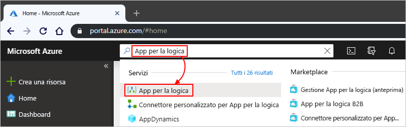
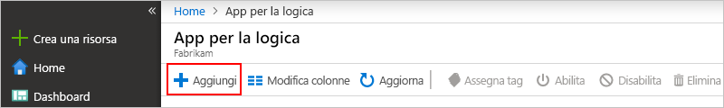
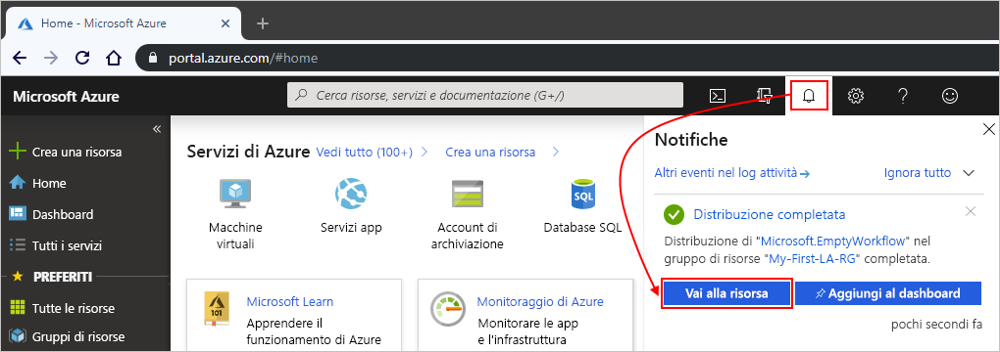
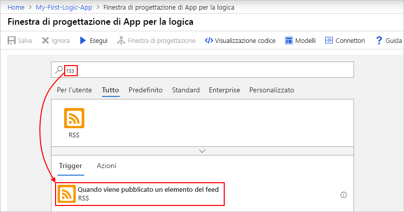
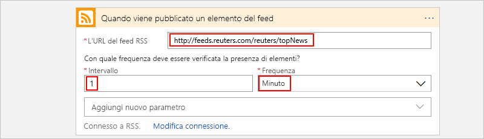
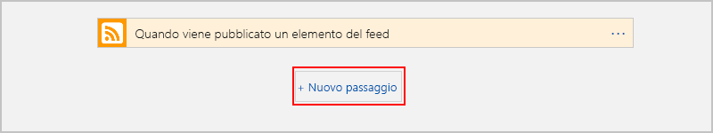

# Avvio rapido: Creare il primo flusso di lavoro di App per la logica - Portale di Azure

Questa guida di avvio rapido illustra come creare il primo flusso di lavoro in [App per la logica di Azure](logic-apps-overview.md) tramite il [portale di Azure](https://portal.azure.com). Questa guida introduttiva illustra anche i concetti di base del servizio App per la logica, ad esempio come creare una nuova app per la logica, aggiungere un trigger e un'azione all'app per la logica e testare l'app per la logica. Seguire questa guida di avvio rapido per compilare un'app per la logica di esempio che controlla regolarmente un feed RSS e invia una notifica tramite posta elettronica per i nuovi elementi. Lo screenshot seguente illustra il flusso di lavoro generale di questa app per la logica di esempio:

Per informazioni su come creare e gestire la prima app per la logica tramite altre interfacce e app, vedere le altre guide di avvio rapido di App per la logica seguenti: 

* [Creare e gestire app per la logica usando l'interfaccia della riga di comando di Azure](quickstart-logic-apps-azure-cli.md)
* [Creare e gestire app per la logica in Visual Studio Code](quickstart-create-logic-apps-visual-studio-code.md)
* [Creare e gestire app per la logica in Visual Studio](quickstart-create-logic-apps-with-visual-studio.md)

## Prerequisiti

* Una sottoscrizione di Azure. Se non si ha una sottoscrizione, [iscriversi per un account Azure gratuito](https://azure.microsoft.com/free/?WT.mc_id=A261C142F).
* Un account di posta elettronica da un servizio supportato da App per la logica, ad esempio Office 365 Outlook o Outlook.com. Per altri provider di posta elettronica supportati, [vedere l'elenco dei connettori](/connectors/).

    > [!IMPORTANT]
    > Se si usa il [connettore Gmail](/connectors/gmail/), tenere presente che solo gli account G Suite Business possono usare questo connettore senza restrizioni nelle app per la logica. Se si dispone di un account Gmail consumer, è possibile usare questo connettore solo con servizi approvati da Google specifici oppure è possibile [creare un'app client Google da usare per l'autenticazione con il connettore Gmail](/connectors/gmail/#authentication-and-bring-your-own-application). Per altre informazioni, vedere [Informative sulla privacy e sulla sicurezza dei dati per i connettori Google in App per la logica di Azure](../connectors/connectors-google-data-security-privacy-policy.md).

## Creare l'app per la logica

1. Accedere al [portale di Azure](https://portal.azure.com) con le credenziali dell'account Azure.

1. Nella casella di ricerca del portale di Azure immettere `logic apps` e selezionare **App per la logica**.

   

1. Nella pagina **App per la logica** selezionare **Aggiungi**.

   

1. Nel riquadro **App per la logica** specificare i dettagli e le impostazioni di base per l'app per la logica. Creare un nuovo [gruppo di risorse](../azure-resource-manager/management/overview.md#terminology) ai fini di questa app per la logica di esempio.
    
   | Proprietà | Valore | Descrizione |
   |----------|-------|-------------|
   | **Nome** | <*logic-app-name*> | Nome dell'app per la logica, che deve essere univoco tra le aree. Il nome può contenere solo lettere, numeri, trattini (`-`), caratteri di sottolineatura (`_`), parentesi (`(`, `)`) e punti (`.`). Questo esempio usa "My-First-Logic-app". |
   | **Sottoscrizione** | <*nome sottoscrizione di Azure*> | Nome della sottoscrizione di Azure. |
   | **Gruppo di risorse** | <*Azure-resource-group-name*> | Nome del [gruppo di risorse di Azure](../azure-resource-manager/management/overview.md#terminology) in cui verrà creata l'app per la logica. Il nome del gruppo di risorse deve essere univoco tra le aree. Questo esempio usa "My-First-LA-RG". |
   | **Posizione** | <*Area di Azure*> | Area di Azure in cui archiviare le informazioni sull'app per la logica. Questo esempio usa "Stati Uniti occidentali". |
   | **Log Analytics** | Disattivato | Impostazione per la registrazione diagnostica, che è impostata su **No** per impostazione predefinita. Per questo esempio, mantenere l'impostazione **No**. |
   ||||

   

1. Al termine, selezionare **Rivedi e crea**. Verificare i dettagli specificati e selezionare **Crea**.

1. Dopo che Azure distribuisce correttamente l'app, fare clic su **Vai alla risorsa**. In alternativa, è possibile trovare e selezionare l'app per la logica digitando il nome nella casella di ricerca.

   

   Viene visualizzata la finestra Progettazione app per la logica, che mostra una pagina con un video introduttivo e i trigger più usati. In **Modelli** selezionare **App per la logica vuota**.

   

A questo punto, [aggiungere un trigger all'app per la logica](#add-rss-trigger).

## Aggiungere il trigger RSS

Ogni app per la logica deve essere avviata con un [trigger](../logic-apps/logic-apps-overview.md#how-do-logic-apps-work), che viene attivato quando si verifica un determinato evento o quando viene soddisfatta una condizione specifica. Ogni volta che il trigger trova nuovi elementi viene attivato e il motore di App per la logica crea un'istanza dell'app per la logica che viene avviata e che esegue il flusso di lavoro. Se il trigger non trova nuovi elementi, non viene attivato e non crea e non esegue un'istanza del flusso di lavoro in corrispondenza di questo controllo.

In questo esempio dell'avvio rapido, dopo aver [creato un'app per la logica](#create-your-logic-app), si aggiunge un trigger che verifica la presenza di nuovi elementi in un feed RSS e viene attivato quando rileva nuovi elementi. È anche possibile creare app per la logica con diversi tipi di trigger, come illustrato nell'esercitazione per la [creazione di flussi di lavoro automatici basati su approvazione](tutorial-process-mailing-list-subscriptions-workflow.md).

1. In **Progettazione app per la logica** nella casella di ricerca selezionare **Tutti**.

1. Per trovare il connettore RSS, nella casella di ricerca immettere `rss`. Dall'elenco **Trigger** selezionare il trigger RSS **Quando viene pubblicato un elemento del feed**.

   

1. Fornire l'URL del feed RSS per il trigger. Definire quindi la pianificazione del trigger impostando l'intervallo e la frequenza.

   | Proprietà | Valore | Descrizione |
   | -------- | ----- | ----------- |
   | **URL feed RSS** | <*RSS-feed-URL*> | URL del feed RSS che si vuole monitorare. Questo esempio usa il feed RSS di Wall Street Journal all'indirizzo `https://feeds.a.dj.com/rss/RSSMarketsMain.xml`. Tuttavia, ai fini di questo esempio, è possibile usare qualsiasi feed RSS che non richieda l'autorizzazione HTTP. Scegliere un feed RSS con una frequenza di pubblicazione elevata, in modo da poter testare l'app per la logica con facilità in un secondo momento. |
   | **Interval** | 1 | Numero di intervalli di attesa tra i controlli del feed RSS. Questo esempio usa intervalli di 1 minuto. |
   | **Frequenza** | Minuto | Unità di tempo per ogni intervallo tra i controlli del feed RSS. Questo esempio usa intervalli di 1 minuto. |
   ||||

   

1. Per il momento, comprimere i dettagli del trigger facendo clic all'interno della barra del titolo.

   

1. Salvare l'app per la logica selezionando **Salva** sulla barra degli strumenti della finestra di progettazione.

L'app per la logica è ora attiva, ma non esegue alcuna operazione oltre a controllare il feed RSS. A questo punto, [aggiungere un'azione](#add-email-action) per definire cosa accade quando viene attivato il trigger.

## Aggiungere l'azione di "invio messaggio di posta elettronica"

Dopo aver [aggiunto un trigger per l'app per la logica](#add-rss-trigger), è necessario aggiungere un'[azione](../logic-apps/logic-apps-overview.md#logic-app-concepts) per determinare la risposta quando l'app per la logica controlla il feed RSS e viene individuato un nuovo elemento. È anche possibile creare app per la logica con azioni molto più complesse, come illustrato nell'esercitazione per l'[elaborazione di messaggi di posta elettronica con App per la logica, Funzioni di Azure e Archiviazione di Azure](/tutorial-process-email-attachments-workflow.md).

> [!NOTE]
> Questo esempio usa Office 365 Outlook come servizio di posta elettronica. Se si usa un altro servizio di posta elettronica supportato nell'app per la logica, l'interfaccia utente potrebbe avere un aspetto diverso. Tuttavia, i concetti di base per la connessione a un altro servizio di posta elettronica restano invariati.

1. Nel trigger **Quando viene pubblicato un elemento del feed** selezionare **Nuovo passaggio**.

   

1. In **Scegliere un'azione** e nella casella di ricerca selezionare **Tutte**.

1. Nella casella di ricerca immettere `send an email` per trovare i connettori che offrono questa azione. Per filtrare l'elenco di azioni in base a un'app o a un servizio specifico, è possibile selezionare prima l'app o il servizio.

   Ad esempio, se si usa un account aziendale o dell'istituto di istruzione Microsoft e si vuole usare Office 365 Outlook, selezionare **Office 365 Outlook**. Se invece si usa un account Microsoft personale, è possibile selezionare Outlook.com. Questo esempio continua con Office 365 Outlook:

   

   È ora possibile trovare e selezionare più facilmente l'azione che si vuole usare, ad esempio `send an email`:

   

1. Se il connettore di posta elettronica selezionato richiede di autenticare l'identità, completare il passaggio adesso. Per il corretto funzionamento di questo esempio, è necessario creare una connessione tra l'app per la logica e il servizio di posta elettronica. 

    > [!NOTE]
    > Questo esempio illustra l'autenticazione manuale per il connettore Office 365 Outlook. Altri connettori potrebbero tuttavia supportare tipi di autenticazione diversi.
    > È anche possibile gestire l'autenticazione per le app per la logica in modi diversi, a seconda del caso d'uso. Ad esempio, quando si usano modelli di Azure Resource Manager per la distribuzione, è possibile impostare parametri per migliorare la sicurezza degli input che cambiano di frequente, ad esempio i dettagli della connessione. Per altre informazioni, vedere gli argomenti seguenti:
   > * [Parametri del modello per la distribuzione](../logic-apps/logic-apps-azure-resource-manager-templates-overview.md#template-parameters)
   > * [Autorizzare le connessioni OAuth](../logic-apps/logic-apps-deploy-azure-resource-manager-templates.md#authorize-oauth-connections)
   > * [Eseguire l'autenticazione dell'accesso con le identità gestite](../logic-apps/create-managed-service-identity.md)
   > * [Eseguire l'autenticazione delle connessioni per la distribuzione di app per la logica](../logic-apps/logic-apps-azure-resource-manager-templates-overview.md#authenticate-connections)

1. Nell'azione **Invia un messaggio di posta elettronica** specificare le informazioni da includere nella notifica tramite posta elettronica.

   1. Nella casella **A** immettere l'indirizzo di posta elettronica del destinatario. Per questo esempio, usare il proprio indirizzo di posta elettronica.

        > [!NOTE]
        > Quando si fa clic all'interno della casella **A** e di altre caselle di input nella finestra Progettazione app per la logica, viene visualizzato l'elenco **Aggiungi contenuto dinamico**. Questo esempio userà il contenuto dinamico in un passaggio successivo. L'elenco **Aggiungi contenuto dinamico** mostra gli output del passaggio precedente disponibili che è possibile usare come input per l'azione corrente.

   1. Nella casella **Oggetto** immettere l'oggetto per la notifica tramite posta elettronica. Per questo esempio, immettere il testo seguente con uno spazio vuoto finale: `New RSS item: `

      

   1. Dall'elenco **Aggiungi contenuto dinamico** selezionare **Titolo feed** , che viene fornito come output dal trigger **Quando viene pubblicato un elemento del feed**. La notifica tramite posta elettronica usa questo output per ottenere il titolo dell'elemento del feed RSS.

      

      > [!TIP]
      > Nell'elenco del contenuto dinamico, se non viene visualizzato alcun output dal trigger **Quando viene pubblicato un elemento del feed** , accanto all'intestazione dell'azione selezionare **Mostra più**.
      > 
      > 

      Al termine dell'operazione, l'oggetto del messaggio sarà simile al seguente:

      

      Se nella finestra di progettazione viene visualizzato un ciclo "For each", è stato selezionato un token per una matrice, ad esempio il token **categories-Item**. Per questi tipi di token la finestra di progettazione aggiunge automaticamente questo ciclo intorno all'azione che fa riferimento a tale token. In questo modo, l'app per la logica esegue la stessa azione su ogni elemento della matrice. Per rimuovere il ciclo, selezionare i **puntini di sospensione** ( **...** ) nella barra del titolo del ciclo e quindi scegliere **Elimina**.

   1. Nella casella **Corpo** immettere il contenuto del corpo del messaggio di posta elettronica. In questo esempio il contenuto include tre proprietà con un testo descrittivo per ognuna di esse: `Title:`, la proprietà **Titolo del feed** ; `Date published:`, la proprietà **Data di pubblicazione del feed** e `Link:`, la proprietà **Collegamento al feed primario**. Per aggiungere righe vuote in una casella di modifica, premere MAIUSC+INVIO.

      | Proprietà | Descrizione |
      |----------|-------------|
      | **Titolo feed** | Titolo dell'elemento |
      | **Data di pubblicazione del feed** | Data e ora di pubblicazione dell'elemento |
      | **Collegamento al feed primario** | URL dell'elemento |
      |||

      

1. Salvare l'app per la logica. Selezionare **Salva** dal menu della finestra di progettazione.

A questo punto, [verificare che l'app per la logica funzioni](#test-logic-app).

## Eseguire l'app per la logica

Dopo aver creato l'app per la logica di esempio, verificare che il flusso di lavoro sia configurato correttamente. È possibile attendere che l'app per la logica controlli il feed RSS in base alla pianificazione specificata. In alternativa, è possibile eseguire manualmente l'app per la logica selezionando **Esegui** sulla barra degli strumenti della finestra Progettazione app per la logica, come illustrato nello screenshot seguente. 

Se il feed RSS include nuovi elementi, l'app per la logica invia un messaggio di posta elettronica per ogni nuovo elemento. In caso contrario, l'app per la logica attende l'intervallo successivo prima di controllare di nuovo il feed RSS. 

Lo screenshot seguente mostra una notifica tramite posta elettronica di esempio da questa app per la logica di esempio. Il messaggio di posta elettronica include i dettagli per ogni elemento del feed RSS selezionato nella finestra di progettazione, nonché il testo descrittivo aggiunto per ogni elemento.

Se non si ricevono messaggi di posta elettronica di notifica dall'app per la logica come previsto:

* Controllare la cartella della posta indesiderata dell'account di posta elettronica per verificare che il messaggio non sia stato filtrato in modo errato.
* Assicurarsi che nel feed RSS siano stati pubblicati nuovi elementi dall'ultimo controllo pianificato o manuale.

## Pulire le risorse

Dopo aver testato questa app per la logica di esempio, pulire l'app per la logica e le eventuali risorse correlate eliminando il gruppo di risorse creato per questo esempio.

> [!NOTE]
> Quando si [elimina un'app per la logica](manage-logic-apps-with-azure-portal.md#delete-logic-apps), non vengono più create istanze di nuove esecuzioni. Tutte le esecuzioni in corso e in sospeso vengono annullate. Se si dispone di migliaia di esecuzioni, l'annullamento potrebbe richiedere molto tempo.

1. Nella casella di ricerca di Azure immettere `resource groups` e quindi selezionare **Gruppi di risorse**.

   

1. Trovare e selezionare il gruppo di risorse dell'app per la logica. Nel riquadro **Panoramica** selezionare **Elimina gruppo di risorse**.

   

1. Quando viene visualizzato il riquadro di conferma immettere il nome del gruppo di risorse e selezionare **Elimina**.

   

## Passaggi successivi

In questa guida di avvio rapido è stata creata la prima app per la logica nel portale di Azure per controllare gli aggiornamenti di un feed RSS in base a una pianificazione e inviare una notifica tramite posta elettronica per ogni nuovo elemento del feed. 

Per informazioni su come creare flussi di lavoro basati su pianificazione più avanzati in App per la logica, vedere l'esercitazione seguente:

> [!div class="nextstepaction"]
> [Controllare il traffico con un'app per la logica basata su utilità di pianificazione](../logic-apps/tutorial-build-schedule-recurring-logic-app-workflow.md)
