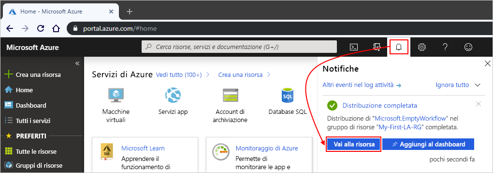

# <a name="quickstart-create-your-first-automated-workflow-with-azure-logic-apps---azure-portal"></a>Guida introduttiva: Creare il primo flusso di lavoro automatizzato con App per la logica di Azure - Portale di Azure

Questa guida introduttiva spiega come creare il primo flusso di lavoro automatizzato con [App per la logica di Azure](../logic-apps/logic-apps-overview.md). In questo articolo viene creata un'app per la logica che verifica la presenza di nuovi elementi nel feed RSS di un sito Web a intervalli regolari. Se sono presenti nuovi elementi, l'app per la logica invia un messaggio di posta elettronica per ogni elemento. Al termine, a livello generale l'app per la logica dovrebbe avere un flusso di lavoro simile al seguente:


Per seguire questa guida introduttiva, è necessario un account di posta elettronica di un provider supportato da App per la logica, come Office 365 Outlook, Outlook.com o Gmail. Per altri provider, [vedere qui l'elenco dei connettori](https://docs.microsoft.com/connectors/). Questa app per la logica usa un account Office 365 Outlook. Se si usa un altro account di posta elettronica, la procedura generale resta invariata, ma l'interfaccia utente potrebbe essere leggermente diversa.

Se inoltre non si ha una sottoscrizione di Azure, è necessario [iscriversi per creare un account Azure gratuito](https://azure.microsoft.com/free/).

## <a name="sign-in-to-the-azure-portal"></a>Accedere al portale di Azure

Accedere al [portale di Azure](https://portal.azure.com) con le credenziali dell'account Azure.

## <a name="create-your-logic-app"></a>Creare l'app per la logica

1. Dal menu principale di Azure selezionare **Crea una risorsa** > **Integrazione** > **App per la logica**.

   

1. In **Crea app per la logica** specificare i dettagli sull'app per la logica come mostrato di seguito. Al termine, selezionare **Crea**.

   

   | Proprietà | Valore | DESCRIZIONE |
   |----------|-------|-------------|
   | **Nome** | <*logic-app-name*> | Il nome dell'app per la logica, che può contenere solo lettere, numeri, trattini (`-`), caratteri di sottolineatura (`_`), parentesi (`(`, `)`) e punti (`.`). Questo esempio usa "My-First-Logic-app". |
   | **Sottoscrizione** | <*nome sottoscrizione di Azure*> | Il nome della sottoscrizione di Azure |
   | **Gruppo di risorse** | <*Azure-resource-group-name*> | Nome del [gruppo di risorse di Azure](../azure-resource-manager/resource-group-overview.md) usato per organizzare le risorse correlate. Questo esempio usa "My-First-LA-RG". |
   | **Posizione** | <*Area di Azure*> | L'area in cui archiviare le informazioni sull'app per la logica. Questo esempio usa "Stati Uniti occidentali". |
   | **Log Analytics** | Off | Lasciare l'impostazione **No** per la registrazione diagnostica. |
   ||||

1. Dopo che Azure ha distribuito l'app, sulla barra degli strumenti di Azure selezionare **Notifiche** > **Vai alla risorsa** per l'app per la logica distribuita.

   

   In alternativa, è possibile trovare e selezionare l'app per la logica digitando il nome nella casella di ricerca.

   Viene visualizzata la finestra Progettazione app per la logica, che mostra una pagina con un video introduttivo e i trigger più usati. In **Modelli** selezionare **App per la logica vuota**.

   

Aggiungere quindi un [trigger](../logic-apps/logic-apps-overview.md#logic-app-concepts) che attiva il flusso di lavoro quando nel feed RSS è presente un nuovo elemento. Ogni app per la logica deve essere avviata con un trigger, che viene attivato quando si verifica un determinato evento o quando viene soddisfatta una condizione specifica. Ogni volta che il trigger viene attivato, il motore di App per la logica crea un'istanza dell'app per la logica che si avvia ed esegue il flusso di lavoro.

<a name="add-rss-trigger"></a>

## <a name="check-rss-feed-with-a-trigger"></a>Controllare il feed RSS con un trigger

1. In Progettazione app per la logica selezionare **Tutti** sotto la casella di ricerca.

1. Nella casella di ricerca immettere "rss". Nell'elenco di trigger selezionare questo trigger: **Quando viene pubblicato un elemento del feed - RSS**

   

1. Specificare queste informazioni per il trigger, come mostrato e descritto di seguito:

   

   | Proprietà | Valore | DESCRIZIONE |
   |----------|-------|-------------|
   | **URL feed RSS** | ```http://feeds.reuters.com/reuters/topNews``` | Collegamento per il feed RSS che si vuole monitorare |
   | **Interval** | 1 | Numero di intervalli di attesa tra i controlli |
   | **Frequenza** | Minuto | Unità di tempo per ogni intervallo tra i controlli  |
   ||||

   La combinazione di intervallo e frequenza consente di definire la pianificazione per il trigger dell'app per la logica. Questa app per la logica controlla il feed ogni minuto.

1. Per nascondere i dettagli del trigger per il momento, fare clic sulla barra del titolo del trigger.

   

1. Salvare l'app per la logica. Sulla barra degli strumenti della finestra di progettazione selezionare **Salva**.

L'app per la logica è ora attiva, ma non esegue alcuna operazione oltre a controllare il feed RSS. Aggiungere quindi un'azione per la risposta all'attivazione del trigger.

## <a name="send-email-with-an-action"></a>Inviare messaggi di posta elettronica con un'azione

Aggiungere ora un'[azione](../logic-apps/logic-apps-overview.md#logic-app-concepts) per l'invio di un messaggio di posta elettronica quando compaiono nuovi elementi nel feed RSS.

1. Nel trigger **Quando viene pubblicato un elemento del feed** selezionare **Nuovo passaggio**.

   

1. In **Scegliere un'azione** e nella casella di ricerca selezionare **Tutte**.

1. Nella casella di ricerca immettere "invia un messaggio di posta elettronica". Nell'elenco di azioni selezionare l'azione "invia un messaggio di posta elettronica" per il provider di posta elettronica desiderato.

   

   Per filtrare l'elenco di azioni in base a un'app o a un servizio specifico, si può selezionare prima l'app o il servizio:

   * Per un account aziendale o dell'istituto di istruzione di Azure, selezionare Office 365 Outlook.
   * Per gli account Microsoft personali, selezionare Outlook.com.

1. Se viene chiesto di immettere le credenziali, accedere all'account di posta elettronica in modo che App per la logica crei una connessione all'account.

1. Nell'azione **Invia un messaggio di posta elettronica** specificare i dati da includere nel messaggio.

   1. Nella casella **A** immettere l'indirizzo di posta elettronica del destinatario. AI fini del test delle app è possibile indicare il proprio indirizzo di posta elettronica.

      Per il momento ignorare l'elenco **Aggiungi contenuto dinamico** che viene visualizzato. Quando si fa clic all'interno di alcune caselle di modifica, viene visualizzato questo elenco che mostra tutti i parametri disponibili del passaggio precedente che è possibile includere come input nel flusso di lavoro.

   1. Nella casella **Oggetto** immettere questo testo seguito da uno spazio vuoto: ```New RSS item:```

      

   1. Nell'elenco **Aggiungi contenuto dinamico** selezionare **Titolo feed** per includere il titolo dell'elemento RSS.

      

      Al termine dell'operazione, l'oggetto del messaggio sarà simile al seguente:

      

      Se nella finestra di progettazione viene visualizzato un ciclo "For each", è stato selezionato un token per una matrice, ad esempio il token **categories-item**. Per questi tipi di token la finestra di progettazione aggiunge automaticamente questo ciclo intorno all'azione che fa riferimento a tale token. In questo modo, l'app per la logica esegue la stessa azione su ogni elemento della matrice. Per rimuovere il ciclo, selezionare i **puntini di sospensione** ( **...** ) nella barra del titolo del ciclo e quindi scegliere **Elimina**.

   1. Nella casella **Corpo** immettere questo testo e selezionare questi token per il corpo del messaggio di posta elettronica. Per aggiungere righe vuote in una casella di modifica, premere MAIUSC+INVIO.

      

      | Proprietà | DESCRIZIONE |
      |----------|-------------|
      | **Titolo feed** | Titolo dell'elemento |
      | **Data di pubblicazione del feed** | Data e ora di pubblicazione dell'elemento |
      | **Collegamento al feed primario** | URL dell'elemento |
      |||

1. Salvare l'app per la logica.

Testare quindi l'app per la logica.

## <a name="run-your-logic-app"></a>Eseguire l'app per la logica

Per avviare manualmente l'app per la logica, sulla barra degli strumenti della finestra di progettazione selezionare **Esegui**. In alternativa, attendere che l'app per la logica controlli il feed RSS in base alla pianificazione specificata (ogni minuto). Se il feed RSS include nuovi elementi, l'app per la logica invia un messaggio di posta elettronica per ogni nuovo elemento. In caso contrario, l'app per la logica attende l'intervallo successivo prima di controllare di nuovo. Se non si riceve alcun messaggio di posta elettronica, controllare la cartella della posta indesiderata.

Ecco un esempio di messaggio di posta elettronica inviato dall'app per la logica.


Da un punto di vista tecnico, quando il trigger controlla il feed RSS e trova nuovi elementi, il trigger viene attivato e il motore di App per la logica crea un'istanza del flusso di lavoro dell'app per la logica che esegue le azioni del flusso di lavoro. Se il trigger non trova nuovi elementi, non viene attivato e non crea un'istanza del flusso di lavoro.

Sono state completate la creazione e l'esecuzione della prima app per la logica con il portale di Azure.

## <a name="clean-up-resources"></a>Pulire le risorse

Quando questo esempio non è più necessario, eliminare il gruppo di risorse contenente l'app per la logica e le risorse correlate.

1. Nel menu principale di Azure selezionare **Gruppi di risorse** e quindi il gruppo di risorse dell'app per la logica. Nel riquadro **Panoramica** selezionare **Elimina gruppo di risorse**.

   

1. Immettere il nome del gruppo di risorse per conferma e selezionare **Elimina**.

   

> [!NOTE]
> Quando si elimina un'app per la logica, non viene eseguita alcuna nuova istanza di esecuzione. Tutte le esecuzioni in corso e in sospeso vengono annullate. Se si dispone di migliaia di esecuzioni, l'annullamento potrebbe richiedere molto tempo.

## <a name="get-support"></a>Supporto

In caso di domande, visitare il [forum di App per la logica di Azure](https://social.msdn.microsoft.com/Forums/home?forum=azurelogicapps).

## <a name="next-steps"></a>Passaggi successivi

In questa esercitazione è stata creata la prima app per la logica che verifica la presenza di aggiornamenti del feed RSS in base alla pianificazione specificata (ogni minuto) ed esegue un'azione (invio di un messaggio di posta elettronica) quando sono presenti aggiornamenti. Per altre informazioni, continuare con questa esercitazione che consente di creare flussi di lavoro più avanzati basati sulla pianificazione:

> [!div class="nextstepaction"]
> [Controllare il traffico con un'app per la logica basata su utilità di pianificazione](../logic-apps/tutorial-build-schedule-recurring-logic-app-workflow.md)
