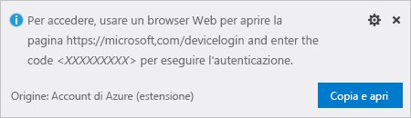

# <a name="quickstart-create-and-manage-logic-app-workflow-definitions-with-visual-studio-code"></a>Guida introduttiva: Creare e gestire le definizioni dei flussi di lavoro delle app per la logica con Visual Studio Code

Con [App per la logica di Azure](../logic-apps/logic-apps-overview.md) e Visual Studio Code, è possibile creare e gestire app per la logica che consentono di automatizzare attività, flussi di lavoro e processi per l'integrazione di app, dati, sistemi e servizi tra aziende e organizzazioni. Questa guida di avvio rapido illustra come è possibile creare e modificare definizioni dei flussi di lavoro sottostanti che usano JavaScript Object Notation (JSON) per le app per la logica tramite un'esperienza basata su codice. È anche possibile usare le app per la logica esistenti già distribuite in Azure.

Anche se è possibile eseguire queste stesse attività nel [portale di Azure](https://portal.azure.com) e in Visual Studio, quando si ha già familiarità con le app per la logica e si vuole lavorare direttamente nel codice, Visual Studio Code permette di iniziare più velocemente. È ad esempio possibile disabilitare, abilitare, eliminare e aggiornare le app per la logica già create. Inoltre, è possibile lavorare con app per la logica e account di integrazione da qualsiasi piattaforma di sviluppo che supporta l'esecuzione di Visual Studio Code, ad esempio Linux, Windows e Mac.

Per questo articolo è possibile creare la stessa app per la logica da questa [guida di avvio rapido](../logic-apps/quickstart-create-first-logic-app-workflow.md), che è maggiormente incentrata sui concetti di base. In Visual Studio Code l'app per la logica è simile a questo esempio:


Prima di iniziare, verificare di avere gli elementi seguenti:

* Se non si ha una sottoscrizione di Azure, [iscriversi per creare un account Azure gratuito](https://azure.microsoft.com/free/).

* Conoscenza di base delle [definizioni dei flussi di lavoro delle app per la logica](../logic-apps/logic-apps-workflow-definition-language.md) e relativa struttura come descritto con JSON

  Se non si ha familiarità con le app per la logica, provare questa [guida di avvio rapido](../logic-apps/quickstart-create-first-logic-app-workflow.md), che crea la prima app per la logica nel portale di Azure ed è maggiormente incentrata sui concetti di base.

* Accesso al Web per accedere ad Azure e alla sottoscrizione di Azure

* Scaricare e installare questi strumenti, se non sono già disponibili:

  * [Visual Studio Code versione 1.25.1 o successiva](https://code.visualstudio.com/), disponibile gratuitamente

  * Estensione Visual Studio Code per App per la logica di Azure

    È possibile scaricare e installare questa estensione da [Visual Studio Marketplace](https://marketplace.visualstudio.com/items?itemName=ms-azuretools.vscode-logicapps) o direttamente dall'interno di Visual Studio Code. Assicurarsi di ricaricare Visual Studio Code dopo l'installazione.

    

    Per verificare che l'estensione sia stata installata correttamente, selezionare l'icona di Azure visualizzata nella barra degli strumenti di Visual Studio Code.

    

    Per altre informazioni, vedere [Extension Marketplace](https://code.visualstudio.com/docs/editor/extension-gallery) (Marketplace delle estensioni). Per contribuire a questa versione open source dell'estensione, visitare la pagina dell'[estensione di App per la logica di Azure per Visual Studio Code su GitHub](https://github.com/Microsoft/vscode-azurelogicapps).

<a name="sign-in-azure"></a>

## <a name="sign-in-to-azure"></a>Accedere ad Azure

1. Aprire Visual Studio Code. Sulla barra degli strumenti di Visual Studio Code selezionare l'icona di Azure.

   

1. Nella finestra di Azure, in **App per la logica** selezionare **Accedi ad Azure**.

   

   A questo punto viene chiesto di accedere usando il codice di autenticazione fornito.

1. Copiare il codice di autenticazione e quindi selezionare **Copia e apri** per aprire una nuova finestra del browser.

   

1. Immettere il codice di autenticazione. Quando richiesto, selezionare **Continua**.

   

1. Selezionare l'account Azure. Dopo aver effettuato l'accesso, è possibile chiudere il browser e tornare a Visual Studio Code.

   Nella finestra di Azure i riquadri App per la logica e Account di integrazione mostrano ora le sottoscrizioni di Azure nell'account.

   

   Se non vengono visualizzate le sottoscrizioni previste, accanto all'etichetta **App per la logica** scegliere **Selezionare le sottoscrizioni** (icona del filtro). Trovare e selezionare le sottoscrizioni desiderate.

1. Per visualizzare tutte le app per la logica o gli account di integrazione esistenti nella sottoscrizione di Azure, espandere la sottoscrizione.

   

<a name="create-logic-app"></a>

## <a name="create-logic-app"></a>Creare l'app per la logica

1. Se non è stato effettuato l'accesso alla sottoscrizione di Azure da Visual Studio Code, seguire la procedura descritta in questo articolo per [accedere ora](#sign-in-azure).

1. Dal menu di scelta rapida della sottoscrizione scegliere **Crea**.

   

1. Nell'elenco contenente i gruppi di risorse di Azure della sottoscrizione selezionare un gruppo di risorse esistente o **creare un nuovo gruppo di risorse**.

   Questo esempio crea un nuovo gruppo di risorse:

   

1. Specificare un nome per il gruppo di risorse di Azure e quindi premere INVIO.

   

1. Selezionare la località del data center in cui salvare i metadati dell'app per la logica.

   

1. Assegnare un nome all'app per la logica e quindi premere INVIO.

   

   La nuova app per la logica viene ora visualizzata nella finestra di Azure, nella sottoscrizione di Azure. Ora è possibile avviare la creazione della definizione del flusso di lavoro dell'app per la logica.

1. Dal menu di scelta rapida dell'app per la logica scegliere **Apri nell'editor**.

   

   Visual Studio Code apre un modello di definizione di flusso di lavoro di app per la logica (file con estensione logicapp.json) per poter iniziare a creare il flusso di lavoro dell'app per la logica.

   

1. Nel file modello di definizione del flusso di lavoro dell'app per la logica iniziare a compilare la definizione del flusso di lavoro dell'app per la logica.
Per informazioni di riferimento tecniche, vedere lo [schema del linguaggio di definizione del flusso di lavoro per App per la logica di Azure](../logic-apps/logic-apps-workflow-definition-language.md).

   Di seguito è riportato un esempio di definizione logica. In genere gli elementi JSON vengono visualizzati in ordine alfabetico in ogni sezione. Questo esempio però mostra questi elementi approssimativamente nell'ordine in cui i passaggi dell'app per la logica vengono visualizzati nella finestra di progettazione.

   ```json
   {
      "$schema": "https://schema.management.azure.com/providers/Microsoft.Logic/schemas/2016-06-01/workflowdefinition.json#",
      "contentVersion": "1.0.0.0",
      "parameters": {
         "$connections": {
            "defaultValue": {},
            "type": "Object"
         }
      },
      "triggers": {
         "When_a_feed_item_is_published": {
            "recurrence": {
               "frequency": "Minute",
               "interval": 1
            },
            "splitOn": "@triggerBody()?['value']",
            "type": "ApiConnection",
            "inputs": {
               "host": {
                  "connection": {
                     "name": "@parameters('$connections')['rss']['connectionId']"
                  }
               },
               "method": "get",
               "path": "/OnNewFeed",
               "queries": {
                  "feedUrl": "http://feeds.reuters.com/reuters/topNews"
               }
            }
         }
      },
      "actions": {
         "Send_an_email": {
            "runAfter": {},
            "type": "ApiConnection",
            "inputs": {
               "body": {
                  "Body": "Title: @{triggerBody()?['title']}\n\nDate published: @{triggerBody()?['publishDate']}\n\nLink: @{triggerBody()?['primaryLink']}",
                  "Subject": "New RSS item: @{triggerBody()?['title']}",
                  "To": "Sophie.Owen@contoso.com"
               },
               "host": {
                  "connection": {
                     "name": "@parameters('$connections')['outlook']['connectionId']"
                  }
               },
               "method": "post",
               "path": "/Mail"
            }
         }
      },
      "outputs": {}
   }
   ```

1. Al termine, salvare il file della definizione dell'app per la logica. Quando Visual Studio Code chiede di confermare il caricamento della definizione dell'app per la logica nella sottoscrizione di Azure, selezionare **Carica**.

   

   Dopo che Visual Studio Code ha pubblicato l'app per la logica in Azure, è possibile trovare l'app in esecuzione nel portale di Azure.

   

<a name="edit-logic-app"></a>

## <a name="edit-logic-app"></a>Modificare l'app per la logica

Per lavorare su un'app per la logica pubblicata in Azure, è possibile aprire la definizione dell'app stessa usando Visual Studio Code.

1. Se non è stato effettuato l'accesso alla sottoscrizione di Azure da Visual Studio Code, seguire la procedura descritta in questo articolo per [accedere ora](#sign-in-azure).

1. Nella finestra di Azure, in **App per la logica** espandere la sottoscrizione di Azure e selezionare l'app per la logica desiderata.

1. Dal menu dell'app per la logica scegliere **Apri nell'editor** oppure selezionare l'icona di modifica accanto al nome dell'app per la logica.

   

   Visual Studio Code apre il file con estensione logicapp.json della definizione del flusso di lavoro dell'app per la logica.

   

1. Apportare le modifiche nella definizione dell'app per la logica.

1. Al termine, salvare le modifiche.

1. Quando Visual Studio Code chiede di aggiornare la definizione dell'app per la logica nella sottoscrizione di Azure, selezionare **Carica**.

   

## <a name="next-steps"></a>Passaggi successivi

> [!div class="nextstepaction"]
> * [Creare app per la logica con Visual Studio](../logic-apps/quickstart-create-logic-apps-with-visual-studio.md)