# <a name="quickstart-create-and-manage-logic-app-workflow-definitions-by-using-visual-studio-code"></a>Guida introduttiva: Creare e gestire definizioni dei flussi di lavoro delle app per la logica con Visual Studio Code

Con [App per la logica di Azure](../logic-apps/logic-apps-overview.md) e Visual Studio Code, è possibile creare e gestire app per la logica che consentono di automatizzare attività, flussi di lavoro e processi per l'integrazione di app, dati, sistemi e servizi tra aziende e organizzazioni. Questa guida di avvio rapido illustra come è possibile creare e modificare definizioni dei flussi di lavoro sottostanti che usano JavaScript Object Notation (JSON) per le app per la logica tramite un'esperienza basata su codice. È anche possibile usare le app per la logica esistenti già distribuite in Azure.

Anche se è possibile eseguire queste stesse attività nel [portale di Azure](https://portal.azure.com) e in Visual Studio, quando si ha già familiarità con le app per la logica e si vuole lavorare direttamente nel codice, Visual Studio Code permette di iniziare più velocemente. È ad esempio possibile disabilitare, abilitare, eliminare e aggiornare le app per la logica già create. Inoltre, è possibile lavorare con app per la logica e account di integrazione da qualsiasi piattaforma di sviluppo che supporta l'esecuzione di Visual Studio Code, ad esempio Linux, Windows e Mac.

Per questo articolo è possibile creare la stessa app per la logica da questa [guida di avvio rapido](../logic-apps/quickstart-create-first-logic-app-workflow.md), che è maggiormente incentrata sui concetti di base. In Visual Studio Code l'app per la logica è simile a questo esempio:

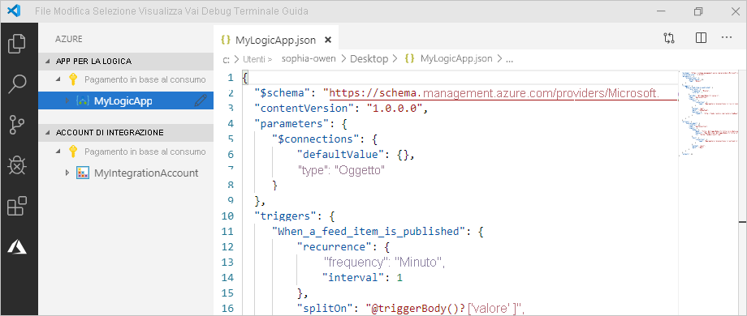

Prima di iniziare, verificare di disporre degli elementi seguenti:

* Se non si ha una sottoscrizione di Azure e un account, [iscriversi per creare un account Azure gratuito](https://azure.microsoft.com/free/).

* Conoscenza di base delle [definizioni dei flussi di lavoro delle app per la logica](../logic-apps/logic-apps-workflow-definition-language.md) e relativa struttura come descritto con JSON

  Se non si ha familiarità con le app per la logica, provare questa [guida di avvio rapido](../logic-apps/quickstart-create-first-logic-app-workflow.md), che crea la prima app per la logica nel portale di Azure ed è maggiormente incentrata sui concetti di base.

* Accesso al Web per accedere ad Azure e alla sottoscrizione di Azure

* Scaricare e installare questi strumenti, se non sono già disponibili:

  * [Visual Studio Code versione 1.25.1 o successiva](https://code.visualstudio.com/), disponibile gratuitamente

  * Estensione Visual Studio Code per App per la logica di Azure

    È possibile scaricare e installare questa estensione da [Visual Studio Marketplace](https://marketplace.visualstudio.com/items?itemName=ms-azuretools.vscode-logicapps) o direttamente dall'interno di Visual Studio Code. Assicurarsi di ricaricare Visual Studio Code dopo l'installazione.

    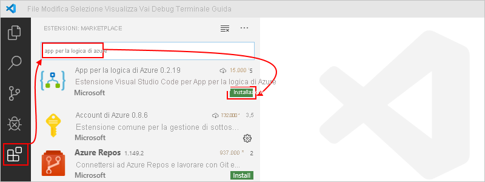

    Per verificare che l'estensione sia stata installata correttamente, selezionare l'icona di Azure visualizzata nella barra degli strumenti di Visual Studio Code.

    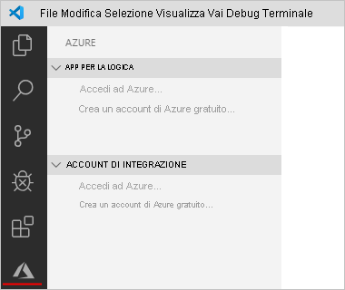

    Per altre informazioni, vedere [Extension Marketplace](https://code.visualstudio.com/docs/editor/extension-gallery) (Marketplace delle estensioni). Per contribuire a questa versione open source dell'estensione, visitare la pagina dell'[estensione di App per la logica di Azure per Visual Studio Code su GitHub](https://github.com/Microsoft/vscode-azurelogicapps).

<a name="sign-in-azure"></a>

## <a name="sign-in-to-azure"></a>Accedere ad Azure

1. Aprire Visual Studio Code. Sulla barra degli strumenti di Visual Studio Code selezionare l'icona di Azure.

   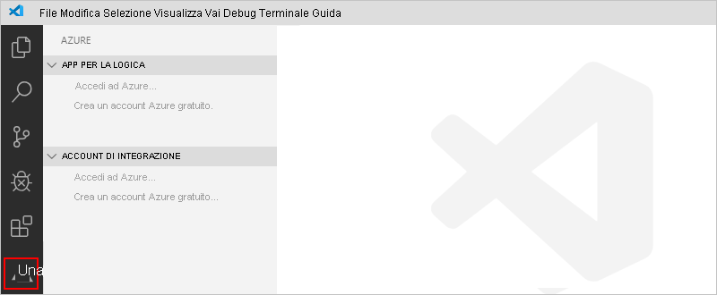

1. Nella finestra di Azure, in **App per la logica** selezionare **Accedi ad Azure**. Quando la pagina di accesso di Microsoft lo richiede, accedere con l'account Azure.

   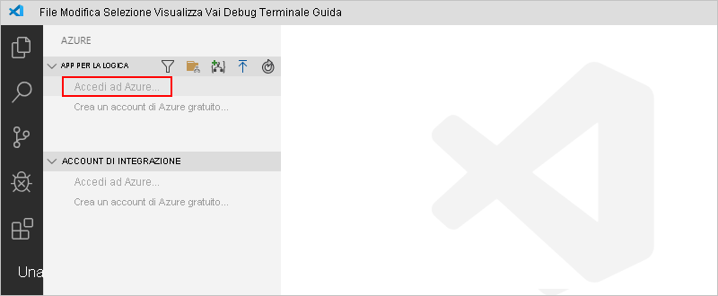

   1. Se l'accesso impiega più tempo del previsto, Visual Studio Code richiede di accedere tramite un sito Web di autenticazione Microsoft fornendo un codice del dispositivo. Per accedere con il codice, selezionare **Use Device Code** (Usa codice del dispositivo).

      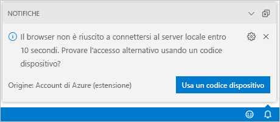

   1. Per copiare il codice, selezionare **Copy & Open** (Copia e apri).

      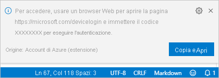

   1. Per aprire una nuova finestra del browser e passare al sito Web di autenticazione, selezionare **Apri il collegamento**.

      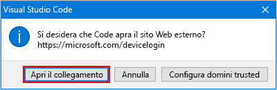

   1. Nella pagina **Accesso all'account** immettere il codice di autenticazione e selezionare **Avanti**.

      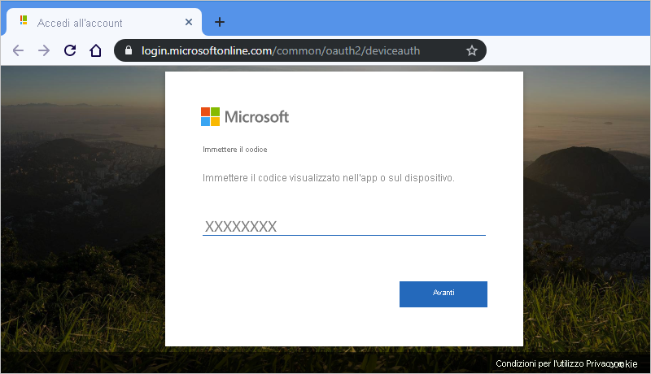

1. Selezionare l'account Azure. Dopo aver effettuato l'accesso, è possibile chiudere il browser e tornare a Visual Studio Code.

   Nel riquadro di Azure le sezioni **App per la logica** e **Account di integrazione** mostrano ora le sottoscrizioni di Azure associate all'account. Tuttavia, se non vengono visualizzate le sottoscrizioni previste o se le sezioni mostrano troppe sottoscrizioni, seguire questa procedura:

   1. Spostare il puntatore del mouse sull'etichetta **App per la logica**. Quando viene visualizzata la barra degli strumenti, selezionare **Seleziona sottoscrizioni** (icona filtro).

      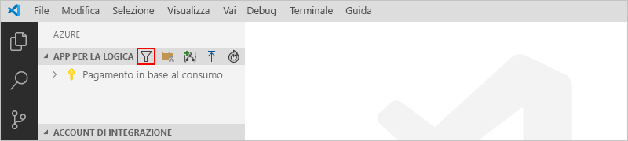

   1. Nell'elenco selezionare le sottoscrizioni che devono essere visualizzate.

1. In **App per la logica** selezionare la sottoscrizione desiderata. Il nodo della sottoscrizione si espande e mostra tutte le app per la logica presenti nella sottoscrizione.

   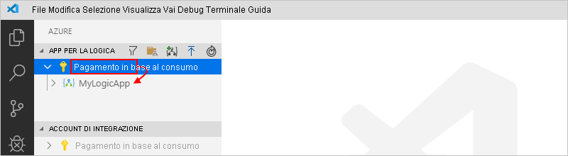

   > [!TIP]
   > In **Account di integrazione**, la selezione della sottoscrizione mostra tutti gli account di integrazione presenti nella sottoscrizione.

<a name="create-logic-app"></a>

## <a name="create-new-logic-app"></a>Creare una nuova app per la logica

1. Se non è stato effettuato l'accesso all'account e alla sottoscrizione di Azure da Visual Studio Code, seguire la [procedura descritta in precedenza per effettuare l'accesso adesso](#sign-in-azure).

1. In Visual Studio Code, in **App per la logica** aprire il menu di scelta rapida della sottoscrizione e scegliere **Crea app per la logica**.

   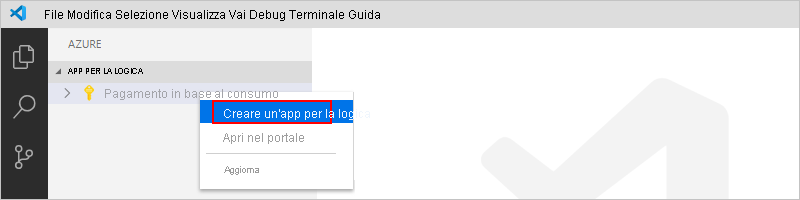

   Verrà visualizzato un elenco che mostra i gruppi di risorse di Azure nella sottoscrizione.

1. Nell'elenco dei gruppi di risorse, selezionare **Crea un nuovo gruppo di risorse** o selezionare un gruppo di risorse esistente. Per questo esempio, creare un nuovo gruppo di risorse.

   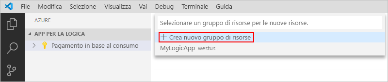

1. Specificare un nome per il gruppo di risorse di Azure e quindi premere INVIO.

   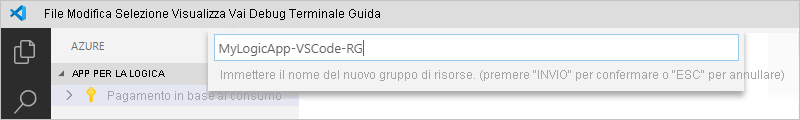

1. Selezionare l'area di Azure in cui salvare i metadati dell'app per la logica.

   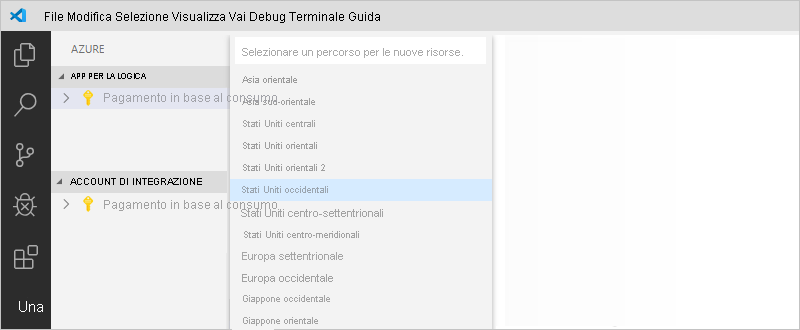

1. Assegnare un nome all'app per la logica e quindi premere INVIO.

   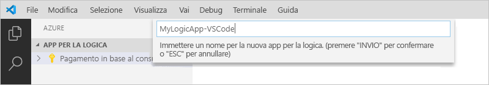

   La nuova app per la logica vuota viene ora visualizzata nella finestra di Azure, nella sottoscrizione di Azure corrente. Visual Studio Code apre anche un file JSON (.logicapp.json), che include una definizione del flusso di lavoro scheletro per l'app per la logica. A questo punto è possibile iniziare a creare manualmente la definizione del flusso di lavoro dell'app per la logica in questo file JSON. Per informazioni di riferimento tecniche sulla struttura e la sintassi per una definizione del flusso di lavoro, vedere [Schema del linguaggio di definizione del flusso di lavoro per App per la logica di Azure](../logic-apps/logic-apps-workflow-definition-language.md).

   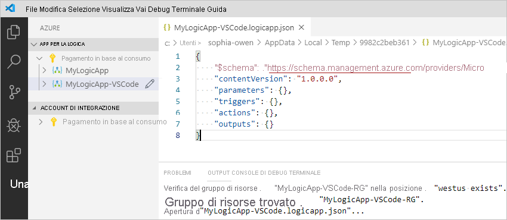

   Ad esempio, di seguito è riportata una definizione del flusso di lavoro dell'app per la logica di esempio, che inizia con un trigger RSS e un'azione di Office 365 Outlook. In genere gli elementi JSON vengono visualizzati in ordine alfabetico in ogni sezione. Questo esempio però mostra questi elementi approssimativamente nell'ordine in cui i passaggi dell'app per la logica vengono visualizzati nella finestra di progettazione.

   > [!IMPORTANT]
   > Se si vuole riutilizzare questa definizione di app per la logica di esempio, è necessario un account aziendale Office 365, ad esempio @fabrikam.com. Assicurarsi di sostituire l'indirizzo di posta elettronica fittizio con il proprio indirizzo di posta elettronica. Per usare un connettore di posta elettronica diverso, ad esempio Outlook.com o Gmail, sostituire l'azione `Send_an_email_action` con un'azione simile disponibile da un [connettore di posta elettronica supportato da App per la logica di Azure](../connectors/apis-list.md).

   ```json
   {
      "$schema": "https://schema.management.azure.com/providers/Microsoft.Logic/schemas/2016-06-01/workflowdefinition.json#",
      "contentVersion": "1.0.0.0",
      "parameters": {
         "$connections": {
            "defaultValue": {},
            "type": "Object"
         }
      },
      "triggers": {
         "When_a_feed_item_is_published": {
            "recurrence": {
               "frequency": "Minute",
               "interval": 1
            },
            "splitOn": "@triggerBody()?['value']",
            "type": "ApiConnection",
            "inputs": {
               "host": {
                  "connection": {
                     "name": "@parameters('$connections')['rss']['connectionId']"
                  }
               },
               "method": "get",
               "path": "/OnNewFeed",
               "queries": {
                  "feedUrl": "http://feeds.reuters.com/reuters/topNews"
               }
            }
         }
      },
      "actions": {
         "Send_an_email_(V2)": {
            "runAfter": {},
            "type": "ApiConnection",
            "inputs": {
               "body": {
                  "Body": "<p>Title: @{triggerBody()?['title']}<br>\n<br>\nDate published: @{triggerBody()?['updatedOn']}<br>\n<br>\nLink: @{triggerBody()?['primaryLink']}</p>",
                  "Subject": "RSS item: @{triggerBody()?['title']}",
                  "To": "sophia-owen@fabrikam.com"
               },
               "host": {
                  "connection": {
                     "name": "@parameters('$connections')['office365']['connectionId']"
                  }
               },
               "method": "post",
               "path": "/v2/Mail"
            }
         }
      },
      "outputs": {}
   }
   ```

1. Al termine, salvare il file della definizione del flusso di lavoro dell'app per la logica. (menu File > Salva oppure premere CTrl+S)

1. Quando viene richiesto di caricare l'app per la logica nella sottoscrizione di Azure, selezionare **Carica**.

   Questo passaggio consente di pubblicare l'app per la logica nel [portale di Azure](https://portal.azure.com), affinché sia disponibile e in esecuzione in Azure.

   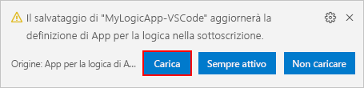

## <a name="view-logic-app-in-designer"></a>Visualizzare l'app per la logica nella finestra di progettazione

In Visual Studio Code è possibile aprire l'app per la logicanella visualizzazione Progettazione di sola lettura. Sebbene non sia possibile modificare l'app per la logica nella finestra di progettazione, è possibile controllare visivamente il flusso di lavoro dell'app per la logica tramite la visualizzazione Progettazione.

Nella finestra di Azure, in **App per la logica** aprire il menu di scelta rapida dell'app per la logica e scegliere **Open in Designer** (Apri nella finestra di progettazione).

Verrà visualizzata la finestra di progettazione di sola lettura in una finestra separata in cui viene mostrato il flusso di lavoro dell'app per la logica, ad esempio:

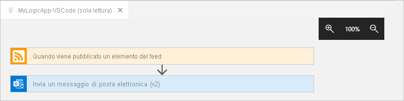

## <a name="view-in-azure-portal"></a>Visualizzare nel portale di Azure

Per esaminare l'app per la logica in portale di Azure, seguire questa procedura:

1. Accedere al [portale di Azure](https://portal.azure.com) usando lo stesso account e la stessa sottoscrizione di Azure associati all'app per la logica.

1. Nella casella di ricerca del portale di Azure immettere il nome dell'app per la logica. Nell'elenco dei risultati selezionare l'app per la logica.

   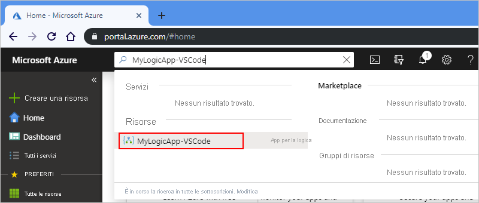

<a name="disable-enable-logic-app"></a>

## <a name="disable-or-enable-logic-app"></a>Disabilitare o abilitare l'app per la logica

In Visual Studio Code se si modifica un'app per la logica pubblicata e si salvano le modifiche, si *sovrascrive* l'app già distribuita. Per evitare di interrompere l'app per la logica nell'ambiente di produzione e ridurre al minimo l'interruzione di servizio, disattivare prima l'app per la logica. È quindi possibile riattivare l'app per la logica dopo aver verificato che l'app per la logica funzioni ancora.

1. Se non è stato effettuato l'accesso all'account e alla sottoscrizione di Azure da Visual Studio Code, seguire la [procedura descritta in precedenza per effettuare l'accesso adesso](#sign-in-azure).

1. Nella finestra di Azure, in **App per la logica** espandere la sottoscrizione di Azure per visualizzare tutte le app per la logica nella sottoscrizione.

   1. Per disabilitare l'app per la logica desiderata, aprire il menu dell'app per la logica e selezionare **Disabilita**.

      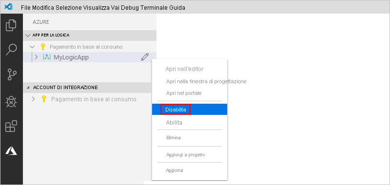

   1. Quando si è pronti per riattivare l'app per la logica, aprire il menu dell'app per la logica e selezionare **Abilita**.

      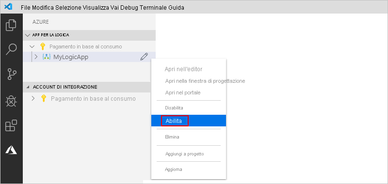

<a name="edit-logic-app"></a>

## <a name="edit-deployed-logic-app"></a>Modificare l'app per la logica distribuita

In Visual Studio Code è possibile aprire e modificare la definizione del flusso di lavoro per un'app per la logica già distribuita in Azure.

> [!IMPORTANT] 
> Prima di modificare un'app per la logica attivamente in esecuzione nell'ambiente di produzione, per evitare il rischio di interrompere l'app per la logica e ridurre al minimo le interruzioni di servizio, è [prima necessario disabilitare l'app per la logica](#disable-enable-logic-app).

1. Se non è stato effettuato l'accesso all'account e alla sottoscrizione di Azure da Visual Studio Code, seguire la [procedura descritta in precedenza per effettuare l'accesso adesso](#sign-in-azure).

1. Nella finestra di Azure, in **App per la logica** espandere la sottoscrizione di Azure e selezionare l'app per la logica desiderata.

1. Aprire il menu dell'app per la logica e selezionare **Apri nell'editor** oppure selezionare l'icona di modifica accanto al nome dell'app per la logica.

   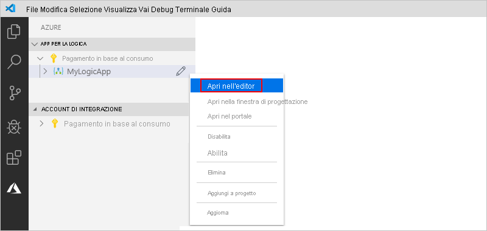

   Visual Studio Code apre il file logicapp.json nella cartella temporanea locale per consentire la visualizzazione della definizione del flusso di lavoro dell'app per la logica.

   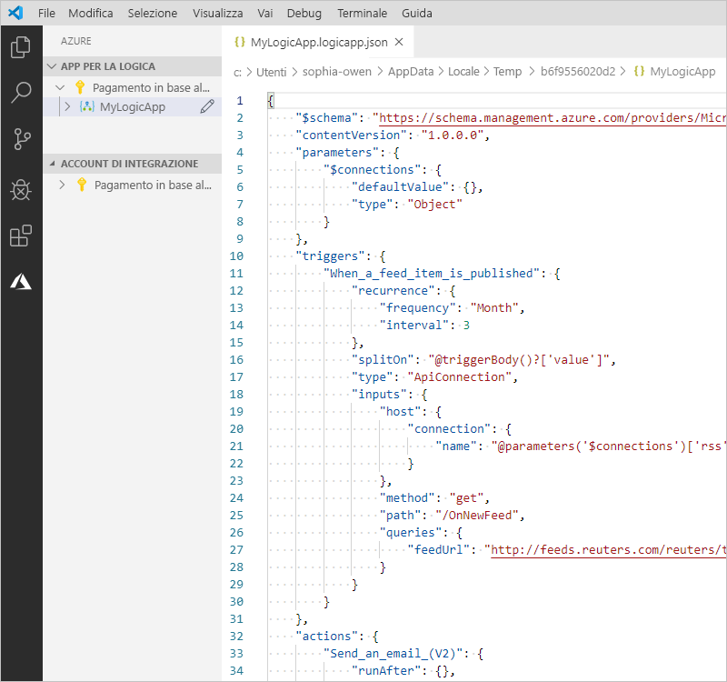

1. Apportare le modifiche alla definizione del flusso di lavoro dell'app per la logica.

1. Al termine, salvare le modifiche. (menu File > Salva oppure premere CTrl+S)

1. Quando viene richiesto di caricare le modifiche e *sovrascrivere* l'app per la logica esistente nel portale di Azure, selezionare **Carica**.

   Questo passaggio consente di pubblicare gli aggiornamenti apportati all'app per la logica nel [portale di Azure](https://portal.azure.com).

   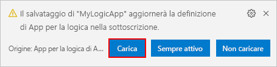

## <a name="view-or-promote-other-versions"></a>Visualizzare o alzare di livello altre versioni

In Visual Studio Code è possibile aprire ed esaminare le versioni precedenti dell'app per la logica. È anche possibile alzare di livello una versione precedente alla versione corrente.

> [!IMPORTANT] 
> Prima di modificare un'app per la logica attivamente in esecuzione nell'ambiente di produzione, per evitare il rischio di interrompere l'app per la logica e ridurre al minimo le interruzioni di servizio, è [prima necessario disabilitare l'app per la logica](#disable-enable-logic-app).

1. Nella finestra di Azure, in **App per la logica** espandere la sottoscrizione di Azure per visualizzare tutte le app per la logica nella sottoscrizione.

1. Nella sottoscrizione espandere l'app per la logica ed espandere **Versioni**.

   L'elenco **Versioni** mostra le versioni precedenti dell'app per la logica, se presenti.

   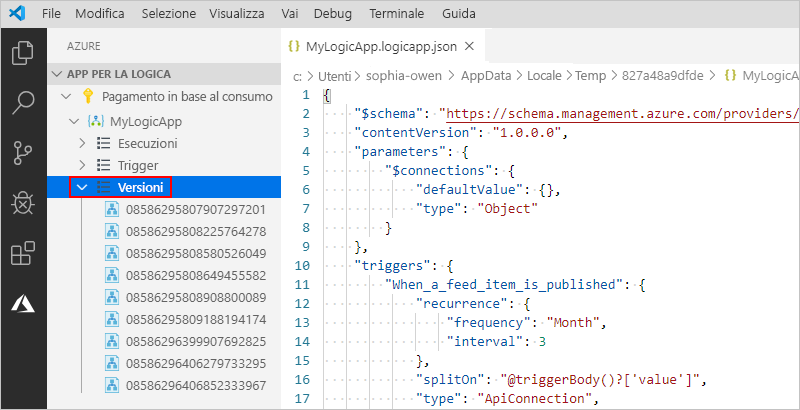

1. Per visualizzare una versione precedente, selezionare una delle procedure seguenti:

   * Per visualizzare la definizione JSON, in **Versioni** selezionare il numero di versione per la definizione corrispondente. In alternativa, aprire il menu di scelta rapida della versione e selezionare **Apri nell'editor**.

     Verrà aperto un nuovo file nel computer locale e verrà visualizzata la definizione JSON della versione.

   * Per visualizzare la versione nella visualizzazione Progettazione di sola lettura, aprire il menu di scelta rapida della versione e selezionare **Open in Designer** (Apri nella finestra di progettazione).

1. Per alzare di livello una versione precedente alla versione corrente, seguire questa procedura:

   1. In **Versioni** aprire il menu di scelta rapida della versione precedente e selezionare **Alza di livello**.

      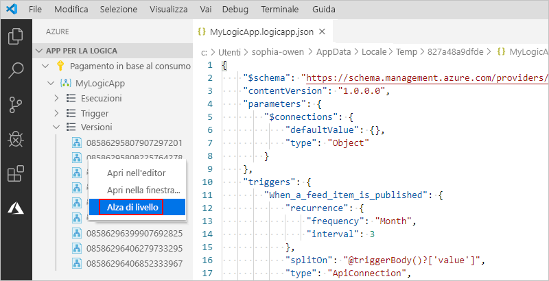

   1. Per continuare dopo la richiesta di conferma di Visual Studio Code, selezionare **Sì**.

      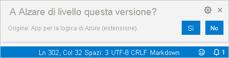

      Visual Studio Code alza di livello la versione selezionata alla versione corrente e assegna un nuovo numero alla versione alzata di livello. La versione corrente precedente è ora visualizzata sotto la versione alzata di livello.

## <a name="next-steps"></a>Passaggi successivi

> [!div class="nextstepaction"]
> [Creare app per la logica con Visual Studio](../logic-apps/quickstart-create-logic-apps-with-visual-studio.md)