# Guida introduttiva: Automatizzare attività e processi con App per la logica di Azure - Visual Studio

Con [App per la logica di Azure](../logic-apps/logic-apps-overview.md) è possibile creare flussi di lavoro che automatizzano le attività e i processi per l'integrazione di applicazioni, dati, sistemi e servizi tra aziende e organizzazioni. Questa guida introduttiva mostra come progettare e implementare questi flussi di lavoro mediante la creazione di app per la logica in Visual Studio e la distribuzione di tali app in <a href="https://docs.microsoft.com/azure/guides/developer/azure-developer-guide" target="_blank">Azure</a> nel cloud. Benché sia possibile eseguire queste attività nel <a href="https://portal.azure.com" target="_blank">portale di Azure</a>, Visual Studio consente di aggiungere app per la logica al controllo del codice sorgente, pubblicare versioni diverse e creare modelli di Azure Resource Manager per ambienti di distribuzione differenti. 

Se non si ha familiarità con App per la logica di Azure e si desidera solo comprendere i concetti di base, è preferibile consultare la [guida introduttiva per la creazione di un'app per la logica nel portale di Azure](../logic-apps/quickstart-create-first-logic-app-workflow.md). La finestra Progettazione app per la logica funziona in modo analogo nel portale di Azure e in Visual Studio. 

In questo caso si creerà la stessa app per la logica vista nella guida introduttiva per il portale di Azure, ma con Visual Studio. Questa app per la logica monitora il feed RSS di un sito Web e invia un messaggio di posta elettronica per ogni nuovo elemento pubblicato nel sito. Al termine, il flusso di lavoro generale dell'app per la logica sarà simile a questo:

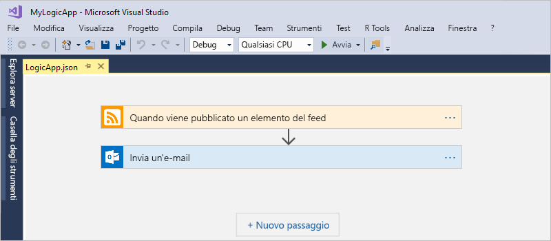

Prima di iniziare, verificare di disporre degli elementi seguenti:

* Se non si ha una sottoscrizione di Azure, <a href="https://azure.microsoft.com/free/" target="_blank">iscriversi per creare un account Azure gratuito</a>.

* Scaricare e installare questi strumenti, se non sono già disponibili: 

  * <a href="https://www.visualstudio.com/downloads" target="_blank">Visual Studio 2017 o Visual Studio 2015 - Community Edition o versioni successive</a>. 
  Questa guida introduttiva usa Visual Studio Community 2017, disponibile gratuitamente.

  * <a href="https://azure.microsoft.com/downloads/" target="_blank">Azure SDK (2.9.1 o versioni successive)</a> e <a href="https://github.com/Azure/azure-powershell#installation" target="_blank">Azure PowerShell</a>

  * <a href="https://marketplace.visualstudio.com/items?itemName=VinaySinghMSFT.AzureLogicAppsToolsforVisualStudio-18551" target="_blank">Strumenti App per la logica di Azure per Visual Studio 2017</a> o la <a href="https://marketplace.visualstudio.com/items?itemName=VinaySinghMSFT.AzureLogicAppsToolsforVisualStudio" target="_blank">versione per Visual Studio 2015</a>
  
    È possibile scaricare e installare Strumenti App per la logica di Azure direttamente da Visual Studio Marketplace o vedere come <a href="https://docs.microsoft.com/visualstudio/ide/finding-and-using-visual-studio-extensions" target="_blank">installare questa estensione da Visual Studio stesso</a>. 
    Assicurarsi di riavviare Visual Studio al termine dell'installazione.

* Un account di posta elettronica supportato da App per la logica, ad esempio un account Office 365 Outlook, Outlook.com o Gmail. Per altri provider, <a href="https://docs.microsoft.com/connectors/" target="_blank">vedere qui l'elenco dei connettori</a>. Questa app per la logica usa Office 365 Outlook. Se si usa un altro provider, la procedura generale resta invariata, ma l'interfaccia utente potrebbe essere leggermente diversa.

* Accesso al Web mentre si usa la finestra integrata Progettazione app per la logica

  La finestra di progettazione richiede una connessione Internet per creare le risorse in Azure e leggere le proprietà e i dati dai connettori nell'app per la logica. 
  Ad esempio, se si usa il connettore per Dynamics CRM Online, la finestra di progettazione verifica la disponibilità di proprietà predefinite e personalizzate nell'istanza di CRM.

## Creare un progetto Gruppo di risorse di Azure

Per iniziare, creare un [progetto Gruppo di risorse di Azure](../azure-resource-manager/vs-azure-tools-resource-groups-deployment-projects-create-deploy.md). È possibile accedere ad altre informazioni sui [gruppi di risorse e le risorse di Azure](../azure-resource-manager/resource-group-overview.md).

1. Avviare Visual Studio e accedere con il proprio account di Azure.

2. Scegliere **Nuovo** > **Progetto** dal menu **File** (scelta rapida da tastiera: CTRL+MAIUSC+N).

   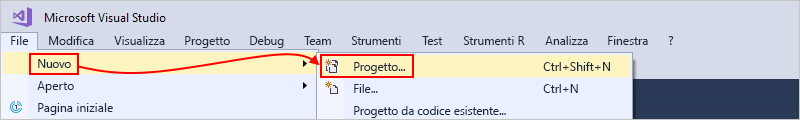

3. In **Installato** selezionare **Visual C#** o **Visual Basic**. Selezionare **Cloud** > **Gruppo di risorse di Azure**. Assegnare un nome al progetto, ad esempio:

   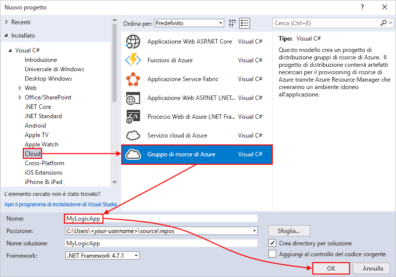

4. Selezionare il modello **App per la logica**. 

   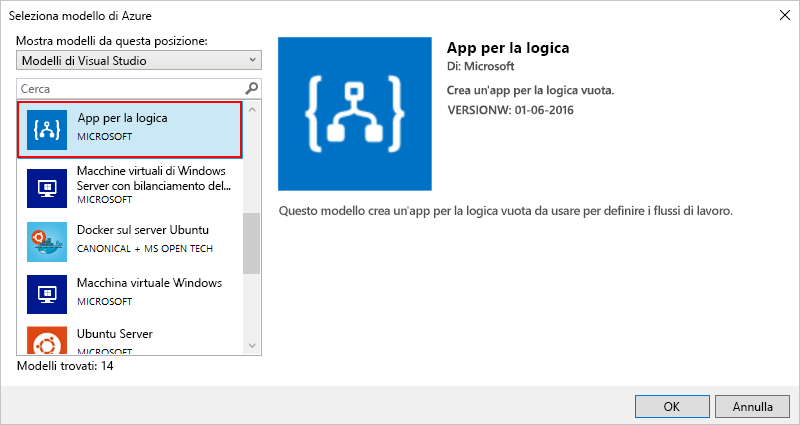

   Dopo la creazione del progetto in Visual Studio, verrà visualizzata la finestra Esplora soluzioni con la soluzione. 

   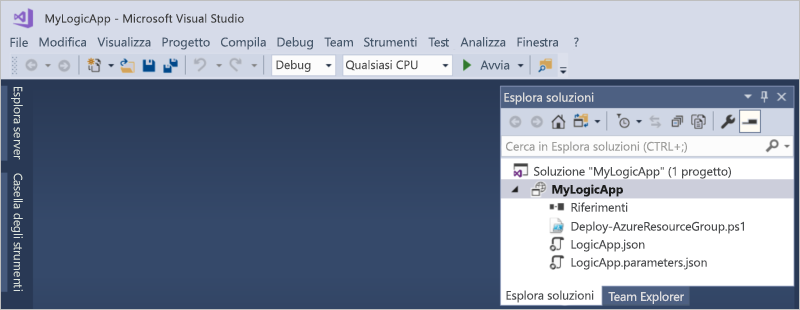

   Il file **LogicApp.json** nella soluzione non solo contiene la definizione dell'app per la logica, ma è anche un modello di Azure Resource Manager che è possibile impostare per la distribuzione.

## Creare un'app per la logica vuota

Dopo aver creato il progetto Gruppo di risorse di Azure, creare e compilare l'app per la logica a partire dal modello **App per la logica vuota**.

1. In Esplora soluzioni aprire il menu di scelta rapida per il file **LogicApp.json**. Selezionare **Open With Logic App Designer** (Apri con Progettazione app per la logica) (scelta rapida da tastiera: CTRL+L).

   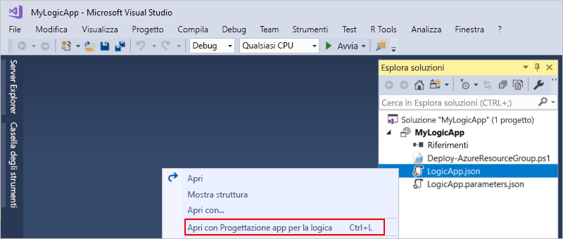

2. In **Sottoscrizione** selezionare la sottoscrizione di Azure da usare. In **Gruppo di risorse** selezionare **Crea nuovo** per creare un nuovo gruppo di risorse di Azure. 

   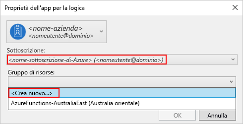

   Visual Studio necessita della sottoscrizione di Azure dell'utente e di un gruppo di risorse per la creazione e distribuzione delle risorse associate all'app per la logica e alle connessioni dell'utente. 

   | Impostazione | Valore di esempio | DESCRIZIONE | 
   | ------- | ------------- | ----------- | 
   | User profile list (Elenco profili utente) | Contoso   jamalhartnett@contoso.com | Per impostazione predefinita, l'account usato per eseguire l'accesso | 
   | **Sottoscrizione** | Pagamento in base al consumo   (jamalhartnett@contoso.com) | Il nome della sottoscrizione di Azure e l'account associato |
   | **Gruppo di risorse** | MiaAppLogica-GR   (Stati Uniti occidentali) | Il gruppo di risorse di Azure e la posizione per l'archiviazione e distribuzione delle risorse per l'app per la logica | 
   | **Posizione** | MiaAppLogica-GR2   (Stati Uniti occidentali) | Una posizione diversa se non si desidera usare la posizione del gruppo di risorse |
   ||||

3. Viene visualizzata la finestra Progettazione app per la logica, che mostra una pagina con un video introduttivo e i trigger più usati. Scorrere dopo il video e i trigger. In **Modelli** selezionare **App per la logica vuota**.

   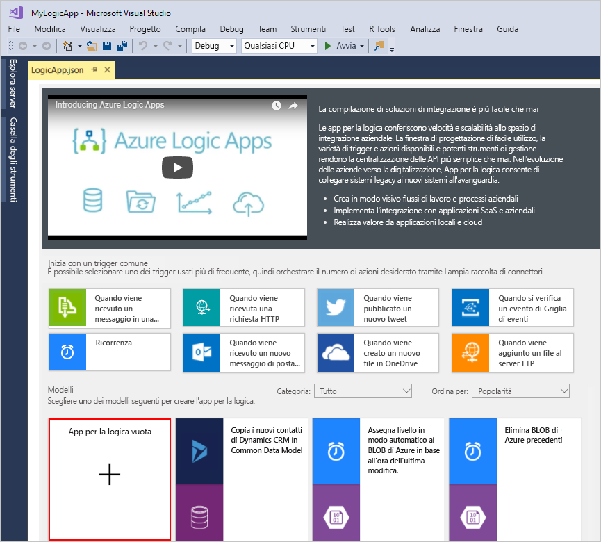

## Creare il flusso di lavoro dell'app per la logica

Aggiungere quindi un [trigger](../logic-apps/logic-apps-overview.md#logic-app-concepts) che attiva il flusso di lavoro quando nel feed RSS è presente un nuovo elemento. Ogni app per la logica deve iniziare con un trigger, che viene attivato quando sono soddisfatti criteri specifici. Ogni volta che il trigger viene attivato, il motore di App per la logica crea un'istanza dell'app per la logica che esegue il flusso di lavoro.

1. Nella finestra Progettazione app per la logica immettere "rss" nella casella di ricerca. Selezionare il trigger: **RSS - Quando viene pubblicato un elemento del feed**

   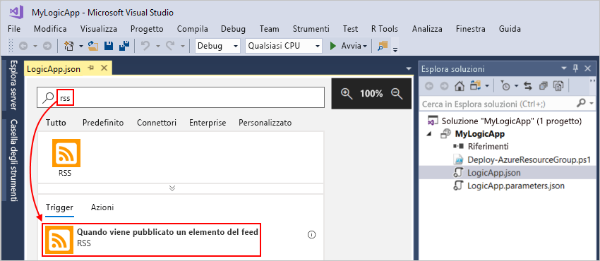

   Il trigger sarà visualizzato nella finestra di progettazione:

   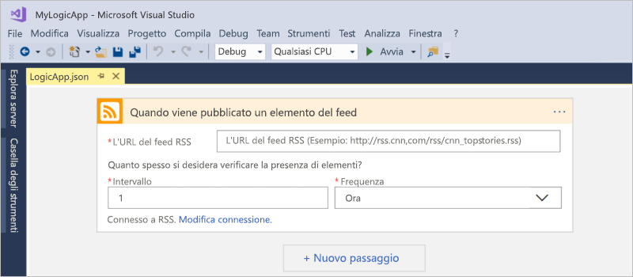

2. Per completare la creazione dell'app per la logica, seguire i passaggi del flusso di lavoro descritti nella [guida introduttiva per il portale di Azure](../logic-apps/quickstart-create-first-logic-app-workflow.md#add-rss-trigger), quindi tornare a questo articolo.

   Al termine, l'app per la logica avrà un aspetto simile all'esempio seguente: 

   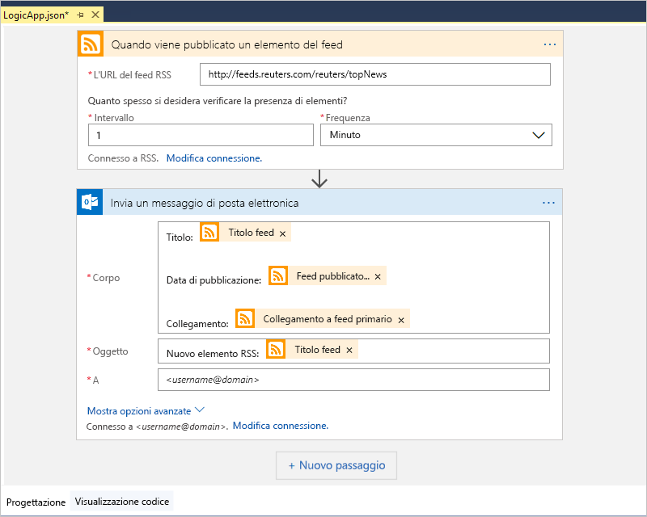

3. Per salvare l'app per la logica, salvare la soluzione di Visual Studio (scelta rapida da tastiera: CTRL+S).

A questo punto, prima del test dell'app per la logica, distribuire l'app in Azure.

## Distribuire l'app per la logica in Azure

Prima di poter eseguire l'app per la logica, distribuire l'app da Visual Studio in Azure, un'operazione che richiede solo pochi passaggi.

1. In Esplora soluzioni, nel menu di scelta rapida del progetto, scegliere **Distribuisci** > **Nuovo**. Se richiesto, accedere con il proprio account di Azure.

   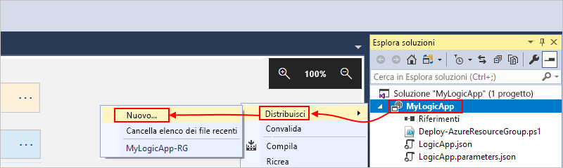

2. Per questa distribuzione mantenere la sottoscrizione di Azure, il gruppo di risorse e le altre impostazioni predefinite. Al termine scegliere **Distribuisci**. 

   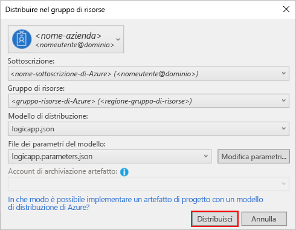

3. Se viene visualizzata la finestra **Modifica parametri**, specificare il nome della risorsa che l'app per la logica dovrà usare durante la distribuzione e quindi salvare le impostazioni. Ad esempio:

   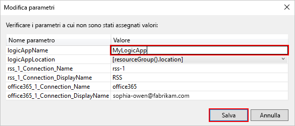

   All'avvio della distribuzione, lo stato di distribuzione dell'app sarà visualizzato nella finestra **Output** di Visual Studio. 
   Se lo stato non è visualizzato, aprire l'elenco **Mostra output di** e selezionare il proprio gruppo di risorse di Azure.

   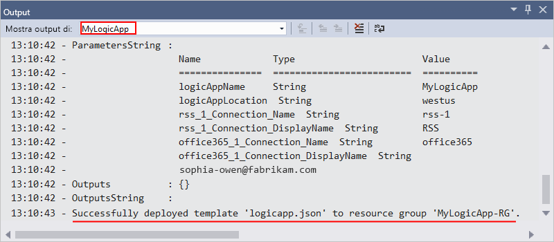

   Al termine della distribuzione, l'app per la logica sarà attiva nel portale di Azure e controllerà il feed RSS in base alla pianificazione specificata (ogni minuto). 
   Se il feed RSS include nuovi elementi, l'app per la logica invia un messaggio di posta elettronica per ogni nuovo elemento. 
   In caso contrario, l'app per la logica attende l'intervallo successivo prima di controllare di nuovo. 

   Ecco alcuni esempi di messaggi di posta elettronica inviato dall'app per la logica. 
   Se non si riceve alcun messaggio di posta elettronica, controllare la cartella della posta indesiderata. 

   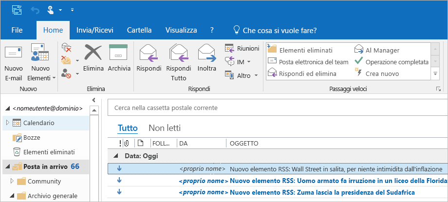

   Da un punto di vista tecnico, quando il trigger controlla il feed RSS e trova nuovi elementi, il trigger viene attivato e il motore di App per la logica crea un'istanza del flusso di lavoro dell'app per la logica che esegue le azioni del flusso di lavoro.
   Se il trigger non trova nuovi elementi, non viene attivato e non crea un'istanza del flusso di lavoro.

Si è così completata la creazione ed esecuzione dell'app per la logica con Visual Studio. Per gestire l'app per la logica ed esaminarne la cronologia di esecuzione, vedere [Gestire app per la logica con Visual Studio](../logic-apps/manage-logic-apps-with-visual-studio.md).

## Pulire le risorse

Quando non è più necessario, eliminare il gruppo di risorse contenente l'app per la logica e le risorse correlate.

1. Accedere al <a href="https://portal.azure.com" target="_blank">portale di Azure</a> con lo stesso account usato per creare l'app per la logica. 

2. Nel menu principale di Azure scegliere **Gruppi di risorse**. Selezionare il gruppo di risorse dell'app per la logica.

3. Scegliere **Elimina gruppo di risorse**. Immettere il nome del gruppo di risorse come conferma e scegliere **Elimina**.

   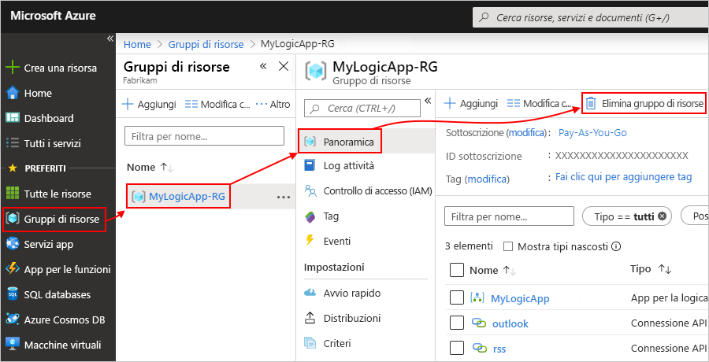

4. Eliminare la soluzione di Visual Studio dal computer locale.

## Supporto

* In caso di domande, visitare il <a href="https://social.msdn.microsoft.com/Forums/en-US/home?forum=azurelogicapps" target="_blank">forum di App per la logica di Azure</a>.
* Per votare o inviare idee relative alle funzionalità, visitare il <a href="http://aka.ms/logicapps-wish" target="_blank">sito dei commenti e suggerimenti degli utenti di App per la logica</a>.

## Passaggi successivi

In questo articolo è stata creata, distribuita ed eseguita un'app per la logica con Visual Studio. Per altre informazioni sulla gestione e l'esecuzione di distribuzioni avanzate di app per la logica con Visual Studio, vedere questi articoli:

> [!div class="nextstepaction"]
> [Gestire app per la logica con Visual Studio](../logic-apps/manage-logic-apps-with-visual-studio.md)