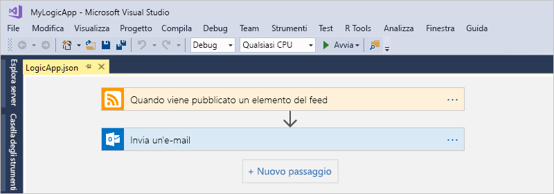
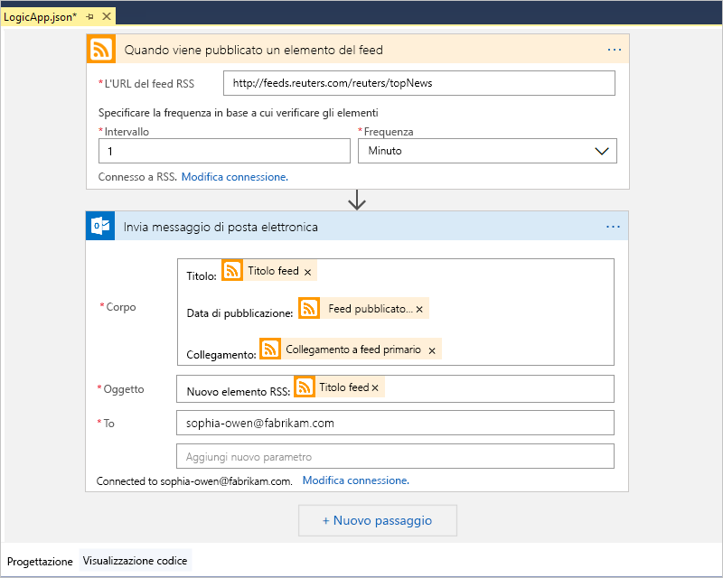
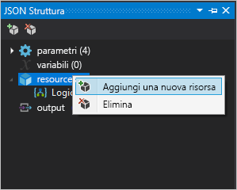
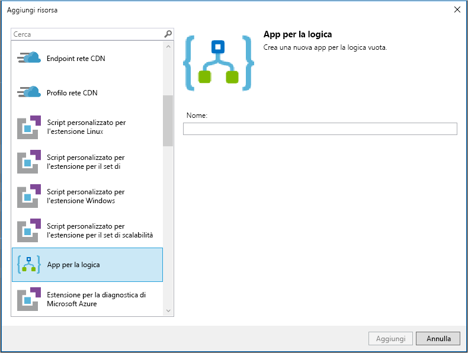

# Guida introduttiva: Automatizzare attività, processi e flussi di lavoro con App per la logica di Azure e Visual Studio

Con [App per la logica di Azure](../logic-apps/logic-apps-overview.md) e Visual Studio è possibile creare flussi di lavoro che automatizzano le attività e i processi per l'integrazione di applicazioni, dati, sistemi e servizi tra aziende e organizzazioni. Questo argomento di avvio rapido mostra come progettare e compilare questi flussi di lavoro creando app per la logica in Visual Studio e distribuendole in Azure. Benché sia possibile eseguire queste attività nel portale di Azure, Visual Studio consente di aggiungere app per la logica al controllo del codice sorgente, pubblicare versioni diverse e creare modelli di Azure Resource Manager per ambienti di distribuzione differenti.

Se non si ha familiarità con App per la logica di Azure e si desidera solo comprenderne i concetti di base, vedere l'[argomento di avvio rapido per la creazione di un'app per la logica nel portale di Azure](../logic-apps/quickstart-create-first-logic-app-workflow.md). Progettazione app per la logica funziona in modo analogo nel portale di Azure e in Visual Studio.

In questo argomento di avvio rapido verrà creata con Visual Studio la stessa app per la logica dell'argomento di avvio rapido per il portale di Azure. Questa app per la logica monitora il feed RSS di un sito Web e invia un messaggio di posta elettronica per ogni nuovo elemento presente nel feed. L'app per la logica completa sarà simile a questo flusso di lavoro di alto livello:

## Prerequisiti

* Una sottoscrizione di Azure. Se non si ha una sottoscrizione di Azure, [iscriversi per creare un account Azure gratuito](https://azure.microsoft.com/free/).

* Scaricare e installare questi strumenti, se non sono già disponibili:

  * [Visual Studio 2019, 2017 o 2015 - Community Edition o superiore](https://aka.ms/download-visual-studio). 
  Questo argomento di avvio rapido usa Visual Studio Community 2017.

    > [!IMPORTANT]
    > Quando si installa Visual Studio 2019 o 2017, assicurarsi di selezionare il carico di lavoro **Sviluppo di Azure**.

  * [Microsoft Azure SDK per .NET (2.9.1 o versione successiva)](https://azure.microsoft.com/downloads/). 
  Altre informazioni su [Azure SDK per .NET](https://docs.microsoft.com/dotnet/azure/dotnet-tools?view=azure-dotnet).

  * [Azure PowerShell](https://github.com/Azure/azure-powershell#installation)

  * Strumenti App per la logica di Azure per la versione di Visual Studio desiderata:

    * [Visual Studio 2019](https://aka.ms/download-azure-logic-apps-tools-visual-studio-2019)

    * [Visual Studio 2017](https://aka.ms/download-azure-logic-apps-tools-visual-studio-2017)

    * [Visual Studio 2015](https://aka.ms/download-azure-logic-apps-tools-visual-studio-2015)
  
    È anche possibile scaricare e installare Strumenti App per la logica di Azure direttamente da Visual Studio Marketplace o [installare questa estensione da Visual Studio](https://docs.microsoft.com/visualstudio/ide/finding-and-using-visual-studio-extensions). 
    Assicurarsi di riavviare Visual Studio al termine dell'installazione.

* Per usare ambienti di Azure diversi, ad esempio Azure per enti pubblici, è possibile installare e usare l'estensione [selettore dell'ambiente di Azure](https://marketplace.visualstudio.com/items?itemName=SteveMichelotti.AzureEnvironmentSelector), che consente di spostarsi più facilmente tra gli ambienti. Per altre informazioni, vedere [Introducing the Azure Environment Selector Visual Studio extension](https://devblogs.microsoft.com/azuregov/introducing-the-azure-environment-selector-visual-studio-extension/) (Introduzione all'estensione di Visual Studio Selettore dell'ambiente di Azure).

* Accesso al Web mentre si usa la finestra integrata Progettazione app per la logica

  La finestra di progettazione richiede una connessione Internet per creare le risorse in Azure e leggere le proprietà e i dati dai connettori nell'app per la logica. 
  Ad esempio, per connessioni Dynamics CRM Online, la finestra di progettazione verifica la presenza di proprietà predefinite e personalizzate nell'istanza di CRM.

* Un account di posta elettronica supportato da App per la logica, ad esempio un account Office 365 Outlook, Outlook.com o Gmail. Per altri provider, [vedere qui l'elenco dei connettori](https://docs.microsoft.com/connectors/). Questo esempio usa Outlook per Office 365. Se si usa un altro provider, la procedura generale resta invariata, ma l'interfaccia utente potrebbe essere leggermente diversa.

## Creare un progetto Gruppo di risorse di Azure

Per iniziare, creare un [progetto Gruppo di risorse di Azure](../azure-resource-manager/vs-azure-tools-resource-groups-deployment-projects-create-deploy.md). È possibile accedere ad altre informazioni sui [gruppi di risorse e le risorse di Azure](../azure-resource-manager/resource-group-overview.md).

1. Avviare Visual Studio. Accedere con l'account Azure.

1. Scegliere **Nuovo** > **Progetto** dal menu **File** (scelta rapida da tastiera: CTRL+MAIUSC+N).

   

1. In **Installato** selezionare **Visual C#** o **Visual Basic**. Selezionare **Cloud** > **Gruppo di risorse di Azure**. Assegnare un nome al progetto, ad esempio:

   

   > [!NOTE]
   > I nomi dei gruppi di risorse possono contenere solo lettere, numeri, punti (`.`), caratteri di sottolineatura (`_`), trattini (`-`) e parentesi (`(`, `)`) ma non possono *terminare* con punti (`.`).
   >
   > Se l'opzione **Cloud** o **Gruppo di risorse di Azure** non è visualizzata, assicurarsi di installare Azure SDK per Visual Studio.

   Se si usa Visual Studio 2019, procedere come segue:

   1. Nella finestra di dialogo **Crea un nuovo progetto** selezionare il progetto **Gruppo di risorse di Azure** per Visual C# o Visual Basic. Scegliere **Avanti**.

   1. Specificare un nome per il gruppo di risorse di Azure da usare e altre informazioni sul progetto. Scegliere **Create**.

1. Selezionare il modello **App per la logica** nell'elenco. Scegliere **OK**.

   

   Dopo la creazione del progetto in Visual Studio, verrà visualizzata la finestra Esplora soluzioni con la soluzione. 
   Nella soluzione il file **LogicApp.json** non solo contiene la definizione dell'app per la logica, ma è anche un modello di Azure Resource Manager che è possibile usare per la distribuzione.

   

## Creare un'app per la logica vuota

Dopo aver creato il progetto Gruppo di risorse di Azure, creare l'app per la logica con il modello **App per la logica vuota**.

1. In Esplora soluzioni aprire il menu di scelta rapida per il file **LogicApp.json**. Selezionare **Open With Logic App Designer** (Apri con Progettazione app per la logica) (scelta rapida da tastiera: CTRL+L).

   

   > [!TIP]
   > Se non si dispone di questo comando in Visual Studio 2019, verificare di aver installato gli aggiornamenti più recenti per Visual Studio.

   Visual Studio richiede la sottoscrizione di Azure e un gruppo di risorse di Azure per la creazione e la distribuzione di risorse per l'app per la logica e le connessioni.

1. Per **Sottoscrizione** selezionare la sottoscrizione di Azure. Per **Gruppo di risorse** selezionare **Crea nuovo** per creare un nuovo gruppo di risorse di Azure.

   

   | Impostazione | Valore di esempio | DESCRIZIONE |
   | ------- | ------------- | ----------- |
   | User profile list (Elenco profili utente) | Contoso   jamalhartnett@contoso.com | Per impostazione predefinita, l'account usato per eseguire l'accesso |
   | **Sottoscrizione** | Pagamento in base al consumo   (jamalhartnett@contoso.com) | Il nome della sottoscrizione di Azure e l'account associato |
   | **Gruppo di risorse** | MiaAppLogica-GR   (Stati Uniti occidentali) | Gruppo di risorse di Azure e la posizione per l'archiviazione e la distribuzione delle risorse per l'app per la logica |
   | **Posizione** | MiaAppLogica-GR2   (Stati Uniti occidentali) | Una posizione diversa se non si desidera usare la posizione del gruppo di risorse |
   ||||

1. Viene visualizzato Progettazione app per la logica, che contiene un video introduttivo e i trigger più usati. Scorrere verso il basso dopo il video e i trigger fino a **Modelli** e selezionare **App per la logica vuota**.

   

## Creare il flusso di lavoro dell'app per la logica

Aggiungere quindi un [trigger](../logic-apps/logic-apps-overview.md#logic-app-concepts) RSS che verrà attivato quando viene visualizzato un nuovo elemento del feed. Ogni app per la logica inizia con un trigger, che viene attivato quando vengono soddisfatti criteri specifici. Ogni volta che il trigger viene attivato, il motore di App per la logica crea un'istanza dell'app per la logica che esegue il flusso di lavoro.

1. In Progettazione app per la logica scegliere **Tutti** sotto la casella di ricerca.
Nella casella di ricerca immettere "rss". Nell'elenco di trigger selezionare questo trigger: **Quando viene pubblicato un elemento del feed**

   

1. Dopo che il trigger viene visualizzato nella finestra di progettazione, completare la creazione dell'app per la logica seguendo i passaggi del flusso di lavoro descritti nell'[argomento di avvio rapido per il portale di Azure](../logic-apps/quickstart-create-first-logic-app-workflow.md#add-rss-trigger), quindi tornare a questo articolo. Al termine, l'app per la logica avrà un aspetto simile all'esempio seguente:

   

1. Salvare la soluzione di Visual Studio. (scelta rapida da tastiera: CTRL+S).

## Distribuire l'app per la logica in Azure

Prima di poter eseguire e testare l'app per la logica, distribuire l'app in Azure da Visual Studio.

1. Nel menu di scelta rapida del progetto in Esplora soluzioni scegliere **Distribuisci** > **Nuovo**. Se richiesto, accedere con il proprio account di Azure.

   

1. Per questa distribuzione, mantenere la sottoscrizione di Azure, il gruppo di risorse e le altre impostazioni. Scegliere **Distribuisci**.

   

1. Se viene visualizzata la finestra **Modifica parametri**, specificare un nome di risorsa per l'app per la logica. Salvare le impostazioni.

   

   All'avvio della distribuzione, lo stato di distribuzione dell'app sarà visualizzato nella finestra **Output** di Visual Studio. Se lo stato non è visualizzato, aprire l'elenco **Mostra output di** e selezionare il proprio gruppo di risorse di Azure.

   

   Se i connettori selezionati richiedono input, viene visualizzata in background una finestra di PowerShell che richiede tutte le password o chiavi segrete necessarie. Dopo avere immesso queste informazioni, la distribuzione continuerà.

   

   Al termine della distribuzione, l'app per la logica sarà attiva nel portale di Azure e verrà eseguita solo in base alla pianificazione specificata (ogni minuto). Se il trigger trova nuovi elementi, viene attivato e viene quindi creata un'istanza del flusso di lavoro che esegue le azioni dell'app per la logica. L'app per la logica invia un messaggio di posta elettronica per ogni nuovo elemento. In caso contrario, se il trigger non trova nuovi elementi, non viene attivato e non crea un'istanza del flusso di lavoro. L'app per la logica attende fino all'intervallo successivo prima di un nuovo controllo.

   Ecco alcuni esempi di messaggi di posta elettronica inviati dall'app per la logica. 
   Se non si riceve alcun messaggio di posta elettronica, controllare la cartella della posta indesiderata.

   

Congratulazioni, l'app per la logica è stata compilata e distribuita con Visual Studio. Per gestire l'app per la logica ed esaminarne la cronologia di esecuzione, vedere [Gestire app per la logica con Visual Studio](../logic-apps/manage-logic-apps-with-visual-studio.md).

## Aggiungere la nuova app per la logica

Quando è disponibile un progetto Gruppo di risorse esistente, è possibile aggiungere una nuova app per la logica vuota al progetto usando la finestra Struttura JSON.

1. In Esplora soluzioni aprire il file `<logic-app-name>.json`.

1. Nel menu **Visualizza** selezionare **Altre finestre** > **Struttura JSON**.

1. Per aggiungere una risorsa al file del modello, scegliere **Aggiungi risorsa** nella parte superiore della finestra Struttura JSON. Oppure nella finestra Struttura JSON fare clic con il tasto destro del mouse su **risorse**e selezionare **Aggiungi nuova risorsa**.

   

1. Nella finestra di dialogo **Aggiungi risorsa**, individuare e selezionare **App per la logica**. Dare un nome all'app per la logica e scegliere **Aggiungi**.

   

## Pulire le risorse

Quando l'app per la logica non è più necessaria, eliminare il gruppo di risorse che la contiene, insieme alle risorse correlate.

1. Accedere al [portale di Azure](https://portal.azure.com) con lo stesso account usato per creare l'app per la logica.

1. Nel menu principale di Azure scegliere **Gruppi di risorse**.
Selezionare il gruppo di risorse dell'app per la logica e quindi **Panoramica**.

1. Nella pagina **Panoramica** scegliere **Elimina gruppo di risorse**. Immettere il nome del gruppo di risorse come conferma e scegliere **Elimina**.

   

1. Eliminare la soluzione di Visual Studio dal computer locale.

## Passaggi successivi

In questo articolo è stata creata, distribuita ed eseguita un'app per la logica con Visual Studio. Per informazioni sulla gestione e l'esecuzione di distribuzioni avanzate per app per la logica con Visual Studio, vedere questi articoli:

> [!div class="nextstepaction"]
> * [Gestire app per la logica con Visual Studio](../logic-apps/manage-logic-apps-with-visual-studio.md)
