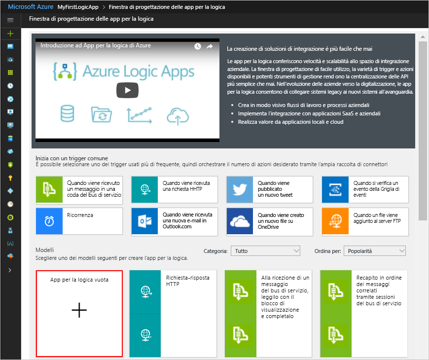

# <a name="manage-mailing-list-requests-with-a-logic-app"></a>Gestire le richieste di sottoscrizione di una lista di distribuzione con un'app per la logica

App per la logica di Azure permette di automatizzare i flussi di lavoro e integrare dati tra servizi di Azure, servizi Microsoft, altre app software come un servizio (SaaS) e sistemi locali. Questa esercitazione mostra come creare un'[app per la logica](../logic-apps/logic-apps-overview.md) che elabora le richieste di sottoscrizione per una lista di distribuzione gestita dal servizio [MailChimp](https://mailchimp.com/).
Questa app per la logica monitora un account di posta elettronica per individuare queste richieste, invia le richieste per l'approvazione e aggiunge i membri approvati alla lista di distribuzione.

In questa esercitazione si apprenderà come:

> [!div class="checklist"]
> * Creare un'app per la logica vuota.
> * Aggiungere un trigger per il monitoraggio dei messaggi di posta elettronica per individuare le richieste di sottoscrizione.
> * Aggiungere un'azione per l'invio di messaggi di posta elettronica per l'approvazione o il rifiuto di tali richieste.
> * Aggiungere una condizione per il controllo della risposta di approvazione.
> * Aggiungere un'azione per l'aggiunta dei membri approvati alla lista di distribuzione.
> * Aggiungere una condizione per il controllo dell'aggiunta o meno dei membri alla lista.
> * Aggiungere un'azione per l'invio di messaggi di posta elettronica per confermare se i membri sono stati o meno aggiunti alla lista.

Al termine, a livello generale l'app per la logica dovrebbe avere un flusso di lavoro simile al seguente:


Se non si ha una sottoscrizione di Azure, <a href="https://azure.microsoft.com/free/" target="_blank">iscriversi per creare un account di Azure gratuito</a> prima di iniziare.

## <a name="prerequisites"></a>prerequisiti

* Un account MailChimp. Creare una lista denominata "test-members-ML", in cui l'app per la logica può aggiungere gli indirizzi di posta elettronica per i membri approvati. Se non si ha un account, [registrarsi per ottenerne uno gratuito](https://login.mailchimp.com/signup/) e vedere [How to create a list](https://us17.admin.mailchimp.com/lists/#) (Come creare una lista di distribuzione). 

* Una account di posta elettronica con Outlook per Office 365 o Outlook.com, che supportano i flussi di lavoro di approvazione. Questo articolo usa Outlook per Office 365. Se si usa un account di posta elettronica diverso, la procedura generale resta invariata, ma l'interfaccia utente potrebbe essere leggermente diversa.

## <a name="sign-in-to-the-azure-portal"></a>Accedere al portale di Azure

Accedere al <a href="https://portal.azure.com" target="_blank">portale di Azure</a> con le credenziali dell'account Azure.

## <a name="create-your-logic-app"></a>Creare l'app per la logica

1. Nel menu principale di Azure scegliere **Crea una risorsa** > **Integrazione aziendale** > **App per la logica**.

   

2. In **Crea app per la logica** specificare le informazioni sull'app per la logica come mostrato e descritto di seguito. Al termine, scegliere **Aggiungi al dashboard** > **Crea**.

   

   | Impostazione | Valore | DESCRIZIONE | 
   | ------- | ----- | ----------- | 
   | **Nome** | LA-MailingList | Nome dell'app per la logica | 
   | **Sottoscrizione** | <*nome-sottoscrizione-Azure*> | Nome della sottoscrizione di Azure | 
   | **Gruppo di risorse** | LA-MailingList-RG | Nome del [gruppo di risorse di Azure](../azure-resource-manager/resource-group-overview.md) usato per organizzare le risorse correlate | 
   | **Posizione** | Stati Uniti orientali 2 | Area in cui archiviare le informazioni sull'app per la logica | 
   | **Log Analytics** | Off | Lasciare l'impostazione **No** per la registrazione diagnostica. | 
   |||| 

3. Dopo che Azure distribuisce l'app, si apre Progettazione app per la logica, che mostra un video introduttivo e alcuni modelli di app per la logica comuni. In **Modelli** scegliere **App per la logica vuota**.

   

Aggiungere quindi un [trigger](../logic-apps/logic-apps-overview.md#logic-app-concepts) che resta in ascolto dei messaggi di posta elettronica in arrivo con richieste di sottoscrizione.
Ogni app per la logica deve essere avviata con un trigger, che viene attivato quando si verifica un determinato evento o quando nuovi dati soddisfano una condizione specifica. Per altre informazioni, vedere [Create your first logic app](../logic-apps/quickstart-create-first-logic-app-workflow.md) (Creare la prima app per la logica).

## <a name="add-trigger-to-monitor-emails"></a>Aggiungere un trigger per il monitoraggio dei messaggi di posta elettronica

1. Nella finestra di progettazione immettere "all'arrivo di un nuovo messaggio di posta elettronica" nella casella di ricerca. Selezionare il trigger per il provider di posta elettronica: **<*provider-posta-elettronica*> - All'arrivo di un nuovo messaggio di posta elettronica**
   
   

   * Per un account aziendale o dell'istituto di istruzione di Azure, selezionare Office 365 Outlook.
   * Per gli account Microsoft personali, selezionare Outlook.com.

2. Se viene chiesto di immettere le credenziali, accedere all'account di posta elettronica in modo che App per la logica possa creare una connessione all'account.

3. Specificare ora i criteri che dovranno essere controllati dal trigger in tutti i nuovi messaggi di posta elettronica.

   1. Specificare cartella, intervallo e frequenza per la verifica dei messaggi di posta elettronica.

      

      | Impostazione | Valore | DESCRIZIONE | 
      | ------- | ----- | ----------- | 
      | **Cartella** | Posta in arrivo | Cartella di posta elettronica da monitorare | 
      | **Interval** | 1 | Numero di intervalli di attesa tra i controlli | 
      | **Frequenza** | Hour | Unità di tempo per ogni intervallo tra i controlli  | 
      |  |  |  | 

   2. Scegliere **Mostra opzioni avanzate**. Nella casella **Filtro oggetto** immettere questo testo che il trigger dovrà trovare nell'oggetto del messaggio: ```subscribe-test-members-ML```

      

4. Per nascondere i dettagli del trigger per il momento, fare clic sulla barra del titolo del trigger.

   

5. Salvare l'app per la logica. Nella barra degli strumenti della finestra di progettazione scegliere **Salva**.

   L'app per la logica è ora attiva, ma non esegue alcuna operazione oltre a controllare la posta elettronica in arrivo. 
   Aggiungere quindi un'azione per la risposta all'attivazione del trigger.

## <a name="send-approval-email"></a>Inviare messaggio di posta elettronica di approvazione

Ora che è stato creato il trigger, aggiungere un'[azione](../logic-apps/logic-apps-overview.md#logic-app-concepts) per l'invio di un messaggio di posta elettronica per approvare o rifiutare la richiesta. 

1. Nel trigger scegliere **+ Nuovo passaggio** > **Aggiungi un'azione**. Cercare "approvazione" e selezionare questa azione: **<*provider-posta-elettronica*> - Invia messaggio di posta elettronica di approvazione**

   

2. Specificare le informazioni per questa azione come mostrato e descritto di seguito: 

   

   | Impostazione | Valore | DESCRIZIONE | 
   | ------- | ----- | ----------- | 
   | **To** | <*indirizzo-posta-elettronica-responsabile-approvazione*> | Indirizzo di posta elettronica del responsabile approvazione. Per scopi di test, è possibile usare il proprio indirizzo. | 
   | **Opzioni utente** | Approva, Rifiuta | Opzioni di risposta tra cui può scegliere il responsabile approvazione. Per impostazione predefinita, il responsabile approvazione può scegliere "Approva" o "Rifiuta" come risposta. | 
   | **Oggetto** | Approvare la richiesta di aggiunta del membro per test-members-ML | Oggetto descrittivo per il messaggio di posta elettronica | 
   |  |  |  | 

   Per ora ignorare l'elenco di contenuto dinamico o l'elenco di parametri inline visualizzato quando si fa clic all'interno di caselle di modifica specifiche. 
   Questi elenchi permettono di selezionare parametri da azioni precedenti che è possibile usare come input nel flusso di lavoro. 
   La larghezza del browser determina l'elenco visualizzato. 
 
4. Salvare l'app per la logica.

Aggiungere quindi una condizione per controllare la risposta scelta dal responsabile approvazione.

## <a name="check-approval-response"></a>Controllare la risposta di approvazione

1. Nell'azione **Invia messaggio di posta elettronica di approvazione** scegliere **+ Nuovo passaggio** > **Aggiungi una condizione**.

   Viene visualizzata la forma della condizione, insieme a tutti i parametri disponibili che è possibile includere come input nel flusso di lavoro. 

2. Rinominare la condizione con una descrizione migliore.

   1. Sulla barra del titolo della condizione fare clic sui **puntini di sospensione** (**...**) > **Rinomina**.

      Ad esempio, se il browser è in visualizzazione ridotta:

      

      Se il browser è in visualizzazione estesa e l'elenco di contenuto dinamico blocca l'accesso al pulsante con i puntini di sospensione, chiudere l'elenco scegliendo **Aggiungi contenuto dinamico** all'interno della condizione.

   2. Rinominare la condizione con questa descrizione: ```If request approved```

3. Creare una condizione che controlli se il responsabile approvazione ha selezionato **Approva**:

   1. All'interno della condizione fare clic nella casella **Scegliere un valore**, a sinistra (visualizzazione estesa del browser) o in alto (visualizzazione ridotta del browser).
   Nell'elenco di parametri o nell'elenco di contenuto dinamico selezionare il campo **SelectedOption** in **Invia messaggio di posta elettronica di approvazione**.

      Se, ad esempio, si usa la visualizzazione estesa, la condizione sarà simile a quella in questo esempio:

      

   2. Nella finestra dell'operatore di confronto selezionare l'operatore: **è maggiore di**

   3. Nella casella **Scegliere un valore** a destra (visualizzazione estesa) o in basso (visualizzazione ridotta) immettere questo valore: ```Approve```

      Al termine, la condizione avrà un aspetto simile a quello in questo esempio:

      

4. Salvare l'app per la logica.

Specificare quindi l'azione che deve eseguire l'app per la logica quando il revisore approva la richiesta. 

## <a name="add-member-to-mailchimp-list"></a>Aggiungere un membro all'elenco MailChimp

Aggiungere ora un'azione per l'aggiunta dei membri approvati alla lista di distribuzione.

1. All'interno del ramo **È true** della condizione scegliere **Aggiungi un'azione**.
Cercare "mailchimp" e selezionare questa azione: **MailChimp - Aggiungi membro all'elenco**

   

3. Se viene chiesto di accedere all'account MailChimp, accedere con le credenziali di MailChimp.

4. Specificare le informazioni per questa azione come mostrato e descritto di seguito:

   

   | Impostazione | Valore | DESCRIZIONE | 
   | ------- | ----- | ----------- | 
   | **ID elenco** | test-members-ML | Nome della lista di distribuzione MailChimp | 
   | **Status** | subscribed | Stato della sottoscrizione per il nuovo membro. Per altre informazioni, vedere <a href="https://developer.mailchimp.com/documentation/mailchimp/guides/manage-subscribers-with-the-mailchimp-api/" target="_blank">Manage subscribers with the MailChimp API</a> (Gestire le sottoscrizioni con l'API MailChimp). | 
   | **Indirizzo di posta elettronica** | <*indirizzo-posta-elettronica-nuovo-membro*> | Nell'elenco di parametri o nell'elenco di contenuto dinamico selezionare **Da** in **All'arrivo di un nuovo messaggio di posta elettronica**, che passa l'indirizzo di posta elettronica per il nuovo membro. 
   |  |  |  | 

5. Salvare l'app per la logica.

Aggiungere quindi una condizione in modo che sia possibile controllare se il nuovo membro è stato o meno aggiunto alla lista di distribuzione. In questo modo, l'app per la logica comunica se l'operazione è o non è riuscita.

## <a name="check-for-success-or-failure"></a>Controllare se l'operazione riesce

1. Nel ramo **È true** nell'azione **Aggiungi membro all'elenco** scegliere **Altro...** > **Aggiungi una condizione**.

2. Rinominare la condizione con questa descrizione: ```If add member succeeded```

3. Creare una condizione che controlli se il membro approvato sia stato o meno aggiunto alla lista di distribuzione:

   1. All'interno della condizione fare clic nella casella **Scegliere un valore**, a sinistra (visualizzazione estesa del browser) o in alto (visualizzazione ridotta del browser).
   Nell'elenco di parametri o nell'elenco di contenuto dinamico selezionare il campo **Status** in **Aggiungi membro all'elenco**.

      Se, ad esempio, si usa la visualizzazione estesa, la condizione sarà simile a quella in questo esempio:

      

   2. Nella finestra dell'operatore di confronto selezionare l'operatore: **è maggiore di**

   3. Nella casella **Scegliere un valore** a destra (visualizzazione estesa) o in basso (visualizzazione ridotta) immettere questo valore: ```subscribed```

   Al termine, la condizione avrà un aspetto simile a quello in questo esempio:

   

Configurare quindi i messaggi di posta elettronica da inviare quando un membro approvato viene o meno aggiunto alla lista di distribuzione.

## <a name="send-email-if-member-added"></a>Inviare un messaggio di posta elettronica se il membro viene aggiunto

1. Nel ramo **È true** per la condizione **If add member succeeded** scegliere **Aggiungi un'azione**.

   

2. Cercare "outlook invio messaggio di posta elettronica" e selezionare questa azione: **<*provider-posta-elettronica*> - Invia un messaggio di posta elettronica**

   

3. Rinominare l'azione con questa descrizione: ```Send email on success```

4. Specificare le informazioni per questa azione come mostrato e descritto di seguito:

   

   | Impostazione | Valore | DESCRIZIONE | 
   | ------- | ----- | ----------- | 
   | **To** | <*indirizzo-posta-elettronica*> | Indirizzo di posta elettronica a cui inviare il messaggio di posta elettronica di conferma. AI fini del test delle app è possibile indicare il proprio indirizzo di posta elettronica. | 
   | **Oggetto** | <*oggetto-messaggio-conferma*> | Oggetto per il messaggio di posta elettronica di conferma. Per questa esercitazione, immettere questo testo e selezionare il campo specificato in **Aggiungi membro all'elenco** nell'elenco di parametri o nell'elenco di contenuto dinamico: <p>"Success! Member added to 'test-members-ML': **Indirizzo di posta elettronica**" | 
   | **Corpo** | <*corpo-per-messaggio-conferma*> | Contenuto del corpo per il messaggio di posta elettronica di conferma. Per questa esercitazione, immettere questo testo e selezionare i campi specificati in **Aggiungi membro all'elenco** nell'elenco di parametri o nell'elenco di contenuto dinamico:  <p>"New member has joined 'test-members-ML': **Indirizzo di posta elettronica**"</br>"Member opt-in status: **Stato**" | 
   | | | | 

5. Salvare l'app per la logica.

## <a name="send-email-if-member-not-added"></a>Inviare un messaggio di posta elettronica se il membro non viene aggiunto

1. Nel ramo **È false** per la condizione **If add member succeeded** scegliere **Aggiungi un'azione**.

   

2. Cercare "outlook invio messaggio di posta elettronica" e selezionare questa azione: **<*provider-posta-elettronica*> - Invia un messaggio di posta elettronica**

   

3. Rinominare l'azione con questa descrizione: ```Send email on failure```

4. Specificare le informazioni per questa azione come mostrato e descritto di seguito:

   

   | Impostazione | Valore | DESCRIZIONE | 
   | ------- | ----- | ----------- | 
   | **To** | <*indirizzo-posta-elettronica*> | Indirizzo di posta elettronica a cui inviare il messaggio di posta elettronica di mancata conferma. AI fini del test delle app è possibile indicare il proprio indirizzo di posta elettronica. | 
   | **Oggetto** | <*oggetto-messaggio-mancata-conferma*> | Oggetto per il messaggio di posta elettronica di mancata conferma. Per questa esercitazione, immettere questo testo e selezionare il campo specificato in **Aggiungi membro all'elenco** nell'elenco di parametri o nell'elenco di contenuto dinamico: <p>"Failed, member not added to 'test-members-ML': **Indirizzo di posta elettronica**" | 
   | **Corpo** | <*corpo-messaggio-mancata-conferma*> | Contenuto del corpo per il messaggio di posta elettronica di mancata conferma. Per questa esercitazione, immettere questo testo: <p>"Member might already exist. Check your MailChimp account." | 
   | | | | 

5. Salvare l'app per la logica. 

Testare quindi l'app per la logica, che sarà simile a questo esempio:

 

## <a name="run-your-logic-app"></a>Eseguire l'app per la logica

1. Inviare a se stessi una richiesta tramite posta elettronica per l'aggiunta alla lista di distribuzione.
Attendere che la richiesta venga visualizzata nella cartella Posta in arrivo.

3. Per avviare manualmente l'app per la logica, sulla barra degli strumenti della finestra di progettazione scegliere **Esegui**. 

   Se il messaggio di posta elettronica ha un oggetto che corrisponde al filtro oggetto del trigger, si riceverà dall'app per la logica il messaggio di posta elettronica per l'approvazione della richiesta di sottoscrizione.

4. Nel messaggio di posta elettronica di approvazione, scegliere **Approva**.

5. Se l'indirizzo di posta elettronica del sottoscrittore non è incluso nella lista di distribuzione, l'app per la logica aggiunge l'indirizzo di questa persona e invia un messaggio di posta elettronica come quello in questo esempio:

   

   Se l'app per la logica non può aggiungere il sottoscrittore, si riceverà un messaggio di posta elettronica simile a quello in questo esempio:

   

   Se non si riceve alcun messaggio di posta elettronica, controllare la cartella della posta indesiderata. 
   Il filtro della posta indesiderata potrebbe reindirizzare questi tipi di messaggi di posta elettronica. 
   In caso contrario, se non si è certi che l'app per la logica sia stata eseguita correttamente, vedere [Risolvere i problemi dell'app per la logica](../logic-apps/logic-apps-diagnosing-failures.md).

È stata creata ed eseguita un'app per la logica che integra informazioni tra Azure, servizi Microsoft e altre app SaaS.

## <a name="clean-up-resources"></a>Pulire le risorse

Quando non è più necessario, eliminare il gruppo di risorse contenente l'app per la logica e le risorse correlate. Nel menu principale di Azure passare a **Gruppi di risorse** e selezionare il gruppo di risorse per l'app per la logica. Scegliere **Elimina gruppo di risorse**. Immettere il nome del gruppo di risorse come conferma e scegliere **Elimina**.


## <a name="get-support"></a>Supporto

* In caso di domande, visitare il [forum di App per la logica di Azure](https://social.msdn.microsoft.com/Forums/en-US/home?forum=azurelogicapps).
* Per votare o inviare idee relative alle funzionalità, visitare il [sito dei commenti e suggerimenti degli utenti di App per la logica](http://aka.ms/logicapps-wish).

## <a name="next-steps"></a>Passaggi successivi

In questa esercitazione è stata creata un'app per la logica per la gestione delle approvazioni per le richieste di sottoscrizione di una lista di distribuzione. Si apprenderà ora come creare un'app per la logica per l'elaborazione e l'archiviazione degli allegati di posta elettronica integrando servizi di Azure, come Archiviazione di Azure e Funzioni di Azure.

> [!div class="nextstepaction"]
> [Elaborare gli allegati di posta elettronica](../logic-apps/tutorial-process-email-attachments-workflow.md)