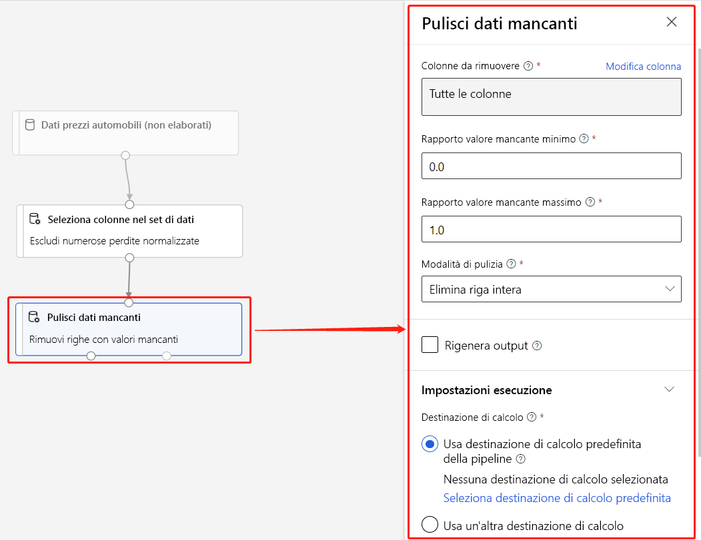

# Che cos'è Finestra di progettazione di Azure Machine Learning (anteprima)? 
[!INCLUDE [applies-to-skus](../../includes/aml-applies-to-enterprise-sku.md)]

La finestra di progettazione di Azure Machine Learning consente di connettere visivamente [set di dati](#datasets) e [moduli](#module) in un canvas interattivo per creare modelli di apprendimento automatico. Per informazioni su come iniziare a usare il progettista, vedere [Esercitazione: prevedere il prezzo dell'automobile con il progettista](tutorial-designer-automobile-price-train-score.md)

La finestra di progettazione usa [l'area di lavoro](concept-workspace.md) di Azure Machine Learning per organizzare le risorse condivise, ad esempio:The designer uses your Azure Machine Learning workspace to organize shared resources such as:

+ [Pipeline](#pipeline)
+ [Set di dati](#datasets)
+ [Risorse di calcolo](#compute)
+ [Modelli registrati](concept-azure-machine-learning-architecture.md#models)
+ [Pipeline pubblicate](#publish)
+ [Endpoint in tempo reale](#deploy)

## Formazione e distribuzione dei modelli

La finestra di progettazione offre un'area di disegno visiva per compilare, testare e distribuire modelli di Apprendimento automatico. Con il progettista è possibile:

+ Trascinare i [set di dati](#datasets) e i [moduli](#module) nell'area di disegno.
+ Connettere i moduli insieme per creare una bozza di [pipeline.](#pipeline-draft)
+ Inviare [un'esecuzione della pipeline](#pipeline-run) usando le risorse di calcolo nell'area di lavoro di Azure Machine Learning.Submit a pipeline run using the compute resources in your Azure Machine Learning workspace.
+ Convertire **le pipeline** di training in pipeline di **inferenza**.
+ [Pubblicare](#publish) le pipeline in un **endpoint della pipeline** REST per inviare nuove esecuzioni della pipeline con parametri e set di dati diversi.
    + Pubblicare una pipeline di **training** per riutilizzare una singola pipeline per eseguire il training di più modelli durante la modifica di parametri e set di dati.
    + Pubblicare una pipeline di **inferenza batch** per eseguire stime sui nuovi dati usando un modello sottoposto a training precedente.
+ [Distribuire](#deploy) una pipeline di **inferenza in tempo reale** in un endpoint in tempo reale per eseguire stime sui nuovi dati in tempo reale.

## Pipeline

Una [pipeline](concept-azure-machine-learning-architecture.md#ml-pipelines) è costituita da set di dati e moduli analitici, che consentono di connettersi tra loro. Le pipeline hanno molti usi: è possibile creare una pipeline che esegue il training di un singolo modello o una che esegue il training di più modelli. È possibile creare una pipeline che esegue stime in tempo reale o in batch oppure eseguire una pipeline che pulisce solo i dati. Le pipeline consentono di riutilizzare il lavoro e organizzare i progetti.

### Bozza della pipeline

Quando si modifica una pipeline nella finestra di progettazione, lo stato di avanzamento viene salvato come bozza della **pipeline.** È possibile modificare una bozza della pipeline in qualsiasi momento aggiungendo o rimuovendo moduli, configurando destinazioni di calcolo, creando parametri e così via.

Una pipeline valida ha le seguenti caratteristiche:

* I set di dati possono connettersi solo ai moduli.
* I moduli possono connettersi solo a set di dati o ad altri moduli.
* Tutte le porte di input per i moduli devono avere una connessione al flusso di dati.
* Tutti i parametri obbligatori per ogni modulo devono essere impostati.

Quando si è pronti per eseguire la bozza della pipeline, si invia un'esecuzione della pipeline.

### Esecuzione della pipeline

Ogni volta che si esegue una pipeline, la configurazione della pipeline e i relativi risultati vengono archiviati nell'area di lavoro come **esecuzione della pipeline.** È possibile tornare a qualsiasi esecuzione della pipeline per esaminarla a scopo di risoluzione dei problemi o controllo. **Clonare** un'esecuzione della pipeline per creare una nuova bozza della pipeline da modificare.

Le esecuzioni della pipeline sono raggruppate in esperimenti per organizzare la cronologia delle [esecuzioni.](concept-azure-machine-learning-architecture.md#experiments) È possibile impostare l'esperimento per ogni esecuzione della pipeline. 

## Set di dati

Un set di dati di Machine Learning semplifica l'accesso e l'utilizzo dei dati. Nella finestra di progettazione sono inclusi numerosi set di dati di esempio. È possibile [registrare](how-to-create-register-datasets.md) più set di dati in base alle esigenze.

## Modulo

Un modulo è un algoritmo che è possibile applicare ai dati. La finestra di progettazione dispone di una serie di moduli che vanno dalle funzioni di ingresso dati ai processi di training, punteggio e convalida.

Un modulo può avere un set di parametri che è possibile usare per configurare gli algoritmi interni del modulo. Quando si seleziona un modulo nell'area di disegno, i parametri del modulo sono visualizzati nel riquadro Properties a destra dell'area di disegno. È possibile modificare i parametri in questo riquadro per ottimizzare il modello. È possibile impostare le risorse di calcolo per i singoli moduli nella finestra di progettazione. 

Per informazioni utili per spostarsi nella libreria di algoritmi di machine learning disponibili, vedere Panoramica dei riferimenti ai [moduli di & degli algoritmiFor](algorithm-module-reference/module-reference.md) some help navigating through the library of machine learning algorithms available, see Algorithm & module reference overview

## Risorse di calcolo

Usare le risorse di calcolo dall'area di lavoro per eseguire la pipeline e ospitare i modelli distribuiti come endpoint in tempo reale o endpoint della pipeline (per l'inferenza di batch). Le destinazioni di calcolo supportate sono:

| Destinazione del calcolo | Formazione | Distribuzione |
| ---- |:----:|:----:|
| Ambiente di calcolo di Azure Machine Learning | ✓ | |
| Servizio Azure Kubernetes | | ✓ |

Le destinazioni di calcolo sono collegate all'area di lavoro di [Azure Machine Learning.](concept-workspace.md) Le destinazioni di calcolo vengono gestite nell'area di lavoro in [Azure Machine Learning Studio (classico).](https://ml.azure.com)

## Distribuire

Per eseguire l'inferenza in tempo reale, è necessario distribuire una pipeline come endpoint in **tempo reale.** L'endpoint in tempo reale crea un'interfaccia tra un'applicazione esterna e il modello di punteggio. Una chiamata a un endpoint in tempo reale restituisce i risultati della stima all'applicazione in tempo reale. Per effettuare una chiamata a un endpoint in tempo reale, si passa la chiave API creata durante la distribuzione dell'endpoint. L'endpoint si basa su REST, una scelta di architettura popolare per i progetti di programmazione web.

Gli endpoint in tempo reale devono essere distribuiti in un cluster di servizi Azure Kubernetes.Real-time endpoints must be deployed to an Azure Kubernetes Service cluster.

Per informazioni su come distribuire il modello, vedere [Esercitazione: Distribuire un modello](tutorial-designer-automobile-price-deploy.md)di Machine Learning con la finestra di progettazione .

## Pubblica

È inoltre possibile pubblicare una pipeline in un **endpoint della pipeline.** Analogamente a un endpoint in tempo reale, un endpoint della pipeline consente di inviare nuove esecuzioni della pipeline da applicazioni esterne tramite chiamate REST. Tuttavia, non è possibile inviare o ricevere dati in tempo reale utilizzando un endpoint della pipeline.

Le pipeline pubblicate sono flessibili, possono essere utilizzate per eseguire il training o il riadeggio dei modelli, [eseguire l'inferenza in batch,](how-to-run-batch-predictions-designer.md)elaborare nuovi dati e molto altro ancora. È possibile pubblicare più pipeline in un singolo endpoint della pipeline e specificare la versione della pipeline da eseguire.

Una pipeline pubblicata viene eseguita sulle risorse di calcolo definite nella bozza della pipeline per ogni modulo.

La finestra di progettazione crea lo stesso oggetto [PublishedPipeline](https://docs.microsoft.com/python/api/azureml-pipeline-core/azureml.pipeline.core.graph.publishedpipeline?view=azure-ml-py) dell'SDK.

## Passaggio dall'interfaccia visiva alla finestra di progettazione

L'interfaccia visiva (anteprima) è stata aggiornata ed è ora la finestra di progettazione di Azure Machine Learning (anteprima). La finestra di progettazione è stata riprogettata per usare un back-end basato su pipeline che si integra completamente con le altre funzionalità di Azure Machine Learning.The designer has been been rearchitectd to use a pipeline-based backend that fully integrates with the other features of Azure Machine Learning. 

Come risultato di questi aggiornamenti, alcuni concetti e termini per l'interfaccia visiva sono stati modificati o rinominati. Vedere la tabella seguente per le modifiche concettuali più importanti. 

| Concetto nel designer | In precedenza nell'interfaccia visiva |
| ---- |:----:|
| Bozza della pipeline | Esperimento |
| Endpoint in tempo reale | Servizio Web |

### Migrazione alla finestra di progettazioneMigrating to the designer

È possibile convertire gli esperimenti di interfaccia visiva e i servizi Web esistenti in pipeline ed endpoint in tempo reale nella finestra di progettazione. Per eseguire la migrazione degli asset dell'interfaccia visiva, eseguire la procedura seguente:Use the following steps to migrate your visual interface assets:

[!INCLUDE [migrate from the visual interface](../../includes/aml-vi-designer-migration.md)]

## Passaggi successivi

* Scopri le nozioni di base dell'analisi predittiva e dell'apprendimento automatico con [Tutorial: Predict automobile price with the designer](tutorial-designer-automobile-price-train-score.md)
* Scopri come modificare gli esempi di [progettazione](samples-designer.md) esistenti per adattarli alle tue esigenze.

