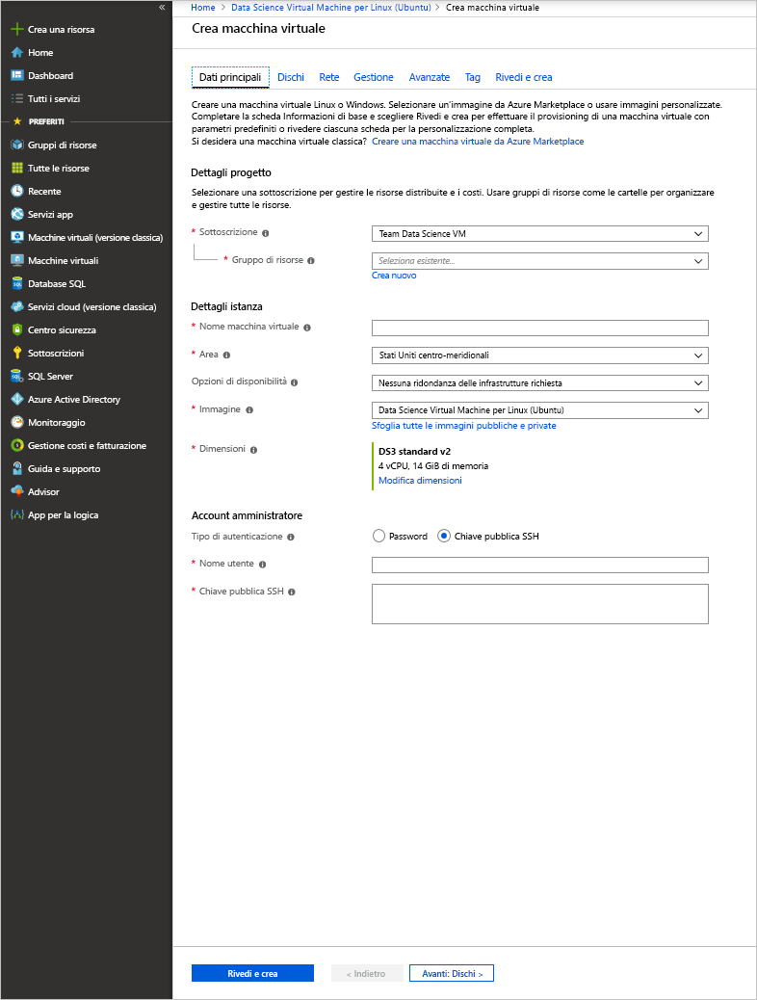

# <a name="quickstart-set-up-the-data-science-virtual-machine-for-linux-ubuntu"></a>Guida introduttiva: Configurare la Data Science Virtual Machine per Linux (Ubuntu)

La Data Science Virtual Machine (DSVM) per Linux è un'immagine di macchina virtuale basata su Ubuntu che semplifica l'uso di Machine Learning, incluso Deep Learning, in Azure. Gli strumenti di apprendimento avanzato includono:

* [Caffe](https://caffe.berkeleyvision.org/): un'infrastruttura di Deep Learning creata per la velocità, l'espressività e la modularità.
* [Caffe2](https://github.com/caffe2/caffe2): una versione multipiattaforma di Caffe.
* [Microsoft Cognitive Toolkit](https://github.com/Microsoft/CNTK): toolkit per software di Deep Learning sviluppato da Microsoft Research.
* [H2O](https://www.h2o.ai/): una piattaforma open source per Big Data e un interfaccia utente grafica.
* [Keras](https://keras.io/): un'API per reti neurali di alto livello in Python per TensorFlow, Microsoft Cognitive Toolkit e Theano.
* [MXNet](https://mxnet.io/): una libreria di Deep Learning flessibile ed efficiente con numerosi binding di linguaggio.
* [NVIDIA DIGITS](https://developer.nvidia.com/digits): un sistema grafico che semplifica le attività di Deep Learning comuni.
* [PyTorch](https://pytorch.org/): una libreria Python di alto livello con supporto per le reti dinamiche.
* [TensorFlow](https://www.tensorflow.org/): una libreria open source di Google per l'intelligenza artificiale.
* [Theano](http://deeplearning.net/software/theano/): una libreria Python per definire, ottimizzare e valutare in modo efficiente espressioni matematiche che includono matrici multidimensionali.
* [Torch](http://torch.ch/): un framework di calcolo scientifico con ampio supporto per algoritmi di Machine Learning.
* CUDA, cuDNN e il driver NVIDIA.
* Molti esempi di Jupyter Notebook.

Tutte le librerie sono le versioni GPU, anche se possono funzionare sulla CPU.

La macchina virtuale per l'analisi scientifica dei dati per Linux contiene anche strumenti di ampia diffusione per attività di sviluppo e di analisi scientifica dei dati, tra cui:

* Microsoft Machine Learning Server con Microsoft R Open.
* Distribuzione di Anaconda Python, versioni 2.7 e 3.5, incluse le più comuni librerie di analisi dei dati.
* JuliaPro, un'accurata distribuzione del linguaggio Julia con librerie di analisi dei dati e scientifiche ampiamente diffuse.
* Istanza autonoma di Spark e Hadoop a nodo singolo (HDFS, YARN).
* JupyterHub, un server Jupyter Notebook multiutente che supporta kernel R, Python, PySpark e Julia.
* Azure Storage Explorer
* Interfaccia della riga di comando di Azure per la gestione delle risorse di Azure.
* Strumenti di Machine Learning:
  * [Vowpal Wabbit](https://github.com/JohnLangford/vowpal_wabbit): un sistema veloce di Machine Learning che supporta tecniche come online, hashing, allreduce, reduction, learning2search, nonché apprendimento attivo e interattivo.
  * [XGBoost](https://xgboost.readthedocs.org/en/latest/): Strumento che consente un'implementazione di albero con boosting rapida e accurata.
  * [Rattle](https://togaware.com/rattle/): uno strumento grafico che consente di iniziare a usare con facilità l'analisi dei dati e Machine Learning in R.
  * [LightGBM](https://github.com/Microsoft/LightGBM): un framework di gradient boosting veloce, distribuito e con prestazioni elevate.
* Azure SDK in Java, Python, Node.js, Ruby e PHP.
* Librerie in R e Python da usare in Azure Machine Learning e altri servizi di Azure.
* Editor e strumenti di sviluppo (RStudio, PyCharm, IntelliJ, Emacs, vim).

L'esecuzione dell'analisi scientifica dei dati comporta l'iterazione di una sequenza di attività quali:

1. Ricerca, caricamento e pre-elaborazione dei dati
1. Compilazione e test di modelli
1. Distribuzione dei modelli per l'uso in applicazioni intelligenti

Gli esperti di dati usano vari strumenti per completare queste attività. Trovare le versioni appropriate del software e quindi scaricarle, compilarle e installarle può essere un'operazione dispersiva in termini di tempo.

La macchina virtuale per l'analisi scientifica dei dati per Linux può rendere queste attività sostanzialmente più facili. Usarla per avviare rapidamente il progetto di analisi. Consente di svolgere attività in diversi linguaggi, ad esempio R, Python, SQL, Java e C++. Azure SDK, incluso nella VM, consente di compilare le applicazioni usando vari servizi in Linux sulla piattaforma cloud di Microsoft. È anche possibile accedere ad altri linguaggi, come Ruby, Perl, PHP e Node. js, anch'essi preinstallati.

Per questa immagine di DSVM non sono previsti costi per il software. Si pagano solo le spese d'uso dell'hardware di Azure valutate in base alle dimensioni della macchina virtuale di cui si esegue il provisioning. Per altre informazioni sui costi delle risorse di calcolo, vedere la [pagina del listino di VM in Azure Marketplace](https://azure.microsoft.com/marketplace/partners/microsoft-ads/linux-data-science-vm/).

## <a name="other-versions-of-the-data-science-virtual-machine"></a>Altre versioni di Data Science Virtual Machine

È disponibile anche un'immagine [CentOS](linux-dsvm-intro.md), con molti degli stessi strumenti dell'immagine Ubuntu. È anche disponibile un'immagine [Windows](provision-vm.md).

## <a name="prerequisites"></a>Prerequisiti

Prima di creare una macchina virtuale per l'analisi scientifica dei dati per Linux è necessario avere una sottoscrizione di Azure. È possibile [ottenere una versione di valutazione gratuita di Azure](https://azure.microsoft.com/free/).

## <a name="create-your-data-science-virtual-machine-for-linux"></a>Creare la macchina virtuale per l'analisi scientifica dei dati per Linux

Di seguito sono elencati i passaggi per la creazione di un'istanza della macchina virtuale per l'analisi scientifica dei dati per Linux:

1. Andare all'elenco di macchine virtuali nel [portale di Azure](https://portal.azure.com/#create/microsoft-dsvm.linux-data-science-vm-ubuntulinuxdsvmubuntu). Se non è stato ancora eseguito l'accesso all'account Azure, verrà probabilmente chiesto di farlo. 
1. Selezionare **Crea** per aprire la procedura guidata.
    
1. Immettere le informazioni seguenti per configurare ogni passaggio della procedura guidata:

    1. **Nozioni di base**:
    
       * **Sottoscrizione** Se si hanno più sottoscrizioni, selezionare quella in cui verrà creata e fatturata la macchina virtuale. È necessario disporre di privilegi di creazione delle risorse per questa sottoscrizione.
       * **Gruppo di risorse**: È possibile creare un nuovo gruppo di risorse o usare un gruppo esistente.
       * **Nome macchina virtuale**: immettere il nome del server di data science che si sta creando.
       * **Area**: selezionare il data center più appropriato. In genere è il data center che include la maggior parte dei dati o è più vicino alla posizione fisica per l'accesso più veloce alla rete.
       * **Opzioni di disponibilità**: impostare questa opzione se si vuole usare questa VM in zone o set di disponibilità. Altrimenti, lasciare l'impostazione predefinita.
       * **Immagine**: Lasciare il valore predefinito.
       * **Dimensione**: selezionare il tipo di server che soddisfa i requisiti funzionali e i vincoli di costo. Selezionare una macchina virtuale serie NC o ND per le istanze di macchina virtuale basate su GPU. 
       * **Nome utente**: immettere il nome utente dell'amministratore.
       * **Chiave pubblica SSH**: immettere la chiave pubblica RSA nel formato a riga singola. È possibile usare una password anziché una chiave SSH.
    
    1. **Dischi**:
    
       * **Tipo di disco del sistema operativo**: se si preferisce un'unità a stato solido, scegliere **SSD Premium**. In caso contrario, scegliere **HDD Standard**.
    
    1. Per le altre impostazioni, è possibile usare i valori predefiniti. Per visualizzare i valori non predefiniti, passare il puntatore sul collegamento informativo. Al termine, selezionare **Rivedi e crea**.
    
    1. Dopo la convalida dalla VM, verificare che tutte le informazioni immesse siano corrette. Un collegamento indirizza alle condizioni per l'utilizzo. La VM non prevede costi aggiuntivi oltre a quelli delle risorse di calcolo per le dimensioni del server scelte nel passaggio **Dimensioni**. Per avviare il provisioning, selezionare **Crea**.
    
    Per il provisioning sono necessari circa 5 minuti. Lo stato viene visualizzato nel portale di Azure.

## <a name="how-to-access-the-data-science-virtual-machine-for-linux"></a>Come accedere alla macchina virtuale per l'analisi scientifica dei dati per Linux

Sono disponibili tre metodi per accedere alla DSVM Ubuntu:

- SSH per le sessioni terminale
- X2Go per le sessioni grafiche
- JupyterHub e JupyterLab per i notebook di Jupyter

È anche possibile collegare una Data Science Virtual Machine ad Azure Notebooks per eseguire istanze di Jupyter Notebook nella VM e ignorare le limitazioni del livello di servizio gratuito. Per altre informazioni, vedere [Gestire e configurare i progetti di Azure Notebooks](../../notebooks/configure-manage-azure-notebooks-projects.md#compute-tier).

### <a name="ssh"></a>SSH

Dopo aver creato la VM, è possibile accedervi tramite SSH. Usare le credenziali dell'account creato nella sezione **Nozioni di base** del passaggio 3 per l'interfaccia della shell di testo. In Windows è possibile scaricare uno strumento client SSH come [PuTTY](https://www.putty.org). Se si preferisce un desktop con interfaccia grafica (X Windows System), è possibile usare X11 Forwarding in PuTTY o installare il client X2Go.

> [!NOTE]
> Nei test il client X2Go ha fornito prestazioni migliori di X11 Forwarding. È quindi consigliabile usare il client X2Go per un'interfaccia desktop grafica.

### <a name="x2go"></a>X2Go

Nella VM Linux è già stato effettuato il provisioning del server X2Go ed è possibile iniziare ad accettare connessioni client. Per connettersi al desktop con interfaccia grafica della VM Linux, è necessario completare la procedura seguente nel client:

1. Scaricare e installare il client X2Go per la piattaforma client da [X2Go](https://wiki.x2go.org/doku.php/doc:installation:x2goclient).
1. Eseguire il client X2Go e selezionare **New Session**(Nuova sessione). Viene visualizzata una finestra di configurazione con più schede. Immettere i parametri di configurazione seguenti:
   * **Scheda Session**(Sessione):
     * **Host**: immettere il nome host o l'indirizzo IP della Data Science Virtual Machine Linux.
     * **Accesso**: immettere il nome utente nella VM Linux.
     * **Porta SSH**: lasciare il valore predefinito 22.
     * **Session Type** (Tipo di sessione): modificare il valore in **XFCE**. Attualmente, la VM Linux supporta solo l'ambiente desktop XFCE.
   * **Scheda Supporti**: è possibile disattivare il supporto audio e la stampa client se non è necessario usarli.
   * **Shared folders** (Cartelle condivise): se si prevede di montare directory dei computer client nella VM Linux, aggiungere in questa scheda le directory dei computer client da condividere con la VM.

Dopo aver eseguito l'accesso alla VM con il client SSH o il desktop con interfaccia grafica XFCE tramite il client X2Go, è possibile iniziare a usare gli strumenti installati e configurati nella VM. In XFCE è possibile visualizzare i collegamenti ai menu delle applicazioni e le icone del desktop per molti di questi strumenti.

### <a name="jupyterhub-and-jupyterlab"></a>JupyterHub e JupyterLab

La DSVM Ubuntu esegue [JupyterHub](https://github.com/jupyterhub/jupyterhub), un server Jupyter multiutente. Per connettersi, passare a https:\//ip-vm:8000 nel computer portatile o desktop. Immettere il nome utente e la password usati per creare la VM ed eseguire l'accesso. Molti notebook di esempio sono disponibili da esplorare e provare a usare.

Sono disponibili anche JupyterLab, la prossima generazione di notebook Jupyter e JupyterHub. Per accedervi, eseguire l'accesso a JupyterHub, quindi passare all'URL https:\//ip-vm:8000/user/nome-utente/lab. È possibile impostare JupyterLab come server notebook predefinito aggiungendo questa riga al file `/etc/jupyterhub/jupyterhub_config.py`:

```python
c.Spawner.default_url = '/lab'
```

## <a name="tools-installed-on-the-data-science-virtual-machine-for-linux"></a>Strumenti installati nella macchina virtuale per l'analisi scientifica dei dati per Linux

### <a name="deep-learning-libraries"></a>Librerie di Deep Learning

#### <a name="cntk"></a>CNTK

Microsoft Cognitive Toolkit è un toolkit open source di Deep Learning. Sono disponibili binding Python negli ambienti root e py35 Conda, oltre a uno strumento da riga di comando (CNTK) già incluso in PATH.

I notebook di Python di esempio sono disponibili in JupyterHub. Per un esempio di base nella riga di comando, eseguire i comandi seguenti nella shell:

```bash
cd /home/[USERNAME]/notebooks/CNTK/HelloWorld-LogisticRegression
cntk configFile=lr_bs.cntk makeMode=false command=Train
```

Per altre informazioni, vedere la sezione CNTK di [GitHub](https://github.com/Microsoft/CNTK) e il [wiki di CNTK](https://github.com/Microsoft/CNTK/wiki).

#### <a name="caffe"></a>Caffe

Caffe è un framework di apprendimento avanzato del Berkeley Vision and Learning Center. È disponibile in /opt/caffe. È possibile trovare esempi in/opt/caffe/examples.

#### <a name="caffe2"></a>Caffe2

Caffe2 è un framework di Facebook per l'apprendimento avanzato, basato su Caffe. È disponibile in Python 2.7 nell'ambiente radice Conda. Per attivarlo, eseguire il comando seguente dalla shell:

```bash
source /anaconda/bin/activate root
```

Sono disponibili alcuni notebook di esempio in JupyterHub.

#### <a name="h2o"></a>H2O

H2O è una piattaforma rapida, in memoria e distribuita di analisi predittiva e Machine Learning. Un pacchetto Python è installato negli ambienti root e py35 Anaconda. Viene installato anche un pacchetto R. 

Per aprire H2O dalla riga di comando, eseguire `java -jar /dsvm/tools/h2o/current/h2o.jar`. È possibile configurare [diverse opzioni della riga di comando](http://docs.h2o.ai/h2o/latest-stable/h2o-docs/starting-h2o.html#from-the-command-line). È possibile accedere all'interfaccia utente Web di Flow passando a http://localhost:54321 per iniziare. Sono anche disponibili notebook di esempio in JupyterHub.

#### <a name="keras"></a>Keras

Keras è un'API per reti neurali di alto livello in Python. Si può eseguire su TensorFlow, Microsoft Cognitive Toolkit o Theano. È disponibile negli ambienti gli ambienti radice e py35 Python.

#### <a name="mxnet"></a>MXNet

MXNet è un framework di apprendimento avanzato progettato per l'efficienza e la flessibilità. Offre binding R e Python inclusi nella macchina virtuale per l'analisi scientifica dei dati. Sono disponibili notebook di esempio in JupyterHub, mentre il codice di esempio è disponibile in /dsvm/samples/mxnet.

#### <a name="nvidia-digits"></a>NVIDIA DIGITS

NVIDIA Deep Learning GPU Training System (DIGITS) è un sistema che semplifica le comuni attività di Deep Learning. Queste attività includono la gestione dei dati, la progettazione e il training di reti neurali nei sistemi GPU, oltre al monitoraggio delle prestazioni in tempo reale con visualizzazione avanzata.

DIGITS è disponibile come servizio denominato *digits*. Avviare il servizio e passare a http://localhost:5000 per iniziare.

DIGITS viene anche installato come modulo Python nell'ambiente root Conda.

#### <a name="tensorflow"></a>TensorFlow

TensorFlow è la libreria di apprendimento avanzato di Google. Si tratta di una libreria software open source per calcoli numerici con grafici del flusso di dati. TensorFlow è disponibile nell'ambiente py35 Python e alcuni notebook di esempio sono inclusi in JupyterHub.

#### <a name="theano"></a>Theano

Theano è una libreria Python per calcoli numerici efficienti. È disponibile negli ambienti gli ambienti radice e py35 Python. 

#### <a name="torch"></a>Torch

Torch è un framework di calcolo scientifico con ampio supporto per algoritmi di Machine Learning. È disponibile in /dsvm/tools/torch, mentre la sessione interattiva **th** e la gestione pacchetti LuaRocks sono disponibili nella riga di comando. Esempi sono disponibili in /dsvm/samples/torch.

PyTorch è disponibile nell'ambiente root Anaconda. Esempi sono disponibili in /dsvm/samples/pytorch.

### <a name="microsoft-machine-learning-server"></a>Microsoft Machine Learning Server

R è uno dei linguaggi più diffusi per l'analisi dei dati e il Machine Learning. Se si vuole usare R per l'esecuzione di analisi, è necessario che nella VM sia installato Microsoft Learning Server con Microsoft R Open e Math Kernel Library. Math Kernel Library ottimizza le operazioni matematiche comuni negli algoritmi analitici. Microsoft R Open è totalmente compatibile con CRAN-R e tutte le librerie R pubblicate in CRAN possono essere installate in questo sistema. 

Machine Learning Server garantisce scalabilità e operazionalizzazione dei modelli R in servizi Web. È possibile modificare i programmi R in uno degli editor predefiniti, ad esempio RStudio, VI o Emacs. Se si preferisce usare l'editor Emacs, è stato pre-installato. Il pacchetto ESS di Emacs (Emacs Speaks Statistics) semplifica l'uso di file R all'interno dell'editor Emacs.

Per aprire la console R, immettere **R** nella shell. Questo comando consente di accedere a un ambiente interattivo. Per sviluppare il programma R, si usa in genere un editor come Emacs o vi e quindi si eseguono gli script all'interno di R. Con RStudio si ottiene un IDE completo con interfaccia grafica per sviluppare programmi R.

È anche disponibile uno script R per installare i [principali 20 pacchetti R](https://www.kdnuggets.com/2015/06/top-20-r-packages.html), se necessario. È possibile eseguire questo script nell'interfaccia interattiva di R. Come indicato in precedenza, è possibile aprire tale interfaccia immettendo **R** nella shell.  

### <a name="python"></a>Python

Anaconda Python viene installato con ambienti Python 2.7 e 3.5. L'ambiente 2.7 è detto _radice_, mentre l'ambiente 3.5 è detto _py35_. Questa distribuzione contiene il linguaggio Python di base con circa 300 dei più diffusi pacchetti di matematica, ingegneria e analisi dei dati.

L'ambiente py35 è il valore predefinito. Per attivare l'ambiente radice (2.7), usare questo comando:

```bash
source activate root
```

Per attivare di nuovo l'ambiente py35, usare questo comando:

```bash
source activate py35
```

Per richiamare la sessione interattiva di Python, immettere **python** nella shell. 

Installare altre librerie di Python usando Conda o pip. Per pip, attivare innanzitutto l'ambiente corretto se non si vuole usare il valore predefinito:

```bash
source activate root
pip install <package>
```

In alternativa, specificare il percorso completo a pip:

```bash
/anaconda/bin/pip install <package>
```

Per Conda, è necessario specificare sempre il nome dell'ambiente (py35 oppure radice):

```bash
conda install <package> -n py35
```

Se si usa un'interfaccia grafica o è configurato X11 Forwarding, è possibile immettere il comando **pycharm** per aprire l'IDE PyCharm di Python. È possibile usare gli editor di testo predefiniti. È inoltre possibile usare Spyder, un IDE Python incluso nelle distribuzioni di Anaconda Python. Spyder richiede un desktop con interfaccia grafica o X11 Forwarding. Nel desktop con interfaccia grafica è disponibile un collegamento a Spyder.

### <a name="jupyter-notebook"></a>Notebook di Jupyter

La distribuzione Anaconda include anche Jupyter Notebook, un ambiente per condividere codice e analisi. Notebook di Jupyter è accessibile tramite JupyterHub. Per eseguire l'accesso, usare il nome utente e la password locali di Linux.

Il server Notebook di Jupyter è stato preconfigurato con Python 2, Python 3 e i kernel R. Usare l'icona del desktop **Jupyter Notebook** per aprire il browser e accedere al server notebook. Se si usa la VM tramite client X2Go o SSH, è anche possibile visitare [https://localhost:8000/](https://localhost:8000/) per accedere al server Jupyter Notebook.

> [!NOTE]
> Se vengono visualizzati avvisi relativi al certificato, scegliere di continuare.

È possibile accedere al server Jupyter Notebook da qualsiasi host, immettendo **https://\<nome DNS o indirizzo IP della VM\>:8000/** .

> [!NOTE]
> La porta 8000 è aperta nel firewall per impostazione predefinita quando viene effettuato il provisioning della VM. 

Nel pacchetto sono inclusi i notebook di esempio: uno in Python e uno in R. È possibile visualizzare il collegamento agli esempi nella home page del notebook dopo l'autenticazione in Jupyter Notebook con il nome utente e la password locali di Linux. È possibile creare un nuovo notebook selezionando **Nuovo** e quindi il kernel del linguaggio adatto. Se il pulsante **Nuovo** non è visualizzato, selezionare l'icona **Jupyter** in alto a sinistra per passare alla home page del server notebook.

### <a name="apache-spark-standalone"></a>Apache Spark autonomo

Un'istanza autonoma di Spark è preinstallata nella DSVM Linux per agevolare lo sviluppo di applicazioni Spark in locale prima di testarle e distribuirle in cluster di grandi dimensioni. 

È possibile eseguire programmi PySpark attraverso il kernel Jupyter. Quando si apre Jupyter, selezionare il pulsante **Nuovo** per visualizzare un elenco di kernel disponibili. **Spark - Python** è il kernel PySpark che consente di creare applicazioni Spark usando il linguaggio Python. È anche possibile usare un IDE Python come PyCharm o Spyder per creare un programma Spark. 

Nell'istanza autonoma lo stack Spark viene eseguito nel programma client chiamante. Questa funzionalità velocizza e semplifica la risoluzione dei problemi rispetto allo sviluppo in un cluster Spark.

Jupyter fornisce un notebook PySpark di esempio. Si trova nella directory SparkML all'interno della d home directory di Jupyter ($HOME/notebooks/SparkML/pySpark). 

Se si programma in R per Spark, è possibile usare Microsoft Machine Learning Server, SparkR o sparklyr. 

Prima di operare in un contesto Spark in Microsoft Machine Learning Server, è necessario eseguire un unico passaggio di configurazione per abilitare un'istanza locale di HDFS e YARN Hadoop a nodo singolo. Per impostazione predefinita, i servizi Hadoop sono installati ma disabilitati su DSVM. Per abilitarli, è necessario eseguire i comandi seguenti come radice la prima volta:

```bash
echo -e 'y\n' | ssh-keygen -t rsa -P '' -f ~hadoop/.ssh/id_rsa
cat ~hadoop/.ssh/id_rsa.pub >> ~hadoop/.ssh/authorized_keys
chmod 0600 ~hadoop/.ssh/authorized_keys
chown hadoop:hadoop ~hadoop/.ssh/id_rsa
chown hadoop:hadoop ~hadoop/.ssh/id_rsa.pub
chown hadoop:hadoop ~hadoop/.ssh/authorized_keys
systemctl start hadoop-namenode hadoop-datanode hadoop-yarn
```

È possibile arrestare i servizi correlati a Hadoop quando non sono necessari eseguendo ```systemctl stop hadoop-namenode hadoop-datanode hadoop-yarn```.

La directory /dsvm/samples/MRS contiene un esempio che illustra come sviluppare e testare Microsoft Machine Learning Server in un contesto Spark remoto (l'istanza autonoma di Spark nella DSVM).

### <a name="ides-and-editors"></a>IDE ed editor

È possibile scegliere tra diversi editor di codice, tra cui vi/VIM, Emacs, PyCharm, RStudio e IntelliJ. 

PyCharm, RStudio e IntelliJ sono editor grafici. Per usarli, è necessario aver eseguito l'accesso a un desktop con interfaccia grafica. Per aprirli, usare i collegamenti del desktop e del menu dell'applicazione.

VIM e Emacs sono editor basati su testo. In Emacs il pacchetto di componenti aggiuntivi ESS semplifica l'uso di R nell'editor Emacs. Per altre informazioni, visitare il [sito Web ESS](https://ess.r-project.org/).

LaTeX viene installato tramite il pacchetto texlive, insieme a un pacchetto di componenti aggiuntivi Emacs denominato [AUCTeX](https://www.gnu.org/software/auctex/manual/auctex/auctex.html). Questo pacchetto semplifica la creazione di documenti LaTeX in Emacs.  

### <a name="databases"></a>Database

#### <a name="graphical-sql-client"></a>Client SQL grafico

SQuirreL SQL, un client SQL grafico, viene fornito per la connessione a vari database, come Microsoft SQL Server e MySQL, e per l'esecuzione di query SQL. È possibile eseguire SQuirrel SQL da una sessione desktop con interfaccia grafica (ad esempio tramite il client X2Go) usando un'icona del desktop. In alternativa, è possibile eseguire il client usando il comando seguente nella shell:

```bash
/usr/local/squirrel-sql-3.7/squirrel-sql.sh
```

Prima di usarlo per la prima volta, è necessario configurare i driver e gli alias di database. I driver JDBC si trovano nel percorso /usr/share/java/jdbcdrivers.

Per altre informazioni, vedere [SQL SQuirrel](http://squirrel-sql.sourceforge.net/index.php?page=screenshots).

#### <a name="command-line-tools-for-accessing-microsoft-sql-server"></a>Strumenti da riga di comando per l'accesso a Microsoft SQL Server

Anche nel pacchetto driver ODBC per SQL Server sono disponibili due strumenti da riga di comando:

- **bcp**: questo strumento crea copie bulk di dati tra un'istanza di Microsoft SQL Server e un file di dati in un formato specificato dall'utente. È possibile usarlo per importare un numero elevato di nuove righe nelle tabelle di SQL Server o per esportare dati delle tabelle in file di dati. Per importare dati in una tabella, è necessario usare un file in un formato creato per tale tabella. In alternativa, è necessario conoscere la struttura della tabella e i tipi di dati validi per le relative colonne.

  Per altre informazioni, vedere [Connessione a bcp](https://msdn.microsoft.com/library/hh568446.aspx).

- **sqlcmd**: questo strumento consente di immettere istruzioni Transact-SQL. È anche possibile immettere procedure di sistema e file di script al prompt dei comandi. Questo strumento usa ODBC per eseguire batch Transact-SQL.

  Per altre informazioni, vedere [Connessione con sqlcmd](https://msdn.microsoft.com/library/hh568447.aspx).

  > [!NOTE]
  > Questo strumento presenta alcune differenze tra le piattaforme Linux e Windows. Per informazioni dettagliate, vedere la documentazione di .

#### <a name="database-access-libraries"></a>Librerie di accesso al database

Le librerie per l'accesso al database sono disponibili in R e Python:

* In R è possibile usare il pacchetto RODBC o dplyr per eseguire query o istruzioni SQL sul server di database.
* In Python la libreria pyodbc fornisce l'accesso al database con ODBC come livello sottostante.  

### <a name="azure-tools"></a>Strumenti di Azure

Nella VM sono installati gli strumenti di Azure seguenti:

* **Interfaccia della riga di comando di Azure**: consente di creare e gestire risorse di Azure tramite i comandi della shell. Per aprire gli strumenti di Azure, immettere **Azure help**. Per altre informazioni, vedere la [pagina di documentazione sull'interfaccia della riga di comando di Azure](https://docs.microsoft.com/cli/azure/get-started-with-az-cli2).
* **Azure Storage Explorer**: è uno strumento grafico che è possibile usare per esplorare gli oggetti archiviati nell'account di archiviazione di Azure e per caricare o scaricare dati rispettivamente in o da BLOB di Azure. È possibile accedere a Esplora archivi dall'icona del collegamento sul desktop. È anche possibile aprire questo strumento da un prompt della shell digitando **StorageExplorer**. È necessario essere connessi da un client X2Go o avere configurato X11 Forwarding.
* **Librerie di Azure**: di seguito sono elencate alcune delle librerie preinstallate.
  
  * **Python**: le librerie correlate ad Azure in Python sono *azure*, *azureml*, *pydocumentdb* e *pyodbc*. Le prime tre librerie consentono di accedere ai servizi di archiviazione di Azure, Azure Machine Learning e Azure Cosmos DB, ovvero un database NoSQL in Azure. La quarta libreria, pyodbc (insieme ai driver Microsoft ODBC per SQL Server), consente l'accesso da Python a SQL Server, al database SQL di Azure e ad Azure SQL Data Warehouse tramite un'interfaccia ODBC. Immettere **pip list** per vedere elencate tutte le librerie. Assicurarsi di eseguire questo comando in Python sia nell'ambiente 2.7 che 3.5.
  * **R**: le librerie correlate ad Azure in R sono AzureML e RODBC.
  * **Java**: l'elenco delle librerie Java per Azure è disponibile nella directory /dsvm/sdk/AzureSDKJava della VM. Le librerie principali sono le API di archiviazione e gestione di Azure, Azure Cosmos DB e i driver JDBC per SQL Server.  

È possibile accedere al [portale di Azure](https://portal.azure.com) dal browser Firefox pre-installato. Nel portale di Azure si possono creare, gestire e monitorare le risorse di Azure.

### <a name="azure-machine-learning"></a>Azure Machine Learning

Azure Machine Learning è un servizio cloud completamente gestito che consente di creare, distribuire e condividere soluzioni di analisi predittiva. Si possono creare esperimenti e modelli da Azure Machine Learning Studio, a cui è possibile accedere da un Web browser nella Data Science Virtual Machine, visitando il sito [Microsoft Azure Machine Learning](https://studio.azureml.net).

Dopo aver eseguito l'accesso ad Azure Machine Learning Studio, si può accedere a un'area di sperimentazione che consente di creare un flusso logico per gli algoritmi di Machine Learning. È anche possibile accedere a un'istanza di Jupyter Notebook ospitata in Azure Machine Learning e usare direttamente gli esperimenti in Machine Learning Studio. 

È possibile rendere operativi i modelli di Machine Learning creati eseguendone il wrapping in un'interfaccia del servizio Web. In questo modo i client scritti in qualsiasi linguaggio possono richiamare le stime dai modelli di Machine Learning. Per altre informazioni, vedere [Documentazione su Machine Learning](https://azure.microsoft.com/documentation/services/machine-learning/).

È anche possibile creare modelli personalizzati in R o Python nella VM e quindi distribuirli nell'ambiente di produzione in Azure Machine Learning. Per abilitare questa funzionalità sono state installate librerie in R (**AzureML**) e Python (**azureml**).

Per informazioni su come distribuire i modelli in R e Python in Azure Machine Learning, vedere [Ten things you can do on the Data Science Virtual Machine](vm-do-ten-things.md).

> [!NOTE]
> Queste istruzioni sono state scritte per la versione Windows della Data Science Virtual Machine. Tuttavia, le informazioni sulla distribuzione di modelli in Azure Machine Learning è applicabile anche alle VM Linux.

### <a name="machine-learning-tools"></a>Strumenti di Machine Learning

La VM include alcuni strumenti e algoritmi di Machine Learning precompilati e preinstallati localmente. incluse le seguenti:

* **Vowpal Wabbit**: algoritmo di apprendimento rapido online.
* **xgboost**: strumento che fornisce algoritmi di albero con boosting ottimizzati.
* **Rattle**: strumento grafico basato su R per semplificare la modellazione e l'esplorazione dei dati.
* **Python**: Anaconda Python integra algoritmi di Machine Learning con librerie come Scikit-learn. È possibile installare altre librerie usando il comando `pip install` .
* **LightGBM**: framework di gradient boosting rapido, distribuito e a prestazioni elevate basato su algoritmi di tipo albero delle decisioni.
* **R**: una libreria completa di funzioni di Machine Learning disponibili per R. Le librerie preinstallate includono lm, glm, randomForest e rpart. È possibile installare altre librerie eseguendo questo comando:
  
        install.packages(<lib name>)

Ecco alcune informazioni aggiuntive sui primi tre strumenti di Machine Learning nell'elenco.

#### <a name="vowpal-wabbit"></a>Vowpal Wabbit

Vowpal Wabbit è un sistema di apprendimento automatico che usa tecniche come hash, allreduce, reduction, learning2search, nonché apprendimento online, attivo e interattivo.

Per eseguire lo strumento con un esempio di base, usare i comandi seguenti:

```bash
cp -r /dsvm/tools/VowpalWabbit/demo vwdemo
cd vwdemo
vw house_dataset
```

Nella directory sono presenti altre demo più approfondite. Per altre informazioni su Vowpal Wabbit, vedere [questa sezione di GitHub](https://github.com/JohnLangford/vowpal_wabbit) e il [wiki di Vowpal Wabbit](https://github.com/JohnLangford/vowpal_wabbit/wiki).

#### <a name="xgboost"></a>XGBoost

La libreria XGBoost è progettata e ottimizzata per gli algoritmi di albero con boosting. L'obiettivo di questa libreria consiste nello spingere i limiti di calcolo dei computer fino ai massimi livelli necessari per fornire una funzionalità di boosting degli alberi su larga scala portabile, scalabile e accurata.

È disponibile sia come riga di comando che come libreria R. Per usare questa libreria in R, è possibile avviare una sessione R interattiva immettendo **R** nella shell e quindi caricando la libreria.

Ecco un semplice esempio eseguibile al prompt di R:

```R
library(xgboost)

data(agaricus.train, package='xgboost')
data(agaricus.test, package='xgboost')
train <- agaricus.train
test <- agaricus.test
bst <- xgboost(data = train$data, label = train$label, max.depth = 2,
                eta = 1, nthread = 2, nround = 2, objective = "binary:logistic")
pred <- predict(bst, test$data)
```

Per eseguire la riga di comando di xgboost, ecco i comandi da eseguire nella shell:

```bash
cp -r /dsvm/tools/xgboost/demo/binary_classification/ xgboostdemo
cd xgboostdemo
xgboost mushroom.conf
```

Nella directory specificata viene scritto un file con estensione model. Altre informazioni su questa demo sono disponibili in [GitHub](https://github.com/dmlc/xgboost/tree/master/demo/binary_classification).

Per altre informazioni su xgboost, vedere la [pagina della documentazione di xgboost](https://xgboost.readthedocs.org/en/latest/) e il relativo [repository GitHub](https://github.com/dmlc/xgboost).

#### <a name="rattle"></a>Rattle

Rattle (**R** **A**nalytical **T**ool **T**o **L**earn **E**asily) usa la funzionalità di esplorazione e modellazione dei dati basate su GUI. Presenta riepiloghi statistici e visivi dei dati, trasforma i dati che possono essere modellati facilmente, compila modelli con e senza supervisione dai dati, presenta graficamente le prestazioni dei modelli e assegna un punteggio ai nuovi set di dati. Genera anche codice R replicando le operazioni nell'interfaccia utente che possono essere eseguite direttamente in R o usate come punto di partenza per altre analisi.

Per eseguire Rattle, è necessario aprire una sessione di accesso desktop con interfaccia grafica. In un terminale immettere **R** per aprire l'ambiente R. Al prompt di R immettere i comandi seguenti:

```R
library(rattle)
rattle()
```

Si apre un'interfaccia grafica con un set di schede. Seguire questi passaggi di avvio rapido in Rattle per usare un set di dati meteo di esempio e creare un modello. In alcuni passaggi viene chiesto di installare e caricare automaticamente specifici pacchetti R necessari non ancora disponibili nel sistema.

> [!NOTE]
> Se non si ha accesso per installare il pacchetto nella directory di sistema (impostazione predefinita), è possibile che nella finestra della console R venga visualizzata la richiesta di installare i pacchetti nella libreria personale. Se vengono visualizzate queste richieste, rispondere **y** (Sì).

1. Scegliere **Execute**(Esegui).
1. Viene visualizzata una finestra di dialogo in cui viene chiesto se si vuole usare il set di dati meteo di esempio. Selezionare **Yes** (Sì) per caricare l'esempio.
1. Selezionare la scheda **Model** (Modello).
1. Selezionare **Execute** (Esegui) per creare un albero delle decisioni.
1. Selezionare **Draw** (Progetta) per visualizzare l'albero delle decisioni.
1. Selezionare l'opzione **Forest** (Foresta) e quindi **Execute** per creare una foresta casuale.
1. Selezionare la scheda **Evaluate** (Valuta).
1. Selezionare l'opzione **Risk** (Rischio) e quindi **Execute** per visualizzare due tracciati delle prestazioni per **Risk (Cumulative)** (Rischio cumulativo).
1. Selezionare la scheda **Log** per visualizzare il codice R generato per le operazioni precedenti.
   A causa di un bug nella versione corrente di Rattle, è necessario inserire un carattere **#** prima di **Export this log** (Esporta il log) nel testo del log.
1. Selezionare il pulsante **Export** (Esporta) per salvare il file di script R denominato *weather_script.R* nella home directory.

È possibile uscire da Rattle e R. A questo punto è possibile modificare lo script R generato. In alternativa, usare lo script così com'è ed eseguirlo in qualsiasi momento per ripetere tutti i passaggi eseguiti nell'interfaccia utente di Rattle. Si tratta di un modo rapido, specialmente per gli utenti meno esperti di R, per eseguire funzioni di analisi e Machine Learning in un'interfaccia grafica semplice, generando automaticamente codice in R da modificare o per l'apprendimento.

## <a name="next-steps"></a>Passaggi successivi

Ecco come è possibile continuare l'apprendimento e l'esplorazione:

* La procedura dettagliata [Data science nella Data Science Virtual Machine per Linux](linux-dsvm-walkthrough.md) illustra come eseguire diverse attività comuni di data science con la DSVM Linux di è stato effettuato il provisioning in questo articolo. 
* Esplorare i vari strumenti di data science disponibili nella DSVM provando quelli descritti in questo articolo. È anche possibile eseguire `dsvm-more-info` nella shell della macchina virtuale per un'introduzione di base e per visualizzare collegamenti ad altre informazioni sugli strumenti installati nella VM.  
* Informazioni su come creare sistematicamente soluzioni analitiche end-to-end usando il [Processo di analisi scientifica dei dati per i team](https://aka.ms/tdsp).
* Per esempi di apprendimento automatico e di analisi dei dati che usano i servizi di intelligenza artificiale per Azure, visitare [Azure AI Gallery](https://gallery.azure.ai/).
