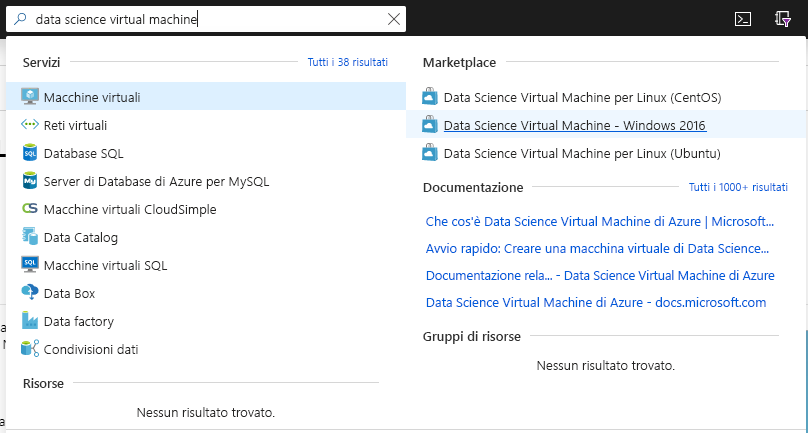
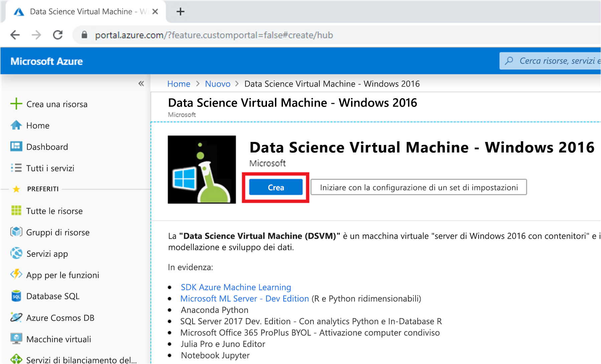
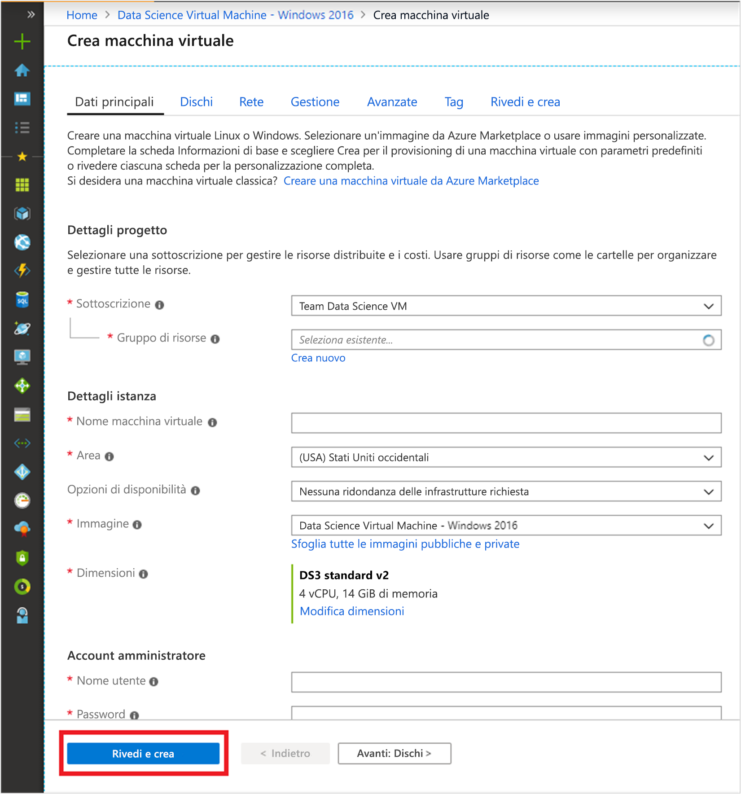

# Guida introduttiva: Configurare la Data Science Virtual Machine per Windows

Iniziare a usare una Data Science Virtual Machine Windows.

## Prerequisito

Per creare una Data Science Virtual Machine Windows, è necessaria una sottoscrizione di Azure. [Provare Azure gratuitamente](https://azure.com/free).
Si noti che gli account gratuiti di Azure non supportano gli SKU delle macchine virtuali abilitate per GPU.

## Creare la propria DSVM

Per creare un'istanza di DSVM:

1. Passare al [portale di Azure](https://portal.azure.com). È possibile che venga richiesto di accedere all'account Azure, se non è stato ancora eseguito l'accesso.
1. Trovare l'elenco delle macchine virtuali digitando "data science virtual machine", quindi selezionare "Data Science Virtual Machine - Windows 2016".

    

1. Selezionare quindi il pulsante **Crea** nella parte inferiore.

    

1. Si verrà reindirizzati al pannello "Crea macchina virtuale".
   

1. Compilare la scheda **Nozioni di base**.
      * **Sottoscrizione** Se si hanno più sottoscrizioni, selezionare quella in cui verrà creata e fatturata la macchina virtuale. È necessario disporre di privilegi di creazione delle risorse per questa sottoscrizione.
      * **Gruppo di risorse**: creare un nuovo gruppo di risorse o selezionarne uno esistente.
      * **Nome macchina virtuale**: immettere il nome della macchina virtuale. È il nome con cui verrà visualizzata nel portale di Azure.
      * **Località**: selezionare il data center più appropriato. Per l'accesso più veloce alla rete, in genere è il data center che include la maggior parte dei dati o è più vicino alla propria posizione fisica. Vedere altre informazioni sulle [aree di Azure](https://azure.microsoft.com/global-infrastructure/regions/).
      * **Immagine**: Lasciare il valore predefinito.
      * **Dimensione**: questo campo dovrebbe essere completato automaticamente con una dimensione appropriata per carichi di lavoro generali. Vedere altre informazioni sulle [dimensioni delle VM Windows in Azure](../../virtual-machines/windows/sizes.md).
      * **Nome utente**: immettere il nome utente dell'amministratore. È il nome utente che verrà usato per accedere alla macchina virtuale e non deve necessariamente essere uguale al nome utente Azure.
      * **Password**: immettere la password che si userà per accedere alla macchina virtuale.    
1. Selezionare **Rivedi e crea**.
1. **Rivedi e crea**
   * Verificare che tutte le informazioni immesse siano corrette. 
   * Selezionare **Create** (Crea).

> [!NOTE]
> * Non vengono addebitati costi di licenza per il software precaricato nella macchina virtuale. Viene invece addebitato il costo di calcolo per le dimensioni del server scelte nel passaggio **Dimensione**.
> * Il provisioning richiede da 10 a 20 minuti. È possibile visualizzare lo stato della macchina virtuale nel portale di Azure.

## Accedere alla DSVM

Dopo la creazione e il provisioning della VM, seguire la procedura illustrata per [connettersi alla macchina virtuale basata su Azure](../../marketplace/cloud-partner-portal/virtual-machine/cpp-connect-vm.md). Usare le credenziali dell'account amministratore configurate nel passaggio **Informazioni di base** per la creazione di una macchina virtuale. 

Si è pronti per iniziare a usare gli strumenti installati e configurati nella VM. Molti strumenti sono accessibili tramite i riquadri del menu **Start** e le icone del desktop.

È anche possibile collegare una DSVM ad Azure Notebooks per eseguire notebook Jupyter nella VM e ignorare le limitazioni del livello di servizio gratuito. Per altre informazioni, vedere [Gestire e configurare i progetti di Notebooks](../../notebooks/configure-manage-azure-notebooks-projects.md#manage-and-configure-projects).

## Passaggi successivi

* Esplorare gli strumenti disponibili nella DSVM aprendo il menu **Start**.
* Per informazioni sul servizio Azure Machine Learning, leggere [Informazioni sul servizio Azure Machine Learning](../service/overview-what-is-azure-ml.md) e seguire le [esercitazioni](../index.yml).
* In Esplora File passare a C:\Programmi\Microsoft\ML Server\R_SERVER\library\RevoScaleR\demoScripts per trovare esempi che usano la libreria RevoScaleR in R che supporta l'analisi dei dati a livello aziendale. 
* Leggere l'articolo [Dieci cose da fare con una Data Science Virtual Machine](https://aka.ms/dsvmtenthings).
* Informazioni su come creare sistematicamente soluzioni analitiche end-to-end usando il [Processo di analisi scientifica dei dati per i team](../team-data-science-process/index.yml).
* Per esempi di apprendimento automatico e di analisi dei dati che usano Azure Machine Learning e i servizi dati correlati in Azure, visitare [Azure AI Gallery](https://gallery.cortanaintelligence.com). Per questa raccolta è disponibile anche un'icona nel menu **Start** e sul desktop della macchina virtuale.
* Vedere la [documentazione di riferimento](./reference-windows-vm.md) appropriata per questa macchina virtuale.

