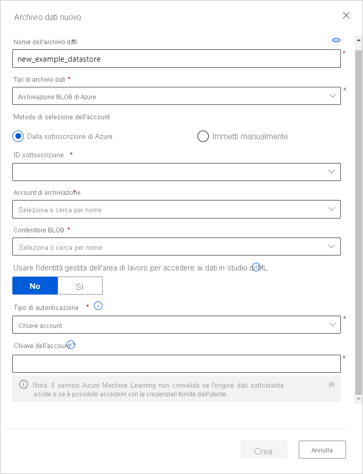

# <a name="access-data-in-azure-storage-services"></a>Accedere ai dati nei servizi di archiviazione di Azure
[!INCLUDE [aml-applies-to-basic-enterprise-sku](../../includes/aml-applies-to-basic-enterprise-sku.md)]

Questo articolo illustra come accedere facilmente ai dati nei servizi di archiviazione di Azure tramite Azure Machine Learning archivi dati. Gli archivi dati vengono usati per archiviare le informazioni di connessione, ad esempio l'ID sottoscrizione e l'autorizzazione del token. Quando si usano gli archivi dati, è possibile accedere alla risorsa di archiviazione senza dover codificare in modo rigido le informazioni di connessione negli script. 

È possibile creare archivi dati da [queste soluzioni di archiviazione di Azure](#matrix). Per le soluzioni di archiviazione non supportate e per risparmiare i costi in uscita durante gli esperimenti di Machine Learning, è consigliabile [spostare i dati](#move) in soluzioni di archiviazione di Azure supportate. 

## <a name="prerequisites"></a>Prerequisiti
Sono necessari gli elementi seguenti:
- Una sottoscrizione di Azure. Se non è disponibile una sottoscrizione di Azure, creare un account gratuito prima di iniziare. Prova la [versione gratuita o a pagamento del Azure Machine Learning](https://aka.ms/AMLFree).

- Un account di archiviazione di Azure con un [contenitore BLOB di Azure](https://docs.microsoft.com/azure/storage/blobs/storage-blobs-overview) o una [condivisione file di Azure](https://docs.microsoft.com/azure/storage/files/storage-files-introduction).

- [SDK Azure Machine Learning per Python](https://docs.microsoft.com/python/api/overview/azure/ml/intro?view=azure-ml-py)o accesso a [Azure Machine Learning Studio](https://ml.azure.com/).

- Un'area di lavoro di Azure Machine Learning.
  
  [Creare un'area di lavoro Azure Machine Learning](how-to-manage-workspace.md) o utilizzarne una esistente tramite Python SDK:

   ```Python
   import azureml.core
   from azureml.core import Workspace, Datastore
        
   ws = Workspace.from_config()
   ```

<a name="access"></a>

## <a name="create-and-register-datastores"></a>Creare e registrare archivi dati

Quando si registra una soluzione di archiviazione di Azure come archivio dati, l'archivio dati viene creato automaticamente in un'area di lavoro specifica. È possibile creare e registrare archivi dati in un'area di lavoro usando Python SDK o Azure Machine Learning Studio.

### <a name="python-sdk"></a>Python SDK

Tutti i metodi Register si trovano nella classe [`Datastore`](https://docs.microsoft.com/python/api/azureml-core/azureml.core.datastore(class)?view=azure-ml-py) e hanno il formato `register_azure_*`.

È possibile trovare le informazioni necessarie per popolare il metodo `register()` usando il [portale di Azure](https://portal.azure.com):

1. Selezionare **account di archiviazione** nel riquadro sinistro e scegliere l'account di archiviazione che si desidera registrare. 
2. Per informazioni come il nome dell'account, il contenitore e il nome della condivisione file, passare alla pagina **Panoramica** . Per informazioni sull'autenticazione, ad esempio la chiave dell'account o il token di firma di accesso condiviso, passare a **chiavi di accesso** nel riquadro **Impostazioni** . 

> [!IMPORTANT]
> Se l'account di archiviazione si trova in una rete virtuale, è supportata solo la creazione di un archivio dati BLOB di Azure. Per concedere l'accesso all'area di lavoro all'account di archiviazione, impostare il parametro `grant_workspace_access` su `True`.

Gli esempi seguenti illustrano come registrare un contenitore BLOB di Azure, una condivisione file di Azure e i dati SQL di Azure come archivio dati.

#### <a name="blob-container"></a>Contenitore BLOB

Per registrare un contenitore BLOB di Azure come archivio dati, usare [`register_azure_blob-container()`](https://docs.microsoft.com/python/api/azureml-core/azureml.core.datastore(class)?view=azure-ml-py#register-azure-blob-container-workspace--datastore-name--container-name--account-name--sas-token-none--account-key-none--protocol-none--endpoint-none--overwrite-false--create-if-not-exists-false--skip-validation-false--blob-cache-timeout-none--grant-workspace-access-false--subscription-id-none--resource-group-none-).

Il codice seguente crea e registra l'archivio dati `blob_datastore_name` nell'area di lavoro `ws`. Questo archivio dati accede al contenitore BLOB `my-container-name` nell'account di archiviazione `my-account-name`, usando la chiave dell'account fornita.

```Python
blob_datastore_name='azblobsdk' # Name of the datastore to workspace
container_name=os.getenv("BLOB_CONTAINER", "<my-container-name>") # Name of Azure blob container
account_name=os.getenv("BLOB_ACCOUNTNAME", "<my-account-name>") # Storage account name
account_key=os.getenv("BLOB_ACCOUNT_KEY", "<my-account-key>") # Storage account key

blob_datastore = Datastore.register_azure_blob_container(workspace=ws, 
                                                         datastore_name=blob_datastore_name, 
                                                         container_name=container_name, 
                                                         account_name=account_name,
                                                         account_key=account_key)
```

#### <a name="file-share"></a>Condivisione file

Per registrare una condivisione file di Azure come archivio dati, usare [`register_azure_file_share()`](https://docs.microsoft.com/python/api/azureml-core/azureml.core.datastore(class)?view=azure-ml-py#register-azure-file-share-workspace--datastore-name--file-share-name--account-name--sas-token-none--account-key-none--protocol-none--endpoint-none--overwrite-false--create-if-not-exists-false--skip-validation-false-). 

Il codice seguente crea e registra l'archivio dati `file_datastore_name` nell'area di lavoro `ws`. Questo archivio dati accede alla condivisione file `my-fileshare-name` nell'account di archiviazione `my-account-name`, usando la chiave dell'account fornita.

```Python
file_datastore_name='azfilesharesdk' # Name of the datastore to workspace
file_share_name=os.getenv("FILE_SHARE_CONTAINER", "<my-fileshare-name>") # Name of Azure file share container
account_name=os.getenv("FILE_SHARE_ACCOUNTNAME", "<my-account-name>") # Storage account name
account_key=os.getenv("FILE_SHARE_ACCOUNT_KEY", "<my-account-key>") # Storage account key

file_datastore = Datastore.register_azure_file_share(workspace=ws,
                                                 datastore_name=file_datastore_name, 
                                                 file_share_name=file_share_name, 
                                                 account_name=account_name,
                                                 account_key=account_key)
```

#### <a name="sql-data"></a>SQL data

Per un archivio dati SQL di Azure, usare [register_azure_sql_database ()](https://docs.microsoft.com/python/api/azureml-core/azureml.core.datastore.datastore?view=azure-ml-py#register-azure-sql-database-workspace--datastore-name--server-name--database-name--tenant-id-none--client-id-none--client-secret-none--resource-url-none--authority-url-none--endpoint-none--overwrite-false--username-none--password-none-) per registrare un archivio dati delle credenziali connesso a un database SQL di Azure con l'autenticazione SQL o le autorizzazioni dell'entità servizio. 

Per eseguire la registrazione tramite l'autenticazione SQL:

```python
sql_datastore_name="azsqlsdksql"
server_name=os.getenv("SQL_SERVERNAME", "<my-server-name>") # Name of the Azure SQL server
database_name=os.getenv("SQL_DATBASENAME", "<my-database-name>") # Name of the Azure SQL database
username=os.getenv("SQL_USER_NAME", "<my-sql-user-name>") # Username of the database user to access the database
password=os.getenv("SQL_USER_PASSWORD", "<my-sql-user-password>") # Password of the database user to access the database

sql_datastore = Datastore.register_azure_sql_database(workspace=ws,
                                                  datastore_name=sql_datastore_name,
                                                  server_name=server_name,
                                                  database_name=database_name,
                                                  username=username,
                                                  password=password)

```

Per eseguire la registrazione tramite un'entità servizio:

```python 
sql_datastore_name="azsqlsdksp"
server_name=os.getenv("SQL_SERVERNAME", "<my-server-name>") # Name of the SQL server
database_name=os.getenv("SQL_DATBASENAME", "<my-database-name>") # Name of the SQL database
client_id=os.getenv("SQL_CLIENTNAME", "<my-client-id>") # Client ID of the service principal with permissions to access the database
client_secret=os.getenv("SQL_CLIENTSECRET", "<my-client-secret>") # Secret of the service principal
tenant_id=os.getenv("SQL_TENANTID", "<my-tenant-id>") # Tenant ID of the service principal

sql_datastore = Datastore.register_azure_sql_database(workspace=ws,
                                                      datastore_name=sql_datastore_name,
                                                      server_name=server_name,
                                                      database_name=database_name,
                                                      client_id=client_id,
                                                      client_secret=client_secret,
                                                      tenant_id=tenant_id)
```

#### <a name="storage-guidance"></a>Linee guida per l'archiviazione

Si consiglia di usare un contenitore BLOB di Azure. Per i BLOB sono disponibili sia l'archiviazione standard che Premium. Sebbene archiviazione Premium sia più costosa, la velocità effettiva più veloce potrebbe migliorare la velocità delle esecuzioni di training, in particolare se si esegue il training su un set di dati di grandi dimensioni. Per informazioni sul costo degli account di archiviazione, vedere il [calcolatore dei prezzi di Azure](https://azure.microsoft.com/pricing/calculator/?service=machine-learning-service).

### <a name="azure-machine-learning-studio"></a>Azure Machine Learning Studio 

Creare un nuovo archivio dati in pochi passaggi in Azure Machine Learning Studio:

1. Accedere ad [Azure Machine Learning Studio](https://ml.azure.com/).
1. Selezionare **archivi dati** nel riquadro sinistro in **Gestisci**.
1. Selezionare **+ nuovo archivio dati**.
1. Completare il modulo per un nuovo archivio dati. Il modulo si aggiorna in modo intelligente in base alle selezioni effettuate per tipo di archiviazione di Azure e tipo di autenticazione.
  
È possibile trovare le informazioni necessarie per popolare il modulo nella [portale di Azure](https://portal.azure.com). Selezionare **account di archiviazione** nel riquadro sinistro e scegliere l'account di archiviazione che si desidera registrare. Nella pagina **Panoramica** sono disponibili informazioni quali il nome dell'account, il contenitore e il nome della condivisione file. Per gli elementi di autenticazione, ad esempio chiave account o token di firma di accesso condiviso, passare a **chiavi account** nel riquadro **Impostazioni** .

Nell'esempio seguente viene illustrato l'aspetto del form quando si crea un archivio dati BLOB di Azure: 
    



<a name="get"></a>

## <a name="get-datastores-from-your-workspace"></a>Ottenere gli archivi dati dall'area di lavoro

Per ottenere un archivio dati specifico registrato nell'area di lavoro corrente, usare il metodo statico [`get()`](https://docs.microsoft.com/python/api/azureml-core/azureml.core.datastore(class)?view=azure-ml-py#get-workspace--datastore-name-) sulla classe `Datastore`:

```Python
# Get a named datastore from the current workspace
datastore = Datastore.get(ws, datastore_name='your datastore name')
```
Per ottenere l'elenco degli archivi dati registrati in una determinata area di lavoro, è possibile usare la proprietà [`datastores`](https://docs.microsoft.com/python/api/azureml-core/azureml.core.workspace%28class%29?view=azure-ml-py#datastores) in un oggetto dell'area di lavoro:

```Python
# List all datastores registered in the current workspace
datastores = ws.datastores
for name, datastore in datastores.items():
    print(name, datastore.datastore_type)
```

Quando si crea un'area di lavoro, un contenitore BLOB di Azure e una condivisione file di Azure vengono registrati automaticamente nell'area di lavoro. Sono denominati rispettivamente `workspaceblobstore` e `workspacefilestore`. Archiviano le informazioni di connessione per il contenitore BLOB e la condivisione file di cui è stato effettuato il provisioning nell'account di archiviazione collegato all'area di lavoro. Il contenitore `workspaceblobstore` viene impostato come archivio dati predefinito.

Per ottenere l'archivio dati predefinito dell'area di lavoro, usare questa riga:

```Python
datastore = ws.get_default_datastore()
```

Per definire un archivio dati predefinito diverso per l'area di lavoro corrente, utilizzare il metodo [`set_default_datastore()`](https://docs.microsoft.com/python/api/azureml-core/azureml.core.workspace(class)?view=azure-ml-py#set-default-datastore-name-) sull'oggetto dell'area di lavoro:

```Python
# Define the default datastore for the current workspace
ws.set_default_datastore('your datastore name')
```

<a name="up-and-down"></a>
## <a name="upload-and-download-data"></a>Caricamento e download dei dati

I metodi [`upload()`](https://docs.microsoft.com/python/api/azureml-core/azureml.data.azure_storage_datastore.azureblobdatastore?view=azure-ml-py#upload-src-dir--target-path-none--overwrite-false--show-progress-true-) e [`download()`](https://docs.microsoft.com/python/api/azureml-core/azureml.data.azure_storage_datastore.azureblobdatastore?view=azure-ml-py#download-target-path--prefix-none--overwrite-false--show-progress-true-) descritti negli esempi seguenti sono specifici di e funzionano in modo identico per le classi [AzureBlobDatastore](https://docs.microsoft.com/python/api/azureml-core/azureml.data.azure_storage_datastore.azureblobdatastore?view=azure-ml-py) e [AzureFileDatastore](https://docs.microsoft.com/python/api/azureml-core/azureml.data.azure_storage_datastore.azurefiledatastore?view=azure-ml-py) .

### <a name="upload"></a>Caricamento

Caricare una directory o singoli file nell'archivio dati usando Python SDK:

```Python
datastore.upload(src_dir='your source directory',
                 target_path='your target path',
                 overwrite=True,
                 show_progress=True)
```

Il parametro `target_path` specifica il percorso nella condivisione file o nel contenitore BLOB da caricare. Il valore predefinito è `None`, quindi i dati vengono caricati nella radice. Se `overwrite=True`, tutti i dati esistenti in `target_path` vengono sovrascritti.

È anche possibile caricare un elenco di singoli file nell'archivio dati tramite il metodo `upload_files()`.

### <a name="download"></a>Download

Scaricare i dati da un archivio dati all'file system locale:

```Python
datastore.download(target_path='your target path',
                   prefix='your prefix',
                   show_progress=True)
```

Il parametro `target_path` è il percorso della directory locale in cui scaricare i dati. Per specificare un percorso della cartella o condivisione file (o contenitore Blob) per il download, fornire tale percorso a `prefix`. Se `prefix` è `None`, tutto il contenuto della condivisione file (o contenitore BLOB) verrà scaricato.

<a name="train"></a>
## <a name="access-your-data-during-training"></a>Accedi ai dati durante il training

> [!IMPORTANT]
> È ora consigliabile usare [Azure Machine Learning set](how-to-create-register-datasets.md) di dati per accedere ai dati nel training. I set di dati forniscono funzioni che caricano dati tabulari in un dataframe Pandas o Spark. I set di dati offrono inoltre la possibilità di scaricare o montare file di qualsiasi formato dall'archiviazione BLOB di Azure, File di Azure, Azure Data Lake Storage Gen1, Azure Data Lake Storage Gen2, database SQL di Azure e database di Azure per PostgreSQL. [Altre informazioni su come eseguire il training con i set di impostazioni](how-to-train-with-datasets.md).

La tabella seguente elenca i metodi che indicano alla destinazione di calcolo come usare gli archivi dati durante le esecuzioni: 

Way|Metodo|Description|
----|-----|--------
Eseguire il montaggio| [`as_mount()`](https://docs.microsoft.com/python/api/azureml-core/azureml.data.azure_storage_datastore.abstractazurestoragedatastore?view=azure-ml-py#as-mount--)| Usare per montare l'archivio dati nella destinazione di calcolo. Quando l'archivio dati viene montato, tutti i file dell'archivio dati vengono resi accessibili alla destinazione di calcolo.
Download|[`as_download()`](https://docs.microsoft.com/python/api/azureml-core/azureml.data.azure_storage_datastore.abstractazurestoragedatastore?view=azure-ml-py#as-download-path-on-compute-none-)|Usare per scaricare il contenuto dell'archivio dati nel percorso specificato da `path_on_compute`. <br><br> Questo download si verifica prima dell'esecuzione.
Caricamento|[`as_upload()`](https://docs.microsoft.com/python/api/azureml-core/azureml.data.azure_storage_datastore.abstractazurestoragedatastore?view=azure-ml-py#as-upload-path-on-compute-none-)| Usare per caricare un file dal percorso specificato da `path_on_compute` nell'archivio dati. <br><br> Questo caricamento si verifica dopo l'esecuzione.

Per fare riferimento a una cartella o un file specifico nell'archivio dati e renderlo disponibile nella destinazione di calcolo, usare il metodo [`path()`](https://docs.microsoft.com/python/api/azureml-core/azureml.data.azure_storage_datastore.abstractazurestoragedatastore?view=azure-ml-py#path-path-none--data-reference-name-none-) dell'archivio dati:

```Python
# To mount the full contents in your storage to the compute target
datastore.as_mount()

# To download the contents of only the `./bar` directory in your storage to the compute target
datastore.path('./bar').as_download()
```
> [!NOTE]
> Qualsiasi oggetto `datastore` o `datastore.path` specificato viene risolto in un nome di variabile di ambiente con il formato `"$AZUREML_DATAREFERENCE_XXXX"`. Il valore di questo nome rappresenta il percorso di montaggio/download nella destinazione di calcolo. Il percorso dell'archivio dati nella destinazione di calcolo potrebbe non corrispondere al percorso di esecuzione dello script di training.

### <a name="examples"></a>Esempi 

È consigliabile usare la classe [`Estimator`](https://docs.microsoft.com/python/api/azureml-train-core/azureml.train.estimator.estimator?view=azure-ml-py) per accedere ai dati durante il training. 

La variabile `script_params` è un dizionario che contiene i parametri da `entry_script`. Usarlo per passare un archivio dati e descrivere come vengono resi disponibili i dati nella destinazione di calcolo. Ulteriori informazioni sono disponibili nell' [esercitazione end-to-end](tutorial-train-models-with-aml.md).

```Python
from azureml.train.estimator import Estimator

# Notice that '/' is in front, which indicates the absolute path
script_params = {
    '--data_dir': datastore.path('/bar').as_mount()
}

est = Estimator(source_directory='your code directory',
                entry_script='train.py',
                script_params=script_params,
                compute_target=compute_target
                )
```

È anche possibile passare un elenco di archivi dati al parametro `inputs` del costruttore `Estimator` per montare o copiare i dati da e verso l'archivio dati. Questo esempio di codice:
* Scarica tutti i contenuti `datastore1` nella destinazione di calcolo prima dell'esecuzione dello script di training `train.py`.
* Scarica la cartella `'./foo'` in `datastore2` alla destinazione di calcolo prima dell'esecuzione `train.py`.
* Carica il file di `'./bar.pkl'` dalla destinazione di calcolo per `datastore3` dopo l'esecuzione dello script.

```Python
est = Estimator(source_directory='your code directory',
                compute_target=compute_target,
                entry_script='train.py',
                inputs=[datastore1.as_download(), datastore2.path('./foo').as_download(), datastore3.as_upload(path_on_compute='./bar.pkl')])
```
Se si preferisce usare un oggetto `RunConfig` per il training, è necessario configurare un oggetto [`DataReference`](https://docs.microsoft.com/python/api/azureml-core/azureml.data.data_reference.datareference?view=azure-ml-py) . 

Il codice seguente illustra come usare un oggetto `DataReference` in una pipeline di stima. Per l'esempio completo, vedere [questo notebook](https://github.com/Azure/MachineLearningNotebooks/blob/master/how-to-use-azureml/machine-learning-pipelines/intro-to-pipelines/aml-pipelines-how-to-use-estimatorstep.ipynb).

```Python
from azureml.core import Datastore
from azureml.data.data_reference import DataReference
from azureml.pipeline.core import PipelineData

def_blob_store = Datastore(ws, "workspaceblobstore")

input_data = DataReference(
       datastore=def_blob_store,
       data_reference_name="input_data",
       path_on_datastore="20newsgroups/20news.pkl")

output = PipelineData("output", datastore=def_blob_store)
```
<a name="matrix"></a>

### <a name="compute-and-datastore-matrix"></a>Matrice di calcolo e datastore

Gli archivi dati supportano attualmente l'archiviazione delle informazioni di connessione nei servizi di archiviazione elencati nella matrice seguente. Questa matrice consente di visualizzare le funzionalità di accesso ai dati disponibili per le diverse destinazioni di calcolo e gli scenari di archivio dati. [Altre informazioni sulle destinazioni di calcolo per Azure Machine Learning](how-to-set-up-training-targets.md#compute-targets-for-training).

|Calcolo|[AzureBlobDatastore](https://docs.microsoft.com/python/api/azureml-core/azureml.data.azure_storage_datastore.azureblobdatastore?view=azure-ml-py)                                       |[AzureFileDatastore](https://docs.microsoft.com/python/api/azureml-core/azureml.data.azure_storage_datastore.azurefiledatastore?view=azure-ml-py)                                      |[AzureDataLakeDatastore](https://docs.microsoft.com/python/api/azureml-core/azureml.data.azure_data_lake_datastore.azuredatalakedatastore?view=azure-ml-py) |[AzureDataLakeGen2Datastore](https://docs.microsoft.com/python/api/azureml-core/azureml.data.azure_data_lake_datastore.azuredatalakegen2datastore?view=azure-ml-py) [AzurePostgreSqlDatastore](https://docs.microsoft.com/python/api/azureml-core/azureml.data.azure_postgre_sql_datastore.azurepostgresqldatastore?view=azure-ml-py) [AzureSqlDatabaseDatastore](https://docs.microsoft.com/python/api/azureml-core/azureml.data.azure_sql_database_datastore.azuresqldatabasedatastore?view=azure-ml-py) |
|--------------------------------|----------------------------------------------------------|----------------------------------------------------------|------------------------|----------------------------------------------------------------------------------------|
| Locale|[as_download()](https://docs.microsoft.com/python/api/azureml-core/azureml.data.data_reference.datareference?view=azure-ml-py#as-download-path-on-compute-none--overwrite-false-), [as_upload()](https://docs.microsoft.com/python/api/azureml-core/azureml.data.data_reference.datareference?view=azure-ml-py#as-upload-path-on-compute-none--overwrite-false-)|[as_download()](https://docs.microsoft.com/python/api/azureml-core/azureml.data.data_reference.datareference?view=azure-ml-py#as-download-path-on-compute-none--overwrite-false-), [as_upload()](https://docs.microsoft.com/python/api/azureml-core/azureml.data.data_reference.datareference?view=azure-ml-py#as-upload-path-on-compute-none--overwrite-false-)|N/D         |N/D                                                                         |
| Ambiente di calcolo di Azure Machine Learning |[as_mount ()](https://docs.microsoft.com/python/api/azureml-core/azureml.data.data_reference.datareference?view=azure-ml-py#as-mount--), [as_download ()](https://docs.microsoft.com/python/api/azureml-core/azureml.data.data_reference.datareference?view=azure-ml-py#as-download-path-on-compute-none--overwrite-false-), [as_upload ()](https://docs.microsoft.com/python/api/azureml-core/azureml.data.data_reference.datareference?view=azure-ml-py#as-upload-path-on-compute-none--overwrite-false-), [pipeline Machine Learning](concept-ml-pipelines.md)|[as_mount ()](https://docs.microsoft.com/python/api/azureml-core/azureml.data.data_reference.datareference?view=azure-ml-py#as-mount--), [as_download ()](https://docs.microsoft.com/python/api/azureml-core/azureml.data.data_reference.datareference?view=azure-ml-py#as-download-path-on-compute-none--overwrite-false-), [as_upload ()](https://docs.microsoft.com/python/api/azureml-core/azureml.data.data_reference.datareference?view=azure-ml-py#as-upload-path-on-compute-none--overwrite-false-), [pipeline Machine Learning](concept-ml-pipelines.md)|N/D         |N/D                                                                         |
| Macchine virtuali               |[as_download()](https://docs.microsoft.com/python/api/azureml-core/azureml.data.data_reference.datareference?view=azure-ml-py#as-download-path-on-compute-none--overwrite-false-), [as_upload()](https://docs.microsoft.com/python/api/azureml-core/azureml.data.data_reference.datareference?view=azure-ml-py#as-upload-path-on-compute-none--overwrite-false-)                           | [as_download()](https://docs.microsoft.com/python/api/azureml-core/azureml.data.data_reference.datareference?view=azure-ml-py#as-download-path-on-compute-none--overwrite-false-) [as_upload()](https://docs.microsoft.com/python/api/azureml-core/azureml.data.data_reference.datareference?view=azure-ml-py#as-upload-path-on-compute-none--overwrite-false-)                            |N/D         |N/D                                                                         |
| HDInsight di Azure                      |[as_download()](https://docs.microsoft.com/python/api/azureml-core/azureml.data.data_reference.datareference?view=azure-ml-py#as-download-path-on-compute-none--overwrite-false-) [as_upload()](https://docs.microsoft.com/python/api/azureml-core/azureml.data.data_reference.datareference?view=azure-ml-py#as-upload-path-on-compute-none--overwrite-false-)                            | [as_download()](https://docs.microsoft.com/python/api/azureml-core/azureml.data.data_reference.datareference?view=azure-ml-py#as-download-path-on-compute-none--overwrite-false-) [as_upload()](https://docs.microsoft.com/python/api/azureml-core/azureml.data.data_reference.datareference?view=azure-ml-py#as-upload-path-on-compute-none--overwrite-false-)                            |N/D         |N/D                                                                         |
| Trasferimento dati                  |[Pipeline di Machine Learning](concept-ml-pipelines.md)                                               |N/D                                           |[Pipeline di Machine Learning](concept-ml-pipelines.md)            |[Pipeline di Machine Learning](concept-ml-pipelines.md)                                                                            |
| Azure Databricks                     |[Pipeline di Machine Learning](concept-ml-pipelines.md)                                              |N/D                                           |[Pipeline di Machine Learning](concept-ml-pipelines.md)             |N/D                                                                         |
| Azure Batch                    |[Pipeline di Machine Learning](concept-ml-pipelines.md)                                               |N/D                                           |N/D         |N/D                                                                         |
| Azure Data Lake Analytics.       |N/D                                           |N/D                                           |[Pipeline di Machine Learning](concept-ml-pipelines.md)             |N/D                                                                         |

> [!NOTE]
> Potrebbero esserci scenari in cui processi di dati di grandi dimensioni estremamente iterativi vengono eseguiti più rapidamente utilizzando `as_download()` anziché `as_mount()`. È possibile convalidare questa operazione sperimentalmente.

### <a name="accessing-source-code-during-training"></a>Accesso al codice sorgente durante il training

Archiviazione BLOB di Azure offre velocità di velocità effettiva più elevate rispetto a una condivisione file di Azure e scalabilità a un numero elevato di processi avviati in parallelo. Per questo motivo, è consigliabile configurare le esecuzioni in modo da usare l'archiviazione BLOB per il trasferimento dei file di codice sorgente.

L'esempio di codice seguente specifica nella configurazione di esecuzione quale archivio dati BLOB usare per i trasferimenti del codice sorgente:

```python 
# workspaceblobstore is the default blob storage
run_config.source_directory_data_store = "workspaceblobstore" 
```

## <a name="access-data-during-scoring"></a>Accedere ai dati durante il Punteggio

Azure Machine Learning offre diversi modi per usare i modelli per l'assegnazione dei punteggi. Alcuni di questi metodi non forniscono l'accesso agli archivi dati. Usare la tabella seguente per informazioni sui metodi che consentono di accedere agli archivi dati durante il Punteggio:

| Metodo | Accesso all'archivio dati | Description |
| ----- | :-----: | ----- |
| [Stima in batch](how-to-run-batch-predictions.md) | ✔ | Eseguire stime su grandi quantità di dati in modo asincrono. |
| [Servizio Web](how-to-deploy-and-where.md) | &nbsp; | Distribuire i modelli come servizio Web. |
| [Modulo Azure IoT Edge](how-to-deploy-and-where.md) | &nbsp; | Distribuire i modelli nei dispositivi IoT Edge. |

Per le situazioni in cui l'SDK non fornisce l'accesso agli archivi dati, è possibile creare codice personalizzato usando Azure SDK pertinente per accedere ai dati. [Azure Storage SDK per Python](https://github.com/Azure/azure-storage-python) , ad esempio, è una libreria client che è possibile usare per accedere ai dati archiviati in BLOB o file.

<a name="move"></a>
## <a name="move-data-to-supported-azure-storage-solutions"></a>Spostare i dati in soluzioni di archiviazione di Azure supportate

Azure Machine Learning supporta l'accesso ai dati di archiviazione BLOB di Azure, File di Azure, Azure Data Lake Storage Gen1, Azure Data Lake Storage Gen2, database SQL di Azure e database di Azure per PostgreSQL. Se si usa una risorsa di archiviazione non supportata, è consigliabile spostare i dati in soluzioni di archiviazione di Azure supportate usando Azure Data Factory. Lo stato di trasferimento dei dati nell'archiviazione supportata può consentire di risparmiare i costi di uscita dei dati durante gli esperimenti di machine learning. 

Azure Data Factory offre un trasferimento dati efficiente e resiliente con più di 80 connettori predefiniti senza costi aggiuntivi. Questi connettori includono i servizi dati di Azure, le origini dati locali, Amazon S3 e lo spostamento verso il proprio e Google BigQuery. [Seguire la guida dettagliata per spostare i dati usando Azure Data Factory](https://docs.microsoft.com/azure/data-factory/quickstart-create-data-factory-copy-data-tool).

## <a name="next-steps"></a>Passaggi successivi

* [Eseguire il training di un modello](how-to-train-ml-models.md)
* [Distribuire un modello](how-to-deploy-and-where.md)
