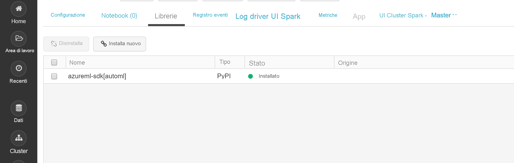

# <a name="configure-a-development-environment-for-azure-machine-learning"></a>Configurare un ambiente di sviluppo per Azure Machine Learning
[!INCLUDE [applies-to-skus](../../includes/aml-applies-to-basic-enterprise-sku.md)]

In this article, you learn how to configure a development environment to work with Azure Machine Learning. Azure Machine Learning è indipendente dalla piattaforma. L'unico requisito rigido per l'ambiente di sviluppo è Python 3.The only hard requirement for your development environment is Python 3. È inoltre consigliabile un ambiente isolato come Anaconda o Virtualenv.

La tabella seguente mostra ogni ambiente di sviluppo trattato in questo articolo, insieme a pro e contro.

| Environment | Vantaggi | Svantaggi |
| --- | --- | --- |
| [Istanza di calcolo di Azure Machine Learning basata su cloud (anteprima)Cloud-based Azure Machine Learning compute instance (preview)](#compute-instance) | Il modo più semplice per iniziare. L'intero SDK è già installato nella macchina virtuale dell'area di lavoro e le esercitazioni sui notebook sono pre-clonate e pronte per l'esecuzione. | Mancanza di controllo sull'ambiente di sviluppo e sulle dipendenze. Costo aggiuntivo sostenuto per la macchina virtuale Linux (vm può essere arrestato quando non è in uso per evitare addebiti). Vedere i [dettagli sui prezzi](https://azure.microsoft.com/pricing/details/virtual-machines/linux/). |
| [Ambiente locale](#local) | Controllo completo dell'ambiente di sviluppo e delle dipendenze. Eseguire con qualsiasi strumento di compilazione, ambiente o IDE di propria scelta. | Ci vuole più tempo per iniziare. È necessario installare i pacchetti SDK necessari e deve essere installato anche un ambiente se non ne è già disponibile uno. |
| [Azure Databricks](#aml-databricks) | Ideale per l'esecuzione di flussi di lavoro di apprendimento automatico intensivi su larga scala sulla piattaforma Apache Spark scalabile. | Eccessivo per l'apprendimento automatico sperimentale o esperimenti e flussi di lavoro su scala ridotta. Costo aggiuntivo sostenuto per Azure Databricks.Additional cost sostenutd for Azure Databricks. Vedere i [dettagli sui prezzi](https://azure.microsoft.com/pricing/details/databricks/). |
| [La macchina virtuale di data science (DSVM)](#dsvm) | Simile all'istanza di calcolo basata su cloud (Python e SDK sono preinstallati), ma con ulteriori strumenti di data science e machine learning popolari preinstallati. Facile da scalare e combinare con altri strumenti personalizzati e flussi di lavoro. | Un'esperienza di avvio più lenta rispetto all'istanza di elaborazione basata su cloud. |

In questo articolo vengono inoltre forniti ulteriori suggerimenti per l'utilizzo per gli strumenti seguenti:This article also provides additional usage tips for the following tools:

* [Jupyter Notebooks](#jupyter): Se si sta già utilizzando il blocco appunti Jupyter, l'SDK ha alcuni extra che è necessario installare.

* [Codice di Visual Studio:](#vscode)se si usa Visual Studio Code, [l'estensione](https://marketplace.visualstudio.com/items?itemName=ms-toolsai.vscode-ai) di Azure Machine Learning include un supporto linguistico esteso per Python e funzionalità per semplificare e semplificare l'utilizzo di Azure Machine Learning.Visual Studio Code : If you use Visual Studio Code, the Azure Machine Learning extension includes extensive language support for Python as well as features to make working with the Azure Machine Learning much more convenient and productive.

## <a name="prerequisites"></a>Prerequisiti

Un'area di lavoro di Azure Machine Learning. Per creare l'area di lavoro, vedere [Creare un'area](how-to-manage-workspace.md)di lavoro di Azure Machine Learning. Un'area di lavoro è tutto ciò che serve per iniziare con il proprio [server notebook basato su cloud,](#compute-instance)una [DSVM](#dsvm)o [Azure Databricks](#aml-databricks).

Per installare l'ambiente SDK per il [computer locale,](#local)è necessario anche il [server Jupyter Notebook](#jupyter) o Visual Studio [Code:](#vscode)

- [Anaconda](https://www.anaconda.com/download/) o [Miniconda](https://conda.io/miniconda.html) package manager.

- In Linux o macOS è necessaria la shell bash.

    > [!TIP]
    > Se si usa Linux o macOS con una shell diversa da bash, ad esempio zsh, possono verificarsi errori durante l'esecuzione di alcuni comandi. Per risolvere questo problema, usare il comando `bash` per avviare una nuova shell bash ed eseguire i comandi nella shell.

- In Windows è necessario il prompt dei comandi o il prompt di Anaconda (installato per Anaconda e Miniconda).

## <a name="your-own-cloud-based-compute-instance"></a><a id="compute-instance"></a>La tua istanza di calcolo basata su cloud

L'istanza di calcolo di Azure Machine Learning [(anteprima)](concept-compute-instance.md) è una workstation Azure sicura basata su cloud che fornisce agli scienziati dei dati un server notebook Jupyter, JupyterLab e un ambiente ML completamente preparato.

Non c'è nulla da installare o configurare per un'istanza di calcolo.  Creane uno in qualsiasi momento dall'area di lavoro di Azure Machine Learning.Create one anytime from within your Azure Machine Learning workspace. Specificare un nome e specificare un tipo di macchina virtuale di Azure.Provide just a name and specify an Azure VM type. Provalo subito con questa [esercitazione: ambiente](tutorial-1st-experiment-sdk-setup.md)di installazione e area di lavoro .

Ulteriori informazioni sulle istanze di [calcolo](concept-compute-instance.md).

Per interrompere le spese di calcolo, [arrestare l'istanza di calcolo.](tutorial-1st-experiment-sdk-train.md#clean-up-resources)

## <a name="data-science-virtual-machine"></a><a id="dsvm"></a>Macchina virtuale di data science

La Data Science Virtual Machine (DSVM) è un'immagine di macchina virtuale personalizzata. È stata progettata per operazioni di data science che sono preconfigurate con:

  - Pacchetti come TensorFlow, PyTorch, Scikit-learn, XGBoost e SDK di Azure Machine Learning
  - Strumenti di data science comuni come Spark Standalone e Drill
  - Strumenti di Azure come l'interfaccia della riga di comando di Azure, AzCopy e Storage Explorer
  - Ambienti di sviluppo integrato (IDE) come Visual Studio Code e PyCharm
  - Server Jupyter Notebook

L'SDK di Azure Machine Learning funziona nella versione della DSVM per Windows o Ubuntu. Ma se si prevede di usare DSVM anche come una destinazione di calcolo, è supportato solo Ubuntu.

Per utilizzare DSVM come ambiente di sviluppo:

1. Creare una DSVM in uno degli ambienti seguenti:

    * Il portale di Azure:

        * [Creare una Data Science Virtual Machine Ubuntu](https://docs.microsoft.com/azure/machine-learning/data-science-virtual-machine/dsvm-ubuntu-intro)

        * [Creare una macchina virtuale data science Windows](https://docs.microsoft.com/azure/machine-learning/data-science-virtual-machine/provision-vm)

    * L'interfaccia della riga di comando di Azure:

        > [!IMPORTANT]
        > * Quando si usa l'interfaccia della riga di comando di Azure, accedere alla sottoscrizione di Azure tramite il comando `az login`.
        >
        > * Quando si usano i comandi in questo passaggio, è necessario specificare il nome di un gruppo di risorse, un nome per la macchina virtuale, un nome utente e una password.

        * Per creare una Data Science Virtual Machine per Ubuntu, usare il comando seguente:

            ```azurecli-interactive
            # create a Ubuntu DSVM in your resource group
            # note you need to be at least a contributor to the resource group in order to execute this command successfully
            # If you need to create a new resource group use: "az group create --name YOUR-RESOURCE-GROUP-NAME --location YOUR-REGION (For example: westus2)"
            az vm create --resource-group YOUR-RESOURCE-GROUP-NAME --name YOUR-VM-NAME --image microsoft-dsvm:linux-data-science-vm-ubuntu:linuxdsvmubuntu:latest --admin-username YOUR-USERNAME --admin-password YOUR-PASSWORD --generate-ssh-keys --authentication-type password
            ```

        * Per creare una Data Science Virtual Machine per Windows, usare il comando seguente:

            ```azurecli-interactive
            # create a Windows Server 2016 DSVM in your resource group
            # note you need to be at least a contributor to the resource group in order to execute this command successfully
            az vm create --resource-group YOUR-RESOURCE-GROUP-NAME --name YOUR-VM-NAME --image microsoft-dsvm:dsvm-windows:server-2016:latest --admin-username YOUR-USERNAME --admin-password YOUR-PASSWORD --authentication-type password
            ```

2. L'SDK di Azure Machine Learning è già installato nella DSVM. Per usare l'ambiente Conda contenente l'SDK, usare uno dei seguenti comandi:

    * Per la DSVM Ubuntu:

        ```bash
        conda activate py36
        ```

    * Per la DSVM Windows:

        ```bash
        conda activate AzureML
        ```

1. Per verificare che sia possibile accedere all'SDK e controllare la versione, usare il codice Python seguente:

    ```python
    import azureml.core
    print(azureml.core.VERSION)
    ```

1. Per configurare DSVM per l'uso dell'area di lavoro di Azure Machine Learning, vedere la sezione Creare un file di [configurazione dell'area di lavoro.](#workspace)

Per altre informazioni, vedere [Data Science Virtual Machine](https://azure.microsoft.com/services/virtual-machines/data-science-virtual-machines/).

## <a name="local-computer"></a><a id="local"></a>Computer locale

Quando si usa un computer locale (che potrebbe anche essere una macchina virtuale remota), creare un ambiente Anaconda e installare l'SDK. Ad esempio:

1. Scaricare e installare [Anaconda](https://www.anaconda.com/distribution/#download-section) (versione Python 3.7) se non lo hai già.

1. Aprire un prompt Anaconda e creare un ambiente con i seguenti comandi:

    Eseguire il comando seguente per creare l'ambiente.

    ```bash
    conda create -n myenv python=3.6.5
    ```

    Quindi attivare l'ambiente.

    ```bash
    conda activate myenv
    ```

    Questo esempio crea un ambiente usando python 3.6.5, ma è possibile scegliere eventuali sovversion specifici. La compatibilità con SDK potrebbe non essere garantita con alcune versioni principali (si consiglia di utilizzare 3,5 versioni successive) ed è consigliabile provare una versione/sovversione diversa nell'ambiente Anaconda in caso di errori. Per creare l'ambiente possono essere necessari diversi minuti mentre vengono scaricati componenti e pacchetti.

1. Eseguire i comandi seguenti nel nuovo ambiente per abilitare kernel IPython specifici dell'ambiente. Ciò garantirà il comportamento previsto per l'importazione del kernel e dei pacchetti quando si lavora con Jupyter Notebooks all'interno degli ambienti Anaconda:

    ```bash
    conda install notebook ipykernel
    ```

    Quindi eseguire il comando seguente per creare il kernel:

    ```bash
    ipython kernel install --user --name myenv --display-name "Python (myenv)"
    ```

1. Utilizzare i seguenti comandi per installare i pacchetti:

    Questo comando installa l'SDK di Azure `automl` Machine Learning di base con blocchi appunti ed extra. L'extra `automl` è un'installazione di grandi dimensioni e può essere rimosso dalle parentesi se non si intende eseguire esperimenti di apprendimento automatico automatizzati. L'extra `automl` include anche l'SDK di preparazione dei dati di Azure Machine Learning per impostazione predefinita come dipendenza.

    ```bash
    pip install azureml-sdk[notebooks,automl]
    ```

   > [!NOTE]
   > * Se si riceve un messaggio che indica che PyYAML non può essere installato, usare in alternativa il comando seguente:
   >
   >   `pip install --upgrade azureml-sdk[notebooks,automl] --ignore-installed PyYAML`
   >
   > * A partire da macOS Catalina, zsh (Z Shell) è la shell di accesso predefinita e la shell interattiva. In zsh usare il comando seguente, che esegue l'escape delle parentesi quadre con "\\" (barra rovesciata):
   >
   >   `pip install --upgrade azureml-sdk\[notebooks,automl\]`

   L'installazione dell'SDK richiederà alcuni minuti. Per ulteriori informazioni sulle opzioni di installazione, vedere la [guida all'installazione](https://docs.microsoft.com/python/api/overview/azure/ml/install?view=azure-ml-py).

1. Installare altri pacchetti per la sperimentazione di apprendimento automatico.

    Utilizzare uno dei seguenti * \<* comandi e sostituire il nuovo pacchetto>con il pacchetto che si desidera installare. L'installazione `conda install` di pacchetti tramite richiede che il pacchetto faccia parte dei canali correnti (nuovi canali possono essere aggiunti in Anaconda Cloud).

    ```bash
    conda install <new package>
    ```

    In alternativa, è possibile `pip`installare i pacchetti tramite .

    ```bash
    pip install <new package>
    ```

### <a name="jupyter-notebooks"></a><a id="jupyter"></a>Jupyter Notebook

I notebook di Jupyter fanno parte del [progetto Jupyter](https://jupyter.org/). Forniscono un'esperienza di codifica interattiva in cui si creano documenti che combinano codice attivo con testi narrativi e grafica. Anche i notebook di Jupyter sono un'ottima soluzione per condividere i risultati con altri utenti perché è possibile salvare l'output delle sezioni di codice nel documento. È possibile installare Jupyter Notebook in un'ampia gamma di piattaforme.

La procedura descritta nella sezione [Computer locale](#local) consente di installare i componenti necessari per l'esecuzione di blocchi appunti Jupyter in un ambiente Anaconda.

Per abilitare questi componenti nell'ambiente Jupyter Notebook:

1. Aprire un prompt Anaconda e attivare l'ambiente.

    ```bash
    conda activate myenv
    ```

1. Clonare [il repository GitHub](https://aka.ms/aml-notebooks) per un set di blocchi appunti di esempio.

    ```bash
    git clone https://github.com/Azure/MachineLearningNotebooks.git
    ```

1. Avviare il server Jupyter Notebook con il comando seguente:

    ```bash
    jupyter notebook
    ```

1. Per verificare che Jupyter Notebook possa usare l'SDK, creare un **nuovo** blocco appunti, selezionare **Python 3** come kernel e quindi eseguire il comando seguente in una cella del blocco appunti:

    ```python
    import azureml.core
    azureml.core.VERSION
    ```

1. Se si verificano problemi `ModuleNotFoundError`durante l'importazione di moduli e si ricevono moduli, verificare che il kernel Jupyter sia connesso al percorso corretto per l'ambiente eseguendo il codice seguente in una cella Notebook.

    ```python
    import sys
    sys.path
    ```

1. Per configurare il blocco appunti di Jupyter per l'uso dell'area di lavoro di Azure Machine Learning, passare alla sezione Creare un file di configurazione dell'area di [lavoro.](#workspace)

### <a name="visual-studio-code"></a><a id="vscode"></a>Visual Studio Code

Visual Studio Code è un editor di codice multipiattaforma molto popolare che supporta un ampio set di linguaggi e strumenti di programmazione tramite le estensioni disponibili nel marketplace di [Visual Studio.](https://marketplace.visualstudio.com/vscode) [L'estensione di Azure Machine Learning](https://marketplace.visualstudio.com/items?itemName=ms-toolsai.vscode-ai) installa [l'estensione Python](https://marketplace.visualstudio.com/items?itemName=ms-python.python) per la codifica in tutti i tipi di ambienti Python (virtuale, Anaconda e così via). Inoltre, offre funzionalità di praticità per l'uso delle risorse di Azure Machine Learning e l'esecuzione di esperimenti di Azure Machine Learning senza uscire dal codice di Visual Studio.In addition, it provides convenience features for working with Azure Machine Learning resources and running Azure Machine Learning experiments all without leaving Visual Studio Code.

Per usare Visual Studio Code per lo sviluppo:

1. Installare l'estensione di Azure Machine Learning per Visual Studio Code, vedere [Azure Machine Learning](https://marketplace.visualstudio.com/items?itemName=ms-toolsai.vscode-ai).

    Per altre informazioni, vedere [Introduzione ad Azure Machine Learning per Visual Studio Code](tutorial-setup-vscode-extension.md).

1. Informazioni su come usare Visual Studio Code per qualsiasi tipo di sviluppo Python, vedere [Introduzione a Python in CodiceVS.](https://code.visualstudio.com/docs/python/python-tutorial)

    - Per selezionare l'ambiente SDK Python che contiene l'SDK, aprire il codice VS, quindi selezionare Ctrl , Maiusc , P (Linux e Windows) o Comando ( Maiusc ) (Mac OS) (Mac OS).
        - Viene visualizzata la __tavolozza dei comandi.__

    - Inserisci __Python: Seleziona Interprete__, quindi seleziona l'ambiente appropriato

1. Per verificare che sia possibile utilizzare l'SDK, creare un nuovo file Python (.py) che contiene il codice seguente:

    ```python
    #%%
    import azureml.core
    azureml.core.VERSION
    ```
    Eseguire questo codice facendo clic su "Esegui cella" CodeLens o semplicemente premere shift-enter.
<a name="aml-databricks"></a>

## <a name="azure-databricks"></a>Azure Databricks
Azure Databricks è un ambiente basato su Apache Spark nel cloud di Azure.Azure Databricks is an Apache Spark-based environment in the Azure cloud. Fornisce un ambiente collaborativo basato su notebook con cluster di calcolo basato su CPU o GPU.

Funzionamento di Azure Databricks con Azure Machine Learning:How Azure Databricks works with Azure Machine Learning:
+ È possibile eseguire il training di un modello usando Spark MLlib e distribuire il modello in ACI/AKS da Azure Databricks.You can train a model using Spark MLlib and deploy the model to ACI/AKS from within Azure Databricks.
+ È anche possibile usare funzionalità di apprendimento automatico automatizzate in uno speciale SDK di Azure ML con Azure Databricks.You can also use [automated machine learning](concept-automated-ml.md) capabilities in a special Azure ML SDK with Azure Databricks.
+ È possibile usare Azure Databricks come destinazione di calcolo da una pipeline di Azure Machine Learning.You can use Azure Databricks as a compute target from an [Azure Machine Learning pipeline.](concept-ml-pipelines.md)

### <a name="set-up-your-databricks-cluster"></a>Configurare il cluster Databricks

Creare un [cluster Databricks](https://docs.microsoft.com/azure/azure-databricks/quickstart-create-databricks-workspace-portal). Alcune impostazioni si applicano solo se si installa l'SDK per l'apprendimento automatico automatico in Databricks.
**La creazione del cluster richiederà alcuni minuti.**

Usare queste impostazioni:

| Impostazione |Si applica a| valore |
|----|---|---|
| Nome cluster |always| nomecluster |
| Databricks Runtime |always|Runtime non ML 6.5 (scala 2.11, spark 2.4.3) |
| Versione Python |always| 3 |
| Ruoli di lavoro |always| almeno 2 |
| Worker node VM types (Tipi di VM dei nodi di ruolo di lavoro) <br>(determina il numero massimo di iterazioni simultanee) |Funzionalità automatiche di Machine Learning<br>only| È preferibile una macchina virtuale ottimizzata per la memoria |
| Enable Autoscaling (Abilita la scalabilità automatica) |Funzionalità automatiche di Machine Learning<br>only| Deselezionare |

Attendere che il cluster sia in esecuzione prima di proseguire.

### <a name="install-the-correct-sdk-into-a-databricks-library"></a>Installare l'SDK corretto in una libreria Databricks
Dopo aver eseguito il cluster, [creare una libreria](https://docs.databricks.com/user-guide/libraries.html#create-a-library) per collegare il pacchetto SDK di Azure Machine Learning appropriato al cluster.

1. Fare clic con il pulsante destro del mouse sulla cartella dell'area di lavoro corrente in cui si desidera archiviare la libreria. Selezionare **Crea** > **libreria**.

1. Scegliere **una sola** opzione (non sono supportate altre installazioni SDK)

   |Pacchetti&nbsp;&nbsp;SDK extra|Source (Sorgente)|Nome&nbsp;PyPi&nbsp;&nbsp;&nbsp;&nbsp;&nbsp;&nbsp;|
   |----|---|---|
   |Per Databricks| Caricare Python Egg o PyPI | azureml-sdk[databricks]|
   |Per Databricks -with-<br> funzionalità ML automatizzate| Caricare Python Egg o PyPI | azureml-sdk[automl]|

   > [!Warning]
   > Non è possibile installare altri SDK extra. Scegliere solo una delle opzioni precedenti [databricks] o [automl].

   * Non selezionare **Collega automaticamente a tutti i cluster**.
   * Selezionare **Collega** accanto al nome del cluster.

1. Monitorare la visualizzazione degli errori fino a quando lo stato non diventa **Attached**, operazione che potrebbe richiedere alcuni minuti.  Se questo passaggio non riesce:If this step fails:

   Provare a riavviare il cluster:
   1. Nel riquadro a sinistra selezionare **Cluster**.
   1. Nella tabella selezionare il nome del cluster.
   1. Nella scheda **Librerie** selezionare **Riavvia**.

   Considerare anche:
   + In Configurazione AutomaticaML, quando si usa Azure Databricks, aggiungere i parametri seguenti:In AutoML config, when using Azure Databricks add the following parameters:
       1. ```max_concurrent_iterations```si basa sul numero di nodi di lavoro nel cluster.
        2. ```spark_context=sc```si basa sul contesto spark predefinito.
   + In alternativa, se si dispone di una versione precedente dell'SDK, deselezionarla dalle libs installate del cluster e passare al cestino. Installare la nuova versione dell'SDK e riavviare il cluster. Se si verifica un problema dopo il riavvio, scollegare e ricollegare il cluster.

Se l'installazione ha avuto esito positivo, la libreria importata dovrebbe essere simile a una di queste:

SDK per Databricks **_senza_** 

SDK per Databrickcons **CON** SDK di apprendimento 

### <a name="start-exploring"></a>Inizia a esplorare

Per provarlo:
+ Sebbene siano disponibili molti blocchi appunti di esempio, **solo questi blocchi appunti di esempio funzionano con Azure Databrick.While many sample notebooks are available, only these sample [notebooks](https://github.com/Azure/MachineLearningNotebooks/blob/master/how-to-use-azureml/azure-databricks) work with Azure Databricks.**

+ Importare questi esempi direttamente dall'area di lavoro. Vedere di 


+ Informazioni su come [creare una pipeline con Databricks come elaborazione del training.](how-to-create-your-first-pipeline.md)

## <a name="create-a-workspace-configuration-file"></a><a id="workspace"></a>Creare un file di configurazione dell'area di lavoro

Il file di configurazione dell'area di lavoro è un file JSON che indica all'SDK come comunicare con l'area di lavoro di Azure Machine Learning.The workspace configuration file is a JSON file that tells the SDK how to communicate with your Azure Machine Learning workspace. Il file è denominato *config.json* e ha il formato seguente:

```json
{
    "subscription_id": "<subscription-id>",
    "resource_group": "<resource-group>",
    "workspace_name": "<workspace-name>"
}
```

Questo file JSON deve trovarsi nella struttura della directory che contiene gli script di Python o i notebook di Jupyter. Può trattarsi della stessa directory, in una sottodirectory denominata *.azureml* o in una directory padre.

Per usare questo file dal codice, usare `ws=Workspace.from_config()`. Questo codice carica le informazioni dal file e si connette all'area di lavoro.

È possibile creare il file di configurazione in tre modi:

* **Utilizzare [ws.write_config](https://docs.microsoft.com/python/api/overview/azure/ml/intro?view=azure-ml-py)**: per scrivere un file *config.json.* che contiene le informazioni di configurazione per l'area di lavoro. È possibile scaricare o copiare il file *config.json* in altri ambienti di sviluppo.

* **Scaricare il file:** nel [portale di Azure](https://ms.portal.azure.com)selezionare Scarica **config.json** nella sezione **Panoramica** dell'area di lavoro.

     

* **Creare il file a livello**di codice: nel frammento di codice seguente ci si connette a un'area di lavoro specificando l'ID sottoscrizione, il gruppo di risorse e il nome dell'area di lavoro. La configurazione dell'area di lavoro viene quindi salvata nel file:

    ```python
    from azureml.core import Workspace

    subscription_id = '<subscription-id>'
    resource_group  = '<resource-group>'
    workspace_name  = '<workspace-name>'

    try:
        ws = Workspace(subscription_id = subscription_id, resource_group = resource_group, workspace_name = workspace_name)
        ws.write_config()
        print('Library configuration succeeded')
    except:
        print('Workspace not found')
    ```

    Questo codice scrive il file di configurazione nel file *con estensione azureml/config.json.*

## <a name="next-steps"></a>Passaggi successivi

- [Eseguire il training di un modello](tutorial-train-models-with-aml.md) in Azure Machine Learning con il set di dati MNISTTrain a model on Azure Machine Learning with the MNIST dataset
- Vedere la documentazione di riferimento di [Azure Machine Learning SDK per Python](https://docs.microsoft.com/python/api/overview/azure/ml/intro?view=azure-ml-py)
