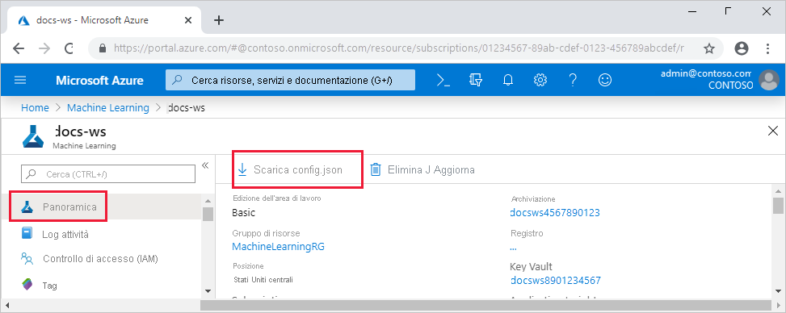
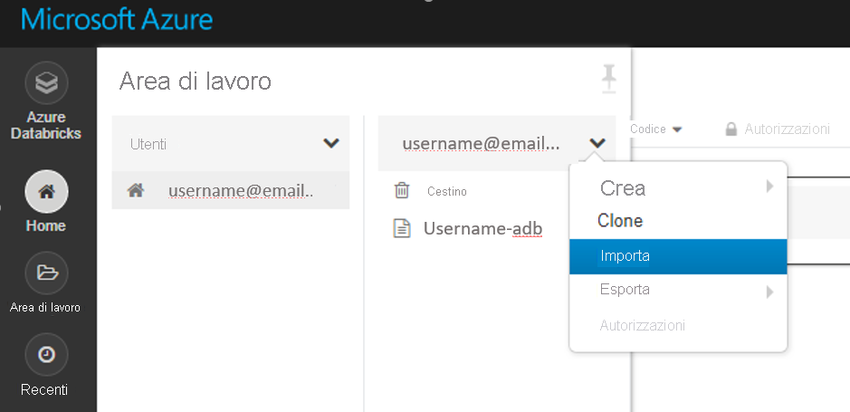
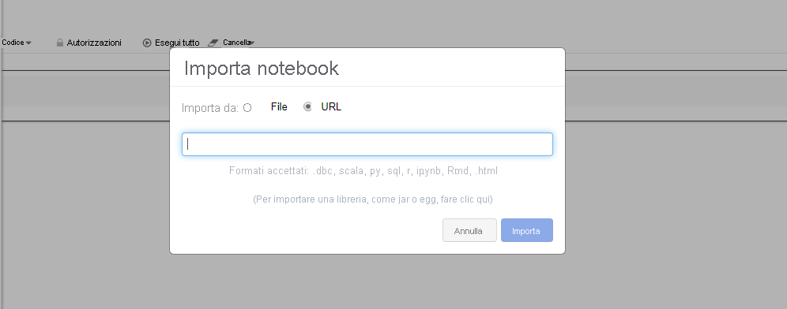

# <a name="set-up-a-development-environment-for-azure-machine-learning"></a>Configurare un ambiente di sviluppo per Azure Machine Learning

Informazioni su come configurare un ambiente di sviluppo Python per Azure Machine Learning.

La tabella seguente illustra tutti gli ambienti di sviluppo trattati in questo articolo, oltre a vantaggi e svantaggi.

| Environment | Vantaggi | Svantaggi |
| --- | --- | --- |
| [Ambiente locale](#local) | Controllo completo dell'ambiente di sviluppo e delle dipendenze. Eseguire con qualsiasi strumento di compilazione, ambiente o IDE di propria scelta. | Per iniziare, è necessario più tempo. È necessario installare i pacchetti SDK necessari ed è necessario installare anche un ambiente, se non è già presente. |
| [Istanza di calcolo di Azure Machine Learning](#compute-instance) | Modo più semplice per iniziare. L'intero SDK è già installato nella macchina virtuale dell'area di lavoro e le esercitazioni sui notebook sono pre-clonate e pronte per l'esecuzione. | Mancanza di controllo sull'ambiente di sviluppo e sulle dipendenze. Costi aggiuntivi per le VM Linux (è possibile arrestare la macchina virtuale quando non è in uso per evitare addebiti). Vedere i [dettagli sui prezzi](https://azure.microsoft.com/pricing/details/virtual-machines/linux/). |
| [Azure Databricks](#aml-databricks) | Ideale per l'esecuzione di flussi di lavoro di Machine Learning intensivi su larga scala sulla piattaforma Apache Spark scalabile. | Overkill per l'apprendimento automatico sperimentale o per esperimenti e flussi di lavoro su scala ridotta. Costi aggiuntivi per Azure Databricks. Vedere i [dettagli sui prezzi](https://azure.microsoft.com/pricing/details/databricks/). |
| [Il Data Science Virtual Machine (DSVM)](#dsvm) | Analogamente all'istanza di calcolo basata sul cloud (Python e SDK sono preinstallati), ma con gli strumenti di data science e di apprendimento automatico più diffusi pre-installati. Facile da scalare e combinare con altri strumenti e flussi di lavoro personalizzati. | Un'esperienza introduttiva più lenta rispetto all'istanza di calcolo basata sul cloud. |

Questo articolo fornisce anche suggerimenti sull'utilizzo aggiuntivi per gli strumenti seguenti:

* Jupyter Notebook: se si usa già i notebook di Jupyter, SDK include alcune funzionalità aggiuntive che è necessario installare.

* Visual Studio Code: se si usa Visual Studio Code, l' [estensione Azure Machine Learning](https://marketplace.visualstudio.com/items?itemName=ms-toolsai.vscode-ai) include il supporto completo del linguaggio per Python, oltre a funzionalità che consentono di lavorare con la Azure Machine Learning molto più comoda e produttiva.

## <a name="prerequisites"></a>Prerequisiti

* Area di lavoro Azure Machine Learning. Se non è già stato creato, è possibile creare un'area di lavoro Azure Machine Learning tramite i modelli [portale di Azure](how-to-manage-workspace.md), interfaccia della riga di comando di [Azure](how-to-manage-workspace-cli.md#create-a-workspace)e [Azure Resource Manager](how-to-create-workspace-template.md).

### <a name="local-and-dsvm-only-create-a-workspace-configuration-file"></a><a id="workspace"></a> (Solo locale e DSVM) Creare un file di configurazione dell'area di lavoro

Il file di configurazione dell'area di lavoro è un file JSON che indica all'SDK come comunicare con l'area di lavoro Azure Machine Learning. Il file è denominato *config.json* e ha il formato seguente:

```json
{
    "subscription_id": "<subscription-id>",
    "resource_group": "<resource-group>",
    "workspace_name": "<workspace-name>"
}
```

Questo file JSON deve trovarsi nella struttura della directory che contiene gli script di Python o i notebook di Jupyter. Può trattarsi della stessa directory, in una sottodirectory denominata *.azureml* o in una directory padre.

Per usare questo file dal codice, usare il [`Workspace.from_config`](/python/api/azureml-core/azureml.core.workspace.workspace?view=azure-ml-py#from-config-path-none--auth-none---logger-none---file-name-none-&preserve-view=true) metodo. Questo codice carica le informazioni dal file e si connette all'area di lavoro.

Creare un file di configurazione dell'area di lavoro in uno dei metodi seguenti:

* Portale di Azure

    **Scaricare il file** : nella [portale di Azure](https://ms.portal.azure.com)Selezionare  **Scarica config.js** da nella sezione **Panoramica** dell'area di lavoro.

    

* Python SDK di Azure Machine Learning

    Creare uno script per connettersi all'area di lavoro di Azure Machine Learning e usare il [`write_config`](/python/api/azureml-core/azureml.core.workspace.workspace?view=azure-ml-py#write-config-path-none--file-name-none-&preserve-view=true) metodo per generare il file e salvarlo con *estensione azureml/config.js*. Assicurarsi di sostituire `subscription_id` , `resource_group` e `workspace_name` con il proprio.

    ```python
    from azureml.core import Workspace

    subscription_id = '<subscription-id>'
    resource_group  = '<resource-group>'
    workspace_name  = '<workspace-name>'

    try:
        ws = Workspace(subscription_id = subscription_id, resource_group = resource_group, workspace_name = workspace_name)
        ws.write_config()
        print('Library configuration succeeded')
    except:
        print('Workspace not found')
    ```

## <a name="local-computer"></a><a id="local"></a>Computer locale

Per configurare un ambiente di sviluppo locale (che potrebbe essere anche una macchina virtuale remota, ad esempio un'istanza di calcolo Azure Machine Learning o DSVM):

1. Creare un ambiente virtuale Python (virtualenv, conda).

    > [!NOTE]
    > Sebbene non sia obbligatorio, è consigliabile usare [Anaconda](https://www.anaconda.com/download/) o [Miniconda](https://www.anaconda.com/download/) per gestire gli ambienti virtuali Python e installare i pacchetti.

    > [!IMPORTANT]
    > Se si usa Linux o macOS con una shell diversa da bash, ad esempio zsh, possono verificarsi errori durante l'esecuzione di alcuni comandi. Per risolvere questo problema, usare il comando `bash` per avviare una nuova shell bash ed eseguire i comandi nella shell.

1. Attivare l'ambiente virtuale Python appena creato.
1. Installare il [Azure Machine Learning Python SDK](/python/api/overview/azure/ml/install?preserve-view=true&view=azure-ml-py).
1. Per configurare l'ambiente locale per l'utilizzo dell'area di lavoro Azure Machine Learning, [creare un file di configurazione dell'area di lavoro](#workspace) o utilizzarne uno esistente.

Ora che è stato configurato l'ambiente locale, si è pronti per iniziare a usare Azure Machine Learning. Per iniziare, vedere la Guida introduttiva di [Python per Azure Machine Learning](tutorial-1st-experiment-sdk-setup-local.md) .

### <a name="jupyter-notebooks"></a><a id="jupyter"></a>Jupyter Notebook

Quando si esegue un server di Jupyter Notebook locale, è consigliabile creare un kernel IPython per l'ambiente virtuale Python. Ciò consente di garantire il comportamento previsto per l'importazione del kernel e del pacchetto.

1. Abilitare i kernel IPython specifici dell'ambiente

    ```bash
    conda install notebook ipykernel
    ```

1. Creare un kernel per l'ambiente virtuale Python. Assicurarsi di sostituire `<myenv>` con il nome dell'ambiente virtuale Python.

    ```bash
    ipython kernel install --user --name <myenv> --display-name "Python (myenv)"
    ```

1. Avviare il server di Jupyter Notebook

Per iniziare a usare i notebook di Azure Machine Learning e Jupyter, vedere il [repository Azure Machine Learning Notebooks](https://github.com/Azure/MachineLearningNotebooks) .

> [!NOTE]
> Un repository di esempi gestito dalla community è disponibile all'indirizzo https://github.com/Azure/azureml-examples.

### <a name="visual-studio-code"></a><a id="vscode"></a>Visual Studio Code

Per usare Visual Studio Code per lo sviluppo:

1. Installare [Visual Studio Code](https://code.visualstudio.com/Download).
1. Installare l' [estensione Azure Machine Learning Visual Studio Code](tutorial-setup-vscode-extension.md) (anteprima).

Una volta installata l'estensione Visual Studio Code, è possibile gestire le [risorse Azure Machine Learning](how-to-manage-resources-vscode.md), [eseguire ed eseguire il debug degli esperimenti](how-to-debug-visual-studio-code.md)e distribuire i modelli sottoposti a [Training](tutorial-train-deploy-image-classification-model-vscode.md).

## <a name="azure-machine-learning-compute-instance"></a><a id="compute-instance"></a>Istanza di calcolo Azure Machine Learning

Il Azure Machine Learning [istanza di calcolo](concept-compute-instance.md) è una workstation di Azure sicura basata sul cloud che fornisce ai data scientist un server di Jupyter notebook, JupyterLab e un ambiente di apprendimento automatico completamente gestito.

Non sono presenti elementi da installare o configurare per un'istanza di calcolo.  

Crearne uno in qualsiasi momento dall'area di lavoro Azure Machine Learning. Fornire un solo nome e specificare un tipo di macchina virtuale di Azure. Provare ora con questa [esercitazione: configurare l'ambiente e l'area di lavoro](tutorial-1st-experiment-sdk-setup.md).

Per altre informazioni sulle istanze di calcolo, inclusa la modalità di installazione dei pacchetti, vedere [creare e gestire un'istanza di calcolo Azure Machine Learning](how-to-create-manage-compute-instance.md).

> [!TIP]
> Per evitare addebiti per un'istanza di calcolo inutilizzata, [arrestare l'istanza di calcolo](how-to-create-manage-compute-instance.md#manage).

Oltre a un server Jupyter Notebook e a JupyterLab, è possibile usare le istanze di calcolo nella [funzionalità notebook integrato all'interno di Azure Machine Learning Studio](how-to-run-jupyter-notebooks.md).

È anche possibile usare l'estensione Azure Machine Learning Visual Studio Code per [configurare un'istanza di calcolo Azure machine learning come server di Jupyter notebook remoto](how-to-set-up-vs-code-remote.md#configure-compute-instance-as-remote-notebook-server).

## <a name="data-science-virtual-machine"></a><a id="dsvm"></a>Data Science Virtual Machine

La Data Science Virtual Machine (DSVM) è un'immagine di macchina virtuale personalizzata. È progettato per data science lavoro di strumenti e software preconfigurati, ad esempio:

  - Pacchetti come TensorFlow, PyTorch, Scikit-learn, XGBoost e SDK di Azure Machine Learning
  - Strumenti di data science comuni come Spark Standalone e Drill
  - Strumenti di Azure come l'interfaccia della riga di comando di Azure, AzCopy e Storage Explorer
  - Ambienti di sviluppo integrato (IDE) come Visual Studio Code e PyCharm
  - Server Jupyter Notebook

Per un elenco più completo degli strumenti, vedere la [Guida agli strumenti inclusi in DSVM](data-science-virtual-machine/tools-included.md).

> [!IMPORTANT]
> Se si prevede di usare DSVM come destinazione di [calcolo](concept-compute-target.md) per la formazione o l'inferenza di processi, è supportata solo Ubuntu.

Per usare DSVM come ambiente di sviluppo

1. Creare una DSVM usando uno dei metodi seguenti:

    * Usare il portale di Azure per creare una [Ubuntu](data-science-virtual-machine/dsvm-ubuntu-intro.md) o [Windows](data-science-virtual-machine/provision-vm.md) DSVM.
    * [Creare una DSVM usando i modelli ARM](data-science-virtual-machine/dsvm-tutorial-resource-manager.md).
    * Usare l'interfaccia della riga di comando di Azure

        Per creare un DSVM Ubuntu, usare il comando seguente:

        ```azurecli-interactive
        # create a Ubuntu DSVM in your resource group
        # note you need to be at least a contributor to the resource group in order to execute this command successfully
        # If you need to create a new resource group use: "az group create --name YOUR-RESOURCE-GROUP-NAME --location YOUR-REGION (For example: westus2)"
        az vm create --resource-group YOUR-RESOURCE-GROUP-NAME --name YOUR-VM-NAME --image microsoft-dsvm:linux-data-science-vm-ubuntu:linuxdsvmubuntu:latest --admin-username YOUR-USERNAME --admin-password YOUR-PASSWORD --generate-ssh-keys --authentication-type password
        ```

        Per creare un DSVM Windows, usare il comando seguente:

        ```azurecli-interactive
        # create a Windows Server 2016 DSVM in your resource group
        # note you need to be at least a contributor to the resource group in order to execute this command successfully
        az vm create --resource-group YOUR-RESOURCE-GROUP-NAME --name YOUR-VM-NAME --image microsoft-dsvm:dsvm-windows:server-2016:latest --admin-username YOUR-USERNAME --admin-password YOUR-PASSWORD --authentication-type password
        ```

1. Attivare l'ambiente conda che contiene il Azure Machine Learning SDK.

    * Per la DSVM Ubuntu:

        ```bash
        conda activate py36
        ```

    * Per la DSVM Windows:

        ```bash
        conda activate AzureML
        ```

1. Per configurare DSVM per l'uso dell'area di lavoro Azure Machine Learning, [creare un file di configurazione dell'area di lavoro](#workspace) o utilizzarne uno esistente.

Analogamente agli ambienti locali, è possibile usare Visual Studio Code e l' [estensione Azure Machine Learning Visual Studio Code](#vscode) per interagire con Azure Machine Learning.

Per altre informazioni, vedere [Data Science Virtual Machine](https://azure.microsoft.com/services/virtual-machines/data-science-virtual-machines/).

## <a name="azure-databricks"></a><a name="aml-databricks"></a> Azure Databricks

Azure Databricks è un ambiente basato su Apache Spark nel cloud di Azure. Fornisce un ambiente di collaborazione basato su notebook con un cluster di calcolo basato su CPU o GPU.

Funzionamento di Azure Databricks con Azure Machine Learning:

+ È possibile eseguire il training di un modello usando Spark MLlib e distribuire il modello in ACI/AKS dall'interno Azure Databricks.
+ È anche possibile usare le funzionalità [automatiche di Machine Learning](concept-automated-ml.md) in un SDK di Azure ml speciale con Azure Databricks.
+ È possibile usare Azure Databricks come destinazione di calcolo da una [pipeline di Azure Machine Learning](concept-ml-pipelines.md).

### <a name="set-up-your-databricks-cluster"></a>Configurare il cluster databricks

Creare un [cluster databricks](/azure/databricks/scenarios/quickstart-create-databricks-workspace-portal). Alcune impostazioni si applicano solo se si installa l'SDK per Machine Learning automatico in databricks.
**La creazione del cluster richiederà alcuni minuti.**

Usa queste impostazioni:

| Impostazione |Si applica a| Valore |
|----|---|---|
| Nome cluster |always| nomecluster |
| Databricks Runtime |always|Runtime non ML 7,1 (scala 2,21, Spark 3.0.0) |
| Versione Python |always| 3 |
| Ruoli di lavoro |always| almeno 2 |
| Worker node VM types (Tipi di VM dei nodi di ruolo di lavoro) <br>(determina il numero massimo di iterazioni simultanee) |Funzionalità automatiche di Machine Learning<br>only| È preferibile una macchina virtuale ottimizzata per la memoria |
| Enable Autoscaling (Abilita la scalabilità automatica) |Funzionalità automatiche di Machine Learning<br>only| Deselezionare |

Attendere che il cluster sia in esecuzione prima di proseguire.

### <a name="install-the-correct-sdk-into-a-databricks-library"></a>Installare l'SDK corretto in una libreria databricks

Quando il cluster è in esecuzione, [creare una libreria](https://docs.databricks.com/user-guide/libraries.html#create-a-library) per alleghi il pacchetto SDK Azure Machine Learning appropriato al cluster. Per l'apprendimento automatico, passare all' [SDK per databricks con la sezione automatizzata di Machine Learning](#sdk-for-databricks-with-automated-machine-learning).

1. Fare clic con il pulsante destro del mouse sulla cartella dell'area di lavoro corrente in cui si desidera archiviare la libreria. Selezionare **Crea**  >  **libreria**.

1. Scegliere l'opzione seguente (non sono supportate altre installazioni SDK)

   |&nbsp;Funzionalità aggiuntive del pacchetto SDK &nbsp;|Origine|&nbsp;Nome pypi&nbsp;&nbsp;&nbsp;&nbsp;&nbsp;&nbsp;|
   |----|---|---|
   |Per databricks| Caricare Python Egg o PyPI | azureml-sdk[databricks]|

   > [!Warning]
   > Non è possibile installare altri SDK aggiuntivi. Scegliere solo l' `databricks` opzione [].

   * Non selezionare **Connetti automaticamente a tutti i cluster**.
   * Selezionare  **Connetti** accanto al nome del cluster.

1. Consente di monitorare gli errori fino a quando lo stato non diventa **collegato** , operazione che può richiedere alcuni minuti.  Se questo passaggio ha esito negativo:

   Provare a riavviare il cluster per:
   1. Nel riquadro a sinistra selezionare **Cluster**.
   1. Nella tabella selezionare il nome del cluster.
   1. Nella scheda **Librerie** selezionare **Riavvia**.

   Prendere in considerazione anche:
   + In AutoML config, quando si usa Azure Databricks aggiungere i parametri seguenti:
       1. ```max_concurrent_iterations``` si basa sul numero di nodi del ruolo di lavoro nel cluster.
        2. ```spark_context=sc``` si basa sul contesto Spark predefinito.
   + In alternativa, se si dispone di una versione precedente dell'SDK, deselezionarla dalle librerie installate del cluster e spostarla nel Cestino. Installare la nuova versione dell'SDK e riavviare il cluster. Se si verifica un problema dopo il riavvio, scollegare e riconnettere il cluster.

Se l'installazione ha avuto esito positivo, la libreria importata avrà un aspetto simile al seguente:

#### <a name="sdk-for-databricks"></a>SDK per databricks


#### <a name="sdk-for-databricks-with-automated-machine-learning"></a>SDK per databricks con Machine Learning automatizzato
Se il cluster è stato creato con databricks non ML Runtime 7,1 o versione successiva, eseguire il comando seguente nella prima cella del notebook per installare AML SDK.

```
%pip install --upgrade --force-reinstall -r https://aka.ms/automl_linux_requirements.txt
```
Per databricks non ML Runtime 7,0 e versioni precedenti, installare l'SDK di AML usando lo [script init](https://github.com/Azure/MachineLearningNotebooks/blob/master/how-to-use-azureml/azure-databricks/automl/README.md).


### <a name="start-exploring"></a>Inizia a esplorare

Per provarlo:
+ Sebbene siano disponibili molti notebook di esempio, **solo [questi notebook di esempio](https://github.com/Azure/MachineLearningNotebooks/blob/master/how-to-use-azureml/azure-databricks) funzionano con Azure Databricks.**

+ Importare questi esempi direttamente dall'area di lavoro. Vedere di seguito: 
 

+ Informazioni su come [creare una pipeline con databricks come calcolo di training](how-to-create-your-first-pipeline.md).

## <a name="next-steps"></a>Passaggi successivi

- Eseguire il [training di un modello](tutorial-train-models-with-aml.md) su Azure Machine Learning con il set di dati MNIST
- Vedere la documentazione di riferimento di [Azure Machine Learning SDK per Python](/python/api/overview/azure/ml/intro?preserve-view=true&view=azure-ml-py)