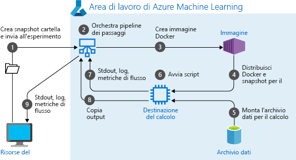
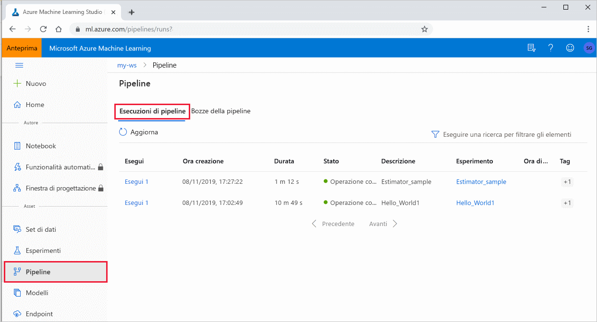

# <a name="create-and-run-machine-learning-pipelines-with-azure-machine-learning-sdk"></a>Creare ed eseguire pipeline di Machine Learning con Azure Machine Learning SDKCreate and run machine learning pipelines with Azure Machine Learning SDK
[!INCLUDE [applies-to-skus](../../includes/aml-applies-to-basic-enterprise-sku.md)]

Questo articolo illustra come creare, pubblicare, eseguire e monitorare una [pipeline di Machine Learning](concept-ml-pipelines.md) usando l'[SDK di Azure Machine Learning](https://docs.microsoft.com/python/api/overview/azure/ml/intro?view=azure-ml-py).  Usare **le pipeline** di Machine Learning per creare un flusso di lavoro che unisce varie fasi di Machine Learning e quindi pubblicare tale pipeline nell'area di lavoro di Azure Machine Learning per accedere in un secondo momento o condividere con altri utenti.  Le pipeline di ML sono ideali per scenari di punteggio batch, usando vari calcoli, riutilizzando i passaggi anziché rieseguirli, nonché per condividere flussi di lavoro di ML con altri utenti.

Sebbene sia possibile usare un tipo diverso di pipeline denominato Pipeline di [Azure](https://docs.microsoft.com/azure/devops/pipelines/targets/azure-machine-learning?context=azure%2Fmachine-learning%2Fservice%2Fcontext%2Fml-context&view=azure-devops&tabs=yaml) per l'automazione CI/CD delle attività di ML, quel tipo di pipeline non viene mai archiviato nell'area di lavoro. [Confrontare queste diverse pipeline](concept-ml-pipelines.md#which-azure-pipeline-technology-should-i-use).

Ogni fase di una pipeline di ML, ad esempio la preparazione dei dati e il training del modello, può includere uno o più passaggi.

Le pipeline di Machine Learning create sono visibili ai membri [dell'area](how-to-manage-workspace.md)di lavoro di Azure Machine Learning. 

Le pipeline di Machine ML usano destinazioni di calcolo remote per il calcolo e l'archiviazione dei dati intermedi e finali associati a tale pipeline. Possono leggere e scrivere dati da e verso percorsi di [Archiviazione di Azure](https://docs.microsoft.com/azure/storage/) supportati.

Se non è disponibile una sottoscrizione di Azure, creare un account gratuito prima di iniziare. Provare la [versione gratuita o a pagamento di Azure Machine Learning](https://aka.ms/AMLFree).

## <a name="prerequisites"></a>Prerequisiti

* Creare un'[area di lavoro di Azure Machine Learning](how-to-manage-workspace.md) che conterrà tutte le risorse della pipeline.

* [Configurare l'ambiente](how-to-configure-environment.md) di sviluppo per installare Azure Machine Learning SDK o usare un'istanza di [calcolo di Azure Machine Learning (anteprima)](concept-compute-instance.md) con l'SDK già installato.

Iniziare allegando l'area di lavoro:

```Python
import azureml.core
from azureml.core import Workspace, Datastore

ws = Workspace.from_config()
```


## <a name="set-up-machine-learning-resources"></a>Configurare le risorse di Machine Learning

Creare le risorse necessarie per eseguire una pipeline di ML:Create the resources required to run an ML pipeline:

* Configurare un archivio dati che verrà usato per accedere ai dati necessari nei passaggi della pipeline.

* Configurare un oggetto `DataReference` in modo da puntare ai dati che si trovano in un archivio dati o che sono accessibili da tale archivio.

* Configurare le [destinazioni di calcolo](concept-azure-machine-learning-architecture.md#compute-targets) in cui verranno eseguiti i passaggi della pipeline.

### <a name="set-up-a-datastore"></a>Configurare un archivio dati

Un archivio dati contiene i dati a cui accede la pipeline. Ogni area di lavoro ha un archivio dati predefinito. È possibile registrare altri archivi dati. 

Quando si crea l'area di lavoro, File di [Azure](https://docs.microsoft.com/azure/storage/files/storage-files-introduction) e [Archiviazione BLOB](https://docs.microsoft.com/azure/storage/blobs/storage-blobs-introduction) di Azure vengono collegati all'area di lavoro. Un archivio dati predefinito viene registrato per connettersi all'archiviazione BLOB di Azure.A default datastore is registered to connect to the Azure Blob storage. Per altre informazioni, vedere [Decidere quando usare BLOB di Azure, File di Azure o Dischi di Azure](https://docs.microsoft.com/azure/storage/common/storage-decide-blobs-files-disks). 

```python
# Default datastore 
def_data_store = ws.get_default_datastore()

# Get the blob storage associated with the workspace
def_blob_store = Datastore(ws, "workspaceblobstore")

# Get file storage associated with the workspace
def_file_store = Datastore(ws, "workspacefilestore")

```

Caricare le directory o i file di dati nell'archivio dati per renderli accessibili dalle pipeline. Questo esempio usa l'archiviazione BLOB come archivio dati:This example uses the Blob storage as the datastore:

```python
def_blob_store.upload_files(
    ["./data/20news.pkl"],
    target_path="20newsgroups",
    overwrite=True)
```

Una pipeline è costituita da uno o più passaggi. Un passaggio è un'unità di esecuzione in una destinazione di calcolo. I passaggi possono utilizzare origini dati e generare dati "intermedi". Un passaggio può creare dati, ad esempio un modello, una directory con modello e file dipendenti o dati temporanei. Questi dati sono quindi disponibili per altri passaggi successivi nella pipeline.

Per altre informazioni sulla connessione della pipeline ai dati, vedere gli articoli [Come accedere ai dati](how-to-access-data.md) e Come [registrare i set di dati](how-to-create-register-datasets.md). 

### <a name="configure-data-reference"></a>Configurare un riferimento ai dati

Si è appena creata un'origine dati a cui si può fare riferimento in una pipeline come input per un passaggio. Un'origine dati in una pipeline è rappresentata da un oggetto [DataReference](https://docs.microsoft.com/python/api/azureml-core/azureml.data.data_reference.datareference). L'oggetto `DataReference` punta ai dati che si trovano in un archivio dati o che sono accessibili da tale archivio.

```python
from azureml.data.data_reference import DataReference

blob_input_data = DataReference(
    datastore=def_blob_store,
    data_reference_name="test_data",
    path_on_datastore="20newsgroups/20news.pkl")
```

I dati intermedi (o output di un passaggio) sono rappresentati da un oggetto [PipelineData](https://docs.microsoft.com/python/api/azureml-pipeline-core/azureml.pipeline.core.pipelinedata?view=azure-ml-py). `output_data1` viene generato come output di un passaggio e usato come input di uno o più passaggi successivi. `PipelineData` introduce una dipendenza dei dati tra i vari passaggi e crea un ordine di esecuzione implicito nella pipeline. Questo oggetto verrà utilizzato in un secondo momento durante la creazione dei passaggi della pipeline.

```python
from azureml.pipeline.core import PipelineData

output_data1 = PipelineData(
    "output_data1",
    datastore=def_blob_store,
    output_name="output_data1")
```

### <a name="configure-data-using-datasets"></a>Configurare i dati utilizzando i set di datiConfigure data using datasets

Se si dispone di dati tabulari archiviati in un file o `DataReference`in un set di file, un [TabularDataset](https://docs.microsoft.com/python/api/azureml-core/azureml.data.tabulardataset?view=azure-ml-py) è un'alternativa efficiente a un oggetto . `TabularDataset`gli oggetti supportano il controllo delle versioni, le differenze e le statistiche di riepilogo. `TabularDataset`s sono valutati in modo lato (come i generatori Python) ed è efficiente per sottoinsiemi mediante divisione o filtraggio. La `FileDataset` classe fornisce dati valutati in modo lato simili che rappresentano uno o più file. 

Creare un `TabularDataset` utilizzando metodi come [from_delimited_files](https://docs.microsoft.com/python/api/azureml-core/azureml.data.dataset_factory.tabulardatasetfactory?view=azure-ml-py#from-delimited-files-path--validate-true--include-path-false--infer-column-types-true--set-column-types-none--separator------header-true--partition-format-none-).

```python
from azureml.data import TabularDataset

iris_tabular_dataset = Dataset.Tabular.from_delimited_files([(def_blob_store, 'train-dataset/tabular/iris.csv')])
```

 Creare un `FileDataset` [from_files](https://docs.microsoft.com/python/api/azureml-core/azureml.data.dataset_factory.filedatasetfactory?view=azure-ml-py#from-files-path--validate-true-)utilizzando .

 Per altre informazioni sull'uso dei [dataset, vedere Add & register datasets](how-to-create-register-datasets.md) o [this sample notebook](https://aka.ms/train-datasets).

## <a name="set-up-compute-target"></a>Configurare la destinazione di calcolo

In Azure Machine Learning il termine calcola (o destinazione di __calcolo__) fa riferimento ai computer o ai cluster che eseguono i passaggi di calcolo nella pipeline di Machine Learning.In Azure Machine Learning, the term __computes__ (or compute target ) refers to the machines or clusters that performthe the computational steps in your machine learning pipeline.   Consultare l'articolo sulle[destinazioni di calcolo per il training del modello](how-to-set-up-training-targets.md) per un elenco completo delle destinazioni di calcolo e per informazioni su come crearle e collegarle all'area di lavoro.  Il processo per la creazione e il collegamento di una destinazione di calcolo è lo stesso indipendentemente dal fatto che si stia eseguendo il passaggio di una pipeline o il training di un modello. Dopo aver creato e collegato la destinazione di calcolo, usare l'oggetto `ComputeTarget` nel [passaggio pipeline](#steps).

> [!IMPORTANT]
> L'esecuzione di operazioni di gestione su destinazioni di calcolo non è supportata all'interno di processi remoti. Poiché le pipeline di Machine Learning vengono inviate come processo remoto, non usare le operazioni di gestione in destinazioni di calcolo all'interno della pipeline.

Di seguito sono riportati esempi di creazione e collegamento di destinazioni di calcolo per:

* Ambiente di calcolo di Azure Machine Learning
* Azure Databricks 
* Azure Data Lake Analytics.

### <a name="azure-machine-learning-compute"></a>Ambiente di calcolo di Azure Machine Learning

È possibile creare un ambiente di calcolo di Azure Machine Learning per eseguire i passaggi.

```python
from azureml.core.compute import ComputeTarget, AmlCompute

compute_name = "aml-compute"
vm_size = "STANDARD_NC6"
if compute_name in ws.compute_targets:
    compute_target = ws.compute_targets[compute_name]
    if compute_target and type(compute_target) is AmlCompute:
        print('Found compute target: ' + compute_name)
else:
    print('Creating a new compute target...')
    provisioning_config = AmlCompute.provisioning_configuration(vm_size=vm_size,  # STANDARD_NC6 is GPU-enabled
                                                                min_nodes=0,
                                                                max_nodes=4)
    # create the compute target
    compute_target = ComputeTarget.create(
        ws, compute_name, provisioning_config)

    # Can poll for a minimum number of nodes and for a specific timeout.
    # If no min node count is provided it will use the scale settings for the cluster
    compute_target.wait_for_completion(
        show_output=True, min_node_count=None, timeout_in_minutes=20)

    # For a more detailed view of current cluster status, use the 'status' property
    print(compute_target.status.serialize())
```

### <a name="azure-databricks"></a><a id="databricks"></a>Azure Databricks

Azure Databricks è un ambiente basato su Apache Spark nel cloud di Azure. Può essere usata come destinazione di calcolo con una pipeline di Azure Machine Learning.

Creare un'area di lavoro di Azure Databricks prima di usarlo. Per creare una risorsa dell'area di lavoro, vedere il documento [Eseguire un processo Spark in Azure Databricks.To](https://docs.microsoft.com/azure/azure-databricks/quickstart-create-databricks-workspace-portal) create a workspace resource, see the Run a Spark job on Azure Databricks document.

Per collegare Azure Databricks come destinazione di calcolo, fornire le informazioni seguenti:

* __Databricks compute name (Nome di calcolo di Databrick):__ il nome da assegnare a questa risorsa di calcolo.
* __Nome area di lavoro Databricks:__ nome dell'area di lavoro di Azure Databricks.
* Token di __accesso Databricks:__ token di accesso usato per l'autenticazione in Azure Databricks. Per generare un token di accesso vedere il documento [Authentication](https://docs.azuredatabricks.net/dev-tools/api/latest/authentication.html) (Autenticazione).

Il codice seguente illustra come collegare Azure Databricks come destinazione di calcolo con Azure Machine Learning SDK __(l'area di lavoro Databricks deve essere presente nella stessa sottoscrizione dell'area di lavoro AML__):

```python
import os
from azureml.core.compute import ComputeTarget, DatabricksCompute
from azureml.exceptions import ComputeTargetException

databricks_compute_name = os.environ.get(
    "AML_DATABRICKS_COMPUTE_NAME", "<databricks_compute_name>")
databricks_workspace_name = os.environ.get(
    "AML_DATABRICKS_WORKSPACE", "<databricks_workspace_name>")
databricks_resource_group = os.environ.get(
    "AML_DATABRICKS_RESOURCE_GROUP", "<databricks_resource_group>")
databricks_access_token = os.environ.get(
    "AML_DATABRICKS_ACCESS_TOKEN", "<databricks_access_token>")

try:
    databricks_compute = ComputeTarget(
        workspace=ws, name=databricks_compute_name)
    print('Compute target already exists')
except ComputeTargetException:
    print('compute not found')
    print('databricks_compute_name {}'.format(databricks_compute_name))
    print('databricks_workspace_name {}'.format(databricks_workspace_name))
    print('databricks_access_token {}'.format(databricks_access_token))

    # Create attach config
    attach_config = DatabricksCompute.attach_configuration(resource_group=databricks_resource_group,
                                                           workspace_name=databricks_workspace_name,
                                                           access_token=databricks_access_token)
    databricks_compute = ComputeTarget.attach(
        ws,
        databricks_compute_name,
        attach_config
    )

    databricks_compute.wait_for_completion(True)
```

Per un esempio più dettagliato, vedere un blocco appunti di esempio in GitHub.For a more detailed [example,](https://aka.ms/pl-databricks) see an example notebook on GitHub.

### <a name="azure-data-lake-analytics"></a><a id="adla"></a>Azure Data Lake Analytics

Azure Data Lake Analytics è una piattaforma di analisi dei Big Data nel cloud di Azure. Può essere usata come destinazione di calcolo con una pipeline di Azure Machine Learning.

Creare un account di Azure Data Lake Analytics prima di usarla. Per creare questa risorsa vedere il documento [Introduzione ad Azure Data Lake Analytics con il portale di Azure](https://docs.microsoft.com/azure/data-lake-analytics/data-lake-analytics-get-started-portal).

Per connettere Data Lake Analytics come destinazione di calcolo è necessario usare Azure Machine Learning SDK e specificare le informazioni seguenti:

* __Nome del calcolo__: il nome da assegnare a questa risorsa di calcolo.
* __Gruppo di risorse:__ il gruppo di risorse che contiene l'account Data Lake Analytics.
* __Nome account__: Il nome dell'account Data Lake Analytics.

Il codice seguente illustra in che modo connettere Data Lake Analytics come destinazione di calcolo:

```python
import os
from azureml.core.compute import ComputeTarget, AdlaCompute
from azureml.exceptions import ComputeTargetException


adla_compute_name = os.environ.get(
    "AML_ADLA_COMPUTE_NAME", "<adla_compute_name>")
adla_resource_group = os.environ.get(
    "AML_ADLA_RESOURCE_GROUP", "<adla_resource_group>")
adla_account_name = os.environ.get(
    "AML_ADLA_ACCOUNT_NAME", "<adla_account_name>")

try:
    adla_compute = ComputeTarget(workspace=ws, name=adla_compute_name)
    print('Compute target already exists')
except ComputeTargetException:
    print('compute not found')
    print('adla_compute_name {}'.format(adla_compute_name))
    print('adla_resource_id {}'.format(adla_resource_group))
    print('adla_account_name {}'.format(adla_account_name))
    # create attach config
    attach_config = AdlaCompute.attach_configuration(resource_group=adla_resource_group,
                                                     account_name=adla_account_name)
    # Attach ADLA
    adla_compute = ComputeTarget.attach(
        ws,
        adla_compute_name,
        attach_config
    )

    adla_compute.wait_for_completion(True)
```

Per un esempio più dettagliato, vedere un blocco appunti di esempio in GitHub.For a more detailed [example,](https://aka.ms/pl-adla) see an example notebook on GitHub.

> [!TIP]
> Le pipeline di Azure Machine Learning possono funzionare solo con i dati archiviati nell'archivio dati predefinito dell'account Data Lake Analytics. Se i dati con cui è necessario lavorare si trovano [`DataTransferStep`](https://docs.microsoft.com/python/api/azureml-pipeline-steps/azureml.pipeline.steps.data_transfer_step.datatransferstep?view=azure-ml-py) in un archivio non predefinito, è possibile usare un oggetto per copiare i dati prima del training.

## <a name="construct-your-pipeline-steps"></a><a id="steps"></a>Creare i passaggi della pipeline

Dopo aver creato e collegato una destinazione di calcolo all'area di lavoro, è possibile definire un passaggio della pipeline. Con l'SDK di Azure Machine Learning sono disponibili numerosi passaggi predefiniti. La più semplice di queste operazioni è un [PythonScriptStep](https://docs.microsoft.com/python/api/azureml-pipeline-steps/azureml.pipeline.steps.python_script_step.pythonscriptstep?view=azure-ml-py), che esegue uno script Python in una destinazione di calcolo specificata:

```python
from azureml.pipeline.steps import PythonScriptStep

trainStep = PythonScriptStep(
    script_name="train.py",
    arguments=["--input", blob_input_data, "--output", output_data1],
    inputs=[blob_input_data],
    outputs=[output_data1],
    compute_target=compute_target,
    source_directory=project_folder
)
```

Il riutilizzo dei`allow_reuse`risultati precedenti ( ) è fondamentale quando si utilizzano pipeline in un ambiente collaborativo poiché l'eliminazione di repliche non necessarie offre agilità. Il riutilizzo è il comportamento predefinito quando il script_name, gli input e i parametri di un passaggio rimangono invariati. Quando l'output del passaggio viene riutilizzato, il processo non viene inviato al calcolo, ma i risultati dell'esecuzione precedente sono immediatamente disponibili per l'esecuzione del passaggio successivo. Se `allow_reuse` è impostato su false, verrà sempre generata una nuova esecuzione per questo passaggio durante l'esecuzione della pipeline. 

Dopo la definizione dei passaggi, si crea la pipeline usando alcuni o tutti i passaggi definiti.

> [!NOTE]
> Nessun file o dato viene caricato in Azure Machine Learning quando si definiscono i passaggi o si compila la pipeline.

```python
# list of steps to run
compareModels = [trainStep, extractStep, compareStep]

from azureml.pipeline.core import Pipeline

# Build the pipeline
pipeline1 = Pipeline(workspace=ws, steps=[compareModels])
```

L'esempio seguente mostra come usare la destinazione di calcolo di Azure Databricks creata in precedenza: 

```python
from azureml.pipeline.steps import DatabricksStep

dbStep = DatabricksStep(
    name="databricksmodule",
    inputs=[step_1_input],
    outputs=[step_1_output],
    num_workers=1,
    notebook_path=notebook_path,
    notebook_params={'myparam': 'testparam'},
    run_name='demo run name',
    compute_target=databricks_compute,
    allow_reuse=False
)
# List of steps to run
steps = [dbStep]

# Build the pipeline
pipeline1 = Pipeline(workspace=ws, steps=steps)
```

### <a name="use-a-dataset"></a>Usare un set di datiUse a dataset 

Per utilizzare `TabularDataset` un `FileDataset` oggetto o nella pipeline, è necessario trasformarlo in un oggetto [DatasetConsumptionConfig](https://docs.microsoft.com/python/api/azureml-core/azureml.data.dataset_consumption_config.datasetconsumptionconfig?view=azure-ml-py) chiamando [as_named_input(name)](https://docs.microsoft.com/python/api/azureml-core/azureml.data.abstract_dataset.abstractdataset?view=azure-ml-py#as-named-input-name-). Si passa `DatasetConsumptionConfig` questo oggetto `inputs` come uno dei al passaggio della pipeline. 

I set di dati creati da Archiviazione BLOB di Azure, File di Azure, Azure Data Lake Storage Gen1, Azure Data Lake Storage Gen2, Database SQL di Azure e Database di Azure per PostgreSQL possono essere usati come input per qualsiasi passaggio della pipeline. Ad eccezione della scrittura dell'output in un [DataTransferStep](https://docs.microsoft.com/python/api/azureml-pipeline-steps/azureml.pipeline.steps.datatransferstep?view=azure-ml-py) o [DatabricksStep](https://docs.microsoft.com/python/api/azureml-pipeline-steps/azureml.pipeline.steps.databricks_step.databricksstep?view=azure-ml-py), i dati di output ([PipelineData](https://docs.microsoft.com/python/api/azureml-pipeline-core/azureml.pipeline.core.pipelinedata?view=azure-ml-py)) possono essere scritti solo negli archivi dati BLOB di Azure e Condivisione file di Azure.

```python
dataset_consuming_step = PythonScriptStep(
    script_name="iris_train.py",
    inputs=[iris_tabular_dataset.as_named_input("iris_data")],
    compute_target=compute_target,
    source_directory=project_folder
)
```

È quindi possibile recuperare il set di dati nella pipeline utilizzando il dizionario [Run.input_datasets.](https://docs.microsoft.com/python/api/azureml-core/azureml.core.run.run?view=azure-ml-py#input-datasets)

```python
# iris_train.py
from azureml.core import Run, Dataset

run_context = Run.get_context()
iris_dataset = run_context.input_datasets['iris_data']
dataframe = iris_dataset.to_pandas_dataframe()
```

Per altre informazioni, vedere il pacchetto azure-pipeline-steps e il riferimento [alla classe Pipeline.For](https://docs.microsoft.com/python/api/azureml-pipeline-core/azureml.pipeline.core.pipeline%28class%29?view=azure-ml-py) more information, see the [azure-pipeline-steps package](https://docs.microsoft.com/python/api/azureml-pipeline-steps/?view=azure-ml-py) and Pipeline class reference.

## <a name="submit-the-pipeline"></a>Inviare la pipeline

Quando si invia la pipeline, Azure Machine Learning controlla le dipendenze per ogni passaggio e carica uno snapshot della directory di origine specificata. Se la directory di origine non è specificata, viene caricata la directory locale corrente. Lo snapshot viene archiviato anche come parte dell'esperimento nell'area di lavoro.

> [!IMPORTANT]
> Per impedire che i file vengano inclusi nello `.amlignore` snapshot, creare un file con estensione [gitignore](https://git-scm.com/docs/gitignore) o nella directory e aggiungervi i file. Il `.amlignore` file utilizza la stessa sintassi e gli stessi modelli del file [.gitignore.](https://git-scm.com/docs/gitignore) Se entrambi i `.amlignore` file esistono, il file ha la precedenza.
>
> Per ulteriori informazioni, vedere [Istantanee](concept-azure-machine-learning-architecture.md#snapshots).

```python
from azureml.core import Experiment

# Submit the pipeline to be run
pipeline_run1 = Experiment(ws, 'Compare_Models_Exp').submit(pipeline1)
pipeline_run1.wait_for_completion()
```

Quando si esegue una pipeline per la prima volta, Azure Machine Learning:

* Scarica lo snapshot del progetto nella destinazione di calcolo dalla risorsa di archiviazione BLOB associata all'area di lavoro.
* Crea un'immagine Docker corrispondente a ogni passaggio nella pipeline.
* Scarica l'immagine Docker per ogni passaggio nella destinazione di calcolo dal Registro di sistema del contenitore.
* Monta l'archivio `DataReference` dati se un oggetto è specificato in un passaggio. Se il montaggio non è supportato, in alternativa i dati vengono copiati nella destinazione di calcolo.
* Esegue il passaggio nella destinazione di calcolo specificata nella definizione del passaggio. 
* Crea gli artefatti, ad esempio i log, stdout e stderr, le metriche e l'output specificati dal passaggio. Questi artefatti vengono quindi caricati e conservati nell'archivio dati predefinito dell'utente.



Per altre informazioni, vedere il riferimento alla [classe Experiment.For](https://docs.microsoft.com/python/api/azureml-core/azureml.core.experiment.experiment?view=azure-ml-py) more information, see the Experiment class reference.

### <a name="view-results-of-a-pipeline"></a>Visualizzare i risultati di una pipelineView results of a pipeline

Visualizza l'elenco di tutte le pipeline e i relativi dettagli di esecuzione in studio:

1. Accedere ad [Azure Machine Learning Studio](https://ml.azure.com).

1. [Visualizzare l'area di lavoro](how-to-manage-workspace.md#view).

1. A sinistra selezionare Pipeline per visualizzare tutte le **esecuzioni** della pipeline.
 
 
1. Selezionare una pipeline specifica per visualizzare i risultati dell'esecuzione.

## <a name="git-tracking-and-integration"></a>Monitoraggio e integrazione Git

Quando si avvia un'esecuzione di training in cui la directory di origine è un repository Git locale, le informazioni sul repository vengono archiviate nella cronologia di esecuzione. Per altre informazioni, vedere [Integrazione Git per Azure Machine Learning.For](concept-train-model-git-integration.md)more information, see Git integration for Azure Machine Learning .

## <a name="publish-a-pipeline"></a>Pubblicare una pipeline

È possibile pubblicare una pipeline in modo da eseguirla in un secondo momento con input diversi. Per consentire all'endpoint REST di una pipeline già pubblicata di accettare parametri, è necessario impostare parametri per la pipeline prima della pubblicazione.

1. Per creare un parametro per la pipeline, usare un oggetto [PipelineParameter](https://docs.microsoft.com/python/api/azureml-pipeline-core/azureml.pipeline.core.graph.pipelineparameter?view=azure-ml-py) con un valore predefinito.

   ```python
   from azureml.pipeline.core.graph import PipelineParameter
   
   pipeline_param = PipelineParameter(
     name="pipeline_arg",
     default_value=10)
   ```

2. Aggiungere l'oggetto `PipelineParameter` come parametro a uno dei passaggi della pipeline, come indicato di seguito:

   ```python
   compareStep = PythonScriptStep(
     script_name="compare.py",
     arguments=["--comp_data1", comp_data1, "--comp_data2", comp_data2, "--output_data", out_data3, "--param1", pipeline_param],
     inputs=[ comp_data1, comp_data2],
     outputs=[out_data3],
     compute_target=compute_target,
     source_directory=project_folder)
   ```

3. Pubblicare la pipeline che accetterà un parametro quando richiamata.

   ```python
   published_pipeline1 = pipeline_run1.publish_pipeline(
        name="My_Published_Pipeline",
        description="My Published Pipeline Description",
        version="1.0")
   ```

### <a name="run-a-published-pipeline"></a>Eseguire una pipeline pubblicata

Tutte le pipeline pubblicate hanno un endpoint REST che richiama l'esecuzione della pipeline da sistemi esterni, ad esempio client non Python. Questo endpoint consente la "ripetibilità gestita" in scenari di ripetizione del training e assegnazione di punteggi in batch.

Per richiamare l'esecuzione della pipeline precedente, è necessario un token di intestazione di autenticazione di Azure Active Directory, come descritto in [AzureCliAuthentication (riferimento alla classe AzureCliAuthentication)](https://docs.microsoft.com/python/api/azureml-core/azureml.core.authentication.azurecliauthentication?view=azure-ml-py) o ottenere ulteriori dettagli nel blocco appunti [Authentication in Azure Machine Learning.](https://aka.ms/pl-restep-auth)

```python
from azureml.pipeline.core import PublishedPipeline
import requests

response = requests.post(published_pipeline1.endpoint,
                         headers=aad_token,
                         json={"ExperimentName": "My_Pipeline",
                               "ParameterAssignments": {"pipeline_arg": 20}})
```

## <a name="create-a-versioned-pipeline-endpoint"></a>Creare un endpoint della pipeline con controllo delle versioniCreate a versiond pipeline endpoint
È possibile creare un endpoint della pipeline con più pipeline pubblicate dietro di esso. Può essere usato come una pipeline pubblicata, ma fornisce un endpoint REST fisso durante l'iterazione e l'aggiornamento delle pipeline di ML.

```python
from azureml.pipeline.core import PipelineEndpoint

published_pipeline = PublishedPipeline.get(workspace="ws", name="My_Published_Pipeline")
pipeline_endpoint = PipelineEndpoint.publish(workspace=ws, name="PipelineEndpointTest",
                                            pipeline=published_pipeline, description="Test description Notebook")
```

### <a name="submit-a-job-to-a-pipeline-endpoint"></a>Inviare un processo a un endpoint della pipelineSubmit a job to a pipeline endpoint
È possibile inviare un processo alla versione predefinita di un endpoint della pipeline:You can submit a job to the default version of a pipeline endpoint:
```python
pipeline_endpoint_by_name = PipelineEndpoint.get(workspace=ws, name="PipelineEndpointTest")
run_id = pipeline_endpoint_by_name.submit("PipelineEndpointExperiment")
print(run_id)
```
È inoltre possibile inviare un processo a una versione specifica:
```python
run_id = pipeline_endpoint_by_name.submit("PipelineEndpointExperiment", pipeline_version="0")
print(run_id)
```

The same can be accomplished using the REST API:
```python
rest_endpoint = pipeline_endpoint_by_name.endpoint
response = requests.post(rest_endpoint, 
                         headers=aad_token, 
                         json={"ExperimentName": "PipelineEndpointExperiment",
                               "RunSource": "API",
                               "ParameterAssignments": {"1": "united", "2":"city"}})
```

### <a name="use-published-pipelines-in-the-studio"></a>Utilizzare pipeline pubblicate in studio

È anche possibile eseguire una pipeline pubblicata dallo studio:You can also run a published pipeline from the studio:

1. Accedere ad [Azure Machine Learning Studio](https://ml.azure.com).

1. [Visualizzare l'area di lavoro](how-to-manage-workspace.md#view).

1. A sinistra, seleziona **Endpoint**.

1. Nella parte superiore selezionare **Endpoint pipeline**.
 

1. Selezionare una pipeline specifica per eseguire, utilizzare o esaminare i risultati delle esecuzioni precedenti dell'endpoint della pipeline.


### <a name="disable-a-published-pipeline"></a>Disabilitare una pipeline pubblicataDisable a published pipeline

Per nascondere una pipeline dall'elenco di pipeline pubblicate, disabilitarla, in studio o dall'SDK:

```
# Get the pipeline by using its ID from Azure Machine Learning studio
p = PublishedPipeline.get(ws, id="068f4885-7088-424b-8ce2-eeb9ba5381a6")
p.disable()
```

È possibile abilitarlo `p.enable()`di nuovo con . Per altre informazioni, vedere Riferimento [alla classe PublishedPipeline.For](https://docs.microsoft.com/python/api/azureml-pipeline-core/azureml.pipeline.core.publishedpipeline?view=azure-ml-py) more information, see PublishedPipeline class reference.


## <a name="caching--reuse"></a>Memorizzazione nella cache & riutilizzoCaching & reuse  

Per ottimizzare e personalizzare il comportamento delle pipeline, è possibile eseguire alcune operazioni sulla memorizzazione nella cache e sul riutilizzo. Ad esempio, è possibile scegliere di:
+ **Disattivare il riutilizzo predefinito dell'output di esecuzione del passaggio** impostando `allow_reuse=False` durante la [definizione del passaggio](https://docs.microsoft.com/python/api/azureml-pipeline-steps/?view=azure-ml-py). Il riutilizzo è fondamentale quando si usano le pipeline in un ambiente collaborativo poiché l'eliminazione di esecuzioni non necessarie offre agilità. Tuttavia, è possibile rifiutare esplicitamente il riutilizzo.
+ **Forza regenerazione dell'output per tutti i passaggi di una conclora**`pipeline_run = exp.submit(pipeline, regenerate_outputs=False)`

Per impostazione predefinita, `allow_reuse` per `source_directory` i passaggi è abilitato e viene eseguito l'hashing di quello specificato nella definizione del passaggio. Pertanto, se lo script per un`script_name`determinato passaggio rimane lo stesso (` source_directory` , input e parametri) e nient'altro nell'oggetto è stato modificato, l'output di un'esecuzione del passaggio precedente viene riutilizzato, il processo non viene inviato al calcolo e i risultati dell'esecuzione precedente sono immediatamente disponibili fino al passaggio successivo.

```python
step = PythonScriptStep(name="Hello World",
                        script_name="hello_world.py",
                        compute_target=aml_compute,
                        source_directory=source_directory,
                        allow_reuse=False,
                        hash_paths=['hello_world.ipynb'])
```

## <a name="next-steps"></a>Passaggi successivi

- Usare [questi notebook di Jupyter in GitHub](https://aka.ms/aml-pipeline-readme) per esplorare più in dettaglio le pipeline di Machine Learning.
- Vedere la Guida di riferimento dell'SDK per il pacchetto [azureml-pipelines-core](https://docs.microsoft.com/python/api/azureml-pipeline-core/?view=azure-ml-py) e il pacchetto [azureml-pipelines-steps.](https://docs.microsoft.com/python/api/azureml-pipeline-steps/?view=azure-ml-py)
- Vedere le [procedure](how-to-debug-pipelines.md) per suggerimenti su debug e risoluzione dei problemi delle pipeline.

[!INCLUDE [aml-clone-in-azure-notebook](../../includes/aml-clone-for-examples.md)]
