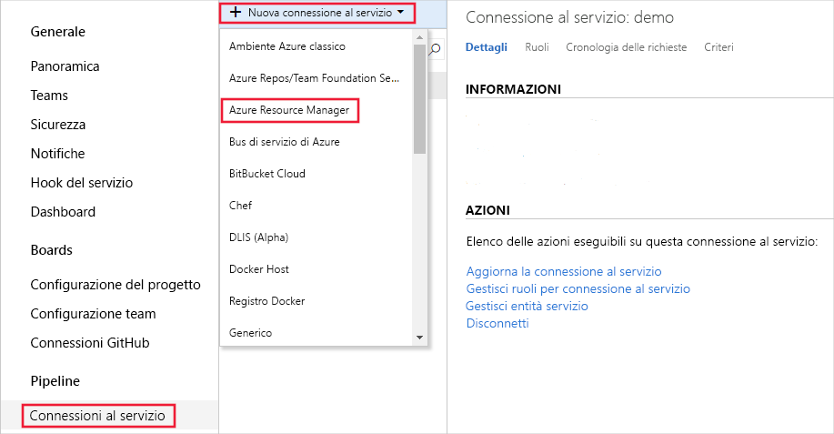
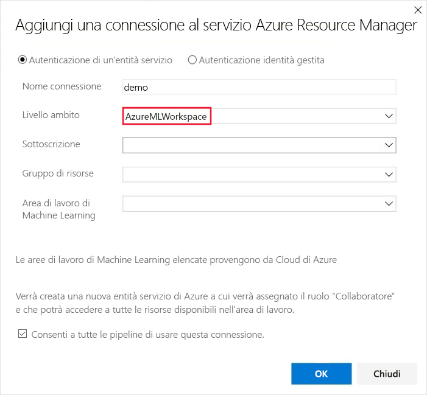
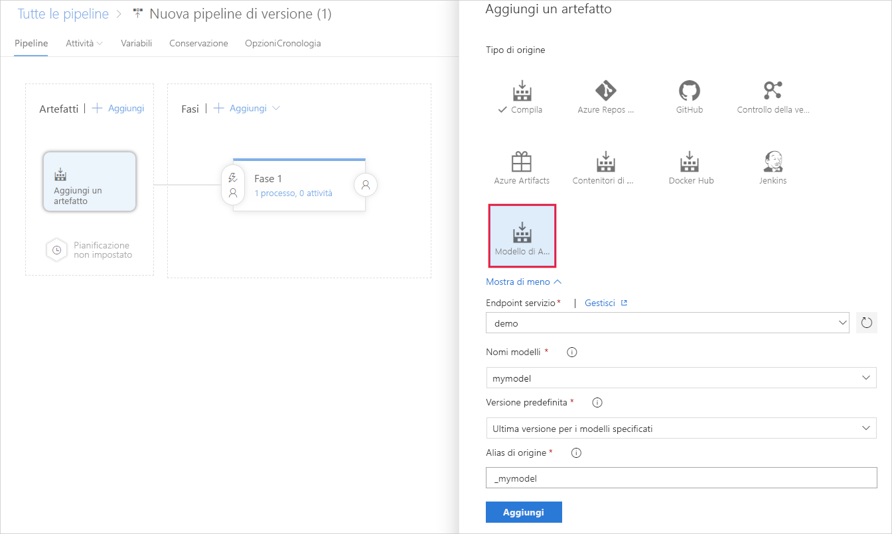
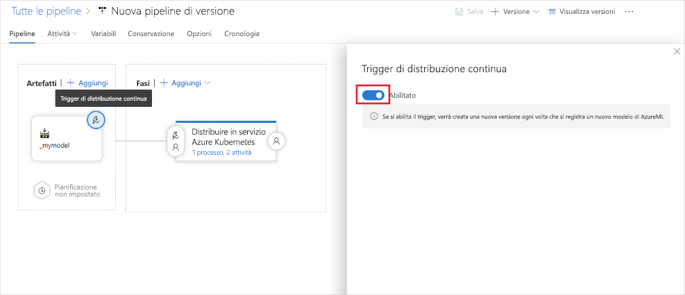

# <a name="deploy-models-with-azure-machine-learning"></a>Distribuire modelli con Azure Machine Learning
[!INCLUDE [applies-to-skus](../../includes/aml-applies-to-basic-enterprise-sku.md)]

Informazioni su come distribuire un modello di machine learning come servizio Web nel cloud di Azure o per Azure IoT Edge dispositivi.

Il flusso di lavoro è simile indipendentemente [da dove si distribuisce](#target) il modello:

1. Registrare il modello.
1. Preparare la distribuzione (specificare asset, utilizzo, destinazione di calcolo).
1. Distribuire il modello nella destinazione di calcolo.
1. Testare il modello distribuito, detto anche servizio Web.

Per ulteriori informazioni sui concetti relativi al flusso di lavoro di distribuzione, vedere [gestire, distribuire e monitorare i modelli con Azure Machine Learning](concept-model-management-and-deployment.md).

## <a name="prerequisites"></a>Prerequisiti

- Un'area di lavoro di Azure Machine Learning. Per altre informazioni, vedere [creare un'area di lavoro Azure Machine Learning](how-to-manage-workspace.md).

- Un modello. Se non si dispone di un modello sottoposto a training, è possibile utilizzare i file di modello e di dipendenza forniti in [questa esercitazione](https://aka.ms/azml-deploy-cloud).

- Estensione dell'interfaccia della riga [di comando di Azure per il servizio Machine Learning](reference-azure-machine-learning-cli.md), l' [SDK Azure Machine Learning per Python](https://docs.microsoft.com/python/api/overview/azure/ml/intro?view=azure-ml-py)o l' [estensione di Visual Studio code Azure Machine Learning](tutorial-setup-vscode-extension.md).

## <a name="connect-to-your-workspace"></a>Connettersi all'area di lavoro

Il codice seguente illustra come connettersi a un'area di lavoro di Azure Machine Learning usando le informazioni memorizzate nella cache per l'ambiente di sviluppo locale:

+ **Uso dell'SDK**

   ```python
   from azureml.core import Workspace
   ws = Workspace.from_config(path=".file-path/ws_config.json")
   ```

  Per altre informazioni sull'uso dell'SDK per connettersi a un'area di lavoro, vedere la documentazione di [Azure Machine Learning SDK per Python](https://docs.microsoft.com/python/api/overview/azure/ml/intro?view=azure-ml-py#workspace) .

+ **Uso dell'interfaccia della riga di comando**

   Quando si usa l'interfaccia della riga `-w` di `--workspace-name` comando, usare il parametro o per specificare l'area di lavoro per il comando.

+ **Uso di Visual Studio Code**

   Quando si utilizza Visual Studio Code, è possibile selezionare l'area di lavoro utilizzando un'interfaccia grafica. Per ulteriori informazioni, vedere la pagina relativa alla [distribuzione e gestione dei modelli](tutorial-train-deploy-image-classification-model-vscode.md#deploy-the-model) nella documentazione sull'estensione Visual Studio Code.

## <a name="register-your-model"></a><a id="registermodel"></a>Registrare il modello

Un modello registrato è un contenitore logico per uno o più file che costituiscono il modello. Se, ad esempio, si dispone di un modello archiviato in più file, è possibile registrarli come singolo modello nell'area di lavoro. Dopo aver registrato i file, è possibile scaricare o distribuire il modello registrato e ricevere tutti i file registrati.

> [!TIP]
> Quando si registra un modello, si specifica il percorso di una posizione cloud (da un'esecuzione di training) o di una directory locale. Questo percorso consente di individuare solo i file da caricare come parte del processo di registrazione. Non è necessario che corrisponda al percorso utilizzato nello script di immissione. Per altre informazioni, vedere [individuare i file di modello nello script di immissione](#load-model-files-in-your-entry-script).

I modelli di apprendimento automatico vengono registrati nell'area di lavoro Azure Machine Learning. Il modello può provenire da Azure Machine Learning o da un'altra posizione. Quando si registra un modello, è possibile specificare facoltativamente i metadati relativi al modello. I `tags` dizionari `properties` e applicati a una registrazione del modello possono quindi essere utilizzati per filtrare i modelli.

Negli esempi seguenti viene illustrato come registrare un modello.

### <a name="register-a-model-from-an-experiment-run"></a>Registrare un modello da un'esecuzione dell'esperimento

I frammenti di codice in questa sezione illustrano come registrare un modello da un'esecuzione di training:

> [!IMPORTANT]
> Per usare questi frammenti, è necessario aver eseguito in precedenza un'esecuzione del `Run` training ed è necessario avere accesso all'oggetto (esempio di SDK) o al valore dell'ID esecuzione (esempio dell'interfaccia della riga di comando). Per altre informazioni sui modelli di training, vedere [configurare le destinazioni di calcolo per il training del modello](how-to-set-up-training-targets.md).

+ **Uso dell'SDK**

  Quando si usa l'SDK per eseguire il training di un modello, è possibile ricevere un oggetto Run o un oggetto [AutoMLRun](/python/api/azureml-train-automl-client/azureml.train.automl.run.automlrun) , a seconda di come è stato [eseguito](https://docs.microsoft.com/python/api/azureml-core/azureml.core.run.run?view=azure-ml-py) il training del modello. Ogni oggetto può essere usato per registrare un modello creato da un'esecuzione dell'esperimento.

  + Registrare un modello da un `azureml.core.Run` oggetto:
 
    ```python
    model = run.register_model(model_name='sklearn_mnist',
                               tags={'area': 'mnist'},
                               model_path='outputs/sklearn_mnist_model.pkl')
    print(model.name, model.id, model.version, sep='\t')
    ```

    Il `model_path` parametro fa riferimento alla posizione cloud del modello. In questo esempio viene usato il percorso di un singolo file. Per includere più file nella registrazione del modello, impostare `model_path` sul percorso di una cartella che contiene i file. Per ulteriori informazioni, vedere la documentazione di [Run. register_model](https://docs.microsoft.com/python/api/azureml-core/azureml.core.run.run?view=azure-ml-py#register-model-model-name--model-path-none--tags-none--properties-none--model-framework-none--model-framework-version-none--description-none--datasets-none--sample-input-dataset-none--sample-output-dataset-none--resource-configuration-none----kwargs-) .

  + Registrare un modello da un `azureml.train.automl.run.AutoMLRun` oggetto:

    ```python
        description = 'My AutoML Model'
        model = run.register_model(description = description,
                                   tags={'area': 'mnist'})

        print(run.model_id)
    ```

    In questo esempio, i `metric` parametri `iteration` e non vengono specificati, quindi l'iterazione con la metrica primaria migliore verrà registrata. Il `model_id` valore restituito dall'esecuzione viene utilizzato al posto di un nome di modello.

    Per ulteriori informazioni, vedere la documentazione di [AutoMLRun. register_model](/python/api/azureml-train-automl-client/azureml.train.automl.run.automlrun#register-model-model-name-none--description-none--tags-none--iteration-none--metric-none-) .

+ **Uso dell'interfaccia della riga di comando**

  ```azurecli-interactive
  az ml model register -n sklearn_mnist  --asset-path outputs/sklearn_mnist_model.pkl  --experiment-name myexperiment --run-id myrunid --tag area=mnist
  ```

  [!INCLUDE [install extension](../../includes/machine-learning-service-install-extension.md)]

  Il `--asset-path` parametro fa riferimento alla posizione cloud del modello. In questo esempio viene usato il percorso di un singolo file. Per includere più file nella registrazione del modello, impostare `--asset-path` sul percorso di una cartella che contiene i file.

+ **Uso di Visual Studio Code**

  Registrare i modelli usando i file o le cartelle del modello usando l'estensione [Visual Studio Code](tutorial-train-deploy-image-classification-model-vscode.md#deploy-the-model) .

### <a name="register-a-model-from-a-local-file"></a>Registrare un modello da un file locale

Per registrare un modello, è possibile fornire il percorso locale del modello. È possibile specificare il percorso di una cartella o di un singolo file. È possibile utilizzare questo metodo per registrare i modelli sottoposti a training con Azure Machine Learning e quindi scaricarli. È anche possibile usare questo metodo per registrare i modelli sottoposti a training al di fuori della Azure Machine Learning.

[!INCLUDE [trusted models](../../includes/machine-learning-service-trusted-model.md)]

+ **Uso di SDK e ONNX**

    ```python
    import os
    import urllib.request
    from azureml.core.model import Model
    # Download model
    onnx_model_url = "https://www.cntk.ai/OnnxModels/mnist/opset_7/mnist.tar.gz"
    urllib.request.urlretrieve(onnx_model_url, filename="mnist.tar.gz")
    os.system('tar xvzf mnist.tar.gz')
    # Register model
    model = Model.register(workspace = ws,
                            model_path ="mnist/model.onnx",
                            model_name = "onnx_mnist",
                            tags = {"onnx": "demo"},
                            description = "MNIST image classification CNN from ONNX Model Zoo",)
    ```

  Per includere più file nella registrazione del modello, impostare `model_path` sul percorso di una cartella che contiene i file.

+ **Uso dell'interfaccia della riga di comando**

  ```azurecli-interactive
  az ml model register -n onnx_mnist -p mnist/model.onnx
  ```

  Per includere più file nella registrazione del modello, impostare `-p` sul percorso di una cartella che contiene i file.

**Tempo stimato**: circa 10 secondi.

Per ulteriori informazioni, vedere la documentazione relativa alla [classe del modello](https://docs.microsoft.com/python/api/azureml-core/azureml.core.model.model?view=azure-ml-py).

Per ulteriori informazioni sull'utilizzo di modelli sottoposti a training all'esterno di Azure Machine Learning, vedere [come distribuire un modello esistente](how-to-deploy-existing-model.md).

<a name="target"></a>

## <a name="single-versus-multi-model-endpoints"></a>Endpoint singoli e multimodello
Azure ML supporta la distribuzione di uno o più modelli dietro un singolo endpoint.

Gli endpoint multimodello usano un contenitore condiviso per ospitare più modelli. Questo consente di ridurre i costi di overhead, migliorare l'utilizzo e concatenare i moduli in modo analogo. I modelli specificati nello script di distribuzione sono montati e resi disponibili sul disco del contenitore di servizio. è possibile caricarli in memoria su richiesta e assegnare un punteggio in base al modello specifico richiesto al momento del punteggio.

Per un esempio E2E, che Mostra come usare più modelli dietro un singolo endpoint in contenitori, vedere [questo esempio](https://github.com/Azure/MachineLearningNotebooks/tree/master/how-to-use-azureml/deployment/deploy-multi-model)

## <a name="prepare-to-deploy"></a>Preparare la distribuzione

Per distribuire il modello come servizio, sono necessari i componenti seguenti:

* **Definire l'ambiente di inferenza**. Questo ambiente incapsula le dipendenze necessarie per eseguire il modello per l'inferenza.
* **Definire il codice**di assegnazione dei punteggi. Questo script accetta le richieste, assegna un punteggio alle richieste usando il modello e restituisce i risultati.
* **Definire la configurazione dell'inferenza**. La configurazione dell'inferenza specifica la configurazione dell'ambiente, lo script di ingresso e altri componenti necessari per eseguire il modello come servizio.

Una volta creati i componenti necessari, è possibile profilare il servizio che verrà creato in seguito alla distribuzione del modello per comprenderne i requisiti di CPU e memoria.

### <a name="1-define-inference-environment"></a>1. definire l'ambiente di inferenza

Una configurazione di inferenza descrive come configurare il servizio Web che contiene il modello. Viene usato in un secondo momento, quando si distribuisce il modello.

La configurazione dell'inferenza USA ambienti Azure Machine Learning per definire le dipendenze software necessarie per la distribuzione. Gli ambienti consentono di creare, gestire e riutilizzare le dipendenze software necessarie per il training e la distribuzione. È possibile creare un ambiente da file di dipendenza personalizzati o usare uno degli ambienti Azure Machine Learning curati. Il YAML seguente è un esempio di file di dipendenze conda per l'inferenza. Si noti che è necessario indicare azureml-defaults con versione >= 1.0.45 come dipendenza PIP, perché contiene la funzionalità necessaria per ospitare il modello come servizio Web. Se si desidera utilizzare la generazione automatica dello schema, è necessario che lo script di `inference-schema` immissione importi anche i pacchetti.

```YAML
name: project_environment
dependencies:
  - python=3.6.2
  - scikit-learn=0.20.0
  - pip:
      # You must list azureml-defaults as a pip dependency
    - azureml-defaults>=1.0.45
    - inference-schema[numpy-support]
```

> [!IMPORTANT]
> Se la dipendenza è disponibile tramite conda e PIP (da PyPi), Microsoft consiglia di usare la versione conda, in quanto i pacchetti conda sono in genere dotati di binari predefiniti che rendono l'installazione più affidabile.
>
> Per ulteriori informazioni, vedere informazioni su [conda e PIP](https://www.anaconda.com/understanding-conda-and-pip/).
>
> Per verificare se la dipendenza è disponibile tramite conda, utilizzare il `conda search <package-name>` comando oppure utilizzare gli indici dei pacchetti [https://anaconda.org/anaconda/repo](https://anaconda.org/anaconda/repo) in [https://anaconda.org/conda-forge/repo](https://anaconda.org/conda-forge/repo)e.

È possibile usare il file delle dipendenze per creare un oggetto ambiente e salvarlo nell'area di lavoro per un uso futuro:

```python
from azureml.core.environment import Environment
myenv = Environment.from_conda_specification(name = 'myenv',
                                             file_path = 'path-to-conda-specification-file'
myenv.register(workspace=ws)
```

### <a name="2-define-scoring-code"></a><a id="script"></a>2. definire il codice di assegnazione dei punteggi

Lo script di avvio riceve i dati inviati a un servizio Web distribuito e li passa al modello. Riceve quindi la risposta restituita dal modello e la restituisce al client. *Lo script è specifico del modello*. Deve comprendere i dati previsti e restituiti dal modello.

Lo script contiene due funzioni per il caricamento e l'esecuzione del modello:

* `init()`: In genere, questa funzione carica il modello in un oggetto globale. Questa funzione viene eseguita una sola volta, quando viene avviato il contenitore Docker per il servizio Web.

* `run(input_data)`: Questa funzione utilizza il modello per stimare un valore in base ai dati di input. Gli input e gli output dell'esecuzione usano in genere JSON per la serializzazione e la deserializzazione. È anche possibile usare dati binari non elaborati. È possibile trasformare i dati prima dell'invio al modello o prima della restituzione al client.

#### <a name="load-model-files-in-your-entry-script"></a>Caricare i file di modello nello script di immissione

Esistono due modi per individuare i modelli nello script di immissione:
* `AZUREML_MODEL_DIR`: Variabile di ambiente contenente il percorso della posizione del modello.
* `Model.get_model_path`: Un'API che restituisce il percorso del file di modello utilizzando il nome del modello registrato.

##### <a name="azureml_model_dir"></a>AZUREML_MODEL_DIR

AZUREML_MODEL_DIR è una variabile di ambiente creata durante la distribuzione del servizio. È possibile usare questa variabile di ambiente per trovare il percorso dei modelli distribuiti.

Nella tabella seguente viene descritto il valore di AZUREML_MODEL_DIR in base al numero di modelli distribuiti:

| Distribuzione | Valore della variabile di ambiente |
| ----- | ----- |
| Modello singolo | Percorso della cartella che contiene il modello. |
| Più modelli | Percorso della cartella contenente tutti i modelli. I modelli si trovano in base al nome e alla versione`$MODEL_NAME/$VERSION`in questa cartella () |

Durante la registrazione e la distribuzione del modello, i modelli vengono inseriti nel percorso AZUREML_MODEL_DIR e i relativi nomi file originali vengono conservati.

Per ottenere il percorso di un file di modello nello script di immissione, combinare la variabile di ambiente con il percorso del file che si sta cercando.

**Esempio di modello singolo**
```python
# Example when the model is a file
model_path = os.path.join(os.getenv('AZUREML_MODEL_DIR'), 'sklearn_regression_model.pkl')

# Example when the model is a folder containing a file
file_path = os.path.join(os.getenv('AZUREML_MODEL_DIR'), 'my_model_folder', 'sklearn_regression_model.pkl')
```

**Esempio di più modelli**
```python
# Example when the model is a file, and the deployment contains multiple models
model_path = os.path.join(os.getenv('AZUREML_MODEL_DIR'), 'sklearn_model', '1', 'sklearn_regression_model.pkl')
```

##### <a name="get_model_path"></a>get_model_path

Quando si registra un modello, è necessario specificare un nome di modello utilizzato per la gestione del modello nel registro di sistema. Usare questo nome con il metodo [Model. get_model_path ()](https://docs.microsoft.com/python/api/azureml-core/azureml.core.model.model?view=azure-ml-py#get-model-path-model-name--version-none---workspace-none-) per recuperare il percorso del file o dei file del modello nel file system locale. Se si registra una cartella o una raccolta di file, questa API restituisce il percorso della directory che contiene tali file.

Quando si registra un modello, è necessario assegnargli un nome. Il nome corrisponde alla posizione in cui viene inserito il modello, localmente o durante la distribuzione del servizio.

#### <a name="optional-define-model-web-service-schema"></a>Opzionale Definire lo schema del servizio Web modello

Per generare automaticamente uno schema per il servizio Web, fornire un esempio di input e/o output nel costruttore per uno degli oggetti tipo definiti. Il tipo e l'esempio vengono utilizzati per creare automaticamente lo schema. Azure Machine Learning quindi crea una specifica [openapi](https://swagger.io/docs/specification/about/) (spavalderia) per il servizio Web durante la distribuzione.

Questi tipi sono attualmente supportati:

* `pandas`
* `numpy`
* `pyspark`
* Oggetto Python standard

Per usare la generazione di schemi, includere il pacchetto `inference-schema` open source nel file delle dipendenze. Per ulteriori informazioni su questo pacchetto, vedere [https://github.com/Azure/InferenceSchema](https://github.com/Azure/InferenceSchema). Definire i formati di esempio di input e output `input_sample` nelle `output_sample` variabili e, che rappresentano i formati di richiesta e risposta per il servizio Web. Usare questi esempi negli elementi Decorator della funzione di input e output `run()` della funzione. Nell'esempio Scikit-learn seguente viene utilizzata la generazione dello schema.

##### <a name="example-entry-script"></a>Script di immissione di esempio

L'esempio seguente illustra come accettare e restituire i dati JSON:

```python
#Example: scikit-learn and Swagger
import json
import numpy as np
import os
from sklearn.externals import joblib
from sklearn.linear_model import Ridge

from inference_schema.schema_decorators import input_schema, output_schema
from inference_schema.parameter_types.numpy_parameter_type import NumpyParameterType


def init():
    global model
    # AZUREML_MODEL_DIR is an environment variable created during deployment. Join this path with the filename of the model file.
    # It holds the path to the directory that contains the deployed model (./azureml-models/$MODEL_NAME/$VERSION).
    # If there are multiple models, this value is the path to the directory containing all deployed models (./azureml-models).
    # Alternatively: model_path = Model.get_model_path('sklearn_mnist')
    model_path = os.path.join(os.getenv('AZUREML_MODEL_DIR'), 'sklearn_mnist_model.pkl')
    # Deserialize the model file back into a sklearn model
    model = joblib.load(model_path)


input_sample = np.array([[10, 9, 8, 7, 6, 5, 4, 3, 2, 1]])
output_sample = np.array([3726.995])


@input_schema('data', NumpyParameterType(input_sample))
@output_schema(NumpyParameterType(output_sample))
def run(data):
    try:
        result = model.predict(data)
        # You can return any data type, as long as it is JSON serializable.
        return result.tolist()
    except Exception as e:
        error = str(e)
        return error
```

Nell'esempio seguente viene illustrato come definire i dati di input come `<key: value>` dizionario usando un frame di dati. Questo metodo è supportato per l'utilizzo del servizio Web distribuito da Power BI. [Per ulteriori informazioni su come utilizzare il servizio Web da Power bi](https://docs.microsoft.com/power-bi/service-machine-learning-integration), vedere.

```python
import json
import pickle
import numpy as np
import pandas as pd
import azureml.train.automl
from sklearn.externals import joblib
from azureml.core.model import Model

from inference_schema.schema_decorators import input_schema, output_schema
from inference_schema.parameter_types.numpy_parameter_type import NumpyParameterType
from inference_schema.parameter_types.pandas_parameter_type import PandasParameterType


def init():
    global model
    # Replace filename if needed.
    model_path = os.path.join(os.getenv('AZUREML_MODEL_DIR'), 'model_file.pkl')
    # Deserialize the model file back into a sklearn model.
    model = joblib.load(model_path)


input_sample = pd.DataFrame(data=[{
    # This is a decimal type sample. Use the data type that reflects this column in your data.
    "input_name_1": 5.1,
    # This is a string type sample. Use the data type that reflects this column in your data.
    "input_name_2": "value2",
    # This is an integer type sample. Use the data type that reflects this column in your data.
    "input_name_3": 3
}])

# This is an integer type sample. Use the data type that reflects the expected result.
output_sample = np.array([0])


@input_schema('data', PandasParameterType(input_sample))
@output_schema(NumpyParameterType(output_sample))
def run(data):
    try:
        result = model.predict(data)
        # You can return any data type, as long as it is JSON serializable.
        return result.tolist()
    except Exception as e:
        error = str(e)
        return error
```

Per altri esempi, vedere gli script seguenti:

* [PyTorch](https://github.com/Azure/MachineLearningNotebooks/tree/master/how-to-use-azureml/ml-frameworks/pytorch)
* [TensorFlow](https://github.com/Azure/MachineLearningNotebooks/tree/master/how-to-use-azureml/ml-frameworks/tensorflow)
* [Keras](https://github.com/Azure/MachineLearningNotebooks/tree/master/how-to-use-azureml/training-with-deep-learning/train-hyperparameter-tune-deploy-with-keras)
* [AutoML](https://github.com/Azure/MachineLearningNotebooks/tree/master/how-to-use-azureml/automated-machine-learning/classification-bank-marketing-all-features)
* [ONNX](https://github.com/Azure/MachineLearningNotebooks/blob/master/how-to-use-azureml/deployment/onnx/)
* [Binary Data](#binary)
* [CORS](#cors)

### <a name="3-define-inference-configuration"></a><a id="script"></a>3. definire la configurazione dell'inferenza
    
Nell'esempio seguente viene illustrato il caricamento di un ambiente dall'area di lavoro e la relativa utilizzo con la configurazione dell'inferenza:

```python
from azureml.core.environment import Environment
from azureml.core.model import InferenceConfig


myenv = Environment.get(workspace=ws, name='myenv', version='1')
inference_config = InferenceConfig(entry_script='path-to-score.py',
                                   environment=myenv)
```

Per altre informazioni sugli ambienti, vedere [creare e gestire ambienti per il training e la distribuzione](how-to-use-environments.md).

Per ulteriori informazioni sulla configurazione dell'inferenza, vedere la documentazione relativa alla classe [InferenceConfig](https://docs.microsoft.com/python/api/azureml-core/azureml.core.model.inferenceconfig?view=azure-ml-py) .

Per informazioni sull'uso di un'immagine Docker personalizzata con una configurazione di inferenza, vedere [come distribuire un modello usando un'immagine Docker personalizzata](how-to-deploy-custom-docker-image.md).

#### <a name="cli-example-of-inferenceconfig"></a>Esempio di interfaccia della riga di comando di InferenceConfig

[!INCLUDE [inference config](../../includes/machine-learning-service-inference-config.md)]

Il comando seguente illustra come distribuire un modello usando l'interfaccia della riga di comando:

```azurecli-interactive
az ml model deploy -n myservice -m mymodel:1 --ic inferenceconfig.json
```

In questo esempio, la configurazione specifica le impostazioni seguenti:

* Che il modello richieda Python.
* [Script di immissione](#script)utilizzato per gestire le richieste Web inviate al servizio distribuito.
* Il file conda che descrive i pacchetti Python necessari per l'inferenza.

Per informazioni sull'uso di un'immagine Docker personalizzata con una configurazione di inferenza, vedere [come distribuire un modello usando un'immagine Docker personalizzata](how-to-deploy-custom-docker-image.md).

### <a name="4-optional-profile-your-model-to-determine-resource-utilization"></a><a id="profilemodel"></a>4. (facoltativo) profilare il modello per determinare l'utilizzo delle risorse

Dopo aver registrato il modello e preparato gli altri componenti necessari per la distribuzione, è possibile determinare la CPU e la memoria necessarie per il servizio distribuito. Il profiling testa il servizio che esegue il modello e restituisce informazioni quali l'utilizzo della CPU, l'utilizzo della memoria e la latenza della risposta. Fornisce inoltre una raccomandazione per la CPU e la memoria in base all'utilizzo delle risorse.

Per profilare il modello, è necessario:
* Modello registrato.
* Una configurazione di inferenza basata sullo script di immissione e la definizione dell'ambiente di inferenza.
* Set di dati tabulare a colonna singola, in cui ogni riga contiene una stringa che rappresenta i dati della richiesta di esempio.

> [!IMPORTANT]
> A questo punto è supportata solo la profilatura dei servizi che prevedono che i dati della richiesta siano una stringa, ad esempio: JSON serializzato di stringa, testo, stringa serializzata immagine e così via. Il contenuto di ogni riga del set di dati (stringa) verrà inserito nel corpo della richiesta HTTP e inviato al servizio incapsulando il modello per l'assegnazione dei punteggi.

Di seguito è riportato un esempio di come è possibile costruire un set di dati di input per profilare un servizio che prevede che i dati della richiesta in ingresso contengano JSON serializzato. In questo caso, è stato creato un set di dati basato su 100 istanze dello stesso contenuto della richiesta. Negli scenari reali è consigliabile usare set di dati più grandi contenenti diversi input, soprattutto se l'utilizzo o il comportamento delle risorse del modello è dipendente dall'input.

```python
import json
from azureml.core import Datastore
from azureml.core.dataset import Dataset
from azureml.data import dataset_type_definitions

input_json = {'data': [[1, 2, 3, 4, 5, 6, 7, 8, 9, 10],
                       [10, 9, 8, 7, 6, 5, 4, 3, 2, 1]]}
# create a string that can be utf-8 encoded and
# put in the body of the request
serialized_input_json = json.dumps(input_json)
dataset_content = []
for i in range(100):
    dataset_content.append(serialized_input_json)
dataset_content = '\n'.join(dataset_content)
file_name = 'sample_request_data.txt'
f = open(file_name, 'w')
f.write(dataset_content)
f.close()

# upload the txt file created above to the Datastore and create a dataset from it
data_store = Datastore.get_default(ws)
data_store.upload_files(['./' + file_name], target_path='sample_request_data')
datastore_path = [(data_store, 'sample_request_data' +'/' + file_name)]
sample_request_data = Dataset.Tabular.from_delimited_files(
    datastore_path, separator='\n',
    infer_column_types=True,
    header=dataset_type_definitions.PromoteHeadersBehavior.NO_HEADERS)
sample_request_data = sample_request_data.register(workspace=ws,
                                                   name='sample_request_data',
                                                   create_new_version=True)
```

Quando il set di dati contenente i dati di richiesta di esempio è pronto, creare una configurazione di inferenza. La configurazione dell'inferenza si basa su score.py e sulla definizione dell'ambiente. Nell'esempio seguente viene illustrato come creare la configurazione dell'inferenza ed eseguire la profilatura:

```python
from azureml.core.model import InferenceConfig, Model
from azureml.core.dataset import Dataset


model = Model(ws, id=model_id)
inference_config = InferenceConfig(entry_script='path-to-score.py',
                                   environment=myenv)
input_dataset = Dataset.get_by_name(workspace=ws, name='sample_request_data')
profile = Model.profile(ws,
            'unique_name',
            [model],
            inference_config,
            input_dataset=input_dataset)

profile.wait_for_completion(True)

# see the result
details = profile.get_details()
```

Il comando seguente illustra come profilare un modello usando l'interfaccia della riga di comando:

```azurecli-interactive
az ml model profile -g <resource-group-name> -w <workspace-name> --inference-config-file <path-to-inf-config.json> -m <model-id> --idi <input-dataset-id> -n <unique-name>
```

> [!TIP]
> Per salvare in modo permanente le informazioni restituite dalla profilatura, usare tag o proprietà per il modello. L'utilizzo di tag o proprietà consente di archiviare i dati con il modello nel registro di sistema del modello. Gli esempi seguenti illustrano l'aggiunta di un nuovo `requestedCpu` tag `requestedMemoryInGb` contenente le informazioni e:
>
> ```python
> model.add_tags({'requestedCpu': details['requestedCpu'],
>                 'requestedMemoryInGb': details['requestedMemoryInGb']})
> ```
>
> ```azurecli-interactive
> az ml model profile -g <resource-group-name> -w <workspace-name> --i <model-id> --add-tag requestedCpu=1 --add-tag requestedMemoryInGb=0.5
> ```

## <a name="deploy-to-target"></a>Distribuisci nella destinazione

La distribuzione usa la configurazione di distribuzione per la configurazione dell'inferenza per distribuire i modelli. Il processo di distribuzione è simile indipendentemente dalla destinazione di calcolo. La distribuzione in AKS è leggermente diversa perché è necessario fornire un riferimento al cluster AKS.

### <a name="choose-a-compute-target"></a>Scegliere una destinazione di calcolo

Per ospitare la distribuzione del servizio Web, è possibile usare le seguenti destinazioni di calcolo o risorse di calcolo:

[!INCLUDE [aml-compute-target-deploy](../../includes/aml-compute-target-deploy.md)]

### <a name="define-your-deployment-configuration"></a>Definire la configurazione di distribuzione

Prima di distribuire il modello, è necessario definire la configurazione della distribuzione. *La configurazione della distribuzione è specifica per la destinazione di calcolo in cui verrà ospitato il servizio Web.* Ad esempio, quando si distribuisce un modello localmente, è necessario specificare la porta in cui il servizio accetta le richieste. La configurazione della distribuzione non fa parte dello script di immissione. Viene usato per definire le caratteristiche della destinazione di calcolo che ospiterà lo script del modello e della voce.

Potrebbe anche essere necessario creare la risorsa di calcolo, se, ad esempio, non si dispone già di un'istanza di Azure Kubernetes Service (AKS) associata all'area di lavoro.

La tabella seguente fornisce un esempio di creazione di una configurazione di distribuzione per ogni destinazione di calcolo:

| Destinazione del calcolo | Esempio di configurazione della distribuzione |
| ----- | ----- |
| Local | `deployment_config = LocalWebservice.deploy_configuration(port=8890)` |
| Istanze di Azure Container | `deployment_config = AciWebservice.deploy_configuration(cpu_cores = 1, memory_gb = 1)` |
| Servizio Azure Kubernetes | `deployment_config = AksWebservice.deploy_configuration(cpu_cores = 1, memory_gb = 1)` |

Le classi per local, istanze di contenitore di Azure e servizi Web AKS possono essere importate da `azureml.core.webservice`:

```python
from azureml.core.webservice import AciWebservice, AksWebservice, LocalWebservice
```

### <a name="securing-deployments-with-tls"></a>Protezione delle distribuzioni con TLS

Per ulteriori informazioni su come proteggere la distribuzione di un servizio Web, vedere [Enable TLS and deploy](how-to-secure-web-service.md#enable).

### <a name="local-deployment"></a><a id="local"></a>Distribuzione locale

Per distribuire un modello localmente, è necessario che Docker sia installato nel computer locale.

#### <a name="using-the-sdk"></a>Uso dell'SDK

```python
from azureml.core.webservice import LocalWebservice, Webservice

deployment_config = LocalWebservice.deploy_configuration(port=8890)
service = Model.deploy(ws, "myservice", [model], inference_config, deployment_config)
service.wait_for_deployment(show_output = True)
print(service.state)
```

Per ulteriori informazioni, vedere la documentazione relativa a [LocalWebservice](https://docs.microsoft.com/python/api/azureml-core/azureml.core.webservice.local.localwebservice?view=azure-ml-py), [Model. Deploy ()](https://docs.microsoft.com/python/api/azureml-core/azureml.core.model.model?view=azure-ml-py#deploy-workspace--name--models--inference-config-none--deployment-config-none--deployment-target-none--overwrite-false-)e [WebService](https://docs.microsoft.com/python/api/azureml-core/azureml.core.webservice.webservice?view=azure-ml-py).

#### <a name="using-the-cli"></a>Uso dell'interfaccia della riga di comando

Per distribuire un modello usando l'interfaccia della riga di comando, usare il comando seguente. Sostituire `mymodel:1` con il nome e la versione del modello registrato:

```azurecli-interactive
az ml model deploy -m mymodel:1 --ic inferenceconfig.json --dc deploymentconfig.json
```

[!INCLUDE [aml-local-deploy-config](../../includes/machine-learning-service-local-deploy-config.md)]

Per ulteriori informazioni, vedere la documentazione [AZ ml Model deploy](https://docs.microsoft.com/cli/azure/ext/azure-cli-ml/ml/model?view=azure-cli-latest#ext-azure-cli-ml-az-ml-model-deploy) .

### <a name="understanding-service-state"></a>Informazioni sullo stato del servizio

Durante la distribuzione del modello, è possibile che venga visualizzata la modifica dello stato del servizio durante la distribuzione completa.

Nella tabella seguente vengono descritti i diversi Stati del servizio:

| Stato WebService | Descrizione | Stato finale?
| ----- | ----- | ----- |
| Transizione | Il servizio è in fase di distribuzione. | No |
| Non integro | Il servizio è stato distribuito ma non è attualmente raggiungibile.  | No |
| Non pianificabile | Non è possibile distribuire il servizio in questo momento a causa di risorse insufficienti. | No |
| Operazione non riuscita | La distribuzione del servizio non è riuscita a causa di un errore o di un arresto anomalo. | Sì |
| Healthy | Il servizio è integro e l'endpoint è disponibile. | Sì |

### <a name="compute-instance-web-service-devtest"></a><a id="notebookvm"></a>Servizio Web dell'istanza di calcolo (sviluppo/test)

Vedere [distribuire un modello per Azure Machine Learning istanza di calcolo](how-to-deploy-local-container-notebook-vm.md).

### <a name="azure-container-instances-devtest"></a><a id="aci"></a>Istanze di contenitore di Azure (sviluppo/test)

Vedere [eseguire la distribuzione in istanze di contenitore di Azure](how-to-deploy-azure-container-instance.md).

### <a name="azure-kubernetes-service-devtest-and-production"></a><a id="aks"></a>Servizio Azure Kubernetes (sviluppo/test e produzione)

Vedere [eseguire la distribuzione nel servizio Azure Kubernetes](how-to-deploy-azure-kubernetes-service.md).

### <a name="ab-testing-controlled-rollout"></a>Test A/B (implementazione controllata)
Per altre informazioni, vedere [implementazione controllata dei modelli ml](how-to-deploy-azure-kubernetes-service.md#deploy-models-to-aks-using-controlled-rollout-preview) .

## <a name="consume-web-services"></a>Utilizzare i servizi Web

Ogni servizio Web distribuito fornisce un endpoint REST, quindi è possibile creare applicazioni client in qualsiasi linguaggio di programmazione.
Se è stata abilitata l'autenticazione basata su chiave per il servizio, è necessario specificare una chiave di servizio come token nell'intestazione della richiesta.
Se è stata abilitata l'autenticazione basata su token per il servizio, è necessario fornire un token JSON Web (JWT) Azure Machine Learning come bearer token nell'intestazione della richiesta. 

La differenza principale consiste nel fatto che le **chiavi sono statiche e possono essere rigenerate manualmente**ed è **necessario aggiornare i token alla scadenza**. L'autenticazione basata su chiavi è supportata per l'istanza di contenitore di Azure e i servizi Web distribuiti dal servizio Azure Kubernetes e l'autenticazione basata su token è disponibile **solo** per le distribuzioni del servizio Kubernetes di Azure. Per ulteriori informazioni ed esempi di codice specifici, vedere la [procedura di](how-to-setup-authentication.md#web-service-authentication) autenticazione.

> [!TIP]
> È possibile recuperare il documento JSON dello schema dopo la distribuzione del servizio. Utilizzare la [proprietà swagger_uri](https://docs.microsoft.com/python/api/azureml-core/azureml.core.webservice.local.localwebservice?view=azure-ml-py#swagger-uri) dal servizio Web distribuito (ad esempio, `service.swagger_uri`) per ottenere l'URI del file di spavalderia del servizio Web locale.

### <a name="request-response-consumption"></a>Consumo richiesta-risposta

Di seguito è riportato un esempio di come richiamare il servizio in Python:
```python
import requests
import json

headers = {'Content-Type': 'application/json'}

if service.auth_enabled:
    headers['Authorization'] = 'Bearer '+service.get_keys()[0]
elif service.token_auth_enabled:
    headers['Authorization'] = 'Bearer '+service.get_token()[0]

print(headers)

test_sample = json.dumps({'data': [
    [1, 2, 3, 4, 5, 6, 7, 8, 9, 10],
    [10, 9, 8, 7, 6, 5, 4, 3, 2, 1]
]})

response = requests.post(
    service.scoring_uri, data=test_sample, headers=headers)
print(response.status_code)
print(response.elapsed)
print(response.json())
```

Per altre informazioni, vedere [creare applicazioni client per l'utilizzo di servizi Web](how-to-consume-web-service.md).

### <a name="web-service-schema-openapi-specification"></a>Schema del servizio Web (specifica OpenAPI)

Se è stata utilizzata la generazione automatica dello schema con la distribuzione, è possibile ottenere l'indirizzo della specifica OpenAPI per il servizio utilizzando la [proprietà swagger_uri](https://docs.microsoft.com/python/api/azureml-core/azureml.core.webservice.local.localwebservice?view=azure-ml-py#swagger-uri). (Ad esempio, `print(service.swagger_uri)`). Usare una richiesta GET o aprire l'URI in un browser per recuperare la specifica.

Il documento JSON seguente è un esempio di schema (OpenAPI Specification) generato per una distribuzione:

```json
{
    "swagger": "2.0",
    "info": {
        "title": "myservice",
        "description": "API specification for Azure Machine Learning myservice",
        "version": "1.0"
    },
    "schemes": [
        "https"
    ],
    "consumes": [
        "application/json"
    ],
    "produces": [
        "application/json"
    ],
    "securityDefinitions": {
        "Bearer": {
            "type": "apiKey",
            "name": "Authorization",
            "in": "header",
            "description": "For example: Bearer abc123"
        }
    },
    "paths": {
        "/": {
            "get": {
                "operationId": "ServiceHealthCheck",
                "description": "Simple health check endpoint to ensure the service is up at any given point.",
                "responses": {
                    "200": {
                        "description": "If service is up and running, this response will be returned with the content 'Healthy'",
                        "schema": {
                            "type": "string"
                        },
                        "examples": {
                            "application/json": "Healthy"
                        }
                    },
                    "default": {
                        "description": "The service failed to execute due to an error.",
                        "schema": {
                            "$ref": "#/definitions/ErrorResponse"
                        }
                    }
                }
            }
        },
        "/score": {
            "post": {
                "operationId": "RunMLService",
                "description": "Run web service's model and get the prediction output",
                "security": [
                    {
                        "Bearer": []
                    }
                ],
                "parameters": [
                    {
                        "name": "serviceInputPayload",
                        "in": "body",
                        "description": "The input payload for executing the real-time machine learning service.",
                        "schema": {
                            "$ref": "#/definitions/ServiceInput"
                        }
                    }
                ],
                "responses": {
                    "200": {
                        "description": "The service processed the input correctly and provided a result prediction, if applicable.",
                        "schema": {
                            "$ref": "#/definitions/ServiceOutput"
                        }
                    },
                    "default": {
                        "description": "The service failed to execute due to an error.",
                        "schema": {
                            "$ref": "#/definitions/ErrorResponse"
                        }
                    }
                }
            }
        }
    },
    "definitions": {
        "ServiceInput": {
            "type": "object",
            "properties": {
                "data": {
                    "type": "array",
                    "items": {
                        "type": "array",
                        "items": {
                            "type": "integer",
                            "format": "int64"
                        }
                    }
                }
            },
            "example": {
                "data": [
                    [ 10, 9, 8, 7, 6, 5, 4, 3, 2, 1 ]
                ]
            }
        },
        "ServiceOutput": {
            "type": "array",
            "items": {
                "type": "number",
                "format": "double"
            },
            "example": [
                3726.995
            ]
        },
        "ErrorResponse": {
            "type": "object",
            "properties": {
                "status_code": {
                    "type": "integer",
                    "format": "int32"
                },
                "message": {
                    "type": "string"
                }
            }
        }
    }
}
```

Per ulteriori informazioni, vedere la [specifica openapi](https://swagger.io/specification/).

Per un'utilità che consente di creare librerie client dalla specifica, vedere [spavalderia-codegen](https://github.com/swagger-api/swagger-codegen).

### <a name="batch-inference"></a><a id="azuremlcompute"></a>Inferenza batch
Azure Machine Learning le destinazioni di calcolo vengono create e gestite da Azure Machine Learning. Possono essere usati per la stima in batch da Azure Machine Learning pipeline.

Per una procedura dettagliata di inferenza batch con Azure Machine Learning calcolo, vedere [How to Run batch Predictions](tutorial-pipeline-batch-scoring-classification.md).

### <a name="iot-edge-inference"></a><a id="iotedge"></a>Inferenza IoT Edge
Il supporto per la distribuzione in Edge è in anteprima. Per altre informazioni, vedere [Deploy Azure Machine Learning As an IOT Edge Module](https://docs.microsoft.com/azure/iot-edge/tutorial-deploy-machine-learning).


## <a name="update-web-services"></a><a id="update"></a>Aggiornare i servizi Web

[!INCLUDE [aml-update-web-service](../../includes/machine-learning-update-web-service.md)]

## <a name="continuously-deploy-models"></a>Distribuzione continua di modelli

È possibile distribuire i modelli in modo continuo usando l'estensione Machine Learning per [Azure DevOps](https://azure.microsoft.com/services/devops/). È possibile usare l'estensione Machine Learning per Azure DevOps per attivare una pipeline di distribuzione quando viene registrato un nuovo modello di apprendimento automatico in un'area di lavoro di Azure Machine Learning.

1. Iscriversi a [Azure Pipelines](https://docs.microsoft.com/azure/devops/pipelines/get-started/pipelines-sign-up?view=azure-devops), che rende possibile l'integrazione e il recapito continui dell'applicazione in qualsiasi piattaforma o cloud. Si noti che Azure Pipelines non è uguale [Machine Learning pipeline](concept-ml-pipelines.md#compare).

1. [Creare un progetto DevOps di Azure.](https://docs.microsoft.com/azure/devops/organizations/projects/create-project?view=azure-devops)

1. Installare l' [estensione Machine Learning per Azure Pipelines](https://marketplace.visualstudio.com/items?itemName=ms-air-aiagility.vss-services-azureml&targetId=6756afbe-7032-4a36-9cb6-2771710cadc2&utm_source=vstsproduct&utm_medium=ExtHubManageList).

1. Usare le connessioni al servizio per configurare una connessione dell'entità servizio all'area di lavoro Azure Machine Learning in modo che sia possibile accedere agli elementi. Passare a Impostazioni progetto, selezionare **connessioni al servizio**e quindi selezionare **Azure Resource Manager**:

    [](media/how-to-deploy-and-where/view-service-connection-expanded.png)

1. Nell'elenco **livello ambito** selezionare **AzureMLWorkspace**e quindi immettere il resto dei valori:

    

1. Per distribuire continuamente il modello di apprendimento automatico usando Azure Pipelines, in pipeline selezionare **versione**. Aggiungere un nuovo elemento, quindi selezionare l'elemento del **modello AzureML** e la connessione del servizio creata in precedenza. Selezionare il modello e la versione per attivare una distribuzione:

    [](media/how-to-deploy-and-where/enable-modeltrigger-artifact-expanded.png)

1. Abilitare il trigger del modello nell'elemento del modello. Quando si attiva il trigger, ogni volta che la versione specificata (ovvero la versione più recente) del modello viene registrata nell'area di lavoro, viene attivata una pipeline di rilascio di Azure DevOps.

    [](media/how-to-deploy-and-where/set-modeltrigger-expanded.png)

Per altri progetti ed esempi di esempio, vedere questi repository di esempio in GitHub:

* [Microsoft/MLOps](https://github.com/Microsoft/MLOps)
* [Microsoft/MLOpsPython](https://github.com/microsoft/MLOpsPython)

## <a name="download-a-model"></a>Scaricare un modello
Se si vuole scaricare il modello per usarlo nel proprio ambiente di esecuzione, è possibile eseguire questa operazione con i comandi SDK/CLI seguenti:

SDK
```python
model_path = Model(ws,'mymodel').download()
```

Interfaccia della riga di comando:
```azurecli-interactive
az ml model download --model-id mymodel:1 --target-dir model_folder
```

## <a name="preview-no-code-model-deployment"></a>Anteprima Distribuzione del modello senza codice

La distribuzione del modello senza codice è attualmente in anteprima e supporta i Framework di apprendimento automatico seguenti:

### <a name="tensorflow-savedmodel-format"></a>Formato Tensorflow SavedModel
I modelli Tensorflow devono essere registrati in **formato SavedModel** per funzionare con la distribuzione del modello senza codice.

Vedere [questo collegamento](https://www.tensorflow.org/guide/saved_model) per informazioni su come creare un SavedModel.

```python
from azureml.core import Model

model = Model.register(workspace=ws,
                       model_name='flowers',                        # Name of the registered model in your workspace.
                       model_path='./flowers_model',                # Local Tensorflow SavedModel folder to upload and register as a model.
                       model_framework=Model.Framework.TENSORFLOW,  # Framework used to create the model.
                       model_framework_version='1.14.0',            # Version of Tensorflow used to create the model.
                       description='Flowers model')

service_name = 'tensorflow-flower-service'
service = Model.deploy(ws, service_name, [model])
```

### <a name="onnx-models"></a>Modelli ONNX

La registrazione e la distribuzione del modello ONNX sono supportate per qualsiasi grafo di inferenza di ONNX. I passaggi di pre-elaborazione e postelaborazione non sono attualmente supportati.

Di seguito è riportato un esempio di come registrare e distribuire un modello ONNX di MNIST:

```python
from azureml.core import Model

model = Model.register(workspace=ws,
                       model_name='mnist-sample',                  # Name of the registered model in your workspace.
                       model_path='mnist-model.onnx',              # Local ONNX model to upload and register as a model.
                       model_framework=Model.Framework.ONNX ,      # Framework used to create the model.
                       model_framework_version='1.3',              # Version of ONNX used to create the model.
                       description='Onnx MNIST model')

service_name = 'onnx-mnist-service'
service = Model.deploy(ws, service_name, [model])
```

Se si usa Pytorch, l' [esportazione di modelli da Pytorch a ONNX](https://github.com/onnx/tutorials/blob/master/tutorials/PytorchOnnxExport.ipynb) include i dettagli sulla conversione e sulle limitazioni. 

### <a name="scikit-learn-models"></a>Scikit-informazioni sui modelli

Nessuna distribuzione del modello di codice è supportata per tutti i tipi di modello Scikit-learn predefiniti.

Di seguito è riportato un esempio di come registrare e distribuire un modello sklearn senza codice aggiuntivo:

```python
from azureml.core import Model
from azureml.core.resource_configuration import ResourceConfiguration

model = Model.register(workspace=ws,
                       model_name='my-sklearn-model',                # Name of the registered model in your workspace.
                       model_path='./sklearn_regression_model.pkl',  # Local file to upload and register as a model.
                       model_framework=Model.Framework.SCIKITLEARN,  # Framework used to create the model.
                       model_framework_version='0.19.1',             # Version of scikit-learn used to create the model.
                       resource_configuration=ResourceConfiguration(cpu=1, memory_in_gb=0.5),
                       description='Ridge regression model to predict diabetes progression.',
                       tags={'area': 'diabetes', 'type': 'regression'})
                       
service_name = 'my-sklearn-service'
service = Model.deploy(ws, service_name, [model])
```

Nota: i modelli che supportano predict_proba utilizzeranno il metodo per impostazione predefinita. Per eseguire l'override di questo per usare Predict, è possibile modificare il corpo del POST come indicato di seguito:
```python
import json


input_payload = json.dumps({
    'data': [
        [ 0.03807591,  0.05068012,  0.06169621, 0.02187235, -0.0442235,
         -0.03482076, -0.04340085, -0.00259226, 0.01990842, -0.01764613]
    ],
    'method': 'predict'  # If you have a classification model, the default behavior is to run 'predict_proba'.
})

output = service.run(input_payload)

print(output)
```

Nota: queste dipendenze sono incluse nel contenitore di inferenza sklearn predefinito:

```yaml
    - azureml-defaults
    - inference-schema[numpy-support]
    - scikit-learn
    - numpy
```

## <a name="package-models"></a>Modelli di pacchetto

In alcuni casi, potrebbe essere necessario creare un'immagine Docker senza distribuire il modello (se, ad esempio, si prevede di eseguire la [distribuzione nel servizio app Azure](how-to-deploy-app-service.md)). In alternativa, potrebbe essere necessario scaricare l'immagine ed eseguirla in un'installazione locale di Docker. Potrebbe anche essere necessario scaricare i file usati per compilare l'immagine, esaminarli, modificarli e compilare l'immagine manualmente.

La creazione di pacchetti di modelli consente di eseguire queste operazioni. Inserisce tutti gli asset necessari per ospitare un modello come servizio Web e consente di scaricare un'immagine Docker completamente compilata o i file necessari per crearne uno. Esistono due modi per usare la creazione di pacchetti di modelli:

**Scaricare un modello di pacchetto:** Scaricare un'immagine Docker contenente il modello e gli altri file necessari per ospitarla come servizio Web.

**Generare un Dockerfile:** Scaricare Dockerfile, Model, entry script e altri asset necessari per creare un'immagine docker. È quindi possibile ispezionare i file o apportare modifiche prima di compilare l'immagine localmente.

Entrambi i pacchetti possono essere usati per ottenere un'immagine Docker locale.

> [!TIP]
> La creazione di un pacchetto è simile alla distribuzione di un modello. Si usano un modello registrato e una configurazione di inferenza.

> [!IMPORTANT]
> Per scaricare un'immagine completamente compilata o creare un'immagine localmente, è necessario che [Docker](https://www.docker.com) sia installato nell'ambiente di sviluppo.

### <a name="download-a-packaged-model"></a>Scaricare un modello di pacchetto

Nell'esempio seguente viene compilata un'immagine, registrata nel registro contenitori di Azure per l'area di lavoro:

```python
package = Model.package(ws, [model], inference_config)
package.wait_for_creation(show_output=True)
```

Dopo aver creato un pacchetto, è possibile usare `package.pull()` per eseguire il pull dell'immagine nell'ambiente Docker locale. L'output di questo comando visualizzerà il nome dell'immagine. Ad esempio: 

`Status: Downloaded newer image for myworkspacef78fd10.azurecr.io/package:20190822181338`. 

Dopo aver scaricato il modello, utilizzare il `docker images` comando per elencare le immagini locali:

```text
REPOSITORY                               TAG                 IMAGE ID            CREATED             SIZE
myworkspacef78fd10.azurecr.io/package    20190822181338      7ff48015d5bd        4 minutes ago       1.43 GB
```

Per avviare un contenitore locale basato su questa immagine, usare il comando seguente per avviare un contenitore denominato dalla shell o dalla riga di comando. Sostituire il `<imageid>` valore con l'ID immagine restituito dal `docker images` comando.

```bash
docker run -p 6789:5001 --name mycontainer <imageid>
```

Questo comando avvia la versione più recente dell'immagine denominata `myimage`. Esegue il mapping della porta locale 6789 alla porta nel contenitore in cui il servizio Web è in ascolto (5001). Assegna anche il nome `mycontainer` al contenitore, rendendo più semplice l'arresto del contenitore. Dopo l'avvio del contenitore è possibile inviare richieste a `http://localhost:6789/score`.

### <a name="generate-a-dockerfile-and-dependencies"></a>Genera Dockerfile e dipendenze

Nell'esempio seguente viene illustrato come scaricare il Dockerfile, il modello e gli altri asset necessari per compilare un'immagine localmente. Il `generate_dockerfile=True` parametro indica che si desidera che i file non siano un'immagine completamente compilata.

```python
package = Model.package(ws, [model], inference_config, generate_dockerfile=True)
package.wait_for_creation(show_output=True)
# Download the package.
package.save("./imagefiles")
# Get the Azure container registry that the model/Dockerfile uses.
acr=package.get_container_registry()
print("Address:", acr.address)
print("Username:", acr.username)
print("Password:", acr.password)
```

Questo codice Scarica i file necessari per compilare l'immagine nella `imagefiles` directory. Il Dockerfile incluso nei file salvati fa riferimento a un'immagine di base archiviata in un registro contenitori di Azure. Quando si compila l'immagine nell'installazione Docker locale, è necessario usare l'indirizzo, il nome utente e la password per l'autenticazione al registro di sistema. Usare la procedura seguente per compilare l'immagine usando un'installazione locale di Docker:

1. Da una shell o da una sessione della riga di comando, usare il comando seguente per autenticare Docker con il registro contenitori di Azure. Sostituire `<address>`, `<username>`e `<password>` con i valori recuperati da `package.get_container_registry()`.

    ```bash
    docker login <address> -u <username> -p <password>
    ```

2. Per compilare l'immagine, usare il comando seguente. Sostituire `<imagefiles>` con il percorso della directory in cui `package.save()` sono stati salvati i file.

    ```bash
    docker build --tag myimage <imagefiles>
    ```

    Questo comando imposta il nome dell'immagine `myimage`su.

Per verificare che l'immagine sia compilata, `docker images` usare il comando. L' `myimage` immagine dovrebbe essere visualizzata nell'elenco:

```text
REPOSITORY      TAG                 IMAGE ID            CREATED             SIZE
<none>          <none>              2d5ee0bf3b3b        49 seconds ago      1.43 GB
myimage         latest              739f22498d64        3 minutes ago       1.43 GB
```

Per avviare un nuovo contenitore basato su questa immagine, usare il comando seguente:

```bash
docker run -p 6789:5001 --name mycontainer myimage:latest
```

Questo comando avvia la versione più recente dell'immagine denominata `myimage`. Esegue il mapping della porta locale 6789 alla porta nel contenitore in cui il servizio Web è in ascolto (5001). Assegna anche il nome `mycontainer` al contenitore, rendendo più semplice l'arresto del contenitore. Dopo l'avvio del contenitore è possibile inviare richieste a `http://localhost:6789/score`.

### <a name="example-client-to-test-the-local-container"></a>Client di esempio per il test del contenitore locale

Il codice seguente è un esempio di un client Python che può essere usato con il contenitore:

```python
import requests
import json

# URL for the web service.
scoring_uri = 'http://localhost:6789/score'

# Two sets of data to score, so we get two results back.
data = {"data":
        [
            [ 1,2,3,4,5,6,7,8,9,10 ],
            [ 10,9,8,7,6,5,4,3,2,1 ]
        ]
        }
# Convert to JSON string.
input_data = json.dumps(data)

# Set the content type.
headers = {'Content-Type': 'application/json'}

# Make the request and display the response.
resp = requests.post(scoring_uri, input_data, headers=headers)
print(resp.text)
```

Per i client di esempio in altri linguaggi di programmazione, vedere [utilizzo di modelli distribuiti come servizi Web](how-to-consume-web-service.md).

### <a name="stop-the-docker-container"></a>Arrestare il contenitore Docker

Per arrestare il contenitore, usare il comando seguente da una shell o riga di comando diversa:

```bash
docker kill mycontainer
```

## <a name="clean-up-resources"></a>Pulire le risorse

Per eliminare un servizio Web distribuito, usare `service.delete()`.
Per eliminare un modello registrato, usare `model.delete()`.

Per ulteriori informazioni, vedere la documentazione relativa a [WebService. Delete ()](https://docs.microsoft.com/python/api/azureml-core/azureml.core.webservice(class)?view=azure-ml-py#delete--) e [Model. Delete ()](https://docs.microsoft.com/python/api/azureml-core/azureml.core.model.model?view=azure-ml-py#delete--).

<a id="advanced-entry-script"></a>
## <a name="advanced-entry-script-authoring"></a>Creazione di script di immissione avanzata

<a id="binary"></a>

### <a name="binary-data"></a>Dati binari

Se il modello accetta dati binari, ad esempio un'immagine, è necessario modificare `score.py` il file usato per la distribuzione per accettare richieste HTTP non elaborate. Per accettare dati non elaborati, `AMLRequest` usare la classe nello script di immissione e `@rawhttp` aggiungere l'elemento Decorator alla `run()` funzione.

Di seguito è riportato un esempio `score.py` di un oggetto che accetta dati binari:

```python
from azureml.contrib.services.aml_request import AMLRequest, rawhttp
from azureml.contrib.services.aml_response import AMLResponse


def init():
    print("This is init()")


@rawhttp
def run(request):
    print("This is run()")
    print("Request: [{0}]".format(request))
    if request.method == 'GET':
        # For this example, just return the URL for GETs.
        respBody = str.encode(request.full_path)
        return AMLResponse(respBody, 200)
    elif request.method == 'POST':
        reqBody = request.get_data(False)
        # For a real-world solution, you would load the data from reqBody
        # and send it to the model. Then return the response.

        # For demonstration purposes, this example just returns the posted data as the response.
        return AMLResponse(reqBody, 200)
    else:
        return AMLResponse("bad request", 500)
```

> [!IMPORTANT]
> La classe `AMLRequest` si trova nello spazio dei nomi `azureml.contrib`. Le entità in questo spazio dei nomi cambiano spesso quando si lavora per migliorare il servizio. Qualsiasi elemento in questo spazio dei nomi deve essere considerato un'anteprima che non è completamente supportata da Microsoft.
>
> Se è necessario testarlo nell'ambiente di sviluppo locale, è possibile installare i componenti usando il comando seguente:
>
> ```shell
> pip install azureml-contrib-services
> ```

La `AMLRequest` classe consente solo di accedere ai dati pubblicati non elaborati in Score.py, non è presente alcun componente lato client. Da un client, i dati vengono pubblicati normalmente. Il codice Python seguente, ad esempio, legge un file di immagine e inserisce i dati:

```python
import requests
# Load image data
data = open('example.jpg', 'rb').read()
# Post raw data to scoring URI
res = request.post(url='<scoring-uri>', data=data, headers={'Content-Type': 'application/octet-stream'})
```

<a id="cors"></a>

### <a name="cross-origin-resource-sharing-cors"></a>Condivisione di risorse tra le origini (CORS)

La condivisione delle risorse tra le origini è un modo per consentire la richiesta di risorse in una pagina Web da un altro dominio. CORS funziona tramite le intestazioni HTTP inviate con la richiesta del client e restituite con la risposta del servizio. Per altre informazioni su CORS e sulle intestazioni valide, vedere [condivisione di risorse tra le origini](https://en.wikipedia.org/wiki/Cross-origin_resource_sharing) in Wikipedia.

Per configurare la distribuzione del modello per il supporto di CORS `AMLResponse` , usare la classe nello script di immissione. Questa classe consente di impostare le intestazioni nell'oggetto risposta.

Nell'esempio seguente viene impostata `Access-Control-Allow-Origin` l'intestazione per la risposta dallo script di immissione:

```python
from azureml.contrib.services.aml_response import AMLResponse

def init():
    print("This is init()")

def run(request):
    print("This is run()")
    print("Request: [{0}]".format(request))
    if request.method == 'GET':
        # For this example, just return the URL for GETs.
        respBody = str.encode(request.full_path)
        return AMLResponse(respBody, 200)
    elif request.method == 'POST':
        reqBody = request.get_data(False)
        # For a real-world solution, you would load the data from reqBody
        # and send it to the model. Then return the response.

        # For demonstration purposes, this example
        # adds a header and returns the request body.
        resp = AMLResponse(reqBody, 200)
        resp.headers['Access-Control-Allow-Origin'] = "http://www.example.com"
        return resp
    else:
        return AMLResponse("bad request", 500)
```

> [!IMPORTANT]
> La classe `AMLResponse` si trova nello spazio dei nomi `azureml.contrib`. Le entità in questo spazio dei nomi cambiano spesso quando si lavora per migliorare il servizio. Qualsiasi elemento in questo spazio dei nomi deve essere considerato un'anteprima che non è completamente supportata da Microsoft.
>
> Se è necessario testarlo nell'ambiente di sviluppo locale, è possibile installare i componenti usando il comando seguente:
>
> ```shell
> pip install azureml-contrib-services
> ```


> [!WARNING]
> Azure Machine Learning instraderà solo le richieste POST e GET ai contenitori che eseguono il servizio di assegnazione dei punteggi. Questo può causare errori a causa di browser che usano richieste di opzioni per eseguire il pre-flight delle richieste CORS.
> 

## <a name="next-steps"></a>Passaggi successivi

* [Come distribuire un modello usando un'immagine Docker personalizzata](how-to-deploy-custom-docker-image.md)
* [Risoluzione dei problemi di distribuzione](how-to-troubleshoot-deployment.md)
* [Usare TLS per proteggere un servizio Web tramite Azure Machine Learning](how-to-secure-web-service.md)
* [Come usare un modello di Azure Machine Learning distribuito come servizio Web](how-to-consume-web-service.md)
* [Monitorare i modelli di Azure Machine Learning con Application Insights](how-to-enable-app-insights.md)
* [Raccogliere i dati per i modelli nell'ambiente di produzione](how-to-enable-data-collection.md)
* [Creare avvisi e trigger per gli eventi per le distribuzioni di modelli](how-to-use-event-grid.md)

