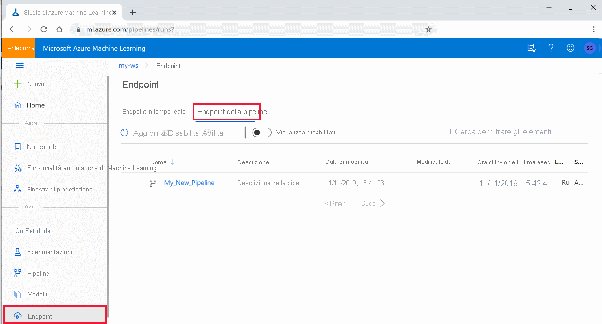

# <a name="publish-and-track-machine-learning-pipelines"></a>Pubblicare e monitorare le pipeline di Machine Learning

[!INCLUDE [applies-to-skus](../../includes/aml-applies-to-basic-enterprise-sku.md)]

Questo articolo illustra come condividere una pipeline di Machine Learning con i colleghi o i clienti.

Le pipeline di Machine Learning sono flussi di lavoro riutilizzabili per le attività di machine learning. Un vantaggio offerto dalle pipeline è una maggiore collaborazione. È anche possibile eseguire la versione delle pipeline, consentendo ai clienti di usare il modello corrente mentre si lavora a una nuova versione. 

## <a name="prerequisites"></a>Prerequisiti

* Creare un' [area di lavoro di Azure Machine Learning](how-to-manage-workspace.md) per conservare tutte le risorse della pipeline

* [Configurare l'ambiente di sviluppo](how-to-configure-environment.md) per l'installazione di Azure Machine Learning SDK oppure usare un' [istanza di calcolo Azure Machine Learning](concept-compute-instance.md) con l'SDK già installato

* Creare ed eseguire una pipeline di Machine Learning, ad esempio [l'esercitazione seguente: creare una pipeline di Azure Machine Learning per il Punteggio batch](tutorial-pipeline-batch-scoring-classification.md). Per altre opzioni, vedere [creare ed eseguire pipeline di Machine Learning con Azure Machine Learning SDK](how-to-create-your-first-pipeline.md)

## <a name="publish-a-pipeline"></a>Pubblicare una pipeline

Una volta che la pipeline è in esecuzione, è possibile pubblicare una pipeline in modo che venga eseguita con input diversi. Affinché l'endpoint REST di una pipeline già pubblicata accetti parametri, è necessario configurare la pipeline in modo `PipelineParameter` che usi oggetti per gli argomenti che variano.

1. Per creare un parametro per la pipeline, usare un oggetto [PipelineParameter](https://docs.microsoft.com/python/api/azureml-pipeline-core/azureml.pipeline.core.graph.pipelineparameter?view=azure-ml-py&preserve-view=true) con un valore predefinito.

   ```python
   from azureml.pipeline.core.graph import PipelineParameter
   
   pipeline_param = PipelineParameter(
     name="pipeline_arg",
     default_value=10)
   ```

2. Aggiungere l'oggetto `PipelineParameter` come parametro a uno dei passaggi della pipeline, come indicato di seguito:

   ```python
   compareStep = PythonScriptStep(
     script_name="compare.py",
     arguments=["--comp_data1", comp_data1, "--comp_data2", comp_data2, "--output_data", out_data3, "--param1", pipeline_param],
     inputs=[ comp_data1, comp_data2],
     outputs=[out_data3],
     compute_target=compute_target,
     source_directory=project_folder)
   ```

3. Pubblicare la pipeline che accetterà un parametro quando richiamata.

   ```python
   published_pipeline1 = pipeline_run1.publish_pipeline(
        name="My_Published_Pipeline",
        description="My Published Pipeline Description",
        version="1.0")
   ```

## <a name="run-a-published-pipeline"></a>Eseguire una pipeline pubblicata

Tutte le pipeline pubblicate hanno un endpoint REST Con l'endpoint della pipeline, è possibile attivare un'esecuzione della pipeline da qualsiasi sistema esterno, inclusi i client non Python. Questo endpoint consente la "ripetibilità gestita" in scenari di ripetizione del training e assegnazione di punteggi in batch.

Per richiamare l'esecuzione della pipeline precedente, è necessario un token di intestazione di autenticazione Azure Active Directory. Il recupero di un token di questo tipo è descritto nel riferimento alla [classe AzureCliAuthentication](https://docs.microsoft.com/python/api/azureml-core/azureml.core.authentication.azurecliauthentication?view=azure-ml-py&preserve-view=true) e nell' [autenticazione in Azure Machine Learning](https://aka.ms/pl-restep-auth) notebook.

```python
from azureml.pipeline.core import PublishedPipeline
import requests

response = requests.post(published_pipeline1.endpoint,
                         headers=aad_token,
                         json={"ExperimentName": "My_Pipeline",
                               "ParameterAssignments": {"pipeline_arg": 20}})
```

## <a name="create-a-versioned-pipeline-endpoint"></a>Creare un endpoint della pipeline con versione

È possibile creare un endpoint della pipeline con più pipeline pubblicate. In questo modo si ottiene un endpoint REST fisso durante l'iterazione e l'aggiornamento delle pipeline di ML.

```python
from azureml.pipeline.core import PipelineEndpoint

published_pipeline = PipelineEndpoint.get(workspace=ws, name="My_Published_Pipeline")
pipeline_endpoint = PipelineEndpoint.publish(workspace=ws, name="PipelineEndpointTest",
                                            pipeline=published_pipeline, description="Test description Notebook")
```

## <a name="submit-a-job-to-a-pipeline-endpoint"></a>Inviare un processo a un endpoint della pipeline

È possibile inviare un processo alla versione predefinita di un endpoint della pipeline:

```python
pipeline_endpoint_by_name = PipelineEndpoint.get(workspace=ws, name="PipelineEndpointTest")
run_id = pipeline_endpoint_by_name.submit("PipelineEndpointExperiment")
print(run_id)
```

È anche possibile inviare un processo a una versione specifica:

```python
run_id = pipeline_endpoint_by_name.submit("PipelineEndpointExperiment", pipeline_version="0")
print(run_id)
```

La stessa operazione può essere eseguita usando l'API REST:

```python
rest_endpoint = pipeline_endpoint_by_name.endpoint
response = requests.post(rest_endpoint, 
                         headers=aad_token, 
                         json={"ExperimentName": "PipelineEndpointExperiment",
                               "RunSource": "API",
                               "ParameterAssignments": {"1": "united", "2":"city"}})
```

## <a name="use-published-pipelines-in-the-studio"></a>Usare le pipeline pubblicate in studio

È anche possibile eseguire una pipeline pubblicata da studio:

1. Accedere ad [Azure Machine Learning Studio](https://ml.azure.com).

1. [Visualizzare l'area di lavoro](how-to-manage-workspace.md#view).

1. A sinistra selezionare **endpoint**.

1. Nella parte superiore selezionare **endpoint della pipeline**.
 

1. Consente di selezionare una pipeline specifica per l'esecuzione, l'utilizzo o la verifica dei risultati delle esecuzioni precedenti dell'endpoint della pipeline.

## <a name="disable-a-published-pipeline"></a>Disabilitare una pipeline pubblicata

Per nascondere una pipeline dall'elenco di pipeline pubblicate, è possibile disabilitarla, in studio o nell'SDK:

```python
# Get the pipeline by using its ID from Azure Machine Learning studio
p = PublishedPipeline.get(ws, id="068f4885-7088-424b-8ce2-eeb9ba5381a6")
p.disable()
```

È possibile abilitarla di nuovo con `p.enable()` . Per altre informazioni, vedere riferimento alla [classe PublishedPipeline](https://docs.microsoft.com/python/api/azureml-pipeline-core/azureml.pipeline.core.publishedpipeline?view=azure-ml-py&preserve-view=true) .

## <a name="next-steps"></a>Passaggi successivi

- Usare [questi notebook di Jupyter in GitHub](https://aka.ms/aml-pipeline-readme) per esplorare più in dettaglio le pipeline di Machine Learning.
- Vedere la Guida di riferimento per l'SDK per il pacchetto [azureml-Pipelines-Core](https://docs.microsoft.com/python/api/azureml-pipeline-core/?view=azure-ml-py&preserve-view=true) e il pacchetto [azureml-Pipelines-Steps](https://docs.microsoft.com/python/api/azureml-pipeline-steps/?view=azure-ml-py&preserve-view=true) .
- Vedere le [procedure](how-to-debug-pipelines.md) consigliate per il debug e la risoluzione dei problemi relativi alle pipeline.
