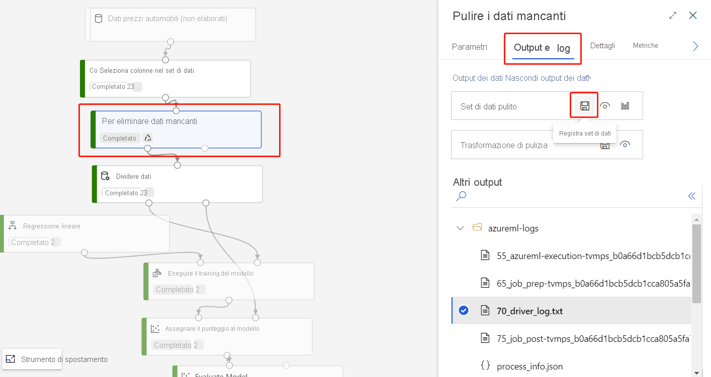
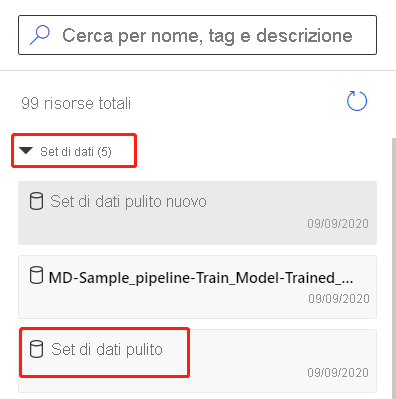

# Importare i dati in Azure Machine Learning Designer (anteprima)

In questo articolo si apprenderà come importare i propri dati nella finestra di progettazione per creare soluzioni personalizzate. È possibile importare i dati nella finestra di progettazione in due modi: 

* **Azure Machine Learning set** di dati: registrare i [set](concept-data.md#datasets) di dati in Azure Machine Learning per abilitare funzionalità avanzate che consentono di gestire i dati.
* **Modulo Import Data** (Importa dati): usare il modulo [Import Data (Importa dati](algorithm-module-reference/import-data.md) ) per accedere direttamente ai dati da origini dati online.

## Usare set di impostazioni Azure Machine Learning

È consigliabile usare i [set](concept-data.md#datasets) di dati per importare i dati nella finestra di progettazione. Quando si registra un set di dati, è possibile sfruttare appieno le funzionalità avanzate dei dati, ad esempio il controllo delle [versioni e il rilevamento](how-to-version-track-datasets.md) e il [monitoraggio dei dati](how-to-monitor-datasets.md).

### Registrare un set di dati

È possibile registrare i set di impostazioni di [a livello esistenti con l'SDK](how-to-create-register-datasets.md#use-the-sdk) o [visivamente in Azure Machine Learning Studio](how-to-create-register-datasets.md#use-the-ui).

È anche possibile registrare l'output per qualsiasi modulo di progettazione come set di dati.

1. Selezionare il modulo che restituisce i dati che si desidera registrare.

1. Nel riquadro Proprietà selezionare **output** > **registra set di dati**.

    

### Usare un set di dati

I set di documenti registrati sono disponibili nella tavolozza dei moduli, in **DataSet set** > di DataSet**personali**. Per usare un set di dati, trascinarlo e rilasciarlo nell'area di disegno della pipeline. Quindi, connettere la porta di output del set di dati ad altri moduli della tavolozza.

> [!NOTE]
> La finestra di progettazione supporta attualmente solo l'elaborazione di [DataSet tabulari](how-to-create-register-datasets.md#dataset-types). Se si vogliono usare i [set di file di file](how-to-create-register-datasets.md#dataset-types), usare l'SDK Azure machine learning disponibile per Python e R.

## Importare dati tramite il modulo Import Data

Sebbene sia consigliabile usare i set di dati per importare i dati, è anche possibile usare il modulo [Import Data](algorithm-module-reference/import-data.md) . Il modulo Import Data ignora la registrazione del set di dati in Azure Machine Learning e importa i dati direttamente da un [Archivio](concept-data.md#datastores) dati o un URL http.

Per informazioni dettagliate su come usare il modulo Import Data, vedere la [pagina Import Data Reference](algorithm-module-reference/import-data.md).

> [!NOTE]
> Se il set di dati contiene troppe colonne, è possibile che si verifichi l'errore seguente: "convalida non riuscita a causa di un limite di dimensione". Per evitare questo problema, [registrare il set di dati nell'interfaccia DataSets](how-to-create-register-datasets.md#use-the-ui).

## Origini supportate

In questa sezione sono elencate le origini dati supportate dalla finestra di progettazione. I dati vengono inseriti nella finestra di progettazione da un archivio dati o da un set di dati [tabulare](how-to-create-register-datasets.md#dataset-types).

### Origini archivio dati
Per un elenco delle origini di archivio dati supportate, vedere [accedere ai dati nei servizi di archiviazione di Azure](how-to-access-data.md#supported-data-storage-service-types).

### Origini dataset tabulari

La finestra di progettazione supporta i set di impostazioni tabulari creati dalle origini seguenti:
 * File delimitati
 * File JSON
 * File Parquet
 * Query SQL

## Tipi di dati

La finestra di progettazione riconosce internamente i tipi di dati seguenti:

* string
* Integer
* Decimal
* Boolean
* Data

La finestra di progettazione utilizza un tipo di dati interno per passare i dati tra i moduli. È possibile convertire in modo esplicito i dati in formato tabella dati usando il modulo [Convert to DataSet](algorithm-module-reference/convert-to-dataset.md) . Qualsiasi modulo che accetta formati diversi dal formato interno convertirà i dati in modo invisibile all'utente prima di passarli al modulo successivo.

## Vincoli di dati

I moduli nella finestra di progettazione sono limitati dalla dimensione della destinazione di calcolo. Per i set di impostazioni più grandi, è consigliabile usare una risorsa di calcolo Azure Machine Learning più grande. Per altre informazioni su Azure Machine Learning calcolo, vedere [che cosa sono le destinazioni di calcolo in Azure Machine Learning?](concept-compute-target.md#azure-machine-learning-compute-managed)

## Passaggi successivi

Informazioni di base sulla finestra di progettazione con [l'esercitazione: stimare il prezzo dell'automobile con la finestra di progettazione](tutorial-designer-automobile-price-train-score.md).
