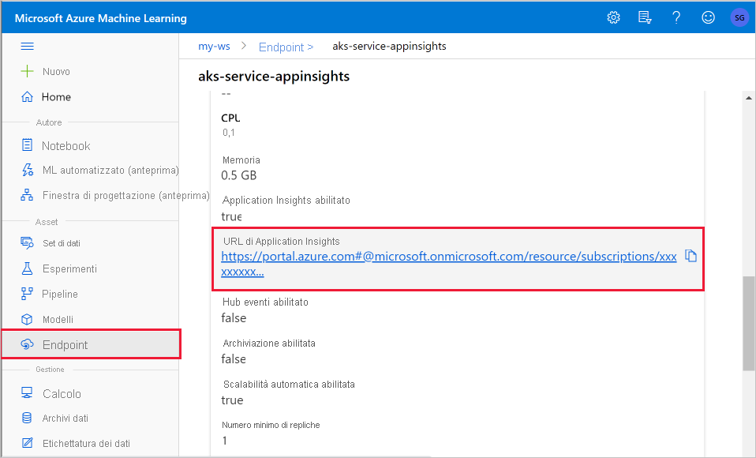
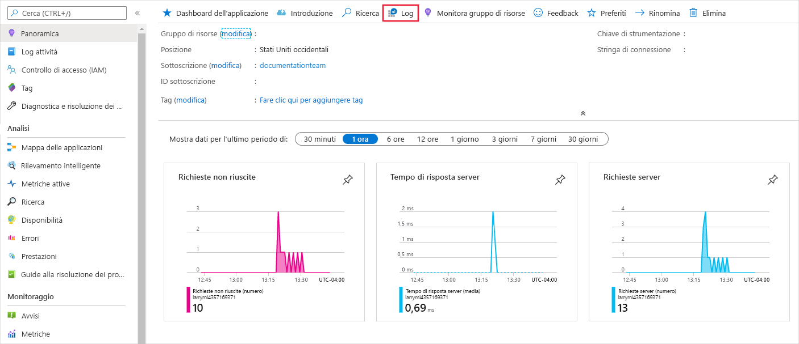
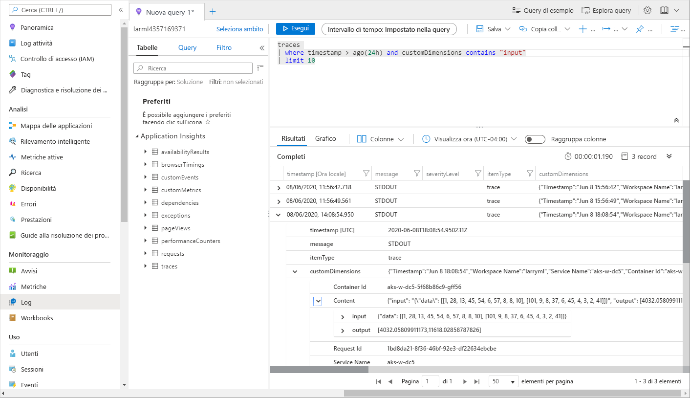

# <a name="monitor-and-collect-data-from-ml-web-service-endpoints"></a>Monitorare e raccogliere dati da endpoint servizio Web di ML
[!INCLUDE [applies-to-skus](../../includes/aml-applies-to-basic-enterprise-sku.md)]

Questo articolo illustra come raccogliere e monitorare i modelli distribuiti negli endpoint dei servizi Web in Azure Kubernetes Service (AKS) o nelle istanze di contenitore di Azure (ACI) abilitando applicazione Azure Insights tramite 
* [Python SDK di Azure Machine Learning](#python)
* [Azure Machine Learning Studio](#studio) allehttps://ml.azure.com

Oltre a raccogliere i dati di output e la risposta di un endpoint, è possibile monitorare:

* Frequenza delle richieste, tempi di risposta e percentuali di errore
* Tassi di dipendenza, tempi di risposta e percentuali di errore
* Eccezioni

[Altre informazioni su applicazione Azure Insights](../azure-monitor/app/app-insights-overview.md). 


## <a name="prerequisites"></a>Prerequisiti

* Se non si ha una sottoscrizione di Azure, creare un account gratuito prima di iniziare. Prova subito la [versione gratuita o a pagamento di Azure Machine Learning](https://aka.ms/AMLFree)

* Un'area di lavoro di Azure Machine Learning, una directory locale contenente gli script e Azure Machine Learning SDK per Python installato. Per informazioni su come ottenere questi prerequisiti, vedere [come configurare un ambiente di sviluppo](how-to-configure-environment.md)

* Un modello di training di Machine Learning da distribuire nel servizio Azure Kubernetes o nel servizio Azure Container. Se non si dispone di un, vedere l'esercitazione [Train image classification Model](tutorial-train-models-with-aml.md)

## <a name="web-service-metadata-and-response-data"></a>Metadati del servizio Web e dati di risposta

> [!IMPORTANT]
> Applicazione Azure Insights registra solo i payload fino a 64KB. Se viene raggiunto questo limite, è possibile che vengano visualizzati errori, ad esempio memoria insufficiente, oppure che non vengano registrate informazioni.

Per registrare le informazioni per una richiesta al servizio Web, aggiungere `print` istruzioni al file score.py. Ogni `print` istruzione restituisce una voce della tabella di traccia in Application Insights, sotto il messaggio `STDOUT` . Il contenuto dell' `print` istruzione sarà contenuto in `customDimensions` , quindi `Contents` nella tabella di traccia. Se si stampa una stringa JSON, viene prodotta una struttura di dati gerarchica nell'output di traccia in `Contents` .

È possibile eseguire query direttamente in applicazione Azure Insights per accedere a questi dati oppure configurare un' [esportazione continua](https://docs.microsoft.com/azure/azure-monitor/app/export-telemetry) in un account di archiviazione per un periodo di conservazione più lungo o un'ulteriore elaborazione. È quindi possibile usare i dati del modello nella Azure Machine Learning per configurare l'assegnazione di etichette, la ripetizione del training, la spiegazione, l'analisi dei dati o altro uso. 

<a name="python"></a>

## <a name="use-python-sdk-to-configure"></a>Usare Python SDK per configurare 

### <a name="update-a-deployed-service"></a>Aggiornare un servizio distribuito

1. Identificare il servizio nell'area di lavoro. Il valore per `ws` è il nome dell'area di lavoro

    ```python
    from azureml.core.webservice import Webservice
    aks_service= Webservice(ws, "my-service-name")
    ```
2. Aggiornare il servizio e abilitare applicazione Azure Insights

    ```python
    aks_service.update(enable_app_insights=True)
    ```

### <a name="log-custom-traces-in-your-service"></a>Registrare tracce personalizzate nel servizio

Per registrare tracce personalizzate, seguire il processo di distribuzione standard per il servizio Azure Kubernetes o il servizio Istanze di Azure Container, descritto nel documento [Distribuire modelli con il servizio di Azure Machine Learning](how-to-deploy-and-where.md). Seguire quindi questa procedura:

1. Per inviare dati a Application Insights durante l'inferenza, aggiornare il file di assegnazione dei punteggi aggiungendo istruzioni Print. Per registrare informazioni più complesse, ad esempio i dati della richiesta e la risposta, usa una struttura JSON. Il file score.py di esempio seguente registra l'ora di inizializzazione del modello, l'input e l'output durante l'inferenza e l'ora in cui si verificano gli errori:

    > [!IMPORTANT]
    > Applicazione Azure Insights registra solo i payload fino a 64KB. Se viene raggiunto questo limite, è possibile che vengano visualizzati errori, ad esempio memoria insufficiente, oppure che non vengano registrate informazioni. Se i dati da registrare sono di dimensioni maggiori 64KB, è invece consigliabile archiviarli nell'archiviazione BLOB usando le informazioni in [raccogliere dati per i modelli in produzione](how-to-enable-data-collection.md).
    
    ```python
    import pickle
    import json
    import numpy 
    from sklearn.externals import joblib
    from sklearn.linear_model import Ridge
    from azureml.core.model import Model
    import time

    def init():
        global model
        #Print statement for appinsights custom traces:
        print ("model initialized" + time.strftime("%H:%M:%S"))
        
        # note here "sklearn_regression_model.pkl" is the name of the model registered under the workspace
        # this call should return the path to the model.pkl file on the local disk.
        model_path = Model.get_model_path(model_name = 'sklearn_regression_model.pkl')
        
        # deserialize the model file back into a sklearn model
        model = joblib.load(model_path)
    

    # note you can pass in multiple rows for scoring
    def run(raw_data):
        try:
            data = json.loads(raw_data)['data']
            data = numpy.array(data)
            result = model.predict(data)
            # Log the input and output data to appinsights:
            info = {
                "input": raw_data,
                "output": result.tolist()
                }
            print(json.dumps(info))
            # you can return any datatype as long as it is JSON-serializable
            return result.tolist()
        except Exception as e:
            error = str(e)
            print (error + time.strftime("%H:%M:%S"))
            return error
    ```

2. Aggiornare la configurazione del servizio
    
    ```python
    config = Webservice.deploy_configuration(enable_app_insights=True)
    ```

3. Compilare un'immagine e distribuirla in [Azure Kubernetes o Azure Container](how-to-deploy-and-where.md).

### <a name="disable-tracking-in-python"></a>Disabilitare il rilevamento in Python

Per disabilitare applicazione Azure Insights, usare il codice seguente:

```python 
## replace <service_name> with the name of the web service
<service_name>.update(enable_app_insights=False)
```

<a name="studio"></a>

## <a name="use-azure-machine-learning-studio-to-configure"></a>Usare Azure Machine Learning Studio per la configurazione

È anche possibile abilitare applicazione Azure Insights da Azure Machine Learning Studio quando si è pronti per distribuire il modello con questa procedura.

1. Accedere all'area di lavoro all'indirizzohttps://ml.azure.com/
1. Passare a **modelli** e selezionare il modello che si desidera distribuire
1. Selezionare **+ Distribuisci**
1. Popolare il modulo **Distribuisci modello**
1. Espandere il menu **Avanzate**

    
1. Selezionare **Enable Application Insights Diagnostics and Data Collection**

    

## <a name="view-metrics-and-logs"></a>Visualizzare metriche e log

I dati del servizio vengono archiviati nell'account di applicazione Azure Insights, all'interno dello stesso gruppo di risorse Azure Machine Learning.
Per visualizzarli:

1. Passare all'area di lavoro Azure Machine Learning in [Studio](https://ml.azure.com/).
1. Selezionare **Endpoint**.
1. Selezionare il servizio distribuito.
1. Scorrere verso il basso per trovare l' **url Application Insights** e fare clic sul collegamento.

    [](././media/how-to-enable-app-insights/appinsightsloc.png#lightbox)

1. In Application iSights, nella scheda **Overview (panoramica** ) o nella sezione __Monitoring (monitoraggio__ ) nell'elenco a sinistra, selezionare __logs (registri__).

    [](./media/how-to-enable-app-insights/overview.png#lightbox)

1. Per visualizzare le informazioni registrate dal file score.py, esaminare la tabella __TRACES__ . La query seguente cerca i log in cui è stato registrato il valore di __input__ :

    ```kusto
    traces
    | where customDimensions contains "input"
    | limit 10
    ```

   [](././media/how-to-enable-app-insights/model-data-trace.png#lightbox)

Per altre informazioni su come usare applicazione Azure Insights, vedere [che cos'è Application Insights?](../azure-monitor/app/app-insights-overview.md).

## <a name="export-data-for-further-processing-and-longer-retention"></a>Esportare i dati per un'ulteriore elaborazione e una conservazione più lunga

>[!Important]
> Applicazione Azure Insights supporta solo le esportazioni nell'archivio BLOB. I limiti aggiuntivi di questa funzionalità di esportazione sono elencati in esportare i dati di [telemetria da Application Insights](https://docs.microsoft.com/azure/azure-monitor/app/export-telemetry#continuous-export-advanced-storage-configuration).

È possibile usare l' [esportazione continua](https://docs.microsoft.com/azure/azure-monitor/app/export-telemetry) di applicazione Azure Insights per inviare messaggi a un account di archiviazione supportato, in cui è possibile impostare un periodo di conservazione più lungo. I dati vengono archiviati in formato JSON e possono essere facilmente analizzati per estrarre i dati del modello. 

Azure Data Factory, le pipeline di Azure ML o altri strumenti di elaborazione dati possono essere usati per trasformare i dati in base alle esigenze. Dopo aver trasformato i dati, è possibile registrarli con l'area di lavoro Azure Machine Learning come set di dati. A tale scopo, vedere [How to create and register DataSets](how-to-create-register-datasets.md).

:::image type="content" source="media/how-to-enable-app-insights/continuous-export-setup.png" alt-text="Esportazione continua":::


## <a name="example-notebook"></a>Notebook di esempio

Il notebook [Enable-App-Insights-in-Production-Service. ipynb](https://github.com/Azure/MachineLearningNotebooks/blob/master/how-to-use-azureml/deployment/enable-app-insights-in-production-service/enable-app-insights-in-production-service.ipynb) illustra i concetti descritti in questo articolo. 
 
[!INCLUDE [aml-clone-in-azure-notebook](../../includes/aml-clone-for-examples.md)]

## <a name="next-steps"></a>Passaggi successivi

* Vedere [come distribuire un modello in un cluster di servizi Kubernetes di Azure](https://docs.microsoft.com/azure/machine-learning/how-to-deploy-azure-kubernetes-service) o [come distribuire un modello in istanze di contenitore di Azure](https://docs.microsoft.com/azure/machine-learning/how-to-deploy-azure-container-instance) per distribuire i modelli negli endpoint del servizio Web e abilitare applicazione Azure Insights per sfruttare la raccolta dei dati e il monitoraggio degli endpoint
* Per altre informazioni sull'uso dei dati raccolti dai modelli nell'ambiente di produzione [, vedere MLOps: gestire, distribuire e monitorare i modelli con Azure Machine Learning](https://docs.microsoft.com/azure/machine-learning/concept-model-management-and-deployment) . Questi dati possono contribuire a migliorare continuamente il processo di Machine Learning
