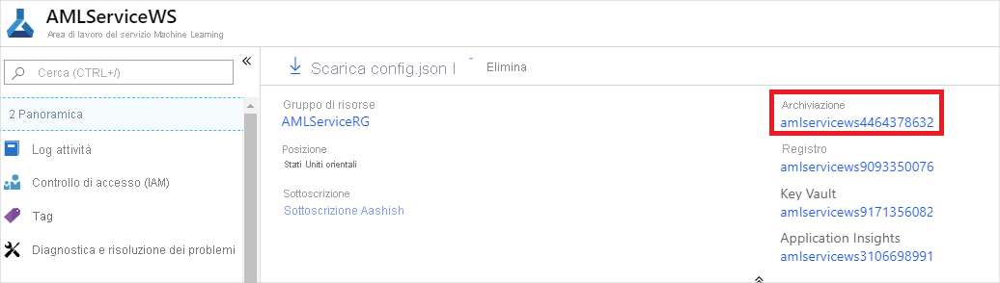
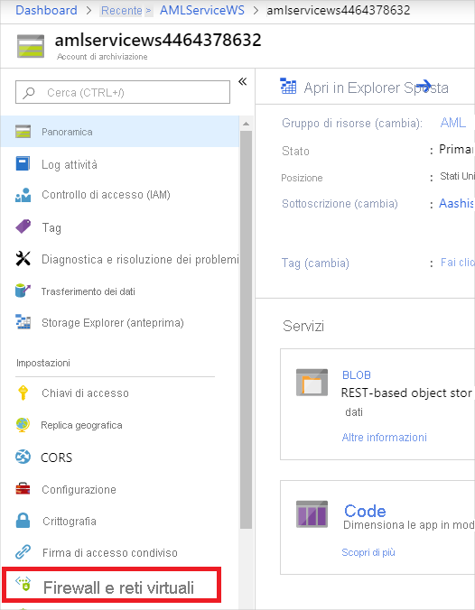
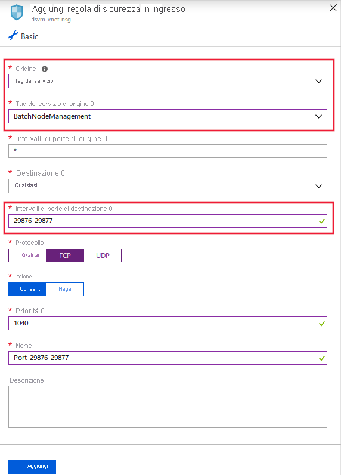
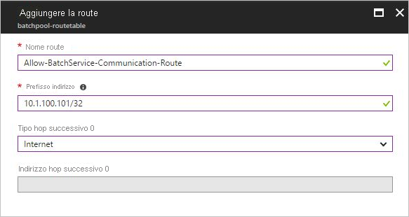
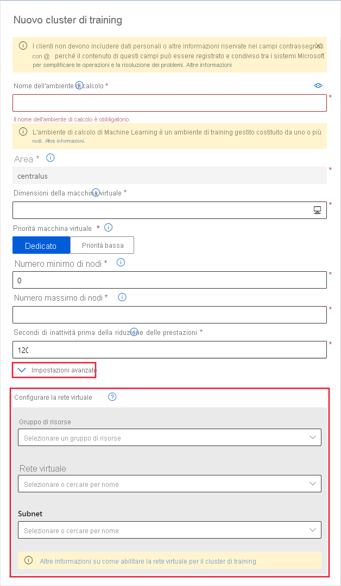
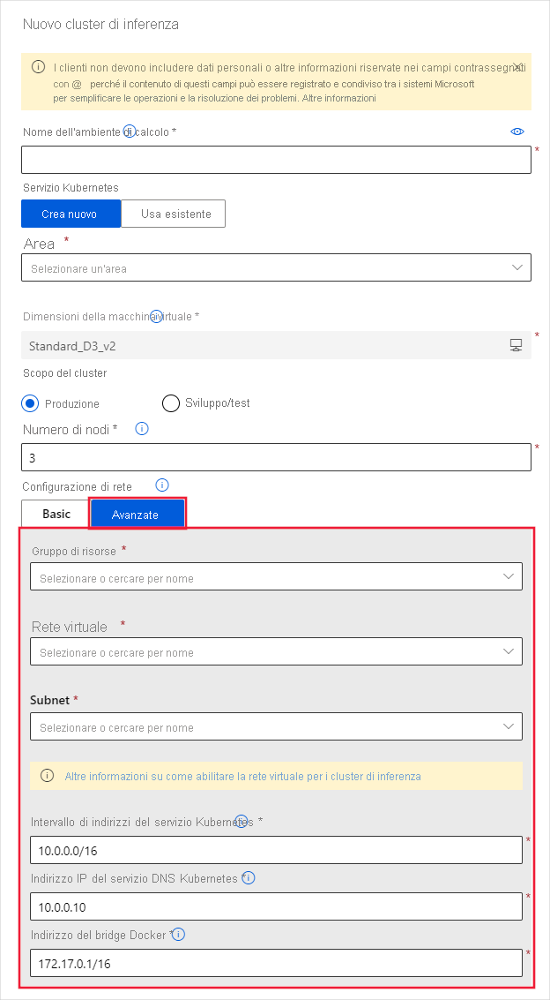

# <a name="secure-azure-ml-experimentation-and-inference-jobs-within-an-azure-virtual-network"></a>Proteggere i processi di sperimentazione e inferenza di Azure ML in una rete virtuale di Azure
[!INCLUDE [applies-to-skus](../../includes/aml-applies-to-basic-enterprise-sku.md)]

In questo articolo si apprenderà come proteggere i processi di sperimentazione/formazione e i processi di inferenza/assegnazione dei punteggi in Azure Machine Learning all'interno di una rete virtuale di Azure (VNET).

Una **rete virtuale** funge da limite di sicurezza, isolando le risorse di Azure dalla rete Internet pubblica. È anche possibile aggiungere una rete virtuale di Azure alla rete locale. Aderendo alle reti, è possibile eseguire il training sicuro dei modelli e accedere ai modelli distribuiti per l'inferenza.

Azure Machine Learning si basa su altri servizi di Azure per le risorse di calcolo. Le risorse di calcolo, o [destinazioni di calcolo](concept-compute-target.md), vengono usate per eseguire il training e distribuire i modelli. Le destinazioni possono essere create all'interno di una rete virtuale. Ad esempio, è possibile usare Microsoft Data Science Virtual Machine per eseguire il training di un modello e quindi distribuire il modello in Azure Kubernetes Service (AKS). Per altre informazioni sulle reti virtuali, vedere [Panoramica di rete virtuale di Azure](https://docs.microsoft.com/azure/virtual-network/virtual-networks-overview).

Questo articolo fornisce inoltre informazioni dettagliate sulle *impostazioni di sicurezza avanzate*, informazioni non necessarie per i casi d'uso di base o sperimentale. Alcune sezioni di questo articolo forniscono informazioni di configurazione per diversi scenari. Non è necessario completare le istruzioni nell'ordine o nel loro complesso.

> [!TIP]
> Se non specificamente specificato, l'uso di risorse come gli account di archiviazione o le destinazioni di calcolo all'interno di una rete virtuale funzionerà con le pipeline di machine learning e i flussi di lavoro non pipeline come le esecuzioni di script.

> [!WARNING]
> Microsoft non supporta l'uso di Azure Machine Learning Designer o di Machine Learning automatizzato (da studio) con risorse all'interno di una rete virtuale.

## <a name="prerequisites"></a>Prerequisites

+ Area di [lavoro](how-to-manage-workspace.md)Azure Machine Learning.

+ Conoscenza generale del [servizio rete virtuale di Azure](https://docs.microsoft.com/azure/virtual-network/virtual-networks-overview) e della [rete IP](https://docs.microsoft.com/azure/virtual-network/virtual-network-ip-addresses-overview-arm).

+ Una rete virtuale e una subnet preesistenti da usare con le risorse di calcolo.

## <a name="use-a-storage-account-for-your-workspace"></a>Usare un account di archiviazione per l'area di lavoro

Per usare un account di archiviazione di Azure per l'area di lavoro in una rete virtuale, seguire questa procedura:

1. Creare una risorsa di calcolo, ad esempio un'istanza di calcolo Machine Learning o un cluster, dietro una rete virtuale oppure alleghi una risorsa di calcolo all'area di lavoro (ad esempio, un cluster HDInsight, una macchina virtuale o un cluster di servizi Azure Kubernetes). La risorsa di calcolo può essere per la sperimentazione o la distribuzione del modello.

   Per altre informazioni, vedere le sezioni [usare un machine learning calcolo](#amlcompute), [usare una macchina virtuale o un cluster HDInsight](#vmorhdi)e [usare il servizio Kubernetes di Azure](#aksvnet) in questo articolo.

1. Nella portale di Azure passare alla risorsa di archiviazione collegata all'area di lavoro.

   [](./media/how-to-enable-virtual-network/workspace-storage.png#lightbox)

1. Nella pagina **archiviazione di Azure** selezionare __firewall e reti virtuali__.

   

1. Nella pagina __firewall e reti virtuali__ eseguire le azioni seguenti:
    - Selezionare __Reti selezionate__.
    - In __reti virtuali__selezionare il collegamento __Aggiungi rete virtuale esistente__ . Questa azione aggiunge la rete virtuale in cui risiede il calcolo (vedere il passaggio 1).

        > [!IMPORTANT]
        > L'account di archiviazione deve trovarsi nella stessa rete virtuale delle istanze di calcolo o dei cluster usati per il training o l'inferenza.

    - Selezionare la casella __di controllo Consenti ai servizi Microsoft attendibili di accedere a questo account di archiviazione__ .

    > [!IMPORTANT]
    > Quando si usa Azure Machine Learning SDK, l'ambiente di sviluppo deve essere in grado di connettersi all'account di archiviazione di Azure. Quando l'account di archiviazione si trova all'interno di una rete virtuale, il firewall deve consentire l'accesso dall'indirizzo IP dell'ambiente di sviluppo.
    >
    > Per abilitare l'accesso all'account di archiviazione, visitare i __firewall e le reti virtuali__ per l'account di archiviazione *da un Web browser nel client di sviluppo*. Usare quindi la casella di controllo __Aggiungi indirizzo IP del client__ per aggiungere l'indirizzo IP del client all' __intervallo di indirizzi__. È anche possibile usare il campo __intervallo di indirizzi__ per immettere manualmente l'indirizzo IP dell'ambiente di sviluppo. Dopo che l'indirizzo IP per il client è stato aggiunto, può accedere all'account di archiviazione usando l'SDK.

   [](./media/how-to-enable-virtual-network/storage-firewalls-and-virtual-networks-page.png#lightbox)

> [!IMPORTANT]
> È possibile inserire sia l' _account di archiviazione predefinito_ per Azure Machine Learning o _account di archiviazione non predefiniti_ in una rete virtuale.
>
> Quando si crea un'area di lavoro, viene eseguito automaticamente il provisioning dell'account di archiviazione predefinito.
>
> Per gli account di archiviazione non predefiniti, il parametro `storage_account` nella [funzione`Workspace.create()`](https://docs.microsoft.com/python/api/azureml-core/azureml.core.workspace(class)?view=azure-ml-py#create-name--auth-none--subscription-id-none--resource-group-none--location-none--create-resource-group-true--sku--basic---friendly-name-none--storage-account-none--key-vault-none--app-insights-none--container-registry-none--cmk-keyvault-none--resource-cmk-uri-none--hbi-workspace-false--default-cpu-compute-target-none--default-gpu-compute-target-none--exist-ok-false--show-output-true-) consente di specificare un account di archiviazione personalizzato in base all'ID risorsa di Azure.

## <a name="use-azure-data-lake-storage-gen-2"></a>Usare Azure Data Lake Storage generazione 2

Azure Data Lake Storage generazione 2 è un set di funzionalità per l'analisi Big Data, basata sull'archiviazione BLOB di Azure. Può essere usato per archiviare i dati usati per il training dei modelli con Azure Machine Learning. 

Per usare Data Lake Storage generazione 2 nella rete virtuale dell'area di lavoro Azure Machine Learning, seguire questa procedura:

1. Creare un account Azure Data Lake Storage generazione 2. Per altre informazioni, vedere [creare un account di archiviazione Azure Data Lake storage Gen2](../storage/blobs/data-lake-storage-quickstart-create-account.md).

1. Usare i passaggi 2-4 nella sezione precedente, [usare un account di archiviazione per l'area di lavoro](#use-a-storage-account-for-your-workspace), per inserire l'account nella rete virtuale.

Quando si usa Azure Machine Learning con Data Lake Storage generazione 2 all'interno di una rete virtuale, usare le linee guida seguenti:

* Se si usa l' __SDK per creare un set di dati__e il sistema che esegue il codice __non si trova nella rete virtuale__, usare il parametro `validate=False`. Questo parametro ignora la convalida, che ha esito negativo se il sistema non si trova nella stessa rete virtuale dell'account di archiviazione. Per ulteriori informazioni, vedere il metodo [from_files ()](https://docs.microsoft.com/python/api/azureml-core/azureml.data.dataset_factory.filedatasetfactory?view=azure-ml-py#from-files-path--validate-true-) .

* Quando si usa Azure Machine Learning istanza di calcolo o un cluster di calcolo per eseguire il training di un modello usando il set di dati, questo deve trovarsi nella stessa rete virtuale dell'account di archiviazione.

## <a name="use-a-key-vault-instance-with-your-workspace"></a>Usare un'istanza di Key Vault con l'area di lavoro

L'istanza di Key Vault associata all'area di lavoro viene usata da Azure Machine Learning per archiviare le credenziali seguenti:
* Stringa di connessione dell'account di archiviazione associato
* Password per le istanze del repository contenitore di Azure
* Stringhe di connessione agli archivi dati

Per usare Azure Machine Learning funzionalità di sperimentazione con Azure Key Vault dietro una rete virtuale, seguire questa procedura:

1. Passare all'insieme di credenziali delle chiavi associato all'area di lavoro.

   [](./media/how-to-enable-virtual-network/workspace-key-vault.png#lightbox)

1. Nel riquadro sinistro della pagina **Key Vault** selezionare __firewall e reti virtuali__.

   

1. Nella pagina __firewall e reti virtuali__ eseguire le azioni seguenti:
    - Selezionare __Reti selezionate__ in __Consenti l'accesso da__.
    - In __reti virtuali__selezionare __Aggiungi reti virtuali esistenti__ per aggiungere la rete virtuale in cui risiede il calcolo della sperimentazione.
    - In __Consenti ai servizi Microsoft attendibili di ignorare questo firewall__selezionare __Sì__.

   [](./media/how-to-enable-virtual-network/key-vault-firewalls-and-virtual-networks-page.png#lightbox)

<a id="amlcompute"></a>

## <a name="compute-instance"></a>Usare un ambiente di calcolo di Machine Learning

Per usare un'istanza di calcolo Azure Machine Learning o un cluster di calcolo in una rete virtuale, è necessario soddisfare i requisiti di rete seguenti:

> [!div class="checklist"]
> * La rete virtuale deve trovarsi nella stessa area e nella stessa sottoscrizione dell'area di lavoro Azure Machine Learning.
> * La subnet specificata per l'istanza di calcolo o il cluster deve disporre di indirizzi IP non assegnati sufficienti per contenere il numero di macchine virtuali di destinazione. Se la subnet non dispone di un numero sufficiente di indirizzi IP non assegnati, un cluster di calcolo verrà allocato parzialmente.
> * Controllare se i criteri di sicurezza o i blocchi nella sottoscrizione o nel gruppo di risorse della rete virtuale limitano le autorizzazioni per la gestione della rete virtuale. Se si prevede di proteggere la rete virtuale limitando il traffico, lasciare aperte alcune porte per il servizio di calcolo. Per altre informazioni, vedere la sezione [Porte richieste](#mlcports).
> * Se si intende inserire più istanze di calcolo o cluster in una rete virtuale, potrebbe essere necessario richiedere un aumento della quota per una o più risorse.
> * Se anche gli account di archiviazione di Azure per l'area di lavoro sono protetti in una rete virtuale, devono trovarsi nella stessa rete virtuale del Azure Machine Learning istanza di calcolo o del cluster. 

> [!TIP]
> Il Machine Learning istanza di calcolo o il cluster alloca automaticamente altre risorse di rete nel gruppo di risorse che contiene la rete virtuale. Per ogni istanza di calcolo o cluster, il servizio alloca le risorse seguenti:
> 
> * Un gruppo di sicurezza di rete
> * Un indirizzo IP pubblico
> * Un bilanciamento del carico
> 
> Queste risorse sono limitate in base alle [quote delle risorse](https://docs.microsoft.com/azure/azure-resource-manager/management/azure-subscription-service-limits) della sottoscrizione.


### <a id="mlcports"></a> Porte richieste

L'ambiente di calcolo di Machine Learning attualmente usa il servizio Azure Batch per effettuare il provisioning delle machine virtuali nella rete virtuale specificata. La subnet deve consentire la comunicazione in ingresso dal servizio Batch. Usare questa comunicazione per pianificare esecuzioni nei nodi ambiente di calcolo di Machine Learning e per comunicare con archiviazione di Azure e altre risorse. Il servizio batch aggiunge gruppi di sicurezza di rete (gruppi) al livello delle interfacce di rete (NIC) collegati alle macchine virtuali. Questi gruppi di sicurezza di rete configurano automaticamente le regole in ingresso e in uscita per consentire il traffico seguente:

- Traffico TCP in ingresso sulle porte 29876 e 29877 da un __tag di servizio__ di __BatchNodeManagement__.

    

- Opzionale Traffico TCP in ingresso sulla porta 22 per consentire l'accesso remoto. Usare questa porta solo se si vuole connettersi usando SSH nell'indirizzo IP pubblico.

- Traffico in uscita su qualsiasi porta verso la rete virtuale.

- Traffico in uscita su qualsiasi porta verso Internet.

- Per il traffico TCP in ingresso dell'istanza di calcolo sulla porta 44224 da un __tag di servizio__ di __AzureMachineLearning__.

Prestare attenzione se si modificano o aggiungono regole in ingresso o in uscita nei gruppi di sicurezza di rete configurati per Batch. Se un NSG blocca la comunicazione con i nodi di calcolo, il servizio di calcolo imposta lo stato dei nodi di calcolo su inutilizzabile.

Non è necessario specificare gruppi a livello di subnet, perché il servizio Azure Batch configura il proprio gruppi. Tuttavia, se alla subnet specificata è associato gruppi o un firewall, configurare le regole di sicurezza in ingresso e in uscita come indicato in precedenza.

La configurazione della regola NSG nel portale di Azure è illustrata nelle immagini seguenti:

[](./media/how-to-enable-virtual-network/amlcompute-virtual-network-inbound.png#lightbox)


### <a id="limiting-outbound-from-vnet"></a>Limitare la connettività in uscita dalla rete virtuale

Se non si vogliono usare le regole in uscita predefinite e si vuole limitare l'accesso in uscita della rete virtuale, seguire questa procedura:

- Negare la connessione Internet in uscita usando le regole NSG.

- Per un' __istanza di calcolo__ o un __cluster di calcolo__, limitare il traffico in uscita agli elementi seguenti:
   - Archiviazione di Azure, usando il __tag di servizio__ di __storage. RegionName__. Dove `{RegionName}` è il nome di un'area di Azure.
   - Azure Container Registry, usando il __tag di servizio__ di __AzureContainerRegistry. RegionName__. Dove `{RegionName}` è il nome di un'area di Azure.
   - Azure Machine Learning, usando il __tag di servizio__ di __AzureMachineLearning__
   
- Per un' __istanza di calcolo__, aggiungere anche gli elementi seguenti:
   - Azure Resource Manager, usando il __tag di servizio__ di __AzureResourceManager__
   - Azure Active Directory, usando il __tag di servizio__ di __AzureActiveDirectory__

La configurazione della regola NSG nel portale di Azure è illustrata nell'immagine seguente:

[](./media/how-to-enable-virtual-network/limited-outbound-nsg-exp.png#lightbox)

> [!NOTE]
> Se si prevede di usare le immagini Docker predefinite fornite da Microsoft e di abilitare le dipendenze gestite dall'utente, è necessario usare anche un __tag di servizio__ di __MicrosoftContainerRegistry. Region_Name__ (ad esempio, MicrosoftContainerRegistry. eastus).
>
> Questa configurazione è necessaria quando si dispone di codice simile ai frammenti di codice seguenti come parte degli script di training:
>
> __Formazione RunConfig__
> ```python
> # create a new runconfig object
> run_config = RunConfiguration()
> 
> # configure Docker 
> run_config.environment.docker.enabled = True
> # For GPU, use DEFAULT_GPU_IMAGE
> run_config.environment.docker.base_image = DEFAULT_CPU_IMAGE 
> run_config.environment.python.user_managed_dependencies = True
> ```
>
> __Training per Estimator__
> ```python
> est = Estimator(source_directory='.',
>                 script_params=script_params,
>                 compute_target='local',
>                 entry_script='dummy_train.py',
>                 user_managed=True)
> run = exp.submit(est)
> ```

### <a name="user-defined-routes-for-forced-tunneling"></a>Route definite dall'utente per il tunneling forzato

Se si usa il tunneling forzato con il ambiente di calcolo di Machine Learning, aggiungere [route definite dall'utente (UDR)](https://docs.microsoft.com/azure/virtual-network/virtual-networks-udr-overview) alla subnet che contiene la risorsa di calcolo.

* Definire un UDR per ogni indirizzo IP usato dal servizio Azure Batch nell'area in cui si trovano le risorse. Questi UdR consentono al servizio batch di comunicare con i nodi di calcolo per la pianificazione delle attività. Per ottenere un elenco di indirizzi IP del servizio batch, usare uno dei metodi seguenti:

    * Scaricare gli [intervalli IP e i tag di servizio di Azure](https://www.microsoft.com/download/details.aspx?id=56519) e cercare `BatchNodeManagement.<region>`nel file, dove `<region>` è l'area di Azure.

    * Usare l' [interfaccia](https://docs.microsoft.com/cli/azure/install-azure-cli?view=azure-cli-latest) della riga di comando di Azure per scaricare le informazioni. L'esempio seguente Scarica le informazioni relative all'indirizzo IP e filtra le informazioni per l'area Stati Uniti orientali 2:

        ```azurecli-interactive
        az network list-service-tags -l "East US 2" --query "values[?starts_with(id, 'Batch')] | [?properties.region=='eastus2']"
        ```

* Il traffico in uscita verso archiviazione di Azure non deve essere bloccato dal dispositivo di rete locale. In particolare, gli URL sono nel formato `<account>.table.core.windows.net`, `<account>.queue.core.windows.net`e `<account>.blob.core.windows.net`.

Quando si aggiunge il UDR, definire la route per ogni prefisso dell'indirizzo IP del batch correlato e impostare __tipo hop successivo__ su __Internet__. Nell'immagine seguente viene illustrato un esempio di questo UDR nel portale di Azure:



Per altre informazioni, vedere [creare un pool di Azure batch in una rete virtuale](../batch/batch-virtual-network.md#user-defined-routes-for-forced-tunneling).

### <a name="create-a-compute-cluster-in-a-virtual-network"></a>Creare un cluster di calcolo in una rete virtuale

Per creare un cluster di ambiente di calcolo di Machine Learning, attenersi alla procedura seguente:

1. Nella [portale di Azure](https://portal.azure.com)selezionare l'area di lavoro Azure Machine Learning.

1. Nella sezione __applicazione__ selezionare __calcolo__, quindi selezionare __Aggiungi calcolo__.

1. Per configurare questa risorsa di calcolo per l'uso di una rete virtuale, eseguire le operazioni seguenti:

    a. Per __configurazione di rete__selezionare __Avanzate__.

    b. Nell'elenco a discesa __gruppo di risorse__ selezionare il gruppo di risorse che contiene la rete virtuale.

    c. Nell'elenco a discesa __rete virtuale__ selezionare la rete virtuale che contiene la subnet.

    d. Nell'elenco a discesa __subnet__ selezionare la subnet da usare.

   

È anche possibile creare un cluster dell'ambiente di calcolo di Machine Learning usando Azure Machine Learning SDK. Il codice seguente crea un nuovo cluster dell'ambiente di calcolo di Machine Learning nella subnet `default` di una rete virtuale denominata `mynetwork`:

```python
from azureml.core.compute import ComputeTarget, AmlCompute
from azureml.core.compute_target import ComputeTargetException

# The Azure virtual network name, subnet, and resource group
vnet_name = 'mynetwork'
subnet_name = 'default'
vnet_resourcegroup_name = 'mygroup'

# Choose a name for your CPU cluster
cpu_cluster_name = "cpucluster"

# Verify that cluster does not exist already
try:
    cpu_cluster = ComputeTarget(workspace=ws, name=cpu_cluster_name)
    print("Found existing cpucluster")
except ComputeTargetException:
    print("Creating new cpucluster")

    # Specify the configuration for the new cluster
    compute_config = AmlCompute.provisioning_configuration(vm_size="STANDARD_D2_V2",
                                                           min_nodes=0,
                                                           max_nodes=4,
                                                           vnet_resourcegroup_name=vnet_resourcegroup_name,
                                                           vnet_name=vnet_name,
                                                           subnet_name=subnet_name)

    # Create the cluster with the specified name and configuration
    cpu_cluster = ComputeTarget.create(ws, cpu_cluster_name, compute_config)

    # Wait for the cluster to be completed, show the output log
    cpu_cluster.wait_for_completion(show_output=True)
```

Al termine del processo di creazione, è necessario eseguire il training del modello usando il cluster in un esperimento. Per altre informazioni, vedere [Configurare le destinazioni di calcolo per il training del modello](how-to-set-up-training-targets.md).

## <a name="use-azure-databricks"></a>USA Azure Databricks

Per usare Azure Databricks in una rete virtuale con l'area di lavoro, è necessario soddisfare i requisiti seguenti:

> [!div class="checklist"]
> * La rete virtuale deve trovarsi nella stessa area e nella stessa sottoscrizione dell'area di lavoro Azure Machine Learning.
> * Se anche gli account di archiviazione di Azure per l'area di lavoro sono protetti in una rete virtuale, devono trovarsi nella stessa rete virtuale del cluster Azure Databricks.
> * Oltre alle subnet databricks __-private__ e __databricks-public__ utilizzate da Azure Databricks, è richiesta anche la subnet __predefinita__ creata per la rete virtuale.

Per informazioni specifiche sull'uso di Azure Databricks con una rete virtuale, vedere [distribuire Azure Databricks nella rete virtuale di Azure](https://docs.azuredatabricks.net/administration-guide/cloud-configurations/azure/vnet-inject.html).

<a id="vmorhdi"></a>

## <a name="use-a-virtual-machine-or-hdinsight-cluster"></a>Usare una macchina virtuale o un cluster HDInsight

> [!IMPORTANT]
> Azure Machine Learning supporta solo le macchine virtuali che eseguono Ubuntu.

Per usare una macchina virtuale o un cluster Azure HDInsight in una rete virtuale con l'area di lavoro, seguire questa procedura:

1. Creare una VM o un cluster HDInsight usando il portale di Azure o l'interfaccia della riga di comando di Azure e inserire il cluster in una rete virtuale di Azure. Per altre informazioni, vedere gli articoli seguenti:
    * [Creare e gestire reti virtuali di Azure per macchine virtuali Linux](https://docs.microsoft.com/azure/virtual-machines/linux/tutorial-virtual-network)

    * [Estendere Azure HDInsight usando Rete virtuale di Azure](https://docs.microsoft.com/azure/hdinsight/hdinsight-extend-hadoop-virtual-network)

1. Per consentire a Azure Machine Learning di comunicare con la porta SSH nella macchina virtuale o nel cluster, configurare una voce di origine per il gruppo di sicurezza di rete. La porta SSH è in genere la porta 22. Per consentire il traffico da questa origine, eseguire le azioni seguenti:

    * Nell'elenco a discesa __origine__ selezionare __tag di servizio__.

    * Nell'elenco a discesa __tag servizio di origine__ selezionare __AzureMachineLearning__.

    * Nell'elenco a discesa __intervalli di porte di origine__ selezionare __*__ .

    * Nell'elenco a discesa __destinazione__ selezionare __any__.

    * Nell'elenco a discesa __intervalli di porte di destinazione__ selezionare __22__.

    * In __protocollo__selezionare __any__.

    * In __azione__selezionare __Consenti__.

   

    Mantieni le regole in uscita predefinite per il gruppo di sicurezza di rete. Per altre informazioni, vedere le regole di sicurezza predefinite in [Gruppi di sicurezza](https://docs.microsoft.com/azure/virtual-network/security-overview#default-security-rules).

    Se non si vogliono usare le regole in uscita predefinite e si vuole limitare l'accesso in uscita della rete virtuale, vedere la sezione [limitare la connettività in uscita dalla rete virtuale](#limiting-outbound-from-vnet) .

1. Alleghi la VM o il cluster HDInsight all'area di lavoro Azure Machine Learning. Per altre informazioni, vedere [Configurare le destinazioni di calcolo per il training del modello](how-to-set-up-training-targets.md).

<a id="aksvnet"></a>

## <a name="use-azure-kubernetes-service-aks"></a>Usare il servizio Azure Kubernetes

Per aggiungere AKS in una rete virtuale all'area di lavoro, seguire questa procedura:

> [!IMPORTANT]
> Prima di iniziare la procedura seguente, attenersi ai prerequisiti descritti in How to [Advanced Networking in Azure Kubernetes Service (AKS)](https://docs.microsoft.com/azure/aks/configure-advanced-networking#prerequisites) e pianificare gli indirizzi IP per il cluster.
>
> L'istanza di AKS e la rete virtuale di Azure devono trovarsi nella stessa area. Se si proteggono gli account di archiviazione di Azure usati dall'area di lavoro in una rete virtuale, è necessario che si trovino nella stessa rete virtuale dell'istanza di AKS.

1. Nel [portale di Azure](https://portal.azure.com)verificare che il NSG che controlla la rete virtuale disponga di una regola in ingresso abilitata per Azure machine learning utilizzando __AzureMachineLearning__ come **origine**.

    [](./media/how-to-enable-virtual-network/aks-vnet-inbound-nsg-aml.png#lightbox)

1. Selezionare l'area di lavoro Azure Machine Learning.

1. Nella sezione __applicazione__ selezionare __calcolo__, quindi selezionare __Aggiungi calcolo__.

1. Per configurare questa risorsa di calcolo per l'uso di una rete virtuale, eseguire le operazioni seguenti:

    - Per __configurazione di rete__selezionare __Avanzate__.

    - Nell'elenco a discesa __gruppo di risorse__ selezionare il gruppo di risorse che contiene la rete virtuale.

    - Nell'elenco a discesa __rete virtuale__ selezionare la rete virtuale che contiene la subnet.

    - Nell'elenco a discesa __subnet__ selezionare la subnet.

    - Nella casella __intervallo di indirizzi del servizio Kubernetes__ immettere l'intervallo di indirizzi del servizio Kubernetes. Questo intervallo di indirizzi utilizza un intervallo IP di notazione CIDR (Inter-Domain Routing) per definire gli indirizzi IP disponibili per il cluster. Non deve sovrapporsi ad alcun intervallo IP della subnet, ad esempio 10.0.0.0/16.

    - Nella casella __indirizzo IP del servizio DNS di Kubernetes__ immettere l'indirizzo IP del servizio DNS di Kubernetes. Questo indirizzo IP viene assegnato al servizio DNS di Kubernetes. Deve rientrare nell'intervallo di indirizzi del servizio Kubernetes (ad esempio, 10.0.0.10).

    - Nella casella __Indirizzo Bridge Docker__ immettere l'indirizzo del Bridge docker. Questo indirizzo IP viene assegnato al bridge Docker. Non deve trovarsi in alcun intervallo IP della subnet o nell'intervallo di indirizzi del servizio Kubernetes (ad esempio, 172.17.0.1/16).

   

1. Verificare che il gruppo NSG che controlla la rete virtuale disponga di una regola di sicurezza in ingresso abilitata per l'endpoint di assegnazione dei punteggi, in modo che possa essere chiamata dall'esterno della rete virtuale.
   > [!IMPORTANT]
   > Mantenere le regole in uscita predefinite per il gruppo di sicurezza di rete. Per altre informazioni, vedere le regole di sicurezza predefinite in [Gruppi di sicurezza](https://docs.microsoft.com/azure/virtual-network/security-overview#default-security-rules).

   [](./media/how-to-enable-virtual-network/aks-vnet-inbound-nsg-scoring.png#lightbox)

È anche possibile usare Azure Machine Learning SDK per aggiungere il servizio Kubernetes di Azure in una rete virtuale. Se si dispone già di un cluster AKS in una rete virtuale, collegarlo all'area di lavoro come descritto in [How to Deploy to AKS](how-to-deploy-and-where.md). Il codice seguente crea una nuova istanza di AKS nella `default` subnet di una rete virtuale denominata `mynetwork`:

```python
from azureml.core.compute import ComputeTarget, AksCompute

# Create the compute configuration and set virtual network information
config = AksCompute.provisioning_configuration(location="eastus2")
config.vnet_resourcegroup_name = "mygroup"
config.vnet_name = "mynetwork"
config.subnet_name = "default"
config.service_cidr = "10.0.0.0/16"
config.dns_service_ip = "10.0.0.10"
config.docker_bridge_cidr = "172.17.0.1/16"

# Create the compute target
aks_target = ComputeTarget.create(workspace=ws,
                                  name="myaks",
                                  provisioning_configuration=config)
```

Al termine del processo di creazione, è possibile eseguire l'inferenza o il punteggio del modello in un cluster AKS dietro una rete virtuale. Per altre informazioni, vedere [Come eseguire la distribuzione nel servizio Azure Kubernetes](how-to-deploy-and-where.md).

### <a name="use-private-ips-with-azure-kubernetes-service"></a>Usare indirizzi IP privati con il servizio Azure Kubernetes

Per impostazione predefinita, viene assegnato un indirizzo IP pubblico alle distribuzioni AKS. Quando si usa AKS all'interno di una rete virtuale, è invece possibile usare un indirizzo IP privato. Gli indirizzi IP privati sono accessibili solo dall'interno della rete virtuale o da reti unite in join.

Un indirizzo IP privato viene abilitato configurando AKS per l'uso di un servizio di _bilanciamento del carico interno_. 

> [!IMPORTANT]
> Non è possibile abilitare l'indirizzo IP privato durante la creazione del cluster del servizio Azure Kubernetes. Deve essere abilitato come aggiornamento a un cluster esistente.

Il frammento di codice seguente illustra come **creare un nuovo cluster AKS**e quindi aggiornarlo per l'uso di un servizio di bilanciamento del carico interno/IP privato:

```python
import azureml.core
from azureml.core.compute.aks import AksUpdateConfiguration
from azureml.core.compute import AksCompute, ComputeTarget

# Verify that cluster does not exist already
try:
    aks_target = AksCompute(workspace=ws, name=aks_cluster_name)
    print("Found existing aks cluster")

except:
    print("Creating new aks cluster")

    # Create AKS configuration
    prov_config = AksCompute.provisioning_configuration(location = "eastus2")
    # Set info for existing virtual network to create the cluster in
    prov_config.vnet_resourcegroup_name = "myvnetresourcegroup"
    prov_config.vnet_name = "myvnetname"
    prov_config.service_cidr = "10.0.0.0/16"
    prov_config.dns_service_ip = "10.0.0.10"
    prov_config.subnet_name = "default"
    prov_config.docker_bridge_cidr = "172.17.0.1/16"

    # Create compute target
    aks_target = ComputeTarget.create(workspace = ws, name = “myaks”, provisioning_configuration = prov_config)
    # Wait for the operation to complete
    aks_target.wait_for_completion(show_output = True)
    
    # Update AKS configuration to use an internal load balancer
    update_config = AksUpdateConfiguration(None, "InternalLoadBalancer", "default")
    aks_target.update(update_config)
    # Wait for the operation to complete
    aks_target.wait_for_completion(show_output = True)
```

__Interfaccia della riga di comando di Azure__

```azurecli-interactive
az rest --method put --uri https://management.azure.com"/subscriptions/<subscription-id>/resourcegroups/<resource-group>/providers/Microsoft.ContainerService/managedClusters/<aks-resource-id>?api-version=2018-11-19 --body @body.json
```

Il contenuto del file `body.json` a cui fa riferimento il comando è simile al documento JSON seguente:

```json
{ 
    "location": “<region>”, 
    "properties": { 
        "resourceId": "/subscriptions/<subscription-id>/resourcegroups/<resource-group>/providers/Microsoft.ContainerService/managedClusters/<aks-resource-id>", 
        "computeType": "AKS", 
        "provisioningState": "Succeeded", 
        "properties": { 
            "loadBalancerType": "InternalLoadBalancer", 
            "agentCount": <agent-count>, 
            "agentVmSize": "vm-size", 
            "clusterFqdn": "<cluster-fqdn>" 
        } 
    } 
} 
```

> [!NOTE]
> Attualmente, non è possibile configurare il servizio di bilanciamento del carico durante l'esecuzione di un'operazione di __connessione__ su un cluster esistente. È necessario prima di tutto alleghi il cluster, quindi eseguire un'operazione di aggiornamento per modificare il servizio di bilanciamento del carico.

Per altre informazioni sull'uso del servizio di bilanciamento del carico interno con AKS, vedere [usare il servizio di bilanciamento del carico interno con il servizio Azure Kubernetes](/azure/aks/internal-lb).

## <a name="use-azure-firewall"></a>Usare il firewall di Azure

Quando si usa il firewall di Azure, è necessario configurare una regola di rete per consentire il traffico da e verso gli indirizzi seguenti:

- `*.batchai.core.windows.net`
- `ml.azure.com`
- `*.azureml.ms`
- `*.experiments.azureml.net`
- `*.modelmanagement.azureml.net`
- `mlworkspace.azure.ai`
- `*.aether.ms`

Quando si aggiunge la regola, impostare il __protocollo__ su Any e le porte da `*`.

Per altre informazioni sulla configurazione di una regola di rete, vedere [distribuire e configurare il firewall di Azure](/azure/firewall/tutorial-firewall-deploy-portal#configure-a-network-rule).

## <a name="use-azure-container-registry"></a>Usare Registro Azure Container

Quando si usa una rete virtuale con Azure Machine Learning, __non__ inserire il container Registry di Azure per l'area di lavoro nella rete virtuale. Questa configurazione non è supportata.

## <a name="next-steps"></a>Passaggi successivi

* [Configurare ambienti di training](how-to-set-up-training-targets.md)
* [Dove eseguire la distribuzione dei modelli](how-to-deploy-and-where.md)
* [Distribuire in modo sicuro modelli con SSL](how-to-secure-web-service.md)
