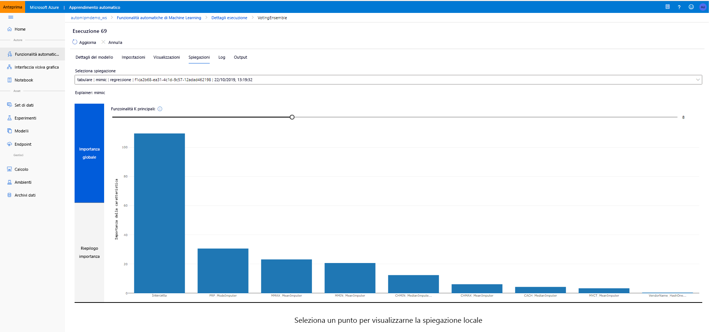

# <a name="interpretability-model-explanations-in-automated-machine-learning-preview"></a>Interpretazione: spiegazione del modello in Machine Learning automatizzato (anteprima)

[!INCLUDE [applies-to-skus](../../includes/aml-applies-to-basic-enterprise-sku.md)]

Questo articolo illustra come ottenere spiegazioni per Machine Learning automatizzato (ML) in Azure Machine Learning. Automatizzato ML consente di comprendere l'importanza della funzionalità progettata. 

Tutte le versioni dell'SDK dopo 1.0.85 impostate `model_explainability=True` per impostazione predefinita. Nella versione SDK 1.0.85 e nelle versioni precedenti, gli utenti devono impostare `model_explainability=True` nell'oggetto per poter `AutoMLConfig` usare l'interpretazione del modello. 

In questo articolo vengono illustrate le operazioni seguenti:

- Eseguire l'interpretazione durante il training per il modello migliore o qualsiasi modello.
- Abilitare le visualizzazioni per visualizzare i modelli nei dati e nelle spiegazioni.
- Implementare l'interpretazione durante l'inferenza o il punteggio.

## <a name="prerequisites"></a>Prerequisiti

- Funzionalità di interpretazione. Eseguire `pip install azureml-interpret azureml-contrib-interpret` per ottenere i pacchetti necessari.
- Conoscenza della creazione di esperimenti di Machine Learning automatizzati. Per altre informazioni su come usare l'SDK Azure Machine Learning, completare questa [esercitazione sul modello di regressione](tutorial-auto-train-models.md) o vedere come [configurare esperimenti](how-to-configure-auto-train.md)di Machine Learning automatici.

## <a name="interpretability-during-training-for-the-best-model"></a>Interpretazione durante il training per il modello migliore

Recuperare la spiegazione da `best_run` , che include le spiegazioni per le funzionalità progettate.

### <a name="download-engineered-feature-importance-from-artifact-store"></a>Scarica l'importanza della funzionalità progettata dall'archivio elementi

È possibile usare `ExplanationClient` per scaricare le spiegazioni delle funzionalità progettate dall'archivio di artefatti di `best_run` . 

```python
from azureml.explain.model._internal.explanation_client import ExplanationClient

client = ExplanationClient.from_run(best_run)
engineered_explanations = client.download_model_explanation(raw=False)
print(engineered_explanations.get_feature_importance_dict())
```

## <a name="interpretability-during-training-for-any-model"></a>Interpretazione durante il training di qualsiasi modello 

Quando si calcolano le spiegazioni dei modelli e le si visualizza, non si è limitati a una spiegazione del modello esistente per un modello di ML automatico. È anche possibile ottenere una spiegazione per il modello con dati di test diversi. I passaggi descritti in questa sezione illustrano come calcolare e visualizzare l'importanza della funzionalità progettata in base ai dati di test.

### <a name="retrieve-any-other-automl-model-from-training"></a>Recuperare qualsiasi altro modello di AutoML da training

```python
automl_run, fitted_model = local_run.get_output(metric='accuracy')
```

### <a name="set-up-the-model-explanations"></a>Configurare le spiegazioni del modello

Usare `automl_setup_model_explanations` per ottenere le spiegazioni progettate. `fitted_model`Può generare gli elementi seguenti:

- Dati in primo piano da esempi di training o di test
- Elenchi di nomi di funzionalità progettati
- Classi trovabili nella colonna con etichetta negli scenari di classificazione

`automl_explainer_setup_obj`Contiene tutte le strutture dall'elenco precedente.

```python
from azureml.train.automl.runtime.automl_explain_utilities import automl_setup_model_explanations

automl_explainer_setup_obj = automl_setup_model_explanations(fitted_model, X=X_train, 
                                                             X_test=X_test, y=y_train, 
                                                             task='classification')
```

### <a name="initialize-the-mimic-explainer-for-feature-importance"></a>Inizializzare il Explainer MIME per l'importanza della funzionalità

Per generare una spiegazione per i modelli AutoML, usare la `MimicWrapper` classe. È possibile inizializzare MimicWrapper con questi parametri:

- Oggetto di installazione di Explainer
- Area di lavoro
- Modello surrogato per spiegare il modello di Machine Learning `fitted_model` automatico

Il MimicWrapper accetta anche l' `automl_run` oggetto in cui verranno caricate le spiegazioni progettate.

```python
from azureml.explain.model.mimic_wrapper import MimicWrapper

# Initialize the Mimic Explainer
explainer = MimicWrapper(ws, automl_explainer_setup_obj.automl_estimator,
                         explainable_model=automl_explainer_setup_obj.surrogate_model, 
                         init_dataset=automl_explainer_setup_obj.X_transform, run=automl_run,
                         features=automl_explainer_setup_obj.engineered_feature_names, 
                         feature_maps=[automl_explainer_setup_obj.feature_map],
                         classes=automl_explainer_setup_obj.classes,
                         explainer_kwargs=automl_explainer_setup_obj.surrogate_model_params)
```

### <a name="use-mimicexplainer-for-computing-and-visualizing-engineered-feature-importance"></a>Usare MimicExplainer per l'elaborazione e la visualizzazione dell'importanza della funzionalità progettata

È possibile chiamare il `explain()` metodo in MimicWrapper con gli esempi di test trasformati per ottenere l'importanza della funzionalità per le funzionalità di progettazione generate. È anche possibile usare `ExplanationDashboard` per visualizzare la visualizzazione del dashboard dei valori di importanza delle funzionalità delle funzionalità di progettazione generate da Machine Learning featurizers.

```python
engineered_explanations = explainer.explain(['local', 'global'], eval_dataset=automl_explainer_setup_obj.X_test_transform)
print(engineered_explanations.get_feature_importance_dict())
```

### <a name="interpretability-during-inference"></a>Interpretazione durante l'inferenza

Questa sezione descrive come rendere operativo un modello di Machine Learning automatizzato con lo Explainer usato per calcolare le spiegazioni nella sezione precedente.

### <a name="register-the-model-and-the-scoring-explainer"></a>Registrare il modello e il spiegazione del Punteggio

Usare `TreeScoringExplainer` per creare il Explainer di assegnazione dei punteggi che calcolerà i valori di importanza della funzionalità progettata in fase di inferenza. Si inizializza il Explainer di assegnazione dei punteggi con il `feature_map` che è stato calcolato in precedenza. 

Salvare il Explainer di assegnazione dei punteggi, quindi registrare il modello e il Explainer di assegnazione dei punteggi con il servizio Gestione modelli. Eseguire il codice seguente:

```python
from azureml.interpret.scoring.scoring_explainer import TreeScoringExplainer, save

# Initialize the ScoringExplainer
scoring_explainer = TreeScoringExplainer(explainer.explainer, feature_maps=[automl_explainer_setup_obj.feature_map])

# Pickle scoring explainer locally
save(scoring_explainer, exist_ok=True)

# Register trained automl model present in the 'outputs' folder in the artifacts
original_model = automl_run.register_model(model_name='automl_model', 
                                           model_path='outputs/model.pkl')

# Register scoring explainer
automl_run.upload_file('scoring_explainer.pkl', 'scoring_explainer.pkl')
scoring_explainer_model = automl_run.register_model(model_name='scoring_explainer', model_path='scoring_explainer.pkl')
```

### <a name="create-the-conda-dependencies-for-setting-up-the-service"></a>Creare le dipendenze conda per la configurazione del servizio

Successivamente, creare le dipendenze di ambiente necessarie nel contenitore per il modello distribuito. Si noti che azureml-defaults con Version >= 1.0.45 deve essere elencato come una dipendenza PIP, perché contiene la funzionalità necessaria per ospitare il modello come servizio Web.

```python
from azureml.core.conda_dependencies import CondaDependencies

azureml_pip_packages = [
    'azureml-interpret', 'azureml-train-automl', 'azureml-defaults'
]

myenv = CondaDependencies.create(conda_packages=['scikit-learn', 'pandas', 'numpy', 'py-xgboost<=0.80'],
                                 pip_packages=azureml_pip_packages,
                                 pin_sdk_version=True)

with open("myenv.yml","w") as f:
    f.write(myenv.serialize_to_string())

with open("myenv.yml","r") as f:
    print(f.read())

```

### <a name="deploy-the-service"></a>Distribuire il servizio

Distribuire il servizio usando il file conda e il file di assegnazione dei punteggi dei passaggi precedenti.

```python
from azureml.core.webservice import Webservice
from azureml.core.webservice import AciWebservice
from azureml.core.model import Model, InferenceConfig
from azureml.core.environment import Environment

aciconfig = AciWebservice.deploy_configuration(cpu_cores=1,
                                               memory_gb=1,
                                               tags={"data": "Bank Marketing",  
                                                     "method" : "local_explanation"},
                                               description='Get local explanations for Bank marketing test data')
myenv = Environment.from_conda_specification(name="myenv", file_path="myenv.yml")
inference_config = InferenceConfig(entry_script="score_local_explain.py", environment=myenv)

# Use configs and models generated above
service = Model.deploy(ws,
                       'model-scoring',
                       [scoring_explainer_model, original_model],
                       inference_config,
                       aciconfig)
service.wait_for_deployment(show_output=True)
```

### <a name="inference-with-test-data"></a>Inferenza con dati di test

Inferenza con alcuni dati di test per visualizzare il valore stimato dal modello di ML automatico. Consente di visualizzare l'importanza della funzionalità progettata per il valore stimato.

```python
if service.state == 'Healthy':
    # Serialize the first row of the test data into json
    X_test_json = X_test[:1].to_json(orient='records')
    print(X_test_json)
    # Call the service to get the predictions and the engineered explanations
    output = service.run(X_test_json)
    # Print the predicted value
    print(output['predictions'])
    # Print the engineered feature importances for the predicted value
    print(output['engineered_local_importance_values'])
```

### <a name="visualize-to-discover-patterns-in-data-and-explanations-at-training-time"></a>Visualizza per individuare i modelli nei dati e le spiegazioni in fase di training

È possibile visualizzare il grafico importanza funzionalità nell'area di lavoro in [Azure Machine Learning Studio](https://ml.azure.com). Al termine dell'esecuzione automatica di Machine Learning, selezionare **Visualizza dettagli modello** per visualizzare un'esecuzione specifica. Selezionare la scheda **spiegazioni** per visualizzare il dashboard di visualizzazione spiegazione.

[](./media/how-to-machine-learning-interpretability-automl/automl-explainability.png#lightbox)

## <a name="next-steps"></a>Passaggi successivi

Per altre informazioni su come abilitare le spiegazioni dei modelli e l'importanza delle funzionalità nelle aree di Azure Machine Learning SDK, ad eccezione dell'apprendimento automatico automatico, vedere l' [articolo relativo al concetto di interpretazione](how-to-machine-learning-interpretability.md).
