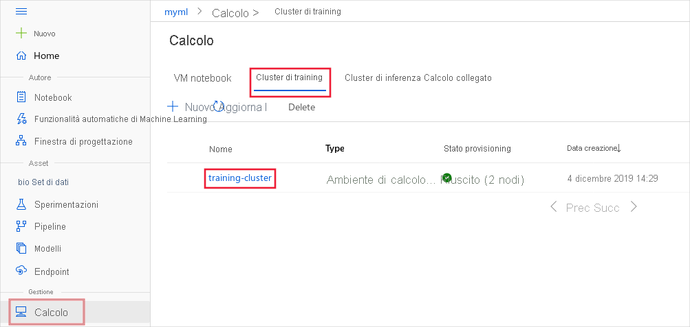
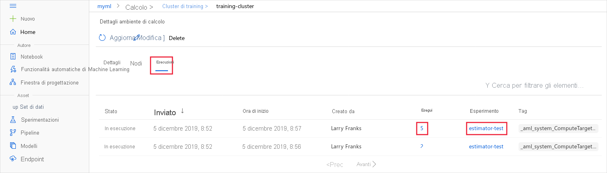

# <a name="monitor-and-view-ml-run-logs-and-metrics"></a>Monitorare e visualizzare i log e le metriche per l'esecuzione di ML


Questo articolo illustra come monitorare le esecuzioni di Azure Machine Learning e visualizzare i log. Prima di poter visualizzare i log, è necessario abilitarli per primi. Per altre informazioni, vedere [abilitare la registrazione nelle esecuzioni di training di Azure ml](how-to-track-experiments.md).

I log possono essere utili per diagnosticare gli errori e gli avvisi o per tenere traccia delle metriche delle prestazioni, ad esempio parametri e accuratezza del modello. In questo articolo si apprenderà come visualizzare i log usando i metodi seguenti:

> [!div class="checklist"]
> * Monitoraggio eseguito in studio
> * Monitoraggio eseguito con il widget Jupyter Notebook
> * Monitorare le esecuzioni automatiche di Machine Learning
> * Visualizza log di output al termine
> * Visualizzare i log di output in studio

Per informazioni generali su come gestire gli esperimenti, vedere [avviare, monitorare e annullare le esecuzioni di training](how-to-manage-runs.md).

## <a name="monitor-runs-in-the-studio"></a>Monitoraggio eseguito in studio

Per monitorare le esecuzioni per una destinazione di calcolo specifica dal browser, seguire questa procedura:

1. In [Azure Machine Learning Studio](https://ml.azure.com/)selezionare l'area di lavoro e quindi selezionare __calcolo__ dal lato sinistro della pagina.

1. Selezionare __Cluster di training__ per visualizzare un elenco di destinazioni di calcolo usate per il training. Selezionare quindi il cluster.

    

1. Selezionare __Esecuzioni__. Viene visualizzato l'elenco delle esecuzioni che usano questo cluster. Per visualizzare i dettagli per un'esecuzione specifica, usare il collegamento nella colonna __Esecuzione__. Per visualizzare i dettagli per un'esecuzione specifica, usare il collegamento nella colonna __Esperimento__.

    
    
    > [!TIP]
    > Poiché le destinazioni di calcolo del training sono una risorsa condivisa, possono avere più esecuzioni in coda o attive in un determinato momento.
    > 
    > Un'esecuzione può contenere esecuzioni figlie, quindi un processo di training può generare più voci.

Una volta completata l'esecuzione, questa non viene più visualizzata nella pagina. Per visualizzare le informazioni sulle esecuzioni completate, visitare la sezione __Esperimenti__ in Studio e selezionare l'esperimento e l'esecuzione. Per altre informazioni, vedere la sezione [visualizzare le metriche per le esecuzioni completate](#view-the-experiment-in-the-web-portal).

## <a name="monitor-runs-using-the-jupyter-notebook-widget"></a>Monitoraggio eseguito con il widget Jupyter notebook

Quando si usa il metodo **ScriptRunConfig** per inviare le esecuzioni, è possibile controllare lo stato di avanzamento dell'esecuzione usando il [widget Jupyter](https://docs.microsoft.com/python/api/azureml-widgets/azureml.widgets?view=azure-ml-py&preserve-view=true). Come per l'invio dell'esecuzione, il widget è asincrono e fornisce aggiornamenti in tempo reale ogni 10-15 secondi finché non viene completato il processo.

Visualizzare il widget di Jupyter durante l'attesa del completamento dell'esecuzione.
    
```python
from azureml.widgets import RunDetails
RunDetails(run).show()
```


È anche possibile ottenere un collegamento alla stessa visualizzazione nell'area di lavoro.

```python
print(run.get_portal_url())
```

## <a name="monitor-automated-machine-learning-runs"></a>Monitorare le esecuzioni automatiche di Machine Learning

Per le esecuzioni automatiche di Machine Learning, per accedere ai grafici da un'esecuzione precedente, sostituire `<<experiment_name>>` con il nome dell'esperimento appropriato:

```python
from azureml.widgets import RunDetails
from azureml.core.run import Run

experiment = Experiment (workspace, <<experiment_name>>)
run_id = 'autoML_my_runID' #replace with run_ID
run = Run(experiment, run_id)
RunDetails(run).show()
```


## <a name="show-output-upon-completion"></a>Mostra output al completamento

Quando si usa **ScriptRunConfig**, è possibile usare ```run.wait_for_completion(show_output = True)``` per visualizzare quando viene completato il training del modello. Il flag ```show_output``` fornisce output dettagliato. Per ulteriori informazioni, vedere la sezione ScriptRunConfig di [come abilitare la registrazione](how-to-track-experiments.md#scriptrun-logs).

<a id="queryrunmetrics"></a>
## <a name="query-run-metrics"></a>Eseguire query sulle metriche di esecuzione

È possibile visualizzare le metriche relative a un modello sottoposto a training usando ```run.get_metrics()```. Ad esempio, è possibile usarlo con l'esempio precedente per determinare il modello migliore cercando il modello con il valore medio di errore quadratico (MSE) più basso.

<a name="view-the-experiment-in-the-web-portal"></a>
## <a name="view-run-records-in-the-studio"></a>Visualizzare i record di esecuzione in studio

È possibile esplorare i record di esecuzione completati, incluse le metriche registrate, in [Azure Machine Learning Studio](https://ml.azure.com).

Passare alla scheda **esperimenti** e selezionare l'esperimento. Nel dashboard dell'esperimento è possibile visualizzare le metriche e i log rilevati per ogni esecuzione. 

Eseguire il drill-down fino a un'esecuzione specifica per visualizzare i relativi output o log oppure scaricare lo snapshot dell'esperimento in modo che sia possibile condividere la cartella dell'esperimento con altri utenti.

È anche possibile modificare la tabella elenco di esecuzione per selezionare più esecuzioni e visualizzare il valore massimo, minimo o massimo registrato per le esecuzioni. Personalizzare i grafici per confrontare i valori delle metriche registrate e le aggregazioni in più esecuzioni.


### <a name="format-charts-in-the-studio"></a>Formattare i grafici in studio

Usare i metodi seguenti nelle API di registrazione per influenzare lo studio per visualizzare le metriche.

|Valore registrato|Codice di esempio| Formattare nel portale|
|----|----|----|
|Registra una matrice di valori numerici| `run.log_list(name='Fibonacci', value=[0, 1, 1, 2, 3, 5, 8, 13, 21, 34, 55, 89])`|Grafico a linee a singola variabile|
|Registra un valore numerico singolo con lo stesso nome di metrica usato più volte (come in un ciclo for)| `for i in tqdm(range(-10, 10)):    run.log(name='Sigmoid', value=1 / (1 + np.exp(-i))) angle = i / 2.0`| Grafico a linee a singola variabile|
|Registra più volte una riga con due colonne numeriche|`run.log_row(name='Cosine Wave', angle=angle, cos=np.cos(angle))   sines['angle'].append(angle)      sines['sine'].append(np.sin(angle))`|Grafico a linee a due variabili|
|Registra una tabella con due colonne numeriche|`run.log_table(name='Sine Wave', value=sines)`|Grafico a linee a due variabili|


## <a name="next-steps"></a>Passaggi successivi

Provare a eseguire questi passaggi successivi per informazioni su come usare Azure Machine Learning:

* Informazioni su come [tenere traccia degli esperimenti e abilitare i log nella finestra di progettazione Azure Machine Learning](how-to-track-designer-experiments.md).

* Vedere un esempio di come registrare il modello migliore e distribuirlo nell'esercitazione [Eseguire il training di un modello di classificazione delle immagini con Azure Machine Learning](tutorial-train-models-with-aml.md).

