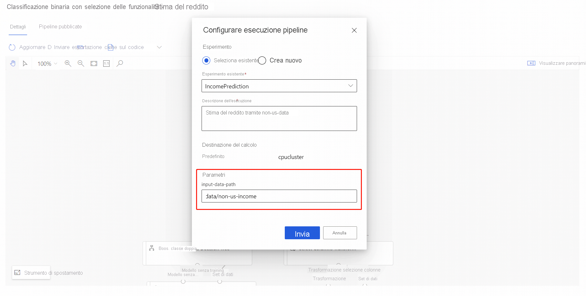

# Ripetere il training dei modelli con Azure Machine Learning Designer

Questo articolo illustra come usare la finestra di progettazione di Azure Machine Learning per ripetere il training di un modello di Machine Learning. Verranno usate le pipeline pubblicate per automatizzare il flusso di lavoro e impostare i parametri per eseguire il training del modello con i nuovi dati. 

In questo articolo vengono illustrate le operazioni seguenti:

> [!div class="checklist"]
> * Eseguire il training di un modello di Machine Learning.
> * Creare un parametro della pipeline.
> * Pubblicare la pipeline di training.
> * Ripetere il training del modello con nuovi parametri.

## Prerequisiti

* Area di lavoro di Azure Machine Learning
* Completare la parte 1 di questa serie di procedure, [trasformare i dati nella finestra di progettazione](how-to-designer-transform-data.md)

[!INCLUDE [machine-learning-missing-ui](../../includes/machine-learning-missing-ui.md)]

Questo articolo presuppone inoltre che l'utente abbia una certa conoscenza della creazione di pipeline nella finestra di progettazione. Per un'introduzione guidata, eseguire l'[esercitazione](tutorial-designer-automobile-price-train-score.md). 

### Pipeline di esempio

La pipeline usata in questo articolo è una versione modificata di una stima del [reddito](samples-designer.md#classification) della pipeline di esempio nella Home page della finestra di progettazione. La pipeline usa il modulo [Import Data](algorithm-module-reference/import-data.md) (Importare dati) anziché il set di dati di esempio per illustrare come eseguire il training dei modelli con i propri dati.

## Creare un parametro della pipeline

Creare i parametri della pipeline per impostare dinamicamente le variabili durante il runtime. Per questo esempio, il percorso dei dati di training verrà modificato da un valore fisso a un parametro in modo che sia possibile ripetere il training del modello con dati diversi.

1. Selezionare il modulo **Import Data** (Importare dati).

    > [!NOTE]
    > Questo esempio usa il modulo Import Data (Importare Dati) per accedere ai dati in un archivio dati registrato. Tuttavia, se si usano modelli di accesso ai dati alternativi, è possibile seguire una procedura simile.

1. Nel riquadro dei dettagli del modulo a destra del canvas selezionare l'origine dati.

1. Immettere il percorso dei dati. È anche possibile selezionare **Browse path** (Sfoglia percorso) per esplorare l'albero dei file. 

1. Passare il mouse sul campo **Path** (Percorso) e selezionare i tre punti visualizzati sopra il campo **Path** (Percorso).

    

1. Selezionare **Add to pipeline parameter** (Aggiungi a parametro pipeline).

1. Specificare un nome di parametro e un valore predefinito.

   > [!NOTE]
   > È possibile esaminare e modificare i parametri della pipeline selezionando l'icona a forma di ingranaggio **Settings** (Impostazioni) accanto al titolo della bozza della pipeline. 

1. Selezionare **Salva**.

1. Avviare l'esecuzione della pipeline.

## Trovare un modello di cui è stato eseguito il training

La finestra di progettazione salva tutti gli output della pipeline, inclusi i modelli di cui è stato eseguito il training, nell'account di archiviazione predefinito dell'area di lavoro. È anche possibile accedere ai modelli di cui è stato eseguito il training direttamente nella finestra di progettazione:

1. Attendere il completamento dell'esecuzione della pipeline.
1. Selezionare il modulo **Train Model**.
1. Nel riquadro dei dettagli del modulo a destra del canvas selezionare **Outputs + logs** (Output + log).
1. È possibile trovare il modello in **Other outputs** (Altri output) insieme ai log di esecuzione.
1. In alternativa, selezionare l'icona **View output** (Visualizza output). Da qui è possibile seguire le istruzioni nella finestra di dialogo per passare direttamente all'archivio dati. 

> [!div class="mx-imgBorder"]
> 

## Pubblicare una pipeline di training

Pubblicare una pipeline in un endpoint della pipeline per riutilizzare facilmente le pipeline in futuro. Un endpoint della pipeline crea un endpoint REST per richiamare la pipeline in futuro. In questo esempio, l'endpoint della pipeline consente di riutilizzare la pipeline per ripetere il training di un modello con dati diversi.

1. Selezionare **Publish** (Pubblica) sopra il canvas della finestra di progettazione.
1. Selezionare o creare un endpoint della pipeline.

   > [!NOTE]
   > È possibile pubblicare più pipeline in un singolo endpoint. A ogni pipeline di un determinato endpoint viene assegnato un numero di versione che è possibile specificare quando si chiama l'endpoint della pipeline.

1. Selezionare **Pubblica**.

## Ripetere il training del modello

Ora che è disponibile una pipeline di training pubblicata, è possibile usarla per ripetere il training del modello con i nuovi dati. È possibile avviare le esecuzioni da un endpoint della pipeline dall'area di lavoro di Studio o a livello di codice.

### Inviare le esecuzioni tramite il portale di studio

Usare la procedura seguente per inviare un endpoint della pipeline con parametri eseguito dal portale di studio:

1. Passare alla pagina **Endpoints** (Endpoint) nell'area di lavoro di Studio.
1. Selezionare la scheda **Pipeline endpoints** (Endpoint pipeline). Quindi selezionare l'endpoint della pipeline.
1. Selezionare la scheda **Published pipelines** (Pipeline pubblicate). Quindi selezionare la versione della pipeline che si vuole eseguire.
1. Selezionare **Submit** (Invia).
1. Nella finestra di dialogo di impostazione è possibile specificare i valori dei parametri per l'esecuzione. Per questo esempio, aggiornare il percorso dei dati per eseguire il training del modello usando un set di dati diverso da US.

### Avviare le esecuzioni usando il codice

L'endpoint REST di una pipeline pubblicata è disponibile nel pannello di panoramica. Chiamando l'endpoint è possibile ripetere il training della pipeline pubblicata.

Per eseguire una chiamata REST è necessaria un'intestazione di autenticazione di tipo bearer token OAuth 2.0. Per informazioni sulla configurazione dell'autenticazione nell'area di lavoro e sull'esecuzione di una chiamata REST con parametri, vedere [Creare una pipeline di Azure Machine Learning per l'assegnazione di punteggi batch](tutorial-pipeline-batch-scoring-classification.md#publish-and-run-from-a-rest-endpoint).

## Passaggi successivi

In questo articolo si è appreso come creare un endpoint della pipeline di training con parametri usando la finestra di progettazione.

Per la procedura dettagliata completa per distribuire un modello per eseguire stime, vedere l'[esercitazione con la finestra di progettazione](tutorial-designer-automobile-price-train-score.md) per eseguire il training e la distribuzione di un modello di regressione.
