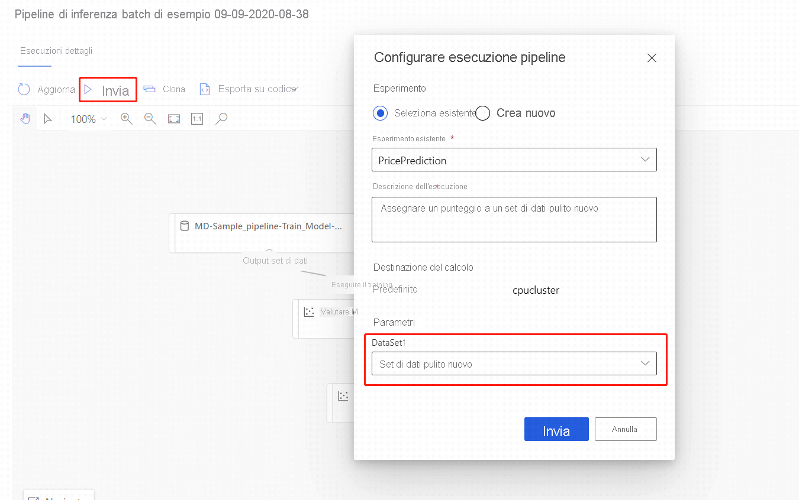

# Eseguire stime batch tramite la finestra di progettazione di Azure Machine Learning
[!INCLUDE [applies-to-skus](../../includes/aml-applies-to-basic-enterprise-sku.md)]

Questo articolo illustra come usare la finestra di progettazione per creare una pipeline di stima batch. La stima in batch consente di assegnare in modo continuo un punteggio di set di caratteri di grandi dimensioni su richiesta usando un servizio Web che può essere attivato da qualsiasi libreria HTTP.

In questa procedura viene illustrato come eseguire le attività seguenti:

> [!div class="checklist"]
> * Creare e pubblicare una pipeline di inferenza batch
> * Utilizzare un endpoint della pipeline
> * Gestire le versioni degli endpoint

Per informazioni su come configurare i servizi di assegnazione dei punteggi in batch usando l'SDK, vedere le [procedure](how-to-run-batch-predictions.md)associate.

## Prerequisiti

In questa procedura si presuppone che sia già presente una pipeline di training. Per un'introduzione guidata alla finestra di progettazione, completare la [prima parte dell'esercitazione relativa alla finestra di progettazione](tutorial-designer-automobile-price-train-score.md). 

## Creare una pipeline di inferenza batch

La pipeline di training deve essere eseguita almeno una volta per poter creare una pipeline di inferenza.

1. Passare alla scheda **finestra di progettazione** nell'area di lavoro.

1. Selezionare la pipeline di training che consente di eseguire il training del modello per eseguire la stima.

1. **Eseguire** la pipeline.

    

Ora che la pipeline di training è stata eseguita, è possibile creare una pipeline di inferenza batch.

1. Accanto a **Esegui**selezionare il nuovo elenco a discesa **Crea inferenza pipeline**.

1. Selezionare **pipeline inferenza batch**.

    
    
Il risultato è una pipeline di inferenza batch predefinita 

### Aggiungere un parametro della pipeline

Per creare stime sui nuovi dati, è possibile connettere manualmente un set di dati diverso in questa visualizzazione bozza della pipeline o creare un parametro per il set di dati. I parametri consentono di modificare il comportamento del processo di inferenza del batch in fase di esecuzione.

In questa sezione viene creato un parametro del set di dati per specificare un set di dati diverso per eseguire stime.

1. Selezionare il modulo del set di dati.

1. Verrà visualizzato un riquadro a destra dell'area di disegno. Nella parte inferiore del riquadro selezionare **Imposta come parametro della pipeline**.
   
    Immettere un nome per il parametro oppure accettare il valore predefinito.

## Pubblicare la pipeline di inferenza batch

A questo punto si è pronti per distribuire la pipeline di inferenza. Questa operazione consente di distribuire la pipeline e di renderla disponibile per l'uso da parte di altri utenti.

1. Fare clic sul pulsante **Pubblica**.

1. Nella finestra di dialogo visualizzata espandere l'elenco a discesa per **PipelineEndpoint**e selezionare **nuovo PipelineEndpoint**.

1. Specificare un nome di endpoint e una descrizione facoltativa.

    Nella parte inferiore della finestra di dialogo è possibile visualizzare il parametro configurato con un valore predefinito dell'ID set di dati utilizzato durante il training.

1. Selezionare **Pubblica**.

## Utilizzare un endpoint

A questo punto è disponibile una pipeline pubblicata con un parametro del set di dati. La pipeline utilizzerà il modello sottoposto a training creato nella pipeline di training per assegnare un punteggio al set di dati fornito come parametro.

### Inviare un'esecuzione di pipeline 

In questa sezione si configurerà un'esecuzione manuale della pipeline e si modificherà il parametro della pipeline per assegnare un punteggio ai nuovi dati. 

1. Al termine della distribuzione, passare alla sezione **endpoint** .

1. Selezionare **endpoint della pipeline**.

1. Selezionare il nome dell'endpoint creato.

1. Selezionare **pipeline pubblicate**.

    Questa schermata Mostra tutte le pipeline pubblicate pubblicate in questo endpoint.

1. Selezionare la pipeline pubblicata.

    La pagina dei dettagli della pipeline Mostra una cronologia di esecuzione dettagliata e informazioni sulla stringa di connessione per la pipeline. 
    
1. Selezionare **Esegui** per creare un'esecuzione manuale della pipeline.

    
    
1. Modificare il parametro in modo da utilizzare un set di dati diverso.
    
1. Selezionare **Esegui** per eseguire la pipeline.

### Usare l'endpoint REST

È possibile trovare informazioni su come utilizzare gli endpoint della pipeline e la pipeline pubblicata nella sezione **endpoint** .

È possibile trovare l'endpoint REST di un endpoint della pipeline nel pannello di panoramica dell'esecuzione. Chiamando l'endpoint, si utilizza la pipeline pubblicata predefinita.

È inoltre possibile utilizzare una pipeline pubblicata nella pagina **pipeline pubblicate** . Selezionare una pipeline pubblicata e trovare l'endpoint REST. 

Per eseguire una chiamata REST, è necessaria un'intestazione di autenticazione del tipo di porta OAuth 2,0. Vedere la [sezione dell'esercitazione](tutorial-pipeline-batch-scoring-classification.md#publish-and-run-from-a-rest-endpoint) seguente per informazioni più dettagliate sulla configurazione dell'autenticazione per l'area di lavoro e l'esecuzione di una chiamata REST con parametri.

## Controllo delle versioni degli endpoint

La finestra di progettazione assegna una versione a ogni pipeline successiva pubblicata in un endpoint. È possibile specificare la versione della pipeline che si vuole eseguire come parametro nella chiamata REST. Se non si specifica un numero di versione, la pipeline predefinita verrà utilizzata dalla finestra di progettazione.

Quando si pubblica una pipeline, è possibile scegliere di impostarla come nuova pipeline predefinita per tale endpoint.

È anche possibile impostare una nuova pipeline predefinita nella scheda **pipeline pubblicate** dell'endpoint.

## Passaggi successivi

Seguire l'[esercitazione](tutorial-designer-automobile-price-train-score.md) relativa alla finestra di progettazione per eseguire il training e la distribuzione di un modello di regressione.
