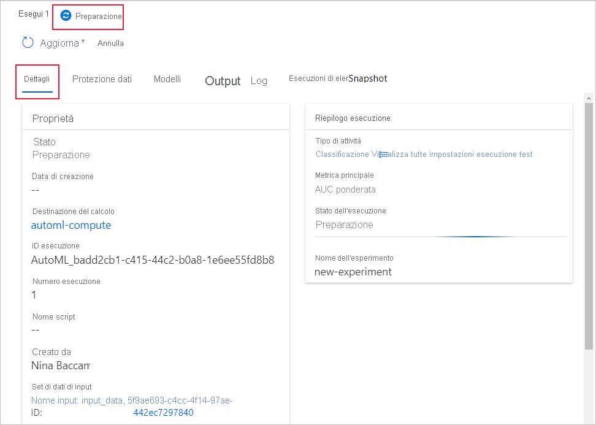

# Creare, rivedere e distribuire modelli di Machine Learning automatizzato con Azure Machine Learning

Questo articolo illustra come creare, esplorare e distribuire modelli di Machine Learning automatici senza una singola riga di codice in Azure Machine Learning Studio.

Machine Learning automatizzato è un processo in cui viene selezionato il migliore algoritmo di Machine Learning da usare per i dati specifici. Questo processo consente di generare rapidamente modelli di Machine Learning. [Altre informazioni sulle funzionalità di Machine Learning automatizzato](concept-automated-ml.md).
 
Per un esempio end-to-end, provare l’[esercitazione per la creazione di un modello di classificazione con l’interfaccia di ML automatizzato di Azure Machine Learning](tutorial-first-experiment-automated-ml.md). 

Per un'esperienza basata su codice Python, [configurare gli esperimenti di Machine Learning automatizzato](how-to-configure-auto-train.md) con l'SDK di Azure Machine Learning.

## Prerequisiti

* Una sottoscrizione di Azure. Se non si ha una sottoscrizione di Azure, creare un account gratuito prima di iniziare. Provare la [versione gratuita o a pagamento di Azure Machine Learning](https://aka.ms/AMLFree).

* Un'area di lavoro di Azure Machine Learning. Vedere [Creare un'area di lavoro di Azure Machine Learning](how-to-manage-workspace.md). 

## Introduzione

1. Accedere ad Azure Machine Learning in https://ml.azure.com. 

1. Selezionare la sottoscrizione e l’area di lavoro. 

1. Passare al riquadro sinistro. Selezionare **ML automatizzato** nella sezione **Autore**.

 Poiché si tratta del primo esperimento, verranno visualizzati un elenco vuoto e collegamenti alla documentazione. 

Altrimenti, verrà visualizzato un elenco degli esperimenti recenti di Machine Learning automatizzato, inclusi quelli creati con l'SDK. 

## Creare ed eseguire l'esperimento

1. Selezionare **+ Nuova esecuzione di ML automatizzato** e popolare il modulo.

1. Selezionare un set di dati dal contenitore di archiviazione o creare un nuovo set di dati. I set di dati possono essere creati da file locali, URL Web, archivi dati o set di dati aperti di Azure. Altre informazioni sulla [creazione del set di dati](how-to-create-register-datasets.md).  

    >[!Important]
    > Requisiti per i dati di training:
    >* I dati devono essere in formato tabulare.
    >* Il valore che si desidera prevedere (colonna di destinazione) deve essere presente nei dati.

    1. Per creare un nuovo set di dati da un file nel computer locale, selezionare **+ Crea set di dati** e quindi selezionare **da file locale**. 

    1. Nel modulo **informazioni di base** assegnare un nome univoco al set di dati e specificare una descrizione facoltativa. 

    1. Selezionare **Avanti** per aprire il **modulo di selezione file e archivio dati**. In questo modulo è possibile selezionare la posizione in cui caricare il set di dati, il contenitore di archiviazione predefinito creato automaticamente con l'area di lavoro o scegliere un contenitore di archiviazione da usare per l'esperimento. 
    
        1. Se i dati sono protetti da una rete virtuale, è necessario abilitare la funzione **Ignora la convalida** per assicurarsi che l'area di lavoro sia in grado di accedere ai dati. Per altre informazioni, vedere [usare Azure Machine Learning Studio in una rete virtuale di Azure](how-to-enable-studio-virtual-network.md). 
    
    1. Selezionare **Browse (Sfoglia** ) per caricare il file di dati per il set di dati. 

    1. Esaminare il modulo **Impostazioni e anteprima** per verificarne l'accuratezza. Il modulo viene popolato in modo intelligente in base al tipo di file. 

        Campo| Descrizione
        ----|----
        Formato file| Definisce il layout e il tipo di dati archiviati in un file.
        Delimitatore| Uno o più caratteri per specificare il limite tra aree distinte indipendenti in testo normale o altri flussi di dati.
        Codifica| Identifica la tabella dello schema bit-carattere da usare per leggere il set di dati.
        Intestazioni di colonna| Indica come verranno considerate le intestazioni del set di dati, se presenti.
        Ignora righe | Indica quante righe vengono eventualmente ignorate nel set di dati.
    
        Selezionare **Avanti**.

    1. Il modulo **Schema** viene popolato in modo intelligente in base alle selezioni nel modulo **Impostazioni e anteprima**. Qui è possibile configurare il tipo di dati per ogni colonna, esaminare i nomi delle colonne e selezionare le colonne da **non includere** per l'esperimento. 
            
        Selezionare **Avanti.**

    1. Il modulo **Conferma dettagli** è un riepilogo delle informazioni con cui sono stati precedentemente popolati i moduli **Info di base** e **Impostazioni e anteprima**. È inoltre possibile creare un profilo dati per il set di dati usando un ambiente di calcolo abilitato per la profilatura. Altre informazioni sulla [profilatura dei dati](how-to-connect-data-ui.md#profile).

        Selezionare **Avanti**.
1. Selezionare il set di dati appena creato quando viene visualizzato. È anche possibile visualizzare un'anteprima del set di dati e delle statistiche di esempio. 

1. Nel modulo **Configura esecuzione** immettere un nome di esperimento univoco.

1. Selezionare una colonna di destinazione. Si tratta della colonna su cui si desidera eseguire le previsioni.

1. Selezionare un ambiente di calcolo per il processo di training e profilatura dei dati. Un elenco degli ambienti di calcolo esistenti è disponibile nell'elenco a discesa. Per creare un nuovo ambiente di calcolo, seguire le istruzioni riportate nel passaggio 7.

1. Selezionare **Crea un nuovo ambiente di calcolo** per configurare il contesto di calcolo per questo esperimento.

    Campo|Descrizione
    ---|---
    Nome del calcolo| Immettere un nome univoco che identifichi il contesto di calcolo.
    Priorità macchina virtuale| Le macchine virtuali con priorità bassa sono più economiche, ma non garantiscono i nodi di calcolo. 
    Tipo di macchina virtuale| Selezionare CPU o GPU per tipo di macchina virtuale.
    Dimensioni della macchina virtuale| Selezionare le dimensioni della macchina virtuale per il contesto di calcolo.
    Nodi min/max| Per profilare i dati, è necessario specificare almeno un nodo. Immettere il numero massimo di nodi per l’ambiente di calcolo. Il valore predefinito è 6 nodi per un ambiente di calcolo di AML.
    Impostazioni avanzate | Queste impostazioni consentono di configurare un account utente e una rete virtuale esistente per l'esperimento. 
    
    Selezionare **Create** (Crea). La creazione di un nuovo ambiente di calcolo può richiedere alcuni minuti.

    >[!NOTE]
    > Il nome dell’ambiente di calcolo indicherà se l’ambiente di calcolo selezionato/creato è *abilitato per la profilatura*. Per ulteriori informazioni, vedere la sezione [Profilatura dei dati](how-to-connect-data-ui.md#profile).

    Selezionare **Avanti**.

1. Nel modulo **Tipo di attività e impostazioni** selezionare il tipo di attività: classificazione, regressione o previsione. Per ulteriori informazioni, vedere [tipi di attività supportati](concept-automated-ml.md#when-to-use-automl-classify-regression--forecast) .

    1. Per la **classificazione**, è anche possibile abilitare l'apprendimento avanzato.
    
        Se l'apprendimento avanzato è abilitato, la convalida è limitata a _train_validation divisione_. [Altre informazioni sulle opzioni di convalida](how-to-configure-cross-validation-data-splits.md).

    1. Per la **previsione** è possibile, 
    
        1. Abilitare l'apprendimento avanzato.
    
        1. Seleziona *colonna temporale*: questa colonna contiene i dati relativi all'ora da usare.

        1. Select *Forecast Horizon*: indica il numero di unità di tempo (minuti/ore/giorni/settimane/mesi/anni) che il modello sarà in grado di stimare in futuro. Maggiore è il tempo per il quale il modello deve effettuare previsioni nel futuro, minore sarà il livello di precisione. [Altre informazioni sulla previsione e sull'orizzonte di previsione](how-to-auto-train-forecast.md).

1. (Facoltativo) Visualizzare le impostazioni di configurazione aggiuntive: altre impostazioni che è possibile usare per controllare meglio il processo di training. Altrimenti, vengono applicate le impostazioni predefinite in base alla selezione dell'esperimento e ai dati. 

    Configurazioni aggiuntive|Descrizione
    ------|------
    Primary metric (Metrica principale)| Metrica principale usata per assegnare un punteggio al modello. [Altre informazioni sulle metriche dei modelli](how-to-configure-auto-train.md#primary-metric).
    Modello esplicativo migliore | Selezionare questa opzione per abilitare o disabilitare, in modo da visualizzare le spiegazioni per il modello migliore consigliato.   Questa funzionalità non è attualmente disponibile per [determinati algoritmi di previsione](how-to-machine-learning-interpretability-automl.md#interpretability-during-training-for-the-best-model). 
    Algoritmo bloccato| Selezionare gli algoritmi da escludere dal processo di training.    Consentire gli algoritmi è disponibile solo per gli [esperimenti SDK](how-to-configure-auto-train.md#supported-models).   Vedere i [modelli supportati per ogni tipo di attività](https://docs.microsoft.com/python/api/azureml-automl-core/azureml.automl.core.shared.constants.supportedmodels?view=azure-ml-py&preserve-view=true).
    Exit criterion (Esci da criterio)| Quando uno di questi criteri viene soddisfatto, il processo di training viene arrestato.   *Durata del processo di training (ore)* : per quanto tempo consentire l'esecuzione del processo di training.   *Soglia di punteggio metrica*:  punteggio di metrica minimo per tutte le pipeline. In questo modo si garantisce che, se si dispone di una metrica di destinazione definita che si desidera raggiungere, non si dedica più tempo del necessario al processo di training.
    Convalida| Selezionare una delle opzioni di convalida incrociata da usare nel processo di training.   [Altre informazioni sulla convalida incrociata](how-to-configure-cross-validation-data-splits.md#prerequisites).   La previsione supporta solo la convalida incrociata k-fold.
    Concorrenza| *Numero massimo di iterazioni simultanee*: numero massimo di pipeline (iterazioni) da testare nel processo di training. Il processo non viene eseguito più volte del numero specificato di iterazioni.

1. Opzionale Visualizza impostazioni conteggi: se si sceglie di abilitare **conteggi automatici** nel modulo **impostazioni di configurazione aggiuntive** , vengono applicate le tecniche conteggi predefinite. Nelle **impostazioni di visualizzazione conteggi** è possibile modificare queste impostazioni predefinite e personalizzarle di conseguenza. Informazioni su come [personalizzare featurizations](#customize-featurization). 

    

## Personalizzare conteggi

Nel modulo **conteggi** è possibile abilitare o disabilitare conteggi automatici e personalizzare le impostazioni conteggi automatiche per l'esperimento. Per aprire questo modulo, vedere il passaggio 10 nella sezione [creare ed eseguire l'esperimento](#create-and-run-experiment) . 

Nella tabella seguente sono riepilogate le personalizzazioni attualmente disponibili tramite Studio. 

Colonna| Personalizzazione
---|---
Incluso | Specifica le colonne da includere per il training.
Tipo di funzionalità| Modificare il tipo di valore per la colonna selezionata.
Imputa con| Selezionare il valore in cui si desidera imputare i valori mancanti nei dati.

## Eseguire l'esperimento e visualizzare i risultati

Selezionare **Fine** per eseguire l'esperimento. L'esperimento di preparazione del processo può richiedere fino a 10 minuti. Per completare l'esecuzione di ogni pipeline, i processi di training possono richiedere altri 2-3 minuti.

### Visualizzare i dettagli sull'esperimento

Viene visualizzata la schermata **Dettagli esecuzione** nella scheda **Dettagli**. Questa schermata mostra un riepilogo dell'esecuzione dell'esperimento, inclusa una barra di stato in alto accanto al numero di esecuzione. 

La scheda **Modelli** contiene un elenco dei modelli creati, ordinati in base al punteggio della metrica. Per impostazione predefinita, il modello che riceve il punteggio più alto in base alla metrica scelta si trova all'inizio dell'elenco. Man mano che il processo di training prova altri modelli, questi vengono aggiunti all'elenco. Usare questa procedura per ottenere un rapido confronto delle metriche per i modelli prodotti finora.

### Visualizzare i dettagli relativi all'esecuzione del training

Eseguire il drill-down su uno dei modelli completati per visualizzare i dettagli delle esecuzioni di training, ad esempio un riepilogo del modello nella scheda **modello** o i grafici delle metriche delle prestazioni nella scheda **metriche** . [altre informazioni sui grafici](how-to-understand-automated-ml.md).

## Distribuire il modello

Una volta ottenuto il modello migliore, è necessario distribuirlo come servizio Web per eseguire previsioni sui nuovi dati.

ML automatizzato semplifica la distribuzione del modello senza scrivere codice:

1. Per la distribuzione sono disponibili due opzioni. 

    + Opzione 1: distribuire il modello migliore in base ai criteri della metrica definiti. 
        1. Al termine dell'esperimento, passare alla pagina esecuzione padre selezionando **Esegui 1** nella parte superiore della schermata. 
        1.  Selezionare il modello elencato nella sezione **Riepilogo del modello migliore** . 
        1. Selezionare **Distribuisci** nella parte superiore sinistra della finestra. 

    + Opzione 2: per distribuire un'iterazione del modello specifica da questo esperimento.
        1. Selezionare il modello desiderato dalla scheda **Modelli**
        1. Selezionare **Distribuisci** nella parte superiore sinistra della finestra.

1. Inserire i dati nel riquadro **Distribuisci modello**.

    Campo| Valore
    ----|----
    Nome| Specificare un nome univoco per la distribuzione.
    Descrizione| Immettere una descrizione per identificare meglio le finalità della distribuzione.
    Tipo di calcolo| Selezionare il tipo di endpoint da distribuire: *Servizio Azure Kubernetes* o *Istanza di contenitore di Azure*.
    Nome del calcolo| *Solo per il servizio Azure Kubernetes:* Selezionare il nome del cluster del servizio Azure Kubernetes in cui si vuole eseguire la distribuzione.
    Abilita autenticazione | Selezionare questa impostazione per consentire l'autenticazione basata su token o basata su chiave.
    Usa asset di distribuzione personalizzati| Abilitare questa funzionalità se si desidera caricare lo script di punteggio e il file di ambiente. [Altre informazioni sugli script di punteggio](how-to-deploy-and-where.md).

    >[!Important]
    > I nomi file devono essere inferiori a 32 caratteri e iniziare e terminare con caratteri alfanumerici. Possono includere trattini, caratteri di sottolineatura, punti e caratteri alfanumerici. Gli spazi non sono consentiti.

    Il menu *Avanzata* offre funzionalità di distribuzione predefinite, quali la [raccolta dati](how-to-enable-app-insights.md) e le impostazioni di utilizzo delle risorse. Se si desidera eseguire l'override di queste impostazioni predefinite, effettuare questa operazione in questo menu.

1. Selezionare **Distribuisci**. Il completamento della distribuzione può richiedere circa 20 minuti.
    Una volta avviata la distribuzione, viene visualizzata la scheda **Riepilogo modello**. Vedere lo stato di avanzamento della distribuzione nella sezione **Stato distribuzione**. 

A questo punto, è disponibile un servizio Web operativo per generare previsioni. Per eseguire il test delle previsioni, è possibile eseguire una query sul servizio dal [supporto Azure Machine Learning incorporato di Power BI](how-to-consume-web-service.md#consume-the-service-from-power-bi).

## Passaggi successivi

* [Informazioni sull’utilizzo di un servizio Web](https://docs.microsoft.com/azure/machine-learning/how-to-consume-web-service).
* [Informazioni sui risultati di Machine Learning automatizzato](how-to-understand-automated-ml.md).
* [Altre informazioni su Machine Learning automatizzato](concept-automated-ml.md) e Azure Machine Learning.
