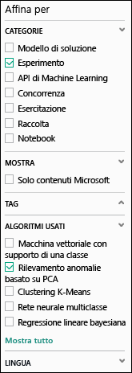
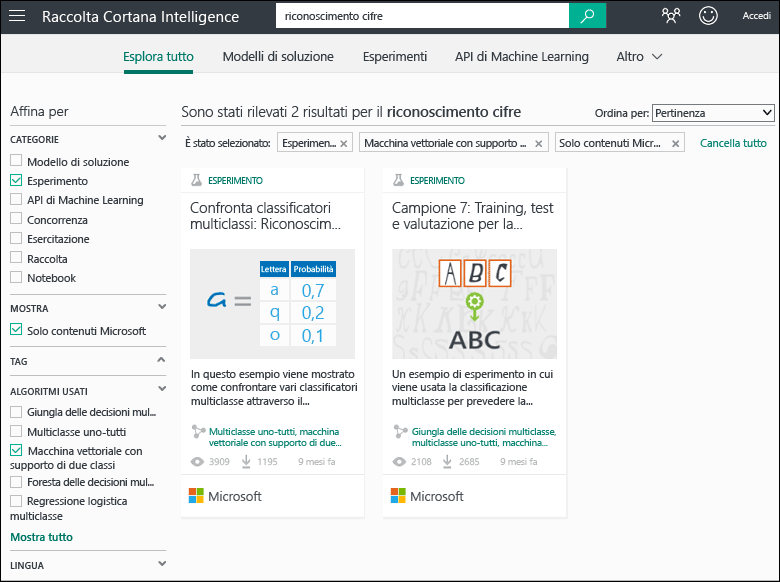
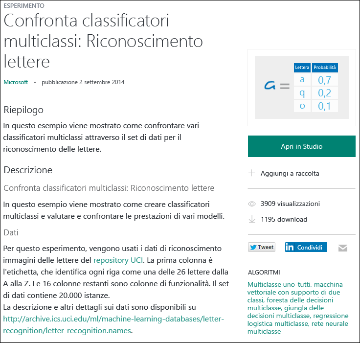

# Copiare gli esperimenti di esempio per creare nuovi esperimenti di Machine Learning
Questo articolo illustra come usare gli esperimenti di esempio di [Cortana Intelligence Gallery](https://gallery.cortanaintelligence.com/) invece di creare esperimenti di Machine Learning da zero. È possibile usare gli esempi per compilare la propria soluzione di Machine Learning.

Nella raccolta sono disponibili esperimenti di esempio del team di Microsoft Azure Machine Learning, oltre a esempi condivisi dalla community di Machine Learning. È anche possibile porre domande o inviare commenti sugli esperimenti disponibili.

Per informazioni su come usare la raccolta, guardare il video di 3 minuti [Copiare il lavoro di altre persone per l'analisi scientifica dei dati](machine-learning-data-science-for-beginners-copy-other-peoples-work-to-do-data-science.md) della serie [Analisi scientifica dei dati per principianti](machine-learning-data-science-for-beginners-the-5-questions-data-science-answers.md).

[!INCLUDE [machine-learning-free-trial](../../includes/machine-learning-free-trial.md)]

## Trovare un esperimento da copiare in Cortana Intelligence Gallery
Per visualizzare gli esperimenti disponibili, passare a [Cortana Intelligence Gallery](https://gallery.cortanaintelligence.com/) e fare clic su **Experiments** (Esperimenti) nella parte superiore della pagina.

### Trovare gli esperimenti più recenti o richiesti
In questa pagina è possibile visualizzare gli esperimenti **aggiunti di recente**, scorrere per esaminare quelli **più richiesti** o la versione più recente degli **esperimenti Microsoft più richiesti**.

### Cercare un esperimento che soddisfa requisiti specifici
Per esplorare tutti gli esperimenti:

1. Fare clic su **Browse all** (Esplora tutto) nella parte superiore della pagina.
2. In **Refine by** (Affina per) a sinistra nella sezione **Categories** (Categorie) selezionare **Experiment** (Esperimento) per visualizzare tutti gli esperimenti nella raccolta.
3. È possibile trovare esperimenti che soddisfano i requisiti in due modi diversi:
   * **Selezionare i filtri a sinistra.** Per esaminare ad esempio gli esperimenti che fanno uso di un algoritmo di rilevamento delle anomalie basato su PCA, selezionare **Experiment** (Esperimento) in **Categories** (Categorie) e fare clic su **Show all** (Mostra tutto). In **Algorithms Used** (Algoritmi usati) scegliere **PCA-Based Anomaly Detection** (Rilevamento anomalie basato su PCA).   
     
   * **Usare la casella di ricerca.** Ad esempio, per trovare esperimenti Microsoft sul riconoscimento di cifre che usano un algoritmo di macchine a vettori di supporto a due classi, immettere "digit recognition" nella casella di ricerca. Selezionare quindi i filtri **Experiment** (Esperimento), **Microsoft content only** (Solo contenuto Microsoft) e **Two-Class Support Vector Machine** (Macchina a vettori di supporto a due classi):  
     
4. Per altre informazioni su un esperimento, fare clic su di esso.
5. Per eseguire e/o modificare l'esperimento, fare clic su **Open in Studio** (Apri in Studio) nella pagina dell'esperimento.   

    

    > [!NOTE]
    > Quando si apre un esperimento in Machine Learning Studio per la prima volta, è possibile provarlo gratuitamente o acquistare una sottoscrizione di Azure. [Confronto tra la versione di valutazione gratuita e il servizio a pagamento di Machine Learning Studio](https://azure.microsoft.com/pricing/details/machine-learning/)
    >
    >

## Creare un nuovo esperimento usando un esempio come modello
È anche possibile creare un nuovo esperimento in Machine Learning Studio usando come modello un esempio della raccolta.

1. Accedere a [Studio](https://studio.azureml.net) con le credenziali dell'account Microsoft e quindi fare clic su **Nuovo** per creare un esperimento.
2. Esplorare il contenuto e fare clic per selezionare un esempio.

Nell'area di lavoro di Machine Learning Studio verrà creato un nuovo esperimento usando l'esperimento di esempio come modello.

## Passaggi successivi
* [Importare dati da diverse origini](machine-learning-data-science-import-data.md)
* [Esercitazione con guida rapida per il linguaggio di programmazione R per Machine Learning](machine-learning-r-quickstart.md)
* [Distribuire un servizio Web di Machine Learning](machine-learning-publish-a-machine-learning-web-service.md)

