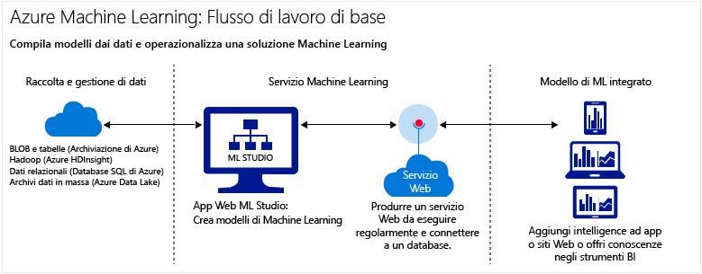

# Introduzione all'apprendimento automatico nel cloud
## Che cos'è l'apprendimento automatico?
L'apprendimento automatico è una tecnica di analisi scientifica dei dati che consente ai computer di apprendere dai dati esistenti per prevedere comportamenti, risultati e tendenze futuri.  

Queste previsioni o stime dell'apprendimento automatico possono rendere più intelligenti le app e i dispositivi. Quando si effettuano acquisti online, l'apprendimento automatico consente di consigliare altri prodotti che potrebbero interessare in base a ciò che si è acquistato. Quando si usa la carta di credito, l'apprendimento automatico confronta la transazione con un database di transazioni e consente di rilevare eventuali frodi. Quando il robot aspirapolvere aspira la polvere in una stanza, l'apprendimento automatico gli consente di decidere se il lavoro è stato completato.

Per una breve panoramica, guardare la serie di video [Analisi scientifica dei dati per principianti](machine-learning-data-science-for-beginners-the-5-questions-data-science-answers.md). Senza usare un gergo tecnico o ricorrere alla matematica, Analisi scientifica dei dati per principianti presenta l'apprendimento automatico e illustra un semplice modello predittivo.

## Cos'è Machine Learning nel cloud di Microsoft Azure?
Azure Machine Learning è un servizio di analisi predittiva basato sul cloud che consente di creare e distribuire rapidamente modelli predittivi come soluzioni di analisi.

È possibile iniziare da una libreria di algoritmi pronta all'uso, usare gli algoritmi per creare modelli su un PC connesso a Internet e distribuire rapidamente la soluzione di analisi predittiva. Per ottenere risultati rapidi, iniziare con le soluzioni e gli esempi pronti all'uso di [Cortana Intelligence Gallery](https://gallery.cortanaintelligence.com/).

Azure Machine Learning fornisce non solo gli strumenti per l'analisi predittiva dei modelli, ma anche un servizio completamente gestito che è possibile usare per distribuire i modelli predittivi come servizi Web pronti all'uso.

[!INCLUDE [machine-learning-free-trial](../../includes/machine-learning-free-trial.md)]

## Cos'è l'analisi predittiva?
L'analisi predittiva usa formule matematiche chiamate algoritmi che analizzano i dati cronologici o correnti per identificare modelli o tendenze e quindi prevedere gli eventi futuri.

## Strumenti per compilare soluzioni complete di apprendimento automatico nel cloud
Azure Machine Learning include tutto ciò è necessario per creare soluzioni complete di analisi predittiva nel cloud, ad esempio una vasta libreria di algoritmi, uno studio per la compilazione di modelli e un semplice strumento per distribuire un modello come servizio Web. È così possibile creare, testare, rendere operativi e gestire i modelli predittivi con rapidità.

### Machine Learning Studio: creare modelli predittivi
In [Machine Learning Studio](machine-learning-what-is-ml-studio.md)è possibile creare rapidamente modelli predittivi trascinando, rilasciando e connettendo i moduli. È possibile [provarlo gratuitamente](https://studio.azureml.net/?selectAccess=true&o=2) sperimentando diverse combinazioni.

* In [Cortana Intelligence Gallery](machine-learning-gallery-how-to-use-contribute-publish.md)è possibile provare soluzioni di analisi create da altri o contribuire con le proprie. Inviare domande o commenti sugli esperimenti nella community oppure condividere collegamenti a esperimenti tramite social network come LinkedIn e Twitter.

  
* Usare una grande libreria di [moduli e algoritmi di Machine Learning](https://msdn.microsoft.com/library/azure/f5c746fd-dcea-4929-ba50-2a79c4c067d7) in Machine Learning Studio per implementare rapidamente i modelli predittivi. Scegliere tra esperimenti di esempio, pacchetti R e Python e i migliori algoritmi di aziende Microsoft, come Xbox e Bing. Estendere i moduli di Studio con gli script [R](machine-learning-r-quickstart.md) e [Python](machine-learning-execute-python-scripts.md) personalizzati.

  

### Rendere operative le soluzioni di analisi predittiva pubblicando la propria
Le esercitazioni seguenti illustrano come rendere operativi i modelli di analisi predittiva:

 * [Distribuire i servizi Web](machine-learning-publish-a-machine-learning-web-service.md)
 * [Eseguire e ripetere il training dei modelli tramite le API](machine-learning-retrain-models-programmatically.md)
 * [Gestire gli endpoint di servizio Web](machine-learning-create-endpoint.md)
 * [Ridimensionare un servizio Web](machine-learning-scaling-webservice.md)
 * [Utilizzare i servizi Web](machine-learning-consume-web-services.md)

## Concetti e termini chiave dell'apprendimento automatico
I termini relativi all'apprendimento automatico possono generare confusione. Ecco quindi le definizioni dei termini chiave. Usare i commenti che seguono per segnalare altri termini di cui si vuole conoscere la definizione.

### Esplorazione dei dati, analisi descrittiva e analisi predittiva
**esplorazione dei dati** è il processo di raccolta di informazioni su un set di dati di grandi dimensioni e spesso non strutturato per trovare caratteristiche che consentano di eseguire un'analisi mirata. **data mining** è l'esplorazione dei dati automatizzata.

**analisi descrittiva** è il processo di analisi di un set di dati per riepilogare cosa è accaduto. La maggior parte delle analisi business, ad esempio i report sulle vendite, le metriche Web e l'analisi dei social network, è descrittiva.

**analisi predittiva** è il processo di compilazione di modelli da dati cronologici o correnti per prevedere i futuri risultati.

### Apprendimento supervisionato e non supervisionato
 **apprendimento supervisionato** viene eseguito con dati con etichette, ovvero dati costituiti da esempi delle risposte desiderate. Ad esempio, il training di un modello che identifica l'uso fraudolento di una carta di credito verrà eseguito da un set di dati in cui è stata assegnata un'etichetta ai punti dati delle spese valide e di quelle fraudolente note. La maggior parte dell'apprendimento automatico viene supervisionato.

 **apprendimento non supervisionato** viene usato sui dati senza etichette con l'obiettivo di trovare relazioni tra i dati. Ad esempio, è possibile trovare raggruppamenti di dati demografici relativi ai clienti con abitudini di acquisto simili.

### Training e valutazione del modello
Un modello di apprendimento automatico è un'astrazione della domanda a cui si sta cercando di rispondere o del risultato che si desidera stimare. Il training e la valutazione dei modelli vengono effettuati a partire da dati esistenti.

#### Dati di training
Quando si esegue il training di un modello dai dati, si usa un set di dati noto e si apportano modifiche al modello in base alle caratteristiche dei dati per ottenere la risposta più precisa. In Azure Machine Learning, un modello viene compilato da un modulo di algoritmo che elabora i dati di training e i moduli funzionali, ad esempio un modulo di assegnazione dei punteggi.

Nell'apprendimento supervisionato, se si sta eseguendo il training di un modello di rilevamento delle frodi, si usa un set di transazioni etichettate come fraudolente o valide. Si suddivide in modo casuale il set di dati e si usa una parte per eseguire il training del modello e una parte per testare o valutare il modello.

#### Dati di valutazione
Dopo aver creato un modello con training, valutare il modello usando i rimanenti dati di test. Si usano dati i cui risultati sono già noti, in modo da poter verificare se la stima del modello sia accurata.

## Altri termini comuni relativi all'apprendimento automatico
* **algoritmo**: set autonomo di regole usate per risolvere i problemi di elaborazione dati, matematica o ragionamento automatizzato.
* **rilevamento anomalie**: modello che contrassegna eventi o valori insoliti e consente di trovare i problemi. Ad esempio, il rilevamento delle frodi commesse con le carte di credito cerca acquisti insoliti.
* **dati categorici**: dati organizzati in categorie e divisibili in gruppi. Ad esempio, un set di dati categorici per le auto può specificare l'anno, la marca, il modello e il prezzo.
* **classificazione**: modello per organizzare i punti dati in categorie in base a un set di dati di cui sono già noti i raggruppamenti in categorie.
* **progettazione delle funzioni**: processo di estrazione o selezione di funzioni correlate a un set di dati per integrare il set di dati e migliorare i risultati. Ad esempio, i dati delle tariffe aeree potrebbero essere integrati con giorni della settimana e festivi. Vedere [Progettazione e selezione di funzioni in Azure Machine Learning](machine-learning-feature-selection-and-engineering.md).
* **modulo**: parte funzionale in un modello di Machine Learning Studio, ad esempio il modulo Enter Data che consente di immettere e modificare piccoli set di dati. Anche un algoritmo è un tipo di modulo in Machine Learning Studio.
* **modello**: un modello di apprendimento supervisionato è il prodotto di un esperimento di apprendimento automatico costituito da dati di training, un modulo di algoritmo e moduli funzionali, ad esempio il modulo Score Model.
* **dati numerici**: dati indicanti misure (dati continui) o conteggi (dati discreti). Sono detti anche *dati quantitativi*.
* **partizione**: metodo con cui si dividono i dati in campioni. Per altre informazioni, vedere [Partition and Sample](https://msdn.microsoft.com/library/azure/dn905960.aspx) .
* **stima**: una stima è una previsione di uno o più valori da un modello di apprendimento automatico. È anche possibile incontrare il termine "punteggio stimato". I punteggi stimati non sono tuttavia l'output finale di un modello. Il punteggio è seguito da una valutazione del modello.
* **regressione**: modello per la stima di un valore basato su variabili indipendenti, ad esempio la stima del prezzo di un'auto basata sull'anno e sulla marca.
* **punteggio**: valore stimato generato da un modello di classificazione o regressione con training, usando il [modulo Score Model](https://msdn.microsoft.com/library/azure/dn905995.aspx) in Machine Learning Studio. I modelli di classificazione restituiscono inoltre un punteggio relativo alla probabilità del valore stimato. Una volta generati i punteggi da un modello, è possibile valutare l'accuratezza del modello con il [modulo Evaluate Model](https://msdn.microsoft.com/library/azure/dn905915.aspx).
* **campione**: parte di un set di dati rappresentativa dell'intero. I campioni possono essere selezionati in modo casuale o in base a funzioni specifiche del set di dati.

## Passaggi successivi
È possibile ottenere informazioni di base sulle analisi predittive e sull'apprendimento automatico tramite un'[esercitazione dettagliata](machine-learning-create-experiment.md) e gli [esempi](machine-learning-sample-experiments.md).  

<!-- Module References -->
[learning-with-counts]: https://msdn.microsoft.com/library/azure/81c457af-f5c0-4b2d-922c-fdef2274413c/

<!--HONumber=Nov16_HO3-->

