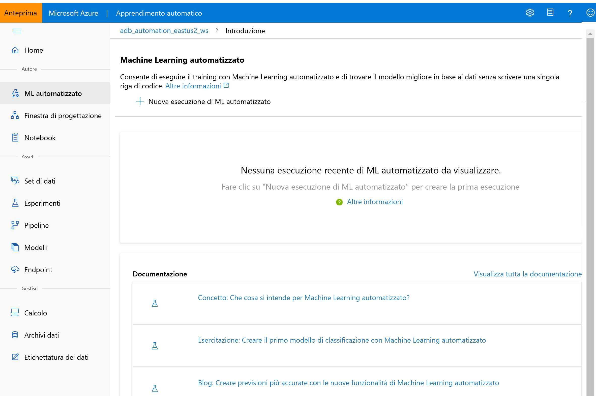

# Che cos'è Azure Machine Learning Studio?

In questo articolo vengono fornite informazioni su Azure Machine Learning Studio, il portale Web per sviluppatori di data science in [Azure Machine Learning](overview-what-is-azure-ml.md). Lo studio combina esperienze senza codice e code-first per una piattaforma di data science completa.

Contenuto dell'articolo:
>[!div class="checklist"]
> - Come [creare progetti di Machine Learning](#author-machine-learning-projects) nello Studio.
> - Come [gestire asset e risorse](#manage-assets-and-resources) nello Studio.
> - Differenze tra [Azure Machine Learning Studio e Machine Learning Studio (versione classica)](#ml-studio-classic-vs-azure-machine-learning-studio).

## Creare progetti di Machine Learning

Nello Studio sono disponibili più esperienze di creazione a seconda del progetto di tipo e del livello di esperienza utente.

+ **Notebook**

  Scrivere ed eseguire il codice personalizzato in [server Jupyter Notebook](how-to-run-jupyter-notebooks.md) gestiti direttamente integrati nello Studio. 

+ **Finestra di progettazione di Azure Machine Learning**

  Usare la finestra di progettazione per eseguire il training e distribuire i modelli di Machine Learning senza scrivere codice. Trascinare e rilasciare i set di dati e moduli per creare pipeline di ML. Provare l'[esercitazione relativa alla finestra di progettazione](tutorial-designer-automobile-price-train-score.md).

    

+ **Interfaccia utente di Machine Learning automatizzato**

  Informazioni su come creare [esperimenti di Machine Learning automatizzato](tutorial-first-experiment-automated-ml.md) con un'interfaccia di facile utilizzo. 

  

+ **Etichettatura dei dati**

    Usare l'[etichettatura dei dati di Azure Machine Learning](how-to-create-labeling-projects.md) per coordinare in modo efficiente i progetti di etichettatura dei dati.

## Gestire asset e risorse

Gestire gli asset di Machine Learning direttamente nel browser. Gli asset vengono condivisi nella stessa area di lavoro tra l'SDK e lo Studio per un'esperienza senza problemi. È possibile usare Studio per gestire:

- Modelli
- Set di dati
- Archivi dati
- Risorse di calcolo
- Notebook
- Sperimentazioni
- Log di esecuzione
- Pipelines 
- Endpoint della pipeline

Anche per gli sviluppatori esperti, lo Studio può semplificare la gestione delle risorse dell'area di lavoro.

## ML Studio (versione classica) e Azure Machine Learning Studio

Rilasciato nel 2015, **ML Studio (versione classica)** è stato il primo generatore di Machine Learning con trascinamento della selezione. Si tratta di un servizio autonomo che offre solo un'esperienza visiva. Studio (versione classica) non interagisce con Azure Machine Learning.

**Azure Machine Learning** è un servizio separato e modernizzato che offre una piattaforma di data science completa. Supporta entrambe le esperienze code-first e con codice ridotto.

**Azure Machine Learning Studio** è un portale Web *in* Azure Machine Learning che contiene opzioni con codice ridotto e senza codice per la creazione di progetti e la gestione degli asset. 

Per i nuovi utenti è consigliabile scegliere **Azure Machine Learning** anziché ML Studio (versione classica), in modo da usufruire della gamma più recente di strumenti di data science.

### Confronto tra le funzionalità

Nella tabella seguente sono riepilogate alcune delle differenze principali tra ML Studio (versione classica) e Azure Machine Learning.

| Feature | ML Studio (versione classica) | Azure Machine Learning |
|---| --- | --- |
| Interfaccia per il trascinamento della selezione | Esperienza classica | Esperienza aggiornata - [Finestra di progettazione di Azure Machine Learning](concept-designer.md)| 
| SDK di codice | Non supportato | Completamente integrato con gli SDK di [Azure Machine Learning per Python](https://docs.microsoft.com/python/api/overview/azure/ml/) e [R](tutorial-1st-r-experiment.md) |
| Esperimento | Scalabile (limite dei dati di training di 10 GB) | Ridimensionamento con destinazione di calcolo |
| Destinazioni di calcolo del training | Destinazione di calcolo proprietaria, solo supporto di CPU | Ampia gamma di [destinazioni di calcolo per il training](concept-compute-target.md#train) personalizzabili. Include il supporto di GPU e CPU | 
| Destinazioni di calcolo della distribuzione | Formato di servizio Web proprietario, non personalizzabile | Ampia gamma di [destinazioni di calcolo per la distribuzione](concept-compute-target.md#deploy) personalizzabili. Include il supporto di GPU e CPU |
| Pipeline di Machine Learning | Non supportate | Creazione di [pipeline](concept-ml-pipelines.md) flessibili e modulari per automatizzare i flussi di lavoro |
| MLOps | Gestione e distribuzione dei modelli di base; distribuzioni solo CPU | Controllo delle versioni delle entità (modello, dati, flussi di lavoro), automazione dei flussi di lavoro, integrazione con strumenti CICD, distribuzioni CPU e GPU [e altro ancora](concept-model-management-and-deployment.md) |
| Formato dei modelli | Formato proprietario, solo Studio (versione classica) | Più formati supportati a seconda del tipo di processo di training |
| Training automatizzato dei modelli e ottimizzazione degli iperparametri |  Non supportate | [Supportata](concept-automated-ml.md). Opzioni code-first e senza codice. | 
| Rilevamento deriva dei dati | Non supportate | [Supporto](how-to-monitor-datasets.md) |
| Progetti di etichettatura dei dati | Non supportato | [Supporto](how-to-create-labeling-projects.md) |

## Passaggi successivi

Visitare lo [Studio](https://ml.azure.com) o esplorare le opzioni di creazione disponibili con le esercitazioni seguenti:  
  + [Usare i notebook di Python per eseguire il training e la distribuzione di modelli](tutorial-1st-experiment-sdk-setup.md)
  + [Usare il servizio Machine Learning automatizzato per eseguire il training e la distribuzione di modelli](tutorial-first-experiment-automated-ml.md)  
  + [Usare la finestra di progettazione per eseguire il training e la distribuzione di modelli](tutorial-designer-automobile-price-train-score.md)

