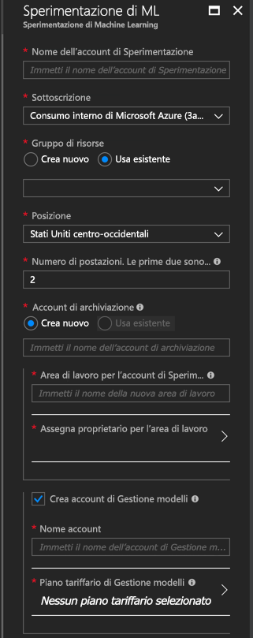
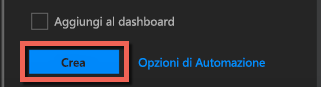

# <a name="quickstart-install-and-get-started-with-azure-machine-learning-services"></a>Guida introduttiva: Installare e iniziare a usare i servizi di Azure Machine Learning
I servizi di Azure Machine Learning (anteprima) sono una soluzione integrata di data science e analisi avanzata end-to-end. Consentono a data scientist professionisti di preparare i dati, sviluppare esperimenti e distribuire modelli su scala cloud.

Questa guida introduttiva illustra come effettuare le operazioni seguenti:

* Creare account del servizio per servizi Azure Machine Learning
* Installare Azure Machine Learning Workbench ed eseguire l'accesso
* Creare un progetto in Workbench
* Eseguire uno script in tale progetto  
* Accedere all'interfaccia della riga di comando


Poiché sono parte del portfolio di Microsoft Azure, i servizi di Azure Machine Learning richiedono una sottoscrizione di Azure. Se non si ha una sottoscrizione di Azure, creare un [account gratuito](https://azure.microsoft.com/free/?WT.mc_id=A261C142F) prima di iniziare.

Inoltre, è necessario avere le autorizzazioni adeguate per creare risorse quali gruppi di risorse, macchine virtuali e così via. 

<a name="prerequisites"></a>È possibile installare l'applicazione Azure Machine Learning Workbench nei sistemi operativi seguenti:
- Windows 10 o Windows Server 2016
- macOS Sierra o High Sierra

## <a name="create-azure-machine-learning-services-accounts"></a>Creare account dei servizi Azure Machine Learning
Usare il portale di Azure per effettuare il provisioning degli account di Azure Machine Learning: 
1. Accedere al [portale di Azure](https://portal.azure.com/) usando le credenziali della sottoscrizione di Azure che si userà. Se non si ha una sottoscrizione di Azure, creare ora un [account gratuito](https://azure.microsoft.com/free/?WT.mc_id=A261C142F). 

   

1. Selezionare il pulsante **Crea una risorsa** (+) nell'angolo superiore sinistro del portale.

   

1. Immettere **Machine Learning** nella barra di ricerca. Selezionare il risultato di ricerca denominato **Sperimentazione di Machine Learning**. 

   

1. Nel riquadro **Sperimentazione di Machine Learning** scorrere fino alla fine e selezionare **Crea** per iniziare a definire l'account di Sperimentazione.  

   

1. Nel riquadro **Sperimentazione di ML** configurare l'account di Sperimentazione Machine Learning. 

   Impostazione|Valore consigliato per l'esercitazione|DESCRIZIONE
   ---|---|---
   Nome account di Experimentation | _Nome univoco_ |Immettere un nome univoco che identifica l'account. È possibile usare il proprio nome o il nome di un reparto o un progetto che identifichi l'esperimento. Il nome deve avere una lunghezza compresa tra 2 e 32 caratteri. Può contenere solo caratteri alfanumerici e il trattino (-). 
   Sottoscrizione | _Sottoscrizione in uso_ |Scegliere la sottoscrizione di Azure da usare per l'esperimento. Se si hanno più sottoscrizioni, scegliere quella appropriata per la fatturazione della risorsa.
   Gruppo di risorse | _Il gruppo di risorse_ | Usare un gruppo di risorse esistente nella sottoscrizione oppure immettere un nome per creare un nuovo gruppo di risorse per questo account di Sperimentazione. 
   Località | _Area più vicina ai propri utenti_ | Scegliere la località più vicina agli utenti e alle risorse di dati.
   Number of seats (Numero di postazioni) | 2 | Immettere il numero di postazioni. Informazioni sull'[impatto delle postazioni sui prezzi](https://azure.microsoft.com/pricing/details/machine-learning/).<br/><br/>Per questa guida introduttiva sono necessarie due sole postazioni. È possibile aggiungere o rimuovere le postazioni secondo necessità nel portale di Azure.
   Account di archiviazione | _Nome univoco_ | Selezionare **Crea nuovo** e specificare un nome per creare un [account di archiviazione di Azure](https://docs.microsoft.com/en-us/azure/storage/common/storage-quickstart-create-account?tabs=portal). Il nome deve contenere da 3 a 24 caratteri esclusivamente alfanumerici. In alternativa, selezionare **Usa esistente** e selezionare un account di archiviazione esistente nell'elenco a discesa. L'account di archiviazione è obbligatorio e viene usato per contenere gli elementi del progetto e i dati della cronologia di esecuzione. 
   Workspace for Experimentation account (Area di lavoro per account di Sperimentazione) | IrisGarden<br/>(nome usato nelle esercitazioni) | Specificare un nome per un'area di lavoro per questo account. Il nome deve avere una lunghezza compresa tra 2 e 32 caratteri. Può contenere solo caratteri alfanumerici e il trattino (-). Quest'area di lavoro contiene tutti gli strumenti necessari per la creazione, la gestione e la pubblicazione di esperimenti.
   Assign owner for the workspace (Proprietario area di lavoro) | _L'account_ | Selezionare il proprio account come proprietario dell'area di lavoro.
   Creare un account di Gestione modelli | **check** |Creare ora un account di Gestione modelli in modo che questa risorsa sia disponibile quando si vogliono distribuire e gestire i modelli come servizi Web in tempo reale. <br/><br/>Anche se facoltativo, è consigliabile creare l'account di Gestione modelli al momento della creazione dell'account di Sperimentazione.
   Nome account | _Nome univoco_ | Scegliere un nome univoco per identificare l'account di Gestione modelli. È possibile usare il proprio nome o il nome di un reparto o un progetto che identifichi l'esperimento. Il nome deve avere una lunghezza compresa tra 2 e 32 caratteri. Può contenere solo caratteri alfanumerici e il trattino (-). 
   Piano tariffario di Gestione modelli | **DEVTEST** | Selezionare **Nessun piano tariffario selezionato** per specificare il piano tariffario per il nuovo account di Gestione modelli. Per risparmiare sui costi selezionare il piano tariffario **DEVTEST** se è disponibile per la sottoscrizione (disponibilità limitata). In caso contrario selezionare il piano tariffario S1. Fare clic su **Seleziona** per salvare la selezione del piano tariffario. 
   Aggiungi al dashboard | _check_ | Selezionare l'opzione **Aggiungi al dashboard** per tenere facilmente traccia dell'account di Sperimentazione di Machine Learning nella pagina iniziale del dashboard del portale di Azure.

   

5. Selezionare **Crea** per avviare il processo di creazione dell'account di Sperimentazione unitamente a quello di Gestione modelli.

   

   La creazione di un account può richiedere alcuni istanti. Per controllare lo stato del processo di distribuzione, fare clic sull'icona di notifica a forma di campana sulla barra degli strumenti del portale di Azure.
   
   


## <a name="install-and-log-in-to-workbench"></a>Installare Workbench ed eseguire l'accesso

Azure Machine Learning Workbench è disponibile per Windows o macOS. Visualizzare l'elenco delle [piattaforme supportate](#prerequisites).

>[!WARNING]
>Il completamento dell'installazione può richiedere circa 30 minuti. 

1. Scaricare e avviare il programma di installazione della versione più recente di Workbench. 
   >[!IMPORTANT]
   >Scaricare l'intero programma di installazione sul disco e avviarlo. Non eseguirlo direttamente dal widget di download del browser.

   **In Windows:** 

   &nbsp;&nbsp;&nbsp;&nbsp;A. Scaricare [AmlWorkbenchSetup.msi](https://aka.ms/azureml-wb-msi).  <br/>
   &nbsp;&nbsp;&nbsp;&nbsp;B. In Esplora file fare doppio clic sul programma di installazione scaricato.

   **In MacOS:** 

   &nbsp;&nbsp;&nbsp;&nbsp;A. Scaricare [AmlWorkbench.dmg](https://aka.ms/azureml-wb-dmg). <br/>
   &nbsp;&nbsp;&nbsp;&nbsp;B. In Finder fare doppio clic sul programma di installazione scaricato.<br/><br/>

1. Seguire le istruzioni visualizzate nel programma di installazione fino al completamento. 

   **Il completamento dell'installazione può richiedere circa 30 minuti.**  
   
   | |Percorso di installazione di Azure Machine Learning Workbench|
   |--------|------------------------------------------------|
   |Windows|C:\Utenti\\<user\>\AppData\Local\AmlWorkbench|
   |macOS|/Applications/Azure ML Workbench.app|

   Il programma di installazione scaricherà e configurerà tutte le dipendenze necessarie, ad esempio Python, Miniconda e altre librerie correlate. L'installazione include anche l'interfaccia della riga di comando di Azure, lo strumento da riga di comando multipiattaforma di Azure.

1. Per avviare Workbench, selezionare il pulsante **Launch Workbench** (Avvia Workbench) nell'ultima schermata del programma di installazione. 

   Se il programma di installazione è stato chiuso:
   + Per avviare Workbench in Windows, usare il collegamento **Machine Learning Workbench** sul desktop. 
   + In macOS selezionare **Azure ML Workbench** in Launchpad.

1. Nella prima schermata selezionare **Accedi con Microsoft** per eseguire l'autenticazione con Azure Machine Learning Workbench. Usare le stesse credenziali usate nel portale di Azure per creare gli account di Sperimentazione e Gestione modelli. 

   Dopo aver effettuato l'accesso, Workbench usa il primo account di Sperimentazione trovato nelle sottoscrizioni di Azure e visualizza tutte le aree di lavoro e i progetti associati a tale account. 

   >[!TIP]
   > Per passare a un account di Sperimentazione diverso, fare clic sull'icona nell'angolo in basso a sinistra nella finestra dell'applicazione Workbench.

## <a name="create-a-project-in-workbench"></a>Creare un progetto in Workbench

In Azure Machine Learning un progetto è il contenitore logico di tutto il lavoro svolto per risolvere un problema. Esegue il mapping a una singola cartella nel disco locale a cui è possibile aggiungere qualsiasi file o sottocartella. 

In questo caso viene creato un nuovo progetto Workbench usando un modello che include il [set di dati Iris](https://en.wikipedia.org/wiki/Iris_flower_data_set). Le esercitazioni che seguono questa guida introduttiva si basano su questi dati per creare un modello in grado di prevedere il tipo di iris sulla base di alcune caratteristiche fisiche.  

1. Dopo aver aperto Azure Machine Learning Workbench selezionare il segno più (+) nel riquadro **PROJECTS** (PROGETTI) e scegliere **New Project** (Nuovo progetto).  

   

1. Compilare i campi del modulo e selezionare il pulsante **Create** (Crea) per creare un nuovo progetto in Workbench.

   Campo|Valore consigliato per l'esercitazione|DESCRIZIONE
   ---|---|---
   Project name (Nome progetto) | myIris |Immettere un nome univoco che identifica l'account. È possibile usare il proprio nome o il nome di un reparto o un progetto che identifichi l'esperimento. Il nome deve avere una lunghezza compresa tra 2 e 32 caratteri. Può contenere solo caratteri alfanumerici e il trattino (-). 
   Directory del progetto | c:\Temp\ | Specificare la directory in cui viene creato il progetto.
   Descrizione del progetto | _lasciare vuoto_ | Campo facoltativo utile per descrivere i progetti.
   URL repository GIT Visualstudio.com |_lasciare vuoto_ | Campo facoltativo. Un progetto può essere facoltativamente associato a un repository Git in Visual Studio Team Services per il controllo del codice sorgente e la collaborazione. [Informazioni su come eseguire la configurazione](https://docs.microsoft.com/en-us/azure/machine-learning/preview/using-git-ml-project#step-3-set-up-a-machine-learning-project-and-git-repo). 
   Area di lavoro selezionata | IrisGarden (se esistente) | Scegliere un'area di lavoro creata per l'account di Sperimentazione nel portale di Azure. <br/>Se è stata seguita la procedura illustrata nella Guida introduttiva, dovrebbe essere presente un'area di lavoro denominata IrisGarden. In caso contrario, selezionare l'area di lavoro creata durante la creazione dell'account di Sperimentazione o qualsiasi altra area di lavoro da usare.
   Modello di progetto | Classificazione del set di dati Iris | I modelli contengono script e dati che possono essere usati per esplorare il prodotto. Questo modello contiene gli script e i dati necessari per la guida introduttiva e per altre esercitazioni disponibili in questo sito di documentazione. 

   
 
 Viene creato un nuovo progetto e il dashboard viene aperto con tale progetto visualizzato. A questo punto, è possibile esplorare la home page, le origini dati, i blocchi appunti e i file di codice sorgente del progetto. 

>[!TIP]
>È possibile configurare Workbench in modo da usare un IDE Python che garantisce un'esperienza uniforme per lo sviluppo nel settore del data science. È quindi possibile interagire con il progetto nell'IDE. [Informazioni](how-to-configure-your-IDE.md). 

## <a name="run-a-python-script"></a>Eseguire uno script Python

A questo punto, è possibile eseguire lo script **iris_sklearn.py** nel computer locale. Per impostazione predefinita, questo script è incluso nel modello di progetto **Classificazione del set di dati Iris**. Questo script consente di creare un modello di [regressione logistica](https://en.wikipedia.org/wiki/Logistic_regression) usando la nota libreria [scikit-learn](http://scikit-learn.org/stable/index.html) di Python.

1. Sulla barra dei comandi nella superiore della pagina **Dashboard del progetto** selezionare **locale** come destinazione di esecuzione e selezionare **iris_sklearn.py** come script da eseguire. Questi valori sono preselezionati per impostazione predefinita. 

   L'esempio include altri file che è possibile esaminare in un secondo momento, ma per questa guida introduttiva si è interessati solo a **iris_sklearn.py**. 

   

1. Nella casella di testo **Argomenti** immettere **0.01**. Questo numero corrisponde al tasso di regolarizzazione e viene usato nello script per configurare il modello di regressione logistica. 

1. Selezionare **Esegui** per avviare l'esecuzione dello script nel computer. Il processo **iris_sklearn.py** viene immediatamente visualizzato nel pannello **Processi** sulla destra in modo che sia possibile monitorare l'esecuzione dello script.

   Congratulazioni! È stato eseguito correttamente uno script Python in Azure Machine Learning Workbench.

1. Ripetere più volte i passaggi da 2 a 3 usando valori di argomento diversi compresi tra **0,001** e **10**, ad esempio usando potenze di 10. Ogni esecuzione viene visualizzata nel riquadro **Processi**.

1. Per esaminare la cronologia di esecuzione, selezionare la visualizzazione **Esecuzioni** e quindi scegliere **iris_sklearn.py** nell'elenco delle esecuzioni. 

   

   Questa visualizzazione mostra ogni esecuzione avvenuta in **iris_sklearn.py**. Il dashboard della cronologia di esecuzione visualizza anche le metriche principali, un set di grafici predefiniti e un elenco delle metriche per ogni esecuzione. 

1. È possibile personalizzare questa visualizzazione ordinando, filtrando e modificando le configurazioni tramite le icone di filtro e a forma di ingranaggio.

   

3. Selezionare un'esecuzione completata nel riquadro Processi per aprire una visualizzazione dettagliata per l'esecuzione specifica. I dettagli includono metriche aggiuntive, i file prodotti e altri log potenzialmente utili.

## <a name="start-the-cli"></a>Avviare l'interfaccia della riga di comando

È installata anche l'interfaccia della riga di comando di Azure Machine Learning. Tale interfaccia consente di accedere ai servizi Azure Machine Learning e interagirvi usando i comandi `az` per eseguire tutte le attività necessarie per un flusso di lavoro di data science end-to-end. [Altre informazioni.](tutorial-iris-azure-cli.md)

È possibile avviare l'interfaccia da riga di comando di Azure Machine Learning dalla barra degli strumenti di Workbench usando **File → Apri prompt dei comandi**.

Per ottenere informazioni sui comandi dell'interfaccia della riga di comando di Azure Machine Learning, usare l'argomento --help.

```az ml --help```

## <a name="clean-up-resources"></a>Pulire le risorse

[!INCLUDE [aml-delete-resource-group](../../../includes/aml-delete-resource-group.md)]

## <a name="next-steps"></a>Passaggi successivi
A questo punto sono stati creati gli account di Azure Machine Learning necessari ed è stata installata l'applicazione Azure Machine Learning Workbench. È stato anche creato un progetto, è stato eseguito uno script ed è stata esaminata la cronologia di esecuzione dello script.

Per un'analisi più approfondita di questo flusso di lavoro, incluse informazioni su come distribuire il modello Iris come servizio Web, seguire l'esercitazione *Classificazione di dati Iris* completa. L'esercitazione include i passaggi di [preparazione dei dati](tutorial-classifying-iris-part-1.md), [sperimentazione](tutorial-classifying-iris-part-2.md) e [gestione dei modelli](tutorial-classifying-iris-part-3.md). 

> [!div class="nextstepaction"]
> [Esercitazione: Classificazione del set di dati Iris (parte 1)](tutorial-classifying-iris-part-1.md)

>[!NOTE]
> Anche se è stato creato l'account di gestione del modello, l'ambiente non è ancora configurato per la distribuzione di servizi Web. Informazioni su come configurare l'[ambiente di distribuzione](deployment-setup-configuration.md).
