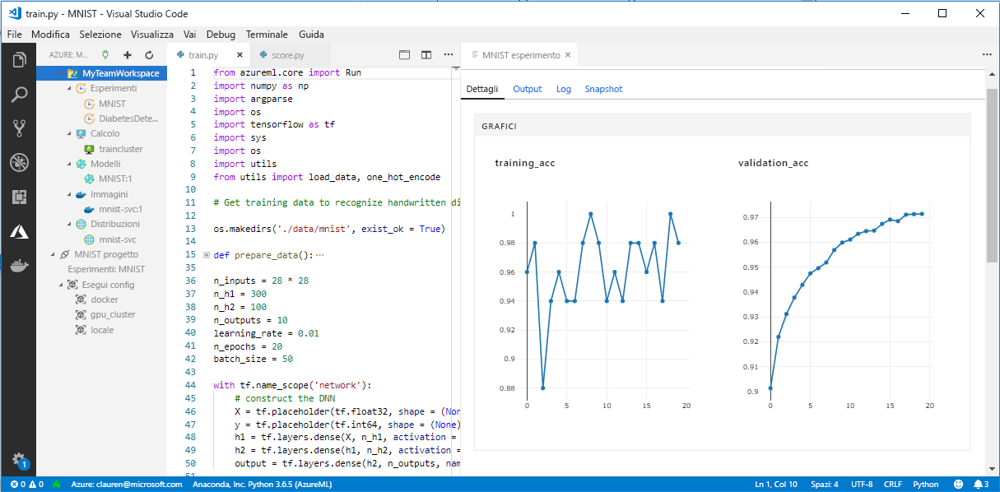

# Che cosa è successo a Workbench in Azure Machine Learning (anteprima)?

L'applicazione Workbench e alcune altre funzionalità di anteprima sono state deprecate nella versione di settembre 2018 per lasciare il posto a un miglioramento dell'[architettura](concept-azure-machine-learning-architecture.md). Questa versione contiene molti aggiornamenti significativi derivanti dal feedback dei clienti per migliorare l'esperienza dell'utente. Le funzionalità di base, dalle esecuzioni sperimentali alla distribuzione del modello, non sono cambiate, ma ora è possibile usare le solide funzionalità <a href="http://aka.ms/aml-sdk" target="_blank">SDK</a> e [CLI](reference-azure-machine-learning-cli.md) per portare a termine attività di apprendimento automatico e pipeline.  

Questo articolo illustra cosa è cambiato e gli effetti sul lavoro preesistente con il servizio Azure Machine Learning.

## Cosa è cambiato?

L'ultima versione di Azure Machine Learning comprende:
+ Un [modello semplificato delle risorse di Azure](concept-azure-machine-learning-architecture.md)
+ [Nuova interfaccia utente del portale](how-to-track-experiments.md) per gestire gli esperimenti e le destinazioni di calcolo
+ Python <a href="http://aka.ms/aml-sdk" target="_blank">SDK</a> nuovo e più completo
+ Una nuova [estensione ampliata dell'interfaccia della riga di comando di Azure](reference-azure-machine-learning-cli.md) per l'apprendimento automatico

L'[architettura](concept-azure-machine-learning-architecture.md) è stata riprogettata con l'obiettivo della facilità d'uso. Invece di più risorse e account di Azure, è sufficiente avere un'[area di lavoro di Azure Machine Learning](concept-azure-machine-learning-architecture.md#workspace).  Le aree di lavoro possono essere create rapidamente nel [portale di Azure](quickstart-get-started.md).  Un'area di lavoro può essere usata da più utenti per archiviare destinazioni di calcolo di formazione e distribuzione, gli esperimenti di modello, le immagini Docker, i modelli distribuiti e così via.

Nella versione corrente sono disponibili client SDK e CLI nuovi e migliorati, ma l'applicazione desktop Workbench stessa è stata deprecata. Ora è possibile monitorare gli esperimenti nel [dashboard dell'area di lavoro del portale Web di Azure](how-to-track-experiments.md#view-the-experiment-in-the-azure-portal). Attraverso il dashboard è possibile accedere alla cronologia degli esperimenti, gestire le destinazioni di calcolo collegate all'area di lavoro, gestire i modelli e le immagini Docker, nonché distribuire servizi Web.

## Come si esegue la migrazione?

La maggior parte degli artefatti creati nella versione precedente del servizio Azure Machine Learning si trova nello spazio di archiviazione locale o cloud. Questi artefatti non verranno mai eliminati. Per eseguire la migrazione, è necessario registrare nuovamente gli artefatti con il servizio Azure Machine Learning aggiornato. Per sapere cosa è possibile includere nella migrazione e come eseguirla, vedere questo [articolo sulla migrazione](how-to-migrate.md).

## Sequenza temporale del supporto

È possibile continuare a usare gli account di gestione modelli e sperimentazione, nonché l'applicazione Workbench, ancora per qualche tempo dopo settembre 2018. Il supporto per le risorse seguenti verrà rimosso progressivamente nel corso dei 3-4 mesi successivi al rilascio della nuova versione. La documentazione delle funzionalità precedenti resta disponibile nella [sezione Risorse](../desktop-workbench/tutorial-classifying-iris-part-1.md) nella parte inferiore del sommario.

|Fase|Dettagli relativi al supporto per le funzionalità precedenti|
|:---:|----------------|
|1|Non sarà più possibile creare un _account Sperimentazione di Azure Machine Learning_ e un _account Gestione modelli_ nel portale di Azure e dall'interfaccia della riga di comando, né creare ambienti di calcolo di Machine Learning dall'interfaccia della riga di comando. Se si ha già un account, in questa fase l'interfaccia della riga di comando e l'applicazione desktop Workbench continueranno a funzionare.|
|2|Le API sottostanti per la creazione di aree di lavoro e progetti precedenti nell'applicazione desktop Workbench e nell'interfaccia della riga di comando non saranno più disponibili. In questa fase sarà ancora possibile aprire i progetti esistenti, aggiungervi altri script, eseguire script nei progetti esistenti e distribuire servizi Web in ambienti di calcolo di Machine Learning esistenti.|
|3|In questa fase termina il supporto per tutto il resto, incluse le API rimanenti e l'applicazione desktop Workbench.|

Consigliamo di [iniziare la migrazione](how-to-migrate.md) oggi stesso. Tutte le funzionalità più recenti sono disponibili tramite il nuovo <a href="http://aka.ms/aml-sdk" target="_blank">SDK</a>, la nuova [interfaccia della riga di comando](reference-azure-machine-learning-cli.md) e il nuovo [portale](quickstart-get-started.md).

## Che ne sarà delle cronologie di esecuzione?

Le cronologie di esecuzione resteranno accessibili per qualche tempo. Quando si è pronti per passare alla versione aggiornata del servizio Azure Machine Learning, è possibile esportare le cronologie di esecuzione se si desidera conservare una copia.

Nella versione corrente le cronologie di esecuzione sono denominate _esperimenti_. È possibile raccogliere gli esperimenti di un modello ed esplorarli usando l'SDK, l'interfaccia della riga di comando o il portale Web.

Il dashboard dell'area di lavoro del portale è supportato solo nei browser Edge, Chrome e Firefox.

[  ] (./media/overview-what-happened-to-workbench/image001.png#lightbox)

## È ancora possibile preparare i dati?

I file di preparazione dei dati preesistenti non possono essere portati nella versione più recente perché Workbench non è più disponibile. È comunque sempre possibile preparare i dati per la modellazione.  

Con set di dati limitati, è possibile usare l'<a href="http://aka.ms/aml-sdk" target="_blank">SDK di preparazione dati di Azure Machine Learning</a> per preparare rapidamente i dati prima della modellazione. 

È possibile usare lo stesso <a href="http://aka.ms/aml-sdk" target="_blank">SDK</a> per set di dati più grandi o usare Azure Databricks per preparare set di Big Data. 

## I progetti saranno mantenuti?

Non si perderà il codice o il lavoro svolto. Nella versione precedente, i progetti sono entità cloud con una directory locale. Nella versione più recente, si collegano le directory locali all'area di lavoro di Azure Machine Learning mediante un file di configurazione locale. [Vedere un diagramma dell'architettura più recente](concept-azure-machine-learning-architecture.md).

Poiché gran parte del contenuto del progetto era già nel computer locale, è sufficiente creare un file di configurazione in tale directory e farvi riferimento nel codice per collegarlo all'area di lavoro. [Informazioni su come eseguire la migrazione dei progetti esistenti.](how-to-migrate.md#projects)

Informazioni su come iniziare a usare [Python con l'SDK principale](quickstart-get-started.md).

## Che ne sarà delle immagini e dei modelli dei registri?
 
Per i modelli registrati nel registro dei modelli precedente è necessario eseguire la migrazione alla nuova area di lavoro se si desidera continuare a usarli. È possibile farlo [scaricando i modelli e registrandoli nuovamente](how-to-migrate.md) nella nuova area di lavoro. 

Le immagini create nel registro delle immagini precedente devono essere ricreate nella nuova area di lavoro per continuare a usarle. È possibile farlo seguendo le indicazioni nella sezione sulla [creazione di un'immagine Docker](how-to-deploy-to-aci.md#configure-an-image). 

## Che ne sarà dei servizi Web distribuiti?

I modelli distribuiti come servizi Web mediante l'account di Gestione modelli continueranno a funzionare finché sarà supportato il servizio contenitore di Azure (ACS). Tali servizi Web funzioneranno anche dopo il termine del supporto per gli account di Gestione modelli. Tuttavia, quando terminerà il supporto per l'interfaccia della riga di comando precedente, non sarà più possibile gestire questi servizi Web.

Nella versione più recente, i modelli sono distribuiti come servizi Web nelle [istanze di contenitore Azure](how-to-deploy-to-aci.md) (ACI) o nei cluster del [servizio Kubernetes di Azure](how-to-deploy-to-aks.md) (AKS). È anche possibile [distribuire in FPGA e in IoT Edge](how-to-deploy-and-where.md). Senza la necessità di modificare i file dei punteggi, le dipendenze e gli schemi, è possibile ridistribuire i modelli usando il nuovo SDK o la nuova interfaccia della riga di comando. 

## Che ne sarà dell'SDK e dell'interfaccia della riga di comando precedenti?

Continueranno a funzionare per un periodo di tempo (vedere la [sequenza temporale](#timeline) sopra). È consigliabile iniziare a creare i nuovi esperimenti e modelli con l'SDK e/o l'interfaccia della riga di comando più recenti.

Nella versione più recente, il nuovo Python SDK consente di interagire con il servizio Azure Machine Learning in qualsiasi ambiente Python. Sono disponibili informazioni sull'installazione dell'<a href="http://aka.ms/aml-sdk" target="_blank">SDK</a> più recente.  È anche possibile usare l'[estensione aggiornata di apprendimento automatico dell'interfaccia della riga di comando di Azure](reference-azure-machine-learning-cli.md) con la vasta gamma di comandi `az ml` per interagire con il servizio in qualsiasi ambiente da riga di comando, tra cui Cloud Shell del portale di Azure.

## Che ne è di Visual Studio Code Tools for AI?

Con quest'ultima versione, l'estensione Visual Studio Code Tools for AI è stata ampliata e migliorata per supportare le nuove funzionalità descritte sopra.

[  ] (./media/overview-what-happened-to-workbench/vscode-big.png#lightbox)

## Che ne è dei pacchetti di domini?

I pacchetti di domini relativi a [Visione artificiale, Analisi del testo e Previsione](../desktop-workbench/reference-python-package-overview.md) non possono essere usati con la versione più recente di Azure Machine Learning. È comunque possibile creare ed eseguire il training di modelli di visione, testo e previsione con il più recente Python <a href="http://aka.ms/aml-sdk" target="_blank">SDK</a> di Azure Machine Learning. Per informazioni su come eseguire la migrazione di modelli preesistenti realizzati con i pacchetti Visione artificiale, Analisi del testo e Previsione, scrivere all'indirizzo [AML-Packages@microsoft.com](mailto:AML-Packages@microsoft.com).

## Passaggi successivi

Leggere le informazioni sull'[architettura più recente per il servizio Azure Machine Learning](concept-azure-machine-learning-architecture.md) e provare una delle guide introduttive o delle esercitazioni:

* [Informazioni sul servizio Azure Machine Learning](overview-what-is-azure-ml.md)
* [Guida introduttiva alla creazione di un'area di lavoro con Python](quickstart-get-started.md)
* [Esercitazione: training di un modello](tutorial-train-models-with-aml.md)
