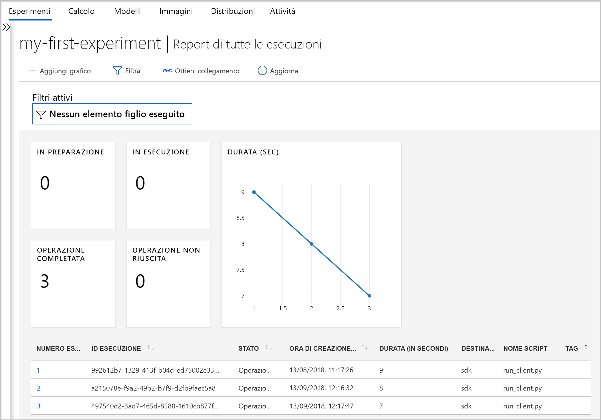

# <a name="what-happened-to-azure-machine-learning-workbench"></a>Che cosa è successo ad Azure Machine Learning Workbench?

L'applicazione Azure Machine Learning Workbench e alcune altre funzionalità di anteprima sono state deprecate e sostituite nella versione di **settembre 2018** per introdurre un miglioramento nell'[architettura](concept-azure-machine-learning-architecture.md).

Per migliorare l'esperienza dell'utente, questa versione contiene molti aggiornamenti significativi introdotti in base al feedback dei clienti. Le funzionalità di base, dalle esecuzioni sperimentali alla distribuzione del modello, non sono cambiate, ma è ora possibile usare le solide funzionalità di <a href="https://docs.microsoft.com/python/api/overview/azure/ml/intro?view=azure-ml-py" target="_blank">Python SDK</a> e R SDK e dell'[interfaccia della riga di comando di Azure](reference-azure-machine-learning-cli.md) per eseguire attività e pipeline di apprendimento automatico.

La maggior parte degli artefatti creati nella versione precedente di Azure Machine Learning si trova nello spazio di archiviazione locale o cloud. Questi artefatti non verranno mai eliminati.

Questo articolo illustra cosa è cambiato e come questi cambiamenti possono influire sul lavoro già svolto con Azure Machine Learning Workbench e con le relative API.

>[!Warning]
>Questo articolo non riguarda gli utenti di Azure Machine Learning Studio. Riguarda i clienti di Azure Machine Learning che hanno installato l'applicazione Workbench (anteprima) e/o hanno account di anteprima per la sperimentazione e la gestione dei modelli.


## <a name="what-changed"></a>Cosa è cambiato?

L'ultima versione di Azure Machine Learning include le funzionalità seguenti:
+ Un [modello semplificato delle risorse di Azure](concept-azure-machine-learning-architecture.md).
+ La [nuova interfaccia utente del portale](how-to-track-experiments.md) per gestire gli esperimenti e le destinazioni di calcolo.
+ Una nuova versione dell'<a href="https://docs.microsoft.com/python/api/overview/azure/ml/intro?view=azure-ml-py" target="_blank">SDK</a> per Python più completa.
+ Una nuova [estensione ampliata dell'interfaccia della riga di comando di Azure](reference-azure-machine-learning-cli.md) per l'apprendimento automatico.

L'[architettura](concept-azure-machine-learning-architecture.md) è stata riprogettata per una maggiore facilità d'uso. Invece di più risorse e account di Azure, è sufficiente avere un'[area di lavoro di Azure Machine Learning](concept-workspace.md). Le aree di lavoro possono essere create rapidamente nel [portale di Azure](how-to-manage-workspace.md). Usando un'area di lavoro, più utenti possono archiviare destinazioni di calcolo per training e distribuzione, esperimenti di modello, immagini Docker, modelli distribuiti e così via.

Anche se nella versione corrente sono disponibili interfaccia della riga di comando e client SDK nuovi e migliorati, l'applicazione desktop Workbench stessa è stata ritirata. È possibile gestire gli esperimenti nel [dashboard dell'area di lavoro di Azure Machine Learning Studio](how-to-track-experiments.md#view-the-experiment-in-the-web-portal). Attraverso il dashboard è possibile accedere alla cronologia degli esperimenti, gestire le destinazioni di calcolo collegate all'area di lavoro, gestire i modelli e le immagini Docker, nonché distribuire servizi Web.

<a name="timeline"></a>

## <a name="support-timeline"></a>Sequenza temporale del supporto

Il 9 gennaio 2019 è terminato il supporto degli account di Machine Learning Workbench, Sperimentazione di Azure Machine Learning e Gestione modelli, oltre che degli SDK e interfacce della riga di comando associati.

Tutte le funzionalità più recenti sono disponibili questo <a href="https://docs.microsoft.com/python/api/overview/azure/ml/intro?view=azure-ml-py" target="_blank">SDK</a>, l'[interfaccia della riga di comando](reference-azure-machine-learning-cli.md) e il [portale](how-to-manage-workspace.md).

## <a name="what-about-run-histories"></a>Che ne sarà delle cronologie di esecuzione?

Le cronologie di esecuzione precedenti non sono più accessibili, ma è comunque possibile visualizzare le esecuzioni nella versione più recente.

Le cronologie di esecuzione sono denominate **esperimenti**. È possibile raccogliere gli esperimenti di un modello ed esplorarli usando l'SDK, l'interfaccia della riga di comando o Azure Machine Learning Studio.

Il dashboard dell'area di lavoro del portale è supportato solo nei browser Microsoft Edge, Chrome e Firefox:

[](./media/overview-what-happened-to-workbench/image001.png#lightbox)

Iniziare ad eseguire il training dei modelli e a rilevare le cronologie di esecuzione usando la nuova interfaccia della riga di comando e il nuovo SDK. La procedura è descritta in [Esercitazione: Eseguire il training di modelli con Azure Machine Learning](tutorial-train-models-with-aml.md).

## <a name="will-projects-persist"></a>I progetti saranno mantenuti?

Non si perderà il codice o il lavoro svolto. Nella versione precedente, i progetti sono entità cloud con una directory locale. Nell'ultima versione si associano le directory locali all'area di lavoro di Azure Machine Learning con un file di configurazione locale. Vedere un [diagramma dell'architettura più recente](concept-azure-machine-learning-architecture.md).

Gran parte del contenuto del progetto era già nel computer locale. È quindi sufficiente creare un file di configurazione in tale directory e farvi riferimento nel codice per collegarlo all'area di lavoro. Per continuare a usare la directory locale che contiene i file e gli script, specificare il nome della directory nel comando Python "[experiment.submit](https://docs.microsoft.com/python/api/azureml-core/azureml.core.experiment.experiment?view=azure-ml-py)" o usando il comando `az ml project attach` dell'interfaccia della riga di comando.  Ad esempio:
```python
run = exp.submit(source_directory=script_folder,
                 script='train.py', run_config=run_config_system_managed)
```

Per iniziare, [creare un'area di lavoro](how-to-manage-workspace.md).

## <a name="what-about-my-registered-models-and-images"></a>Che ne sarà delle immagini e dei modelli registrati?

Se si vuole continuare a usare i modelli registrati nel registro dei modelli precedente, è necessario eseguirne la migrazione nella nuova area di lavoro. Per eseguire la migrazione dei modelli, scaricare i modelli e registrarli nuovamente nella nuova area di lavoro.

Per le immagini create nel registro immagini precedente non è possibile eseguire direttamente la migrazione alla nuova area di lavoro. Nella maggior parte dei casi, il modello può essere distribuito senza dover creare un'immagine. Se necessario, è possibile creare un'immagine per il modello nella nuova area di lavoro. Per altre informazioni, vedere l'articolo su come [gestire, registrare, distribuire e monitorare i modelli di Machine Learning](concept-model-management-and-deployment.md).

## <a name="what-about-deployed-web-services"></a>Che ne sarà dei servizi Web distribuiti?

Ora che il supporto per l'interfaccia della riga di comando precedente è terminato, non è più possibile ridistribuire i servizi Web distribuiti originariamente con l'account di Gestione modelli. Tali servizi Web continueranno a funzionare fino a quando sarà supportato il servizio Azure Container (ACS).

Nella versione più recente, i modelli sono distribuiti come servizi Web in Istanze di Azure Container o nei cluster del servizio Azure Kubernetes. È anche possibile distribuire i modelli in dispositivi FPGA e in Azure IoT Edge.

Per altre informazioni, vedere gli articoli seguenti:
+ [Dove e come eseguire la distribuzione dei modelli](how-to-deploy-and-where.md)
+ [Esercitazione: Distribuire modelli con Azure Machine Learning](tutorial-deploy-models-with-aml.md)

## <a name="next-steps"></a>Passaggi successivi

Informazioni sull'[architettura più recente per Azure Machine Learning](concept-azure-machine-learning-architecture.md).

Per una panoramica del servizio, vedere [Informazioni su Azure Machine Learning](overview-what-is-azure-ml.md).

Creare il primo esperimento con il metodo preferito:
  + [Usare i notebook di Python](tutorial-1st-experiment-sdk-setup.md)
  + [Usare R Markdown]( tutorial-1st-r-experiment.md) 
  + [Usare Machine Learning automatizzato](ui-tutorial-automobile-price-train-score.md) 
  + [Usare le funzionalità di trascinamento della selezione della finestra di progettazione](tutorial-first-experiment-automated-ml.md) 
  + [Usare l'estensione ML per l'interfaccia della riga di comando](tutorial-train-deploy-model-cli.md)
