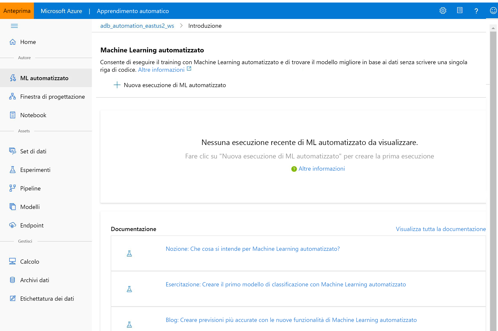

# Informazioni su Azure Machine Learning

Questo articolo illustra Azure Machine Learning, un ambiente basato sul cloud utilizzabile per eseguire il training, distribuire, automatizzare, gestire e tenere traccia dei modelli di Machine Learning. 

Azure Machine Learning può essere usato per qualsiasi tipo di Machine Learning, dalla forma classica al Deep Learning, supervisionato e non supervisionato. Che si preferisca scrivere codice Python o R oppure usare opzioni senza o con poco codice, come nel caso della [finestra di progettazione](ui-tutorial-automobile-price-train-score.md), è possibile creare, sottoporre a training e monitorare i modelli di Deep Learning e Machine Learning altamente accurati in un'area di lavoro di Azure Machine Learning. 

Iniziare il training nel computer locale per poi scalare orizzontalmente nel cloud. 

Il servizio interagisce anche con gli strumenti open source più diffusi, ad esempio PyTorch, TensorFlow e Scikit-learn.

> [!VIDEO https://channel9.msdn.com/Events/Connect/Microsoft-Connect--2018/D240/player]

> [!Tip]
> **Versione di valutazione gratuita.**  Se non è disponibile una sottoscrizione di Azure, creare un account gratuito prima di iniziare. Provare la [versione gratuita o a pagamento di Azure Machine Learning](https://aka.ms/AMLFree). Si ricevono così crediti da spendere in servizi di Azure. Quando i crediti saranno esauriti, sarà possibile mantenere l'account e usare i [servizi di Azure gratuiti](https://azure.microsoft.com/free/). Verranno applicati addebiti alla carta di credito solo se l'utente modifica le impostazioni e richiede esplicitamente l'addebito.

## Che cos'è l'apprendimento automatico?

Machine Learning è una tecnica di analisi scientifica dei dati che consente ai computer di usare i dati esistenti per prevedere comportamenti, tendenze e risultati futuri. Con l'apprendimento automatico, i computer apprendono senza essere programmati in modo esplicito.

Queste previsioni o stime di Machine Learning possono rendere più intelligenti le app e i dispositivi. Quando si effettuano acquisti online, ad esempio, l'apprendimento automatico consiglia altri prodotti che potrebbero interessare in base a ciò che si è acquistato. Quando si usa la carta di credito, l'apprendimento automatico confronta la transazione con un database di transazioni e consente di rilevare eventuali frodi. Infine, quando il robot aspirapolvere aspira la polvere in una stanza, l'apprendimento automatico gli consente di decidere se il lavoro è stato completato.

## Strumenti di Machine Learning adatti per ogni attività 

Azure Machine Learning offre tutti gli strumenti necessari agli sviluppatori e ai data scientist per i rispettivi flussi di lavoro di Machine Learning, tra cui:
+ [Finestra di progettazione di Azure Machine Learning](ui-tutorial-automobile-price-train-score.md) (anteprima): moduli con trascinamento della selezione per creare gli esperimenti e distribuire le pipeline.

+ Notebook di Jupyter: usare i [notebook di esempio](https://aka.ms/aml-notebooks) forniti o creare notebook personalizzati per sfruttare gli esempi dell'<a href="https://docs.microsoft.com/python/api/overview/azure/ml/intro?view=azure-ml-py" target="_blank">SDK per Python</a> per Machine Learning. 

+ Notebook o script R in cui usare l'<a href="https://azure.github.io/azureml-sdk-for-r/reference/index.html" target="_blank">SDK per R</a> per scrivere codice personalizzato o usare i moduli R nella finestra di progettazione.

+ [Estensione di Visual Studio Code](how-to-vscode-tools.md)

+ [Interfaccia della riga di comando di Machine Learning](reference-azure-machine-learning-cli.md)

+ Framework open source come PyTorch, TensorFlow, Scikit-learn e molti altri

È persino possibile usare [MLflow per monitorare le metriche e distribuire i modelli](how-to-use-mlflow.md) oppure Kubeflow per [creare pipeline di flussi di lavoro end-to-end](https://www.kubeflow.org/docs/azure/).

## Creare modelli di Machine Learning in Python o R

Iniziare il training nel computer locale usando Azure Machine Learning <a href="https://docs.microsoft.com/python/api/overview/azure/ml/intro?view=azure-ml-py" target="_blank">Python SDK</a> o <a href="https://azure.github.io/azureml-sdk-for-r/reference/index.html" target="_blank">R SDK</a> per poi scalare orizzontalmente nel cloud. 

Grazie alla disponibilità di molte [destinazioni di calcolo](how-to-set-up-training-targets.md), ad esempio l'ambiente di calcolo di Azure Machine Learning e [Azure Databricks](/azure/azure-databricks/what-is-azure-databricks), e a [servizi avanzati per l'ottimizzazione degli iperparametri](how-to-tune-hyperparameters.md), è possibile creare modelli migliori in modo più rapido, sfruttando la potenza del cloud.

È anche possibile [automatizzare il training e l'ottimizzazione dei modelli](tutorial-auto-train-models.md) usando l'SDK.

## Creare modelli di Machine Learning con strumenti senza codice

Per un training e una distribuzione senza codice o con poco codice, provare:

+ **Finestra di progettazione di Azure Machine Learning (anteprima)**

  Usare la finestra di progettazione per preparare i dati, eseguire il training, testare, distribuire, gestire e tenere traccia dei modelli di Machine Learning senza scrivere codice. Non sono necessarie operazioni di programmazione, è sufficiente collegare visivamente i set di dati e i moduli per costruire il modello.   Provare l'[esercitazione relativa alla finestra di progettazione](tutorial-designer-automobile-price-train-score.md).

  Per altre informazioni, vedere l'[articolo di panoramica sulla finestra di progettazione di Azure Machine Learning](concept-designer.md). 

  

+ **Interfaccia utente di Machine Learning automatizzato**

  Imparare a creare [esperimenti di Machine Learning automatizzato](tutorial-first-experiment-automated-ml.md) in un'interfaccia semplice da usare. 

  

## MLOps: Esecuzione della distribuzione e gestione del ciclo di vita
Dopo aver creato il modello appropriato, è possibile usarlo facilmente in un servizio Web, in un dispositivo IoT o in Power BI. Per altre informazioni, vedere l'articolo su [come e dove eseguire la distribuzione](how-to-deploy-and-where.md).

È quindi possibile gestire i modelli distribuiti usando l'[SDK di Azure Machine Learning per Python](https://aka.ms/aml-sdk), [Azure Machine Learning Studio](https://ml.azure.com) o l'[interfaccia della riga di comando di Machine Learning](reference-azure-machine-learning-cli.md).

Questi modelli possono essere utilizzati e restituiscono stime, [in tempo reale](how-to-consume-web-service.md) o [in modo asincrono](how-to-run-batch-predictions.md), su grandi quantità di dati.

È inoltre possibile usare [pipeline avanzate di Machine Learning](concept-ml-pipelines.md) per collaborare in tutti i passaggi di preparazione dei dati, training dei modelli, valutazione e distribuzione. Le pipeline consentono di:

* Automatizzare il processo di Machine Learning end-to-end nel cloud
* Riutilizzare i componenti e ripetere i passaggi solo quando necessario
* Usare risorse di calcolo diverse in ogni passaggio
* Eseguire attività di assegnazione di punteggio batch

Se si vogliono usare gli script per automatizzare il flusso di lavoro di Machine Learning, l'[interfaccia della riga di comando di Machine Learning](reference-azure-machine-learning-cli.md) fornisce strumenti da riga di comando che eseguono attività comuni, ad esempio l'invio di un'esecuzione di training o la distribuzione di un modello.

Per iniziare a usare Azure Machine Learning, vedere [Passaggi successivi](#next-steps).

## Edizioni Basic ed Enterprise

Azure Machine Learning offre due edizioni personalizzate per le esigenze di Machine Learning:
+ Basic (disponibile a livello generale)
+ Enterprise (anteprima)

Queste edizioni determinano quali strumenti di Machine Learning sono disponibili per sviluppatori e data scientist dalla relativa area di lavoro.   

Le aree di lavoro dell'edizione Basic consentono di continuare a usare Azure Machine Learning e pagare solo per le risorse di Azure utilizzate durante il processo di Machine Learning. Per le aree di lavoro dell'edizione Enterprise verrà addebitato solo l'utilizzo di Azure mentre l'edizione è in anteprima. Per altre informazioni sugli strumenti disponibili, vedere la [pagina di panoramica e dei prezzi delle edizioni](https://azure.microsoft.com/pricing/details/machine-learning/) di Azure Machine Learning. 

L'edizione viene assegnata ogni volta che si crea un'area di lavoro. Inoltre, le aree di lavoro già esistenti sono state convertite automaticamente all'edizione Basic. L'edizione Basic include tutte le funzionalità che erano già disponibili a livello generale da ottobre 2019. Tutti gli esperimenti in queste aree di lavoro creati con le funzionalità dell'edizione Enterprise continueranno a essere disponibili in sola lettura finché non si eseguirà l'aggiornamento a Enterprise. Vedere le informazioni su come [aggiornare un'area di lavoro dell'edizione Basic all'edizione Enterprise](how-to-manage-workspace.md#upgrade). 

I clienti sono responsabili dei costi sostenuti per le risorse di calcolo e di altro tipo di Azure durante questo periodo di tempo.

## Passaggi successivi

- Creare il primo esperimento con il metodo preferito:
  + [Usare i notebook di Python per eseguire il training e la distribuzione di modelli di Machine Learning](tutorial-1st-experiment-sdk-setup.md)
  + [Usare R Markdown per eseguire il training e la distribuzione di modelli di Machine Learning](tutorial-1st-r-experiment.md) 
  + [Usare il servizio Machine Learning automatizzato per eseguire il training e la distribuzione di modelli di Machine Learning](  tutorial-first-experiment-automated-ml.md) 
  + [Usare le funzionalità di trascinamento della selezione della finestra di progettazione per eseguire il training e la distribuzione](tutorial-designer-automobile-price-train-score.md) 
  + [Usare l'interfaccia della riga di comando di Machine Learning per eseguire il training e la distribuzione di un modello](tutorial-train-deploy-model-cli.md)

- Vedere le [pipeline di apprendimento automatico](/azure/machine-learning/service/concept-ml-pipelines) per compilare, ottimizzare e gestire gli scenari di Machine Learning.

- Vedere l'articolo di approfondimento su [architettura e concetti di Azure Machine Learning](concept-azure-machine-learning-architecture.md).
