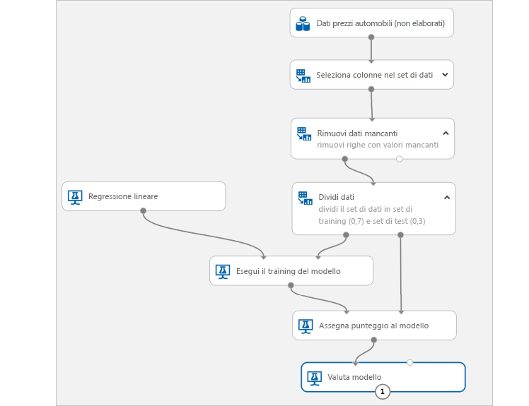

# Informazioni sul servizio Azure Machine Learning

Il servizio Azure Machine Learning è un servizio cloud che è possibile usare per eseguire il training di modelli di Machine Learning, distribuirli, automatizzarli e gestirli, il tutto su vasta scala, grazie all'ampia portata del cloud.

## Che cos'è l'apprendimento automatico?

Machine Learning è una tecnica di analisi scientifica dei dati che consente ai computer di usare i dati esistenti per prevedere comportamenti, tendenze e risultati futuri. Con l'apprendimento automatico, i computer apprendono senza essere programmati in modo esplicito.

Queste previsioni o stime di Machine Learning possono rendere più intelligenti le app e i dispositivi. Quando si effettuano acquisti online, ad esempio, l'apprendimento automatico consiglia altri prodotti che potrebbero interessare in base a ciò che si è acquistato. Quando si usa la carta di credito, l'apprendimento automatico confronta la transazione con un database di transazioni e consente di rilevare eventuali frodi. Infine, quando il robot aspirapolvere aspira la polvere in una stanza, l'apprendimento automatico gli consente di decidere se il lavoro è stato completato.

## Informazioni sul servizio Azure Machine Learning

Il servizio Azure Machine Learning offre un ambiente basato su cloud utile per preparare i dati, eseguire il training, testare, distribuire, gestire e tenere traccia dei modelli di Machine Learning. Iniziare il training nel computer locale per poi scalare orizzontalmente nel cloud. Il servizio offre il supporto completo per tecnologie open source come PyTorch, TensorFlow e scikit-learn e può essere usato per qualsiasi tipo di processo di Machine Learning, da quelli classici al Deep Learning, con apprendimento supervisionato e non supervisionato. 

Esplorare e preparare i dati, eseguire il training e il test dei modelli e distribuirli con strumenti avanzati come:
+ Un'[interfaccia visiva grafica](ui-quickstart-run-experiment.md) in cui è possibile trascinare moduli per creare esperimenti e quindi distribuire i modelli
+ [Jupyter Notebook](https://jupyter.org) in cui usare gli [SDK](https://docs.microsoft.com/azure/machine-learning/service/#reference) per scrivere codice personalizzato, come questi [notebook di esempio](https://aka.ms/aml-notebooks)
+ [Estensione di Visual Studio Code](how-to-vscode-tools.md)

## Quali operazioni si possono eseguire con Azure Machine Learning?

Usando <a href="https://aka.ms/aml-sdk" target="_blank">Azure Machine Learning Python SDK</a> con i pacchetti Python open source oppure tramite l[interfaccia visiva grafica (anteprima)](ui-quickstart-run-experiment.md), è possibile creare ed eseguire autonomamente il training di modelli di Machine Learning e Deep Learning estremamente accurati in un'area di lavoro del servizio Azure Machine Learning.

È possibile scegliere tra i numerosi componenti di Machine Learning disponibili nei pacchetti Python open source, ad esempio <a href="https://scikit-learn.org/stable/" target="_blank">Scikit-learn</a>, <a href="https://www.tensorflow.org" target="_blank">Tensorflow</a>, <a href="https://pytorch.org" target="_blank">PyTorch</a> e <a href="https://mxnet.io" target="_blank">MXNet</a>.

Sia che si decida di scrivere codice o di usare l'interfaccia visiva grafica, è possibile tenere traccia di più esecuzioni mentre si sperimenta per trovare la soluzione ottimale, oltre a gestire i modelli distribuiti.

### Esperienza code-first

Iniziare il training nel computer locale usando <a href="https://aka.ms/aml-sdk" target="_blank">Azure Machine Learning Python SDK</a> per poi scalare orizzontalmente nel cloud. Grazie alla disponibilità di molte [destinazioni di calcolo](how-to-set-up-training-targets.md), ad esempio l'ambiente di calcolo di Azure Machine Learning e [Azure Databricks](/azure/azure-databricks/what-is-azure-databricks), e a [servizi avanzati per l'ottimizzazione degli iperparametri](how-to-tune-hyperparameters.md), è possibile creare modelli migliori in modo più rapido, sfruttando la potenza del cloud.

È anche possibile [automatizzare il training e l'ottimizzazione dei modelli](tutorial-auto-train-models.md) usando l'SDK.

### Esperienza code-free/low code

Per il training code-free, provare a usare:

+ L'interfaccia visiva grafica per la sperimentazione e la distribuzione tramite trascinamento della selezione
    
    

+ L'opzione del portale di Azure per esperimenti automatizzati di Machine Learning

### Operazionalizzazione (MLOps)

Dopo aver creato il modello appropriato, è possibile usarlo facilmente in un servizio Web, in un dispositivo IoT o in Power BI. Per altre informazioni, vedere l'articolo su [come e dove eseguire la distribuzione](how-to-deploy-and-where.md). 

È quindi possibile gestire i modelli distribuiti usando l'[SDK di Azure Machine Learning per Python](https://aka.ms/aml-sdk) o il [portale di Azure](https://portal.azure.com/). 

Questi modelli possono essere utilizzati e restituiscono stime, [in tempo reale](how-to-consume-web-service.md) o [in modo asincrono](how-to-run-batch-predictions.md), su grandi quantità di dati.

È inoltre possibile usare [pipeline avanzate di Machine Learning](concept-ml-pipelines.md) per collaborare in tutti i passaggi di preparazione dei dati, training dei modelli, valutazione e distribuzione.

Per iniziare a usare il servizio Azure Machine Learning, vedere [Passaggi successivi](#next-steps).

## Quali sono le differenze tra il servizio Azure Machine Learning e Studio?

[Machine Learning Studio](../studio/what-is-ml-studio.md) è un'area di lavoro collaborativa e grafica con trascinamento della selezione in cui è possibile creare, testare e distribuire soluzioni di Machine Learning senza la necessità di scrivere codice. Usa algoritmi di Machine Learning e moduli di gestione dei dati precompilati e preconfigurati, oltre a una piattaforma di calcolo proprietaria.

Il servizio Azure Machine Learning offre SDK **oltre a** un'interfaccia visiva grafica (anteprima) per preparare i dati, eseguire il training e distribuire rapidamente i modelli di Machine Learning. Questa interfaccia visiva grafica (anteprima) offre un'esperienza di trascinamento della selezione simile a quella di Studio. Tuttavia, a differenza della piattaforma di calcolo proprietaria di Studio, l'interfaccia visiva grafica usa risorse di calcolo specifiche ed è pienamente integrata nel servizio Azure Machine Learning.

Ecco un confronto rapido.

|| Machine Learning Studio | Servizio Azure Machine Learning: Interfaccia visiva grafica|
|---| --- | --- |
|| Disponibile a livello generale | In anteprima|
|Moduli per l'interfaccia| Molti | Set iniziale di moduli più diffusi|
|Destinazioni di calcolo del training| Destinazione di calcolo proprietaria, solo supporto di CPU| Supporta destinazioni di calcolo di Azure Machine Learning, GPU o CPU. (Altre destinazioni di calcolo supportate nell'SDK)|
|Destinazioni di calcolo della distribuzione| Formato di servizio Web proprietario, non personalizzabile | Opzioni di sicurezza aziendale e servizio Azure Kubernetes.  ([Altre destinazioni di calcolo](how-to-deploy-and-where.md) supportate nell'SDK) |
|Training automatizzato dei modelli e ottimizzazione degli iperparametri | No  | Non ancora nell'interfaccia visiva grafica.   (Supportati nell'SDK e nel portale di Azure). | 

Provare l'interfaccia visiva grafica (anteprima) con [Avvio rapido: Preparare e visualizzare dati senza scrivere codice](ui-quickstart-run-experiment.md)

> [!NOTE]
> I modelli creati in Studio non possono essere distribuiti né gestiti tramite il servizio Azure Machine Learning. Tuttavia, i modelli creati e distribuiti nell'interfaccia visiva grafica del servizio possono essere gestiti tramite l'area di lavoro del servizio Azure Machine Learning.

## Versione di prova gratuita

Se non si dispone di una sottoscrizione di Azure, creare un account gratuito prima di iniziare. Accedere alla [versione gratuita o a pagamento del servizio Azure Machine Learning](https://aka.ms/AMLFree).

Si ricevono così crediti da spendere in servizi di Azure. Quando i crediti saranno esauriti, sarà possibile mantenere l'account e usare i [servizi di Azure gratuiti](https://azure.microsoft.com/free/). Verranno applicati addebiti alla carta di credito solo se l'utente modifica le impostazioni e richiede esplicitamente l'addebito. In alternativa, è possibile [attivare i vantaggi per i sottoscrittori di MSDN](https://azure.microsoft.com/pricing/member-offers/msdn-benefits-details/?WT.mc_id=A261C142F), in modo da accumulare ogni mese crediti che possono essere usati per i servizi di Azure a pagamento.

## Passaggi successivi

- Per iniziare, [creare un'area di lavoro del servizio Azure Machine Learning](setup-create-workspace.md).

- Seguire le esercitazioni complete: 
  + [Eseguire il training di un modello di classificazione delle immagini con il servizio Azure Machine Learning](tutorial-train-models-with-aml.md) 
  + [Preparare i dati e usare il servizio Machine Learning automatizzato per eseguire il training automatico di un modello di regressione](tutorial-data-prep.md)

- Per preparare i dati, usare [ Azure Machine Learning Data Prep SDK](https://aka.ms/data-prep-sdk).

- Vedere le [pipeline di apprendimento automatico](/azure/machine-learning/service/concept-ml-pipelines) per compilare, ottimizzare e gestire gli scenari di Machine Learning.

- Leggere l'articolo di approfondimento [Informazioni sul funzionamento del servizio Azure Machine Learning: architettura e concetti](concept-azure-machine-learning-architecture.md).

- Per altre informazioni, vedere [altri prodotti di apprendimento automatico Microsoft](/azure/architecture/data-guide/technology-choices/data-science-and-machine-learning).
